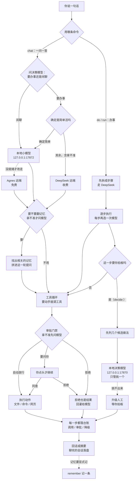
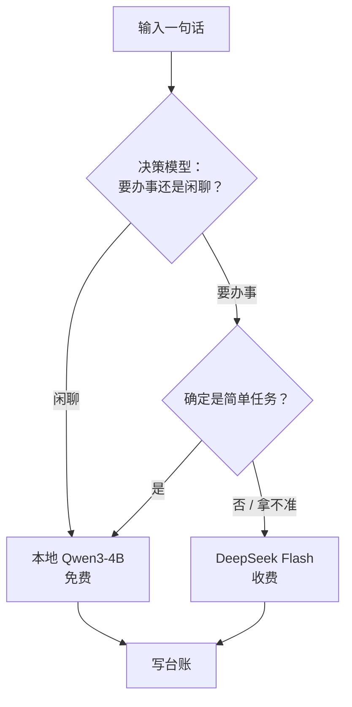
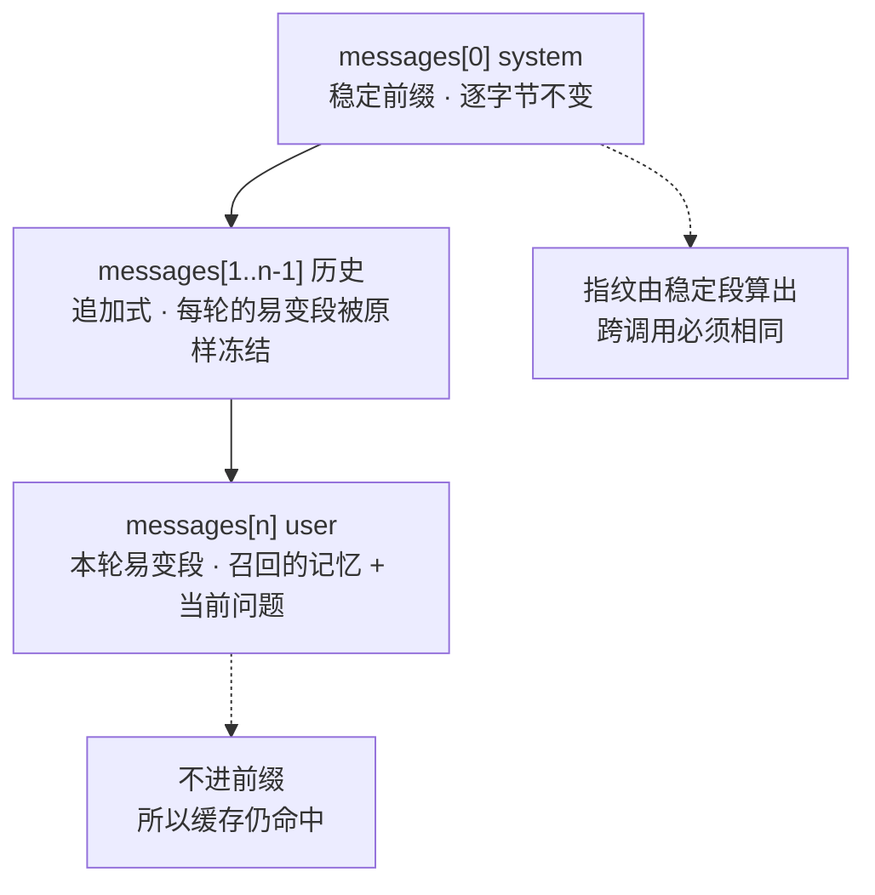
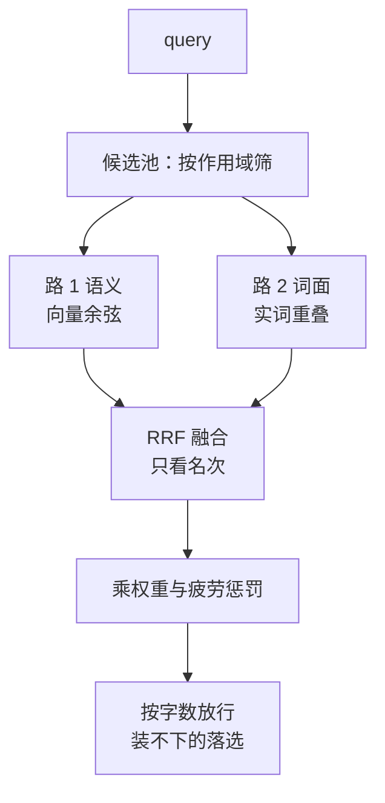
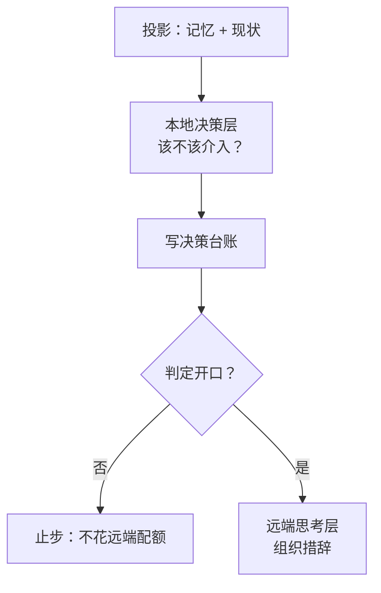

# YunXi Bot

> **陪伴型 · 通用 · 常驻 · Agent 助理**

一个**本地优先、7×24 常驻**的个人 Agent。它跑在你自己的机器上，记得你，会自己决定什么时候该主动开口。
核心不在于"能聊"，而在于**它知道什么时候该介入、什么时候该沉默**。

---

## 这是什么，给谁用

| | |
|---|---|
| **是什么** | 常驻的调度器（任务按间隔 / cron / 文件变化触发）+ 交互式对话 Agent（`chat`，带工具循环与审批门禁）+ 一条"看外部信息、决定要不要打扰你"的链路 |
| **给谁用** | 想在自己的机器上长期跑一个助理、并且**愿意为它的判断和边界买单**的人 |
| **现在能干什么** | 建任务并自动执行、按目标拆解成步骤逐步跑（`do`）、对话里读写文件/跑命令/抓网页（每个动作过审批门禁）、把记忆与画像沉淀进 append-only 台账 |
| **现在不能干什么** | 语音 / 微信 / Web 入口都还没有，**入口层只有 CLI**；Windows 之外的平台没有 OS 级写入隔离；本地小模型的权重不在仓库里，要自己下（约 8 GB，见[装不上的部分](#装不上的部分要自己动手的三件事)） |
| **平台** | 主要在 Windows 上开发和实测。其他地方能编译，但隔离能力会降级，并且**降级会被如实写进台账** |

这个项目的文档习惯和多数开源项目不同：**它写自己的做不到，也写代价。**
下面每一处结论都能在源码里找到对应。

---

## 目录

| 章节 | 讲什么 |
|---|---|
| [快速开始](#快速开始) | 五分钟内让它跑起来 |
| [全链路架构](#全链路架构) | 一句话从进来到落地的完整链路 |
| [模型怎么选](#模型怎么选) | 四个模型槽位、逐任务的路由判据、思考模式 |
| [三张图](#三张图) | 消息前缀缓存、记忆召回、Agent 循环 |
| [它现在是什么状态](#它现在是什么状态) | 每个模块实现到哪一步 |
| [常驻与自动化](#常驻与自动化) | daemon / 监督 / 开机自启 / 定时任务 |
| [决策层](#决策层) | 本地决策模型、七个降级类别、只在更保守的方向降级 |
| [不可动摇的边界](#不可动摇的边界) | 八条硬规则 |
| [安装与附录](#安装一条命令) | 安装细节、权重为什么不在 git 里、决策模型为什么是 Verdict |
| [仓库结构](#仓库结构) | 目录一览 |
| [许可与致谢](#许可与致谢) | Apache-2.0 |
| [深入阅读](#深入阅读) | 三篇对着源码写的正文 |

---

## 快速开始

需要 **Rust `rust-version = 1.88`**（edition 2024，见 [`Cargo.toml`](Cargo.toml)）。
Windows 上跑本地模型还需要 NVIDIA 显卡（拉起 sidecar 时硬编码了 `--device cuda`）。

```powershell
git clone https://github.com/sjxbbdb/YunXi-Bot
cd YunXi-Bot
pwsh scripts/setup.ps1        # 建 .venv + 装 Python 依赖 + 拉决策模型权重（校验 SHA256）
cargo build
cargo run -- isolation-check  # 验证写入隔离真的生效
```

`setup.ps1` 做三件事：建 `.venv`、装 Python 依赖（约 1 GB，含 torch CPU 版）、
拉决策模型权重（约 348 MB，校验 SHA256）。**它不会下载本地小模型。**

然后跑一跑：

```bash
cargo run -- status                    # 数据目录与台账概况
cargo run -- list                      # 列出任务
cargo run -- log -n 12                 # 看台账事件流
cargo run -- policy                    # 看权限预设
cargo run -- tools                     # 列出工具及其能力类别（不需要模型）
cargo run -- cost                      # 模型调用花销（按台账重算）
cargo run -- decide --demo             # 六类降级方向表（不需要模型）
```

再让它说句话（这一步会拉起本地小模型）：

```bash
export YUNXI_BOT_AGNES_KEY=sk-...      # 或放到 %LOCALAPPDATA%\YunXiBot\secrets\agnes.key
cargo run -- chat
```

**没装本地模型时**，`chat` 会先试着把那个 sidecar 拉起来；拉不起来也不至于聊不下去——
选中本地槽位时会探一次 `/health`，不是"就绪"就**这一轮改走 Agnes**，并在 stderr 上说清为什么
（见[路由真正的判据](#路由真正的判据)下面的说明）。

数据目录默认为 `%LOCALAPPDATA%\YunXiBot`（Windows）或 `~/.yunxi-bot`，可用 `YUNXI_BOT_HOME` 覆盖。
`.venv/`、`data/`、`dist/`、模型权重都在 `.gitignore` 里，不进仓库。

### 装不上的部分：要自己动手的三件事

1. **本地小模型的权重不在 git 里**，`setup.ps1` 也不会替你下它——**那要另外花约 8 GB 的下载和显存**：

   ```bash
   python scripts/fetch_local_model.py Qwen/Qwen3-4B-Instruct-2507
   .venv\Scripts\python.exe sidecar\local_llm_server.py --model Qwen3-4B-Instruct-2507
   ```

   脚本本身默认下的是更小的 `Qwen/Qwen3-1.7B`，而路由里写死的槽位是
   `Qwen3-4B-Instruct-2507`——**要跟代码对齐就得显式给这两个参数**。
   权重落在 `<数据目录>/models/`；下载脚本在国内会先试 HuggingFace 官方、再回落镜像。
   （拿不到权重不至于让对话中断：本地没就绪时这一轮会自动改走 Agnes。）

2. **本地 sidecar 需要带 `torch` 的 Python**。`setup.ps1` 装的正是这个（约 1 GB），
   所以别跳过它。没装 torch 时 sidecar 会在 `/health` 上报 `degraded`，而不是假装健康。

3. **第一次加载要几十秒、占约 8 GB 显存**。空闲一段时间后权重会被释放
   （见 [`sidecar/local_llm_server.py`](sidecar/local_llm_server.py) 的空闲看守），
   下一次说话要重新加载。

---

## 全链路架构

**一句话进来，先看走哪条路：`chat` 是问一句答一句，`do` / `run` 是先拆成步骤再逐步跑——两条路都不直接连模型，中间隔着"选哪张牌"。**
**判据只有一条：闲聊和确定简单的事走本地小模型（免费），其余（含拿不准）一律走 DeepSeek；动手之前要过审批门禁，每一步、每次调用、每次降级都落台账。**



链路本身分在三处：[`router.rs`](crates/yunxi-bot-core/src/think/router.rs) 管选模型，
[`chat_handler.rs`](crates/yunxi-bot-cli/src/chat_handler.rs) 管一轮对话怎么发出去，
[`task/engine.rs`](crates/yunxi-bot-core/src/task/engine.rs) 管办事那条链路怎么推进；
审批门禁在 [`tool/runner.rs`](crates/yunxi-bot-core/src/tool/runner.rs)。

**图之外，三件值得知道的事：**

- **本地决策模型（17870）不止被问一次**——输入分类（只在 `chat` 这条路上）、召回门控、
  工具审批、任务决策点各问一次，陪伴介入是第五条、不在这张图里；
  它答不出来就往**更保守**的方向兜底，方向按类别分（见[决策层](#决策层)）。
- **它答不出来时，输入按"闲聊"处理**（走免费的那一档）——判错的方向是"少办事"，
  不是"乱花钱"，`verdict == None` 这件事本身会记进台账。
- **每一步各自选一次模型，但一步从开始到结束不换模型**——中途换会把已建好的前缀缓存全部作废；
  `do` 的步骤走的就是图上"确定是简单活吗"这同一道判据。

---

## 模型怎么选

四张牌，各管一件事。前三个是**思考层**的模型槽位，第四个是**决策层**的判定模型。


**要看的结论：判错的两个方向代价不对称**——繁琐的活错给了本地 4B 是"事办砸了"，
简单的活错给了 DeepSeek 只是"多花几分钱"。所以门槛卡在"确定是轻量"，
拿不准一律往 DeepSeek 倒。

| 槽位 | 端点 / 模型 | 谁在用 | 限流 | 需不需要密钥 |
|---|---|---|---|---|
| 本地 | `http://127.0.0.1:17872/v1` · `Qwen3-4B-Instruct-2507` | 闲聊 / 陪伴、**确定的**简单任务 | 无端点限流（本地进程，槽位里填 600） | 不需要 |
| Agnes | `https://api.agnes-ai.cn/v1` · `agnes-3.0-flash` | 本地不可用或没就绪时的回落目标 | **10 RPM**（免费档） | `secrets/agnes.key` 或 `YUNXI_BOT_AGNES_KEY` |
| DeepSeek | `https://api.deepseek.com/v1` · `deepseek-flash` | **复杂任务**、拿不准的一切 | 60 RPM | `secrets/deepseek.key` 或 `YUNXI_BOT_DEEPSEEK_KEY` |
| 决策模型 | `http://127.0.0.1:17870/decide` · `verdict-small` | 只回答分类/选择类问题，不生成文本 | 本地，走回环 | 不需要（权重约 348 MB，`setup.ps1` 会拉） |

定价表在 [`think/cost.rs`](crates/yunxi-bot-core/src/think/cost.rs) 里（元 / 百万 token）：
DeepSeek 高峰 ¥2 输入、¥8 输出，空闲时段减半（¥1 / ¥4），**缓存命中是输入的 1/50**；
本地那一档**全是 0**。Agnes 当前是免费档，价目表里仍留着它的记录值（¥0.35 / ¥1.0）。

### 路由真正的判据

`ModelRouter::route` 的判据和理由都写在
[`crates/yunxi-bot-core/src/think/router.rs`](crates/yunxi-bot-core/src/think/router.rs) 里：

1. **任务类型**（`TaskKind`，七类）决定**要不要思考**：只有"分析"和"规划"需要推理。
2. **落到哪张牌**：`Conversation` → 本地；`heuristic_tier()` 明确返回"轻量" → 本地；
   **其余（含拿不准的 `None`）→ DeepSeek**。`heuristic_tier()` 看的是预估调用次数
   （> 4 次算深度档）、步数、字数、有没有代码——**不过路由本身不去问任何人**，
   这个预估值是算出来的，不是问出来的。
3. **需要推理但端点不吃思考模式** → 换成支持思考的最小档端点（即 DeepSeek），
   并把这条理由写进台账理由链。

**四条值得记住：**

- 路由**不调用决策模型**。分类那一步已经问过一次了，路由再问就是重复花钱。
  `Routing::used_decider` 因此恒为 `false`。
- 本地 / Agnes 都**不吃 `thinking` 字段**，路由不会硬塞；只有 DeepSeek 接受它。
- **每个任务只在开始时决定一次**，全程用同一个模型同一档思考模式——中途换模型会把
  已经构建的前缀缓存全部作废。拆出来的**每个子步骤各自路由一次**，那是"每个任务"，不是中途换。
- 档位的名字容易读错：`Standard` 挂的是免费的 Agnes，而 `Cheap` 挂的是**更省的本地模型**。
  **看到 `Standard` 不要当成"贵的那个"。**

思考模式的默认值由 `ReasoningEffort` 决定：
`auto`（默认，只对需要推理且落在 DeepSeek 上的任务开）、`on`、`off`。
命令行上就是 `--thinking auto|on|off`。

> ✅ **本地不可用时的回落链已经接通，`chat` 和任务引擎都在用。**
> 选中本地槽位时会探一次 `/health`（300 ms 超时），不是"就绪"就改走 Agnes，
> 并把原因打出来、写进台账。判定只有一份，在
> [`local_health.rs`](crates/yunxi-bot-core/src/think/local_health.rs) 里，
> [`chat_handler.rs`](crates/yunxi-bot-cli/src/chat_handler.rs) 和
> [`task/engine.rs`](crates/yunxi-bot-core/src/task/engine.rs) 共用它
> ——两份判定一定会漂，这个项目已经栽过一次。
>
> 六种状态里只有 `ok` 留在本地。`idle`（权重被空闲释放了）和 `loading`
> **除了这一轮改走 Agnes，还会顺手踢一脚 `/warmup`**：不踢的话没有任何东西
> 会再把模型热起来，本地槽位就**静默地永远用不上**。
> `degraded`（加载失败过，不会重试）和连不上，则只回落、不踢。
>
> 真机实测这一整环：`ok` → 空闲 15 秒 → `idle`（显存 924 MiB）→
> 第一次说话走 Agnes 并在 4 秒内热回 `ok`（显存 8654 MiB）→
> 第二次说话回到本地。

---

## 三张图

### 一、一次请求的消息序列：稳定前缀 + 易变尾

要看的结论只有一句：**第 0 条 system 消息逐字节不变，变化的东西全放最后一条 user 消息里。**
DeepSeek 的前缀缓存要求完整匹配，所以这个布局不是风格问题，是能不能命中缓存的问题。



`messages[0]` 里固定四块，顺序不可换：人格块、画像块（`profile.md`）、
常驻记忆块（只放事实 / 偏好）、项目规则块（`AGENTS.md` / `CLAUDE.md`）。
实现见 [`think/prompt.rs`](crates/yunxi-bot-core/src/think/prompt.rs) 与
[`chat_handler.rs`](crates/yunxi-bot-cli/src/chat_handler.rs)（`chat_prefix_fingerprint`）。

### 二、从一句话到注入了哪几条记忆

要看的结论：**两路召回（语义 + 词面）各自取前 12 条，再用 RRF 按名次融合**，
最后按权重、疲劳惩罚和字符预算裁一遍才落到提示词里。



实现见 [`memory.rs`](crates/yunxi-bot-core/src/memory.rs)、
[`embedding.rs`](crates/yunxi-bot-core/src/embedding.rs)、
[`recall_gate.rs`](crates/yunxi-bot-core/src/recall_gate.rs)。
**召回前还有一道门控**：先做确定性的关键词判断，只有拿不准时才问一次决策模型——
门控要是每次都调模型，省下来的调用还不够付它的。

### 三、Agent 循环：三层各管一段

要看的结论：**顺序不能反。** 本地判断快、免费、离线可用；而成规模的远端配额（Agnes 免费档
只有 **10 RPM**）经不起常驻进程每轮都打一次。本地那一层先筛，是这套配额下的结构必然，不是优化。



跑得起来的验证方式：

```bash
cargo run -- companion --demo      # 桩模型每一刻都说「该开口」，看约束如何压住它
cargo run -- agent --hour 3        # 假定凌晨 3 点，观察安静时段把它压成「延后聚合」
```

---

## 它现在是什么状态

**可运行的调度原型 + 一条能用的对话链路。** 任务能按触发条件自动执行、结果落台账、
需批准的任务被拦下、崩溃残留被回收、状态跨进程存活；`do` 能把目标拆成步骤逐步跑；
`chat` 能带工具循环对话。

| 模块 | 状态 |
|---|---|
| `job` — 任务模型与状态机 | ✅ 状态迁移白名单；区分「上次运行结果」与「任务生命周期」 |
| `ledger` — append-only 台账 + 投影 | ✅ 边界内审计、格式版本、拒绝无损 JSON |
| `policy` — 两个正交旋钮 + 封闭审批词汇表 | ✅ 表外结果一律归一为 `unavailable` |
| `trigger` — 定时 / cron / 文件监听 | ✅ 本地时间 cron、单飞、崩溃残留回收 |
| `exec` — 子进程执行与凭证剥离 | ✅ 硬超时 + 进程树清理；**拿不到要求的隔离就拒绝执行** |
| `runner` — 调度循环 | ✅ 把上面五个模块串成一个回合 |
| `decide` — 决策层 | ✅ typed questions、响应校验、六类双向降级、熔断 |
| `instance` — 单实例锁 | ✅ pid 存活探测；**陈旧锁自动接管**（崩溃过一次不会再也起不来） |
| `win_job` — Windows 隔离 | ✅ Job Object：进程树强制回收 + 内存/进程数上限 |
| `memory` — 记忆层 | ✅ 事件溯源投影；`build_decision_state` 主动裁剪 state |
| `companion` — 陪伴层 | ✅ 记忆 → 模型判断 → **约束只能更保守** |
| `think` — 思考层 | ✅ 三个模型槽位（本地 / Agnes / DeepSeek）+ 本地限流 + 可分流式的错误重试 |
| `sidecar` — 决策模型接入 | ✅ Verdict 后端（选项顺序不变 + 估形弃权 + 可离线） |
| `agent` — Agent 循环 | ✅ 记忆投影 → 本地判断 → 约束收紧 → 远端表达 → 落台账 |
| `task` — 任务执行框架 | ✅ 拆解、逐步执行、`decide:` 步骤、预算与重试上限 |
| `tool` — 工具层 | ✅ 读文件 / 跑命令 / 抓网页，每个动作过审批门禁并留痕 |
| `mcp` — MCP 客户端 | ✅ stdio 传输，`mcp list` / `mcp call` |
| `info` — 信息源 | ✅ 只读 IMAP 邮件入口（走 sidecar，不标已读） |
| 常驻守护 | ✅ 单实例锁、连续失败熔断、开机自启 |
| 本地槽位的回落链 | ✅ `chat` 与任务引擎都接了：本地没就绪时这一轮走 Agnes，`idle` / `loading` 还会在后台把它热回来 |
| 入口层（语音 / 微信 / Web） | ⬜ 待实现（当前是 CLI） |

### 隔离：承诺到哪就说到哪

| 机制 | 状态 | 真实保证 |
|---|---|---|
| **Windows 低完整性令牌** | ✅ **已实现并自检通过** | 子进程**写不进**任何中完整性对象（用户目录里的文件全是中完整性）；可写区仅限低完整性沙箱 |
| **Windows Job Object** | ✅ 已实现并验证 | 进程树强制回收、单进程内存上限、进程数上限 |
| 其他平台 | ✅ 进程隔离 | 独立进程组 + 超时整组清理 |

> ⚠️ **它只隔离写入，不隔离读取。** 子进程仍能读该用户能读的任何东西。
> Job Object 也不构成文件系统沙箱。把"进程与资源隔离"说成"沙箱"是本项目明令禁止的。

**隔离声明由自检背书，不由代码注释背书：**

```bash
cargo run -- isolation-check     # 真起一个受限子进程去写允许与禁止的路径
```

`--require-os-isolation` 的执行点是 `write_isolation_verified()`：**不会因为
"代码里有这个功能"就放行**，而是要求自检真的跑过一次并成功；不通过就在派生之前拒绝。
每条执行记录都会把**实际达到**的级别写进台账；Job 建失败时如实回落到 `进程隔离`，
不会把没做到的说成做到了。

机制说明、被证伪的能力 SID 路线、以及自检抓出的错误，记录在
[ADR-0001 D7](docs/adr/0001-架构与边界.md) 与
[`win_token.rs`](crates/yunxi-bot-core/src/win_token.rs) 的模块文档。

---

## 常驻与自动化

```bash
cargo run -- daemon --interval 5000     # 常驻（Ctrl+C 停止，锁自动释放）
cargo run -- supervise                  # 监督模式：异常退出自动重启
cargo run -- install-autostart          # 注册当前用户登录时自启（跑的是 supervise）
cargo run -- autostart-status           # 查看注册状态
cargo run -- uninstall-autostart        # 取消自启
```

**三层看护**，各管一段：

| 层 | 管什么 |
|---|---|
| `daemon` 循环 | 单轮失败不致命；连续 5 次失败才退出，避免空转刷屏 |
| `supervise` | 进程级崩溃（OOM / panic / 被强杀）后自动重启，指数退避，超过上限就放弃并暴露问题 |
| `install-autostart` | 登录时拉起 `supervise`，per-user、零权限 |

自启走**当前用户的「启动」文件夹 + VBS 隐藏启动器**：

> 实测 `schtasks /SC ONLOGON` 在普通用户下返回 `ERROR: Access is denied.`，
> 因此改用 per-user 的启动文件夹；`.cmd` 会弹控制台窗口，故用 VBS 的
> `Run(..., 0, False)` 以隐藏窗口拉起。删除那个 `.vbs` 即可取消自启。

日常的调度与自动化命令：

```bash
cargo run -- add "心跳任务" --every 2 -- cmd /C "echo heartbeat-ok"
cargo run -- add "发送通知" --irreversible --every 2 -- ./publish.sh   # 创建即待批准，不会执行
cargo run -- approve <id>        # 批准待批准任务
cargo run -- do "把这周的邮件整理成一份摘要" --budget 20 --max-steps 12
cargo run -- do "..." --dry-run  # 不调模型，只展示会怎么拆分与路由（不花钱）
cargo run -- tasks               # 列出执行框架里的任务及其步骤
cargo run -- resume <id>         # 续跑一个停在半路的任务
cargo run -- check --dry-run     # 看信息源 → 判断 → 该通知你的才通知（台账照记）
cargo run -- notify "标题" "正文" --console
cargo run -- daemon --agent --judge-every 12   # 常驻循环里开启陪伴判断
```

`daemon` 的默认节奏：任务推进每 60 秒一次、邮件巡览每 300 秒一次，
都可以用 `--task-interval` / `--assistant-interval` 调（给 0 表示关闭）。
陪伴判断**只有显式加 `--agent` 才开**——判断要调本地决策模型，没装时它每次都降级
（那是正确行为，但会在日志里刷屏）。

邮件那条路需要先起 sidecar：

```bash
python sidecar/mail_server.py --port 17871
cargo run -- mail --limit 20     # 只读，不会把邮件标成已读
```

---

## 决策层

决策模型是**本地 sidecar**，只绑回环：

```bash
python -m pip install -r sidecar/requirements.txt   # 或直接跑 pwsh scripts/setup.ps1
python sidecar/verdict_server.py --port 17870
```

Rust 侧只认一个固定 JSON 契约，上游库的差异由 sidecar 吸收
（见 [`sidecar/verdict_server.py`](sidecar/verdict_server.py)；
早先的 Laya 后端 [`sidecar/laya_server.py`](sidecar/laya_server.py) 仍在仓库里，
但默认走 Verdict）。

**它现在只在六个地方被问到**（都能在源码里对上）：

| 调用点 | 问什么 | 出处 |
|---|---|---|
| 输入分类 | 这句话是要我办事，还是随口聊聊 | `ModelRouter::classify_input` |
| 召回门控 | 要不要去翻关于你的记忆（只在前面的关键词判断拿不准时才问） | `recall_gate::gate_questions` |
| 工具审批 | 这个动作该不该先问过你（答不出来就**问人**，不问人这一侧没有"放行"兜底） | `tool::ask_local` |
| 任务决策点 | `decide:` 步骤里各选项怎么选 | `task::decide::decision_point` |
| 陪伴介入 | 此刻该开口、沉默，还是留到合适的时候 | `companion::decide_intervention` |
| 通知分流 | 这条通知该不该现在打扰你，还是先攒起来 | `triage::triage_item` |

**降级方向按类别相反**（`cargo run -- decide --demo` 会打印前六类）：

| 类别 | 降级方向 | 模型不可用时的动作 |
|---|---|---|
| 打扰 / 通知 | fail-closed | 延后聚合，本轮不打扰 |
| 升级 / 人工介入 | fail-open | 升级给人 |
| 不可逆动作 | 不参与降级 | 保持强制人工批准（行为不变） |
| 分类 / 归档 | fail-closed | 归入待分类队列，不猜 |
| 紧急度 | fail-closed | 按普通处理 |
| 异常识别 | fail-open | 按可疑处理并记日志 |
| 路由 / 选端点 | fail-open | 改走远端（Agnes），这一轮照常办 |

（上面这张表列的是**降级类别**，不是"被问到的调用点"。最后一行的"路由 / 选端点"
是本地槽位回落时留下的痕迹——那一次**没有任何模型被问到**（答话的是 sidecar 的 `/health`），
所以它不在上面那张六行表里。两张表挨着放容易读混，这里分开说清楚。）

**"模型挂了就走规则兜底"是错的**——那会同时犯两个错：打扰类该闭嘴时张嘴，
安全类该叫人时不叫。所以方向必须按类别分。

**三条硬规则：**

1. **模型的判断是策略的输入，不是策略的替代**——模型给概率，约束层做决定。
2. **不信任模型返回值**：选项不在声明的判据里、概率越界、缺答案 → 一律判为非法并降级。
3. **模型不可用时返回明确错误让上层降级，绝不伪造答案。**

每一次降级都写进台账，用 `cargo run -- journal` 看。

架构与边界的完整设计见 **[ADR-0001](docs/adr/0001-架构与边界.md)**。

---

## 设计哲学

| 词 | 承诺 |
|---|---|
| **陪伴** | 对你的状态有连续记忆，介入方式随关系状态变化 |
| **通用** | 不预设领域；能力可扩展，内核不知道具体领域 |
| **常驻** | 7×24 运行，任务与状态跨重启存活 |
| **助理** | 既做判断也干活 |

### 核心判断：陪伴不是功能，是「介入策略」

"什么时候该开口、什么时候该沉默、此刻该用关心还是汇报的语气"——**这些本质上全是分类判断**。

而常驻 + 陪伴 + 通用这三者**无法同时用规则满足**：规则要么漏（通用场景写不全），
要么吵（保守阈值频繁打扰）。

所以本项目把「何时介入」交给**决策模型**判断，再用确定性约束层兜底：

```text
state（含你的偏好与约束）+ 类型化问题
        ↓
   决策模型  →  标签 + 概率          ← 接管全部【判断】
        ↓
   约束层（确定性）→ 只能往【更保守】修正  ← 永远不会"发明"决定
        ↓
      动作
```

这条链条的形状借自本项目自身的既有设计原则：**能力可以下放，安全边界只能收紧。**

记忆的作用是提供"凭什么亲近"：

```text
记忆 / 关系状态  ──提供「凭什么亲近」──┐
                                      ├──→ 决策层判断介入
当下情境         ──提供「此刻发生什么」─┘
```

`build_decision_state` **主动裁剪**：每类记忆只取权重最高的若干条，关系状态压成
一个阶段标签，而不是把知道的一切都塞进 prompt。

**判断归模型，硬事实不归它。** 安静时段、每日上限、最小间隔是使用者设定的硬约束，
模型概率不可靠这件事被挡在安全边界之外。当前跑出来的效果：

```text
  时刻        模型建议   最终动作    为什么
  03:00 凌晨   开口      延后聚合    处于安静时段，被约束收紧
  09:00 上午   开口      主动开口    无约束限制
  23:00 深夜   开口      延后聚合    处于安静时段，被约束收紧
```

---

## 不可动摇的边界

1. **失败方向朝「不执行」**——判定不明一律转待批准，绝不放行。
2. **不可逆动作必须人工批准**，且批准不参与降级。
3. **决策模型的判断不能替代策略**——模型给概率，约束层做决定。
4. **审批结果使用封闭词汇表**——词汇表之外的一切归一为 `unavailable`（fail closed）。
5. **`approval = never` 表示「自动拒绝」，不是「自动放行」。**
6. **不写入边界外的审计事件**——宁可抛错。
7. **不静默降级**——任何降级都必须留痕。
8. **不把进程内策略包装成沙箱**——声称的隔离级别必须与实现一致。

---

## 安装（一条命令）

```powershell
git clone https://github.com/sjxbbdb/YunXi-Bot
cd YunXi-Bot
pwsh scripts/setup.ps1        # 建 venv + 装依赖 + 拉决策模型权重（校验 SHA256）
cargo build
cargo run -- isolation-check  # 验证写入隔离真的生效
```

可选参数：`-SkipModel`（跳过权重下载，sidecar 会回落到 HuggingFace 在线下载）、
`-Force`（重新下载）、`-Python "py -3.12"`（指定解释器，默认 Python 3.12）。

### 决策模型权重为什么不在 git 里

单个 `model.safetensors` 有 **448.8 MB**，超过 GitHub 的 **100 MiB 单文件硬上限**，
推送会被直接拒绝。所以：

| | 放在哪 | 大小 |
|---|---|---|
| 编码器权重 | [GitHub Release `models-v1`](https://github.com/sjxbbdb/YunXi-Bot/releases/tag/models-v1) | 约 348 MB（清单里的 `size_bytes` 是 364,679,983） |
| 下载 + 校验脚本、清单、模型卡 | **仓库里**（[`scripts/fetch_model.py`](scripts/fetch_model.py)、[`models/manifest.json`](models/manifest.json)、[`models/verdict-small-README.md`](models/verdict-small-README.md)） | 几十 KB |
| Rust 侧、sidecar、契约与测试 | **仓库里** | —— |

```bash
python scripts/fetch_model.py          # 下载 + 校验 + 解压到 <数据目录>/models/
python scripts/fetch_model.py --check  # 只校验，不下载
```

权重落在 `<数据目录>/models/verdict-small/`，sidecar 优先读它，
读不到才回落到 HuggingFace 仓库名——**所以第一次跑之前，要么联网，要么先跑这个脚本。**

### 决策模型为什么是 Verdict

选它不是为了基准分，是因为它**唯一同时满足这个项目的三条硬条件**：

| 硬条件 | 出处 | Laya | **Verdict** |
|---|---|---|---|
| 中文可用 | 全程中文 | ⚠️ 非拉丁文字会静默失败 | ✅ multilingual-e5-small |
| 概率可当阈值用 | ADR §7.3 第 5 条 | ❌ ECE 0.466，且未带拟合温度 | ✅ ECE 0.014–0.030，且如实报 `calibrated` |
| 选项顺序不影响答案 | 判断"该不该打扰"，换问法变答案不可接受 | ❌ 翻转率 0.23 | ✅ 结构上保证（已实测正序/逆序一致） |

外加：**`/v1/systemone` 线协议与 Laya 一致**，所以换后端 **Rust 侧一行未改**。

⚠️ **默认未校准**（`calibrated: false`）。ADR §7.3 第 5 条禁止拿未校准的概率卡阈值，
所以 Rust 侧目前只用 argmax，不用它的概率做阈值判断。

---

## 仓库结构

```text
crates/
  yunxi-bot-core/     内聚内核：job / ledger / policy / trigger / exec / task /
                      think / decide / tool / memory / companion / agent / mcp …
  yunxi-bot-cli/      命令行入口（main.rs 的命令分发就是全部命令清单）
sidecar/              Python 侧：决策模型、本地小模型、邮件、测试替身、端到端脚本
scripts/              setup.ps1、权重下载与校验、模型发布、模型对比
models/               权重清单与模型卡（权重本身不进 git）
docs/
  adr/                架构决策记录
  readme/             三篇对着源码写的正文
data/                 运行数据（台账、会话、画像），不进 git
```

**这是一个内聚的具体内核，不是元内核。** 它明确知道自己管什么；没有服务查找、没有事件总线、
没有插件生命周期，依赖全部是编译期显式的。唯一引入异步运行时的依赖是 MCP 客户端
（`rmcp` + 当前线程版 tokio），代价在 `Cargo.toml` 里记着：67 个包 → 104 个包。

---

## 许可与致谢

Apache-2.0。设计参考来源见 [`NOTICE`](NOTICE)。

---

## 深入阅读

三篇正文都是**对着源码写的**，每条事实都带 `文件:行号`：

| | 讲什么 |
|---|---|
| [一、架构与技术栈](docs/readme/01-架构与技术栈.md) | 设计理念、技术栈、依赖清单、模块地图、分层架构图、数据落地 |
| [二、任务链路与决策模型](docs/readme/02-任务链路与决策模型.md) | 任务输入全链路、决策模型的调用点、模型选择器、`decide:` 生命周期、工具循环 |
| [三、提示词、人格与记忆](docs/readme/03-提示词人格与记忆.md) | 系统提示词拼接、人格文件、画像两条来源、记忆与两路召回、脱敏诊断 |

ADR：[架构与边界](docs/adr/0001-架构与边界.md) ·
[工具层调研与设计](docs/工具层调研与设计.md)

测试替身：[`sidecar/mock_laya.py`](sidecar/mock_laya.py) 实现与真实 sidecar 相同的线协议，
但按脚本作答，让"判断 → 约束 → 表达 → 台账"这条链路能在不下载模型的情况下被验证。
