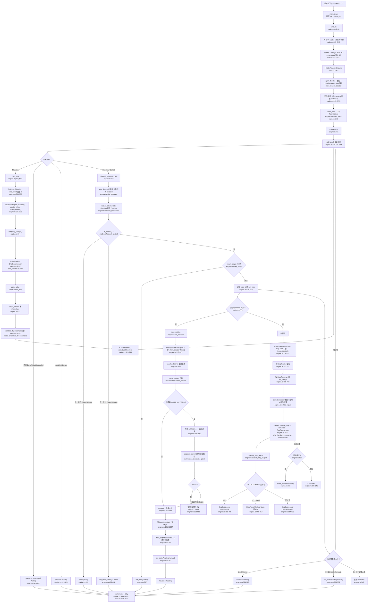
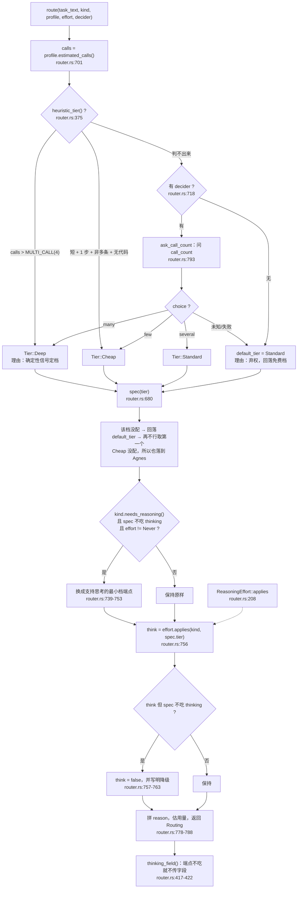
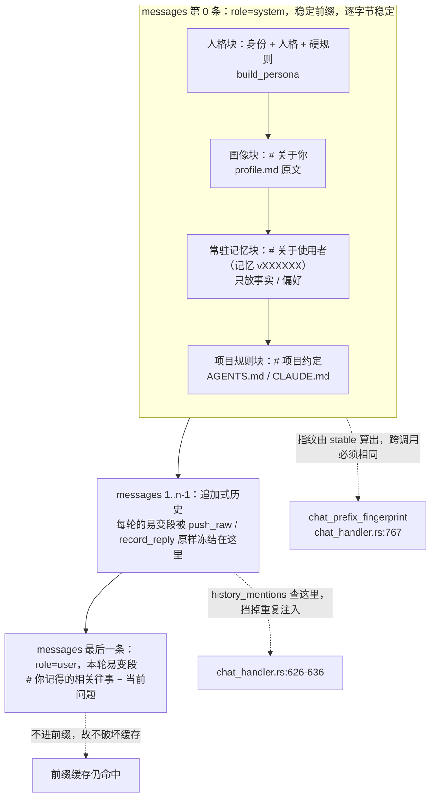
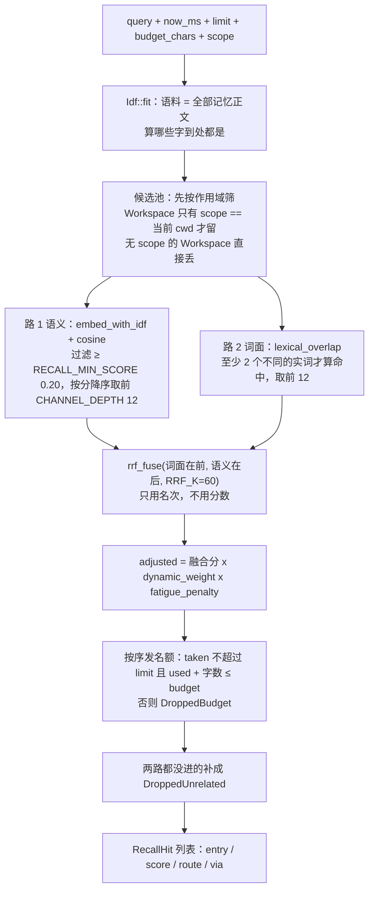

# YunXi Bot

> **陪伴型 · 通用 · 常驻 · Agent 助理**

一个本地优先、7×24 常驻的个人 Agent。核心不在于"能聊"，而在于**它知道什么时候该介入、什么时候该沉默**。

---

## 目录

| 章节 | 讲什么 |
|---|---|
| [设计哲学](#设计哲学) · [快速开始](#快速开始) · [安装](#安装一条命令) · [边界](#不可动摇的边界) | 就在本页 |
| [一、架构与技术栈](docs/readme/01-架构与技术栈.md) | 设计理念、技术栈、依赖清单、**模块地图**、分层架构图、数据落地 |
| [二、任务链路与决策模型](docs/readme/02-任务链路与决策模型.md) | **任务输入全链路**、决策模型的五个调用点、**模型选择器**、`decide:` 生命周期、工具循环 |
| [三、提示词、人格与记忆](docs/readme/03-提示词人格与记忆.md) | **系统提示词拼接**、人格文件、画像两条来源、记忆与两路召回、脱敏诊断 |

三篇正文都是**对着源码写的**，每条事实都带 `文件:行号`——
**它们取代了本页的细节**，本页只留最短的上手路径和四张最要紧的图。

---

## 四张图看懂它

### 任务输入时的完整链路



### 模型选择器怎么选



### 一次请求的消息序列（稳定前缀 + 易变尾）



### 从一句话到注入了哪几条记忆



> 完整的链路、分支和常量在 [二、任务链路与决策模型](docs/readme/02-任务链路与决策模型.md)。

---

## 设计哲学

| 词 | 承诺 |
|---|---|
| **陪伴** | 对你的状态有连续记忆，介入方式随关系状态变化 |
| **通用** | 不预设领域；能力可扩展，内核不知道具体领域 |
| **常驻** | 7×24 运行，任务与状态跨重启存活 |
| **助理** | 既做判断也干活 |

### 核心判断：陪伴不是功能，是「介入策略」

"什么时候该开口、什么时候该沉默、此刻该用关心还是汇报的语气"——**这些本质上全是分类判断**。

而常驻 + 陪伴 + 通用这三者**无法同时用规则满足**：规则要么漏（通用场景写不全），要么吵（保守阈值频繁打扰）。

所以本项目把「何时介入」交给**决策模型**判断，再用确定性约束层兜底：

```text
state（含你的偏好与约束）+ 类型化问题
        ↓
   决策模型  →  标签 + 概率          ← 接管全部【判断】
        ↓
   约束层（确定性）→ 只能往【更保守】修正  ← 永远不会"发明"决定
        ↓
      动作
```

这条链条的形状借自本项目自身的既有设计原则：**能力可以下放，安全边界只能收紧。**

---

## 当前状态

**可运行的调度原型。** 任务能按触发条件自动执行、结果落台账、需批准的任务被拦下、
崩溃残留被回收、状态跨进程存活。

| 模块 | 状态 |
|---|---|
| `job` — 任务模型与状态机 | ✅ 状态迁移白名单；区分「上次运行结果」与「任务生命周期」 |
| `ledger` — append-only 台账 + 投影 | ✅ 边界内审计、格式版本、拒绝无损 JSON |
| `policy` — 两个正交旋钮 + 封闭审批词汇表 | ✅ 表外结果一律归一为 `unavailable` |
| `trigger` — 定时 / cron / 文件监听 | ✅ 本地时间 cron、单飞、崩溃残留回收 |
| `exec` — 子进程执行与凭证剥离 | ✅ 硬超时 + 进程树清理；**拿不到要求的隔离就拒绝执行** |
| `runner` — 调度循环 | ✅ 把上面五个模块串成一个回合 |
| **`decide` — 决策层** | ✅ typed questions、响应校验、六类双向降级、熔断 |
| **`instance` — 单实例锁** | ✅ pid 存活探测；**陈旧锁自动接管**（崩溃过一次不会再也起不来） |
| **`win_job` — Windows 隔离** | ✅ Job Object：进程树强制回收 + 内存/进程数上限 |
| **`memory` — 记忆层** | ✅ 事件溯源投影；`build_decision_state` 主动裁剪 state |
| **`companion` — 陪伴层** | ✅ 记忆 → 模型判断 → **约束只能更保守** |
| **`think` — 思考层** | ✅ Agnes（OpenAI 兼容）接入 + 本地限流 + 错误可分重试 |
| **`sidecar` — 决策模型接入** | ✅ Verdict 后端（选项顺序不变 + 估形弃权 + 可离线） |
| **`agent` — Agent 循环** | ✅ 记忆投影 → 本地判断 → 约束收紧 → 远端表达 → 落台账 |
| 常驻守护 | ✅ 单实例锁、连续失败熔断、开机自启 |
| 入口层（语音 / 微信 / Web） | ⬜ 待实现（当前是 CLI） |

### 陪伴层：约束只能更保守

```bash
cargo run -- companion --demo      # 桩模型每一刻都说「该开口」，看约束如何压住它
cargo run -- companion             # 真实调用本地决策模型
```

实测输出（桩模型在四个时刻都建议"主动开口"）：

```text
  时刻     模型建议    最终动作    说明
  03:00 凌晨 开口       延后聚合   模型建议「主动开口」，被约束收紧为「延后聚合」：当前处于安静时段（3 点）
  09:00 上午 开口       主动开口   模型判断：主动开口（无约束限制）
  14:00 下午 开口       主动开口   模型判断：主动开口（无约束限制）
  23:00 深夜 开口       延后聚合   模型建议「主动开口」，被约束收紧为「延后聚合」：当前处于安静时段（23 点）
```

**模型接管全部判断，但约束层永远不会"发明"决定，只会把动作往更保守的方向压。**
安静时段、每日上限、最小间隔是使用者设定的**硬事实**，不归模型判断——
模型概率不可靠这件事，被挡在安全边界之外。

记忆的作用是提供"凭什么亲近"：

```text
记忆 / 关系状态  ──提供「凭什么亲近」──┐
                                      ├──→ 决策层判断介入
当下情境         ──提供「此刻发生什么」─┘
```

`build_decision_state` **主动裁剪**：每类记忆只取权重最高的若干条，关系状态压成
一个阶段标签，而不是把知道的一切都塞进 prompt。

### 隔离：承诺到哪就说到哪
| 机制 | 状态 | 真实保证 |
|---|---|---|
| **Windows 低完整性令牌** | ✅ **已实现并自检通过** | 子进程**写不进**任何中完整性对象（用户目录里的文件全是中完整性）；可写区仅限低完整性沙箱 |
| **Windows Job Object** | ✅ 已实现并验证 | 进程树强制回收、单进程内存上限、进程数上限 |
| 其他平台 | ✅ 进程隔离 | 独立进程组 + 超时整组清理 |

> ⚠️ **它只隔离写入，不隔离读取。** 子进程仍能读该用户能读的任何东西。
> Job Object 也不构成文件系统沙箱。把"进程与资源隔离"说成"沙箱"是本项目明令禁止的。

**隔离声明由实测背书，不由代码注释背书：**

```bash
cargo run -- isolation-check     # 真起一个受限子进程去写允许与禁止的路径
```

实测输出：

```text
授权区（低完整性）   : C:\Users\...\AppData\LocalLow\YunXiBot-isocheck-...\allowed
禁止区（中完整性）   : D:\...\temp\yunxi-isocheck-...\denied

授权路径写入 : true
未授权路径写入: false
stdout: OK   ...\LocalLow\...\allowed\yunxi-canary-allowed.txt
        FAIL ...\temp\...\denied\yunxi-canary-denied.txt -> 拒绝访问。 (os error 5)
判定: 写入隔离生效：授权路径可写，未授权路径被拒
```

**差分验证**（同一任务，开关隔离对比）：

| | 任务写用户目录的结果 |
|---|---|
| 不加隔离 | ✅ 创建成功 |
| `--require-os-isolation` | ❌ `error=拒绝访问。` |

机制说明、被证伪的能力 SID 路线、以及自检抓出的七个错误，记录在
[ADR-0001 D7](docs/adr/0001-架构与边界.md) 与
[`win_token.rs`](crates/yunxi-bot-core/src/win_token.rs) 的模块文档。

`--require-os-isolation` 的执行点是 `write_isolation_verified()`：**不会因为
"代码里有这个功能"就放行**，而是要求自检真的跑过一次并成功；不通过就在派生之前拒绝。

每条执行记录都会把**实际达到**的级别写进台账；Job 建失败时如实回落，不会把没做到的说成做到了。
`STATUS_DLL_INIT_FAILED`"——因为正常进程启动本身就需要写注册表 HKCU 等位置。

每条执行记录都会把**实际达到**的级别写进台账；Job 建失败时如实回落到 `进程隔离`，
不会把没做到的说成做到了。

### 常驻

```bash
cargo run -- daemon --interval 5000     # 常驻（Ctrl+C 停止，锁自动释放）
cargo run -- supervise                  # 监督模式：异常退出自动重启
cargo run -- install-autostart          # 注册当前用户登录时自启（跑的是 supervise）
cargo run -- autostart-status           # 查看注册状态
cargo run -- uninstall-autostart        # 取消自启
```

**三层看护**，各管一段：

| 层 | 管什么 |
|---|---|
| `daemon` 循环 | 单轮失败不致命；连续 5 次失败才退出，避免空转刷屏 |
| `supervise` | 进程级崩溃（OOM / panic / 被强杀）后自动重启，指数退避，超过上限就放弃并暴露问题 |
| `install-autostart` | 登录时拉起 `supervise`，per-user、零权限 |

自启走**当前用户的「启动」文件夹 + VBS 隐藏启动器**：

> 实测 `schtasks /SC ONLOGON` 在普通用户下返回 `ERROR: Access is denied.`，
> 因此改用 per-user 的启动文件夹；`.cmd` 会弹控制台窗口，故用 VBS 的
> `Run(..., 0, False)` 以隐藏窗口拉起。删除那个 `.vbs` 即可取消自启。

### 决策层

```bash
cargo run -- decide --demo   # 六类降级方向表（不需要模型）
cargo run -- decide          # 真实调用本地 sidecar
```

决策模型是**本地 sidecar**，只绑回环：

```bash
python -m pip install laya                    # 上游决策模型包
python sidecar/laya_server.py --port 17870    # 中文场景用 laya-multilingual
```

Rust 侧只认一个固定 JSON 契约，上游库的差异由 sidecar 吸收（见
[`sidecar/laya_server.py`](sidecar/laya_server.py)）。

**三条硬规则：**

1. **模型的判断是策略的输入，不是策略的替代**——模型给概率，约束层做决定。
2. **降级方向按类别相反**：打扰类 fail-closed（不打扰），安全类 fail-open（升级给人）。
3. **不信任模型返回值**：选项不在声明的判据里、概率越界、缺答案 → 一律判为非法并降级。

模型不可用时**返回明确错误让上层降级，绝不伪造答案**。实测：

```text
$ cargo run -- decide
已降级: 决策模型不可用：调用超时
保守动作: 延后聚合，本轮不打扰
```

架构与边界的完整设计见 **[ADR-0001](docs/adr/0001-架构与边界.md)**。

---

## 快速开始

需要 Rust stable 1.85+（edition 2024）。

```bash
cargo build
cargo test

# 创建一个每 2 秒执行的任务
cargo run -- add "心跳任务" --every 2 -- cmd /C "echo heartbeat-ok"

# 创建一个不可逆任务（创建即进入待批准，不会执行）
cargo run -- add "发送通知" --irreversible --every 2 -- ./publish.sh

# 常驻守护：每 1 秒一轮，跑 6 轮（去掉 --max-ticks 就是真常驻）
cargo run -- daemon --interval 1000 --max-ticks 6

cargo run -- list          # 列出任务
cargo run -- log -n 12     # 看台账事件流
cargo run -- approve <id>  # 批准待批准任务
cargo run -- policy        # 权限预设
```

实测输出（心跳任务执行 3 次，不可逆任务一次都没跑）：

```text
[  1] 检查 2｜到期 1｜单飞跳过 0｜待批准 0｜成功 1｜失败 0｜残留回收 0
[  3] 检查 2｜到期 1｜单飞跳过 0｜待批准 0｜成功 1｜失败 0｜残留回收 0
[  5] 检查 2｜到期 1｜单飞跳过 0｜待批准 0｜成功 1｜失败 0｜残留回收 0

   3  job_started            1a10bc19ef97f7c
   4  job_succeeded          1a10bc19ef97f7c  exit_code=0 duration_ms=27 isolation=进程隔离（未实施 OS 级强制）
```

数据目录默认为 `%LOCALAPPDATA%\YunXiBot`（Windows）或 `~/.yunxi-bot`，可用 `YUNXI_BOT_HOME` 覆盖。

---

## 不可动摇的边界

1. **失败方向朝「不执行」**——判定不明一律转待批准，绝不放行。
2. **不可逆动作必须人工批准**，且批准不参与降级。
3. **决策模型的判断不能替代策略**——模型给概率，约束层做决定。
4. **审批结果使用封闭词汇表**——词汇表之外的一切归一为 `unavailable`（fail closed）。
5. **`approval = never` 表示「自动拒绝」，不是「自动放行」。**
6. **不写入边界外的审计事件**——宁可抛错。
7. **不静默降级**——任何降级都必须留痕。
8. **不把进程内策略包装成沙箱**——声称的隔离级别必须与实现一致。

---

## 仓库结构

```text
crates/
  yunxi-bot-core/     内聚内核（job / ledger / policy / trigger）
  yunxi-bot-cli/      命令行入口
docs/
  adr/                架构决策记录
```

**这是一个内聚的具体内核，不是元内核。** 它明确知道自己管什么；没有服务查找、没有事件总线、没有插件生命周期，依赖全部是编译期显式的。

---

## 许可与致谢

Apache-2.0。设计参考来源见 [`NOTICE`](NOTICE)。

### Agent 循环：三层各管一段

```text
台账 ──投影──> 记忆 + 现状
                 │
                 ├─> 本地决策层（Laya）：该不该介入？   ← 快、免费、离线
                 │        │
                 │        └─ 约束层收紧（只能更保守）
                 │
                 └─> 只有判定「开口」时才动用远端思考层（Agnes）
                          ↓
                      写回决策台账
```

**顺序不能反。** Agnes 免费档只有 **10 RPM**，常驻进程每轮都打远端几秒就把配额
烧光。本地那一层先筛，是这套配额下的结构必然，不是优化。

实测（替身判断模型说"该开口"，表达走真实的 Agnes）：

```text
$ yunxi-bot agent --hour 14
最终动作 : 主动开口
依据     : 模型判断：主动开口（无约束限制）

$ yunxi-bot agent --hour 3
最终动作 : 延后聚合
依据     : 模型建议「主动开口」，被约束收紧为「延后聚合」：当前处于安静时段（3 点）
```

### 思考层：Agnes

```bash
# 密钥放仓库外（%LOCALAPPDATA%\YunXiBot\secrets\agnes.key），或用环境变量
export YUNXI_BOT_AGNES_KEY=sk-...
cargo run -- think "用一句话回答：你更擅长什么？"
```

- Base URL `https://api.agnes-ai.cn/v1`，默认模型 `agnes-3.0-flash`（512K 上下文、支持工具调用）
- **密钥从类型上就打印不出来**：`ApiKey` 不实现 `Display`，`Debug` 只显示前 6 位
- **本地限流**先于网络：拿不到配额就返回 `LocalThrottle`，不 sleep 卡住整轮调度
- **错误分"可重试"与"不可重试"**：429/5xx/网络可重试；401/402/403/404/400 重试只会浪费配额

### Agent 相关命令

```bash
cargo run -- remember "在准备 AI 岗位的面试" --kind fact
cargo run -- agent                      # 跑一个完整回合
cargo run -- agent --show-prompt        # 先看它到底知道什么（排查"为什么不说话"）
cargo run -- journal                    # 最近的决策记录
cargo run -- daemon --agent             # 常驻循环里开启判断（每 12 轮一次）
```

**没装 Laya 时 Agent 不会说话**——判断层降级为 fail-closed（不打扰）。
这是设计，不是故障，daemon 会提示一次。

`sidecar/mock_laya.py` 是一个**测试替身**：实现相同的线协议但按脚本作答，
让"判断 → 约束 → 表达 → 台账"这条链路能在不下载 640MB 模型的情况下被验证。
## 安装（一条命令）

```powershell
git clone https://github.com/sjxbbdb/YunXi-Bot
cd YunXi-Bot
pwsh scripts/setup.ps1        # 建 venv + 装依赖 + 拉决策模型权重（校验 SHA256）
cargo build
cargo run -- isolation-check  # 验证写入隔离真的生效
```

`setup.ps1` 会做三件事：建 `.venv`、装 Python 依赖（约 1GB，含 torch CPU 版）、
**拉取决策模型权重（约 350MB，校验 SHA256）**。跑完即可用。

### 决策模型权重为什么不在 git 里

单个 `model.safetensors` 有 **448.8 MB**，超过 GitHub 的 **100 MiB 单文件硬上限**，
推送会被直接拒绝。所以：

| | 放在哪 | 大小 |
|---|---|---|
| 编码器权重 | [GitHub Release `models-v1`](https://github.com/sjxbbdb/YunXi-Bot/releases/tag/models-v1) | 347.7 MB |
| 下载+校验脚本、清单、模型卡 | **仓库里** | 几十 KB |
| 我们 fit 出来的决策头 + 校准 | **仓库里**（几十 KB，这才是项目的资产） | —— |

```bash
python scripts/fetch_model.py          # 下载 + 校验 + 解压到 <数据目录>/models/
python scripts/fetch_model.py --check  # 只校验，不下载
```

权重落在 `<数据目录>/models/verdict-small/`，sidecar 优先读它——
**实测在 `HF_HUB_OFFLINE=1` 下正常加载（7 秒），之后完全离线可用。**

### 决策模型为什么是 Verdict

选它不是为了基准分，是因为它**唯一同时满足这个项目的三条硬条件**：

| 硬条件 | 出处 | Laya | **Verdict** |
|---|---|---|---|
| 中文可用 | 全程中文 | ⚠️ 非拉丁文字会静默失败 | ✅ multilingual-e5-small |
| 概率可当阈值用 | ADR §7.3 第 5 条 | ❌ ECE 0.466，且未带拟合温度 | ✅ ECE 0.014–0.030，且如实报 `calibrated` |
| 选项顺序不影响答案 | 判断"该不该打扰"，换问法变答案不可接受 | ❌ 翻转率 0.23 | ✅ 结构上保证（已实测正序/逆序一致） |

外加：**`/v1/systemone` 线协议与 Laya 一致**，所以换后端 **Rust 侧一行未改**。

⚠️ **默认未校准**（`calibrated: false`）。ADR §7.3 第 5 条禁止拿未校准的概率卡阈值，
所以 Rust 侧目前只用 argmax，不用它的概率做阈值判断。
