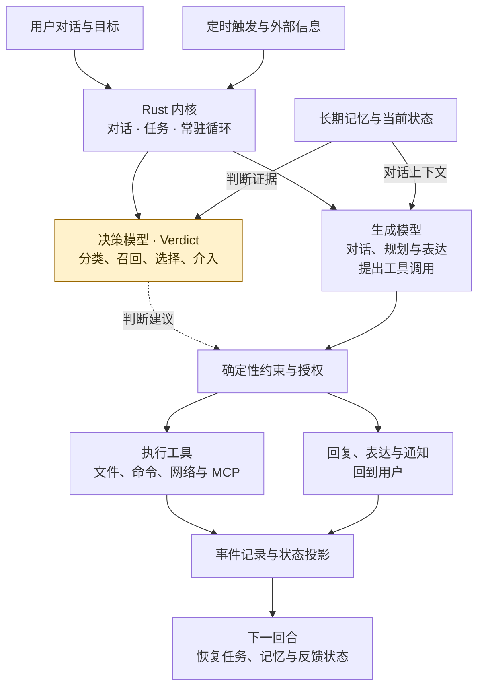
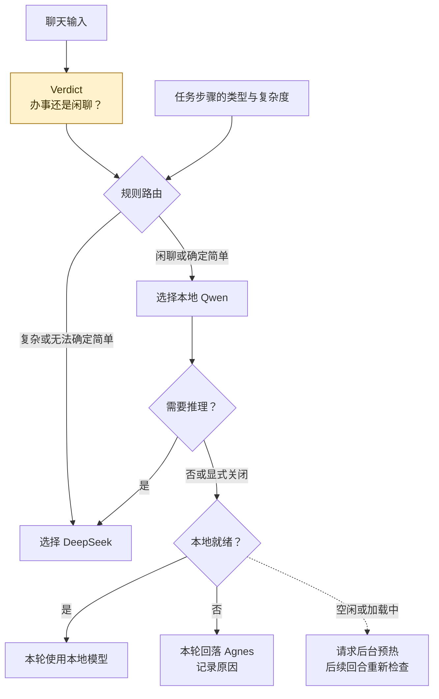
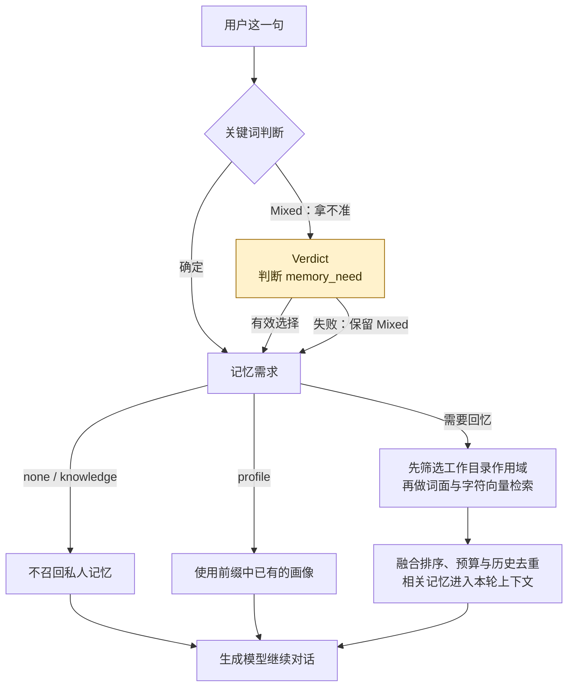
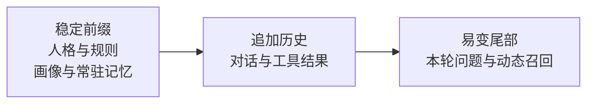
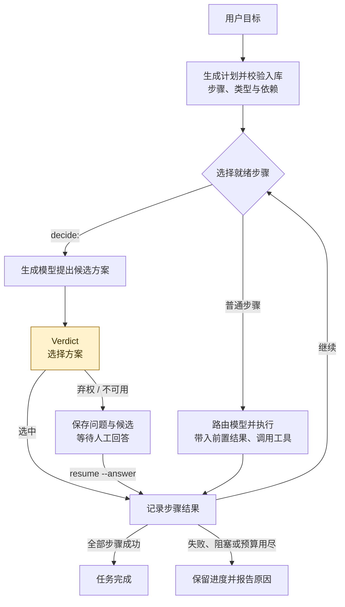
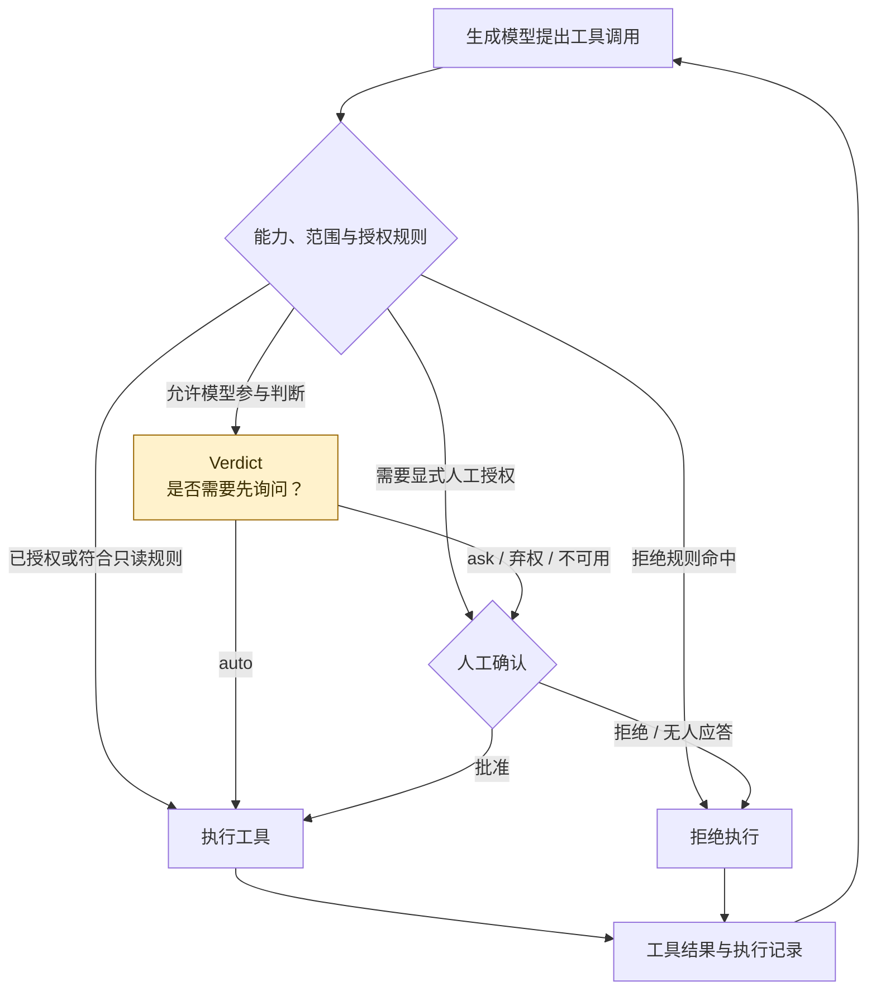
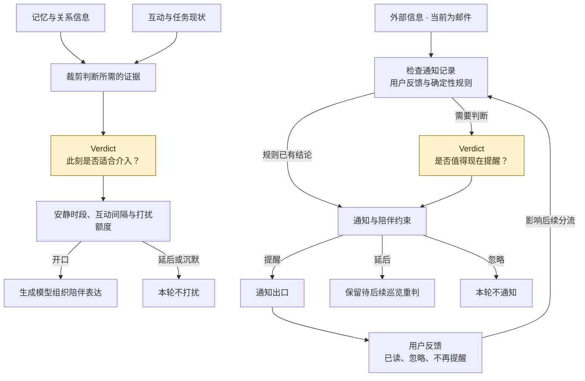
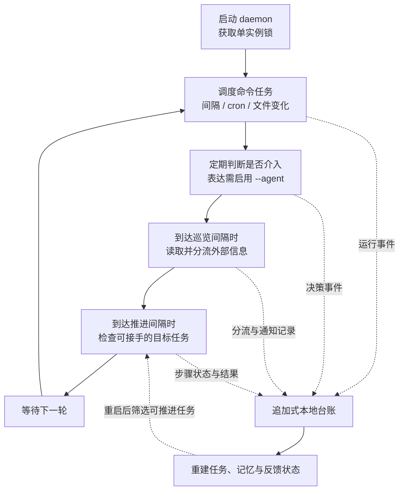

<div align="center">

# YunXi Bot

**陪伴型 · 通用 · 常驻 Agent 助理**

让陪伴有连续性，让行动有分寸。

[设计哲学](#设计哲学) · [系统架构](#系统架构) · [记忆与人格](#记忆与人格) · [任务执行](#任务执行) · [主动陪伴](#主动陪伴) · [开始使用](#开始使用)

</div>

YunXi Bot 是 YunXi 家族衍生的个人 Agent。它以本地机器为长期运行的载体，将对你的了解、对当下情境的判断，以及实际执行任务的能力连接起来。你提出需求时，它可以对话、查找信息、操作文件和推进任务；常驻时，它可以关注任务与外部信息，在合适的时候提醒你。

项目的目标是让一个助理长期在场：相处有连续性，行动有边界，主动有分寸。

> **开发状态**：当前提供 CLI 交互与常驻守护，主要在 Windows 上开发和验证。语音、微信和 Web 入口尚未接入本仓库。下面的功能与流程按当前源码说明；产品目标与实现限制分别列出。

## 设计哲学

### 陪伴的温度来自连续性

人格决定表达方式，记忆承接共同经历，画像保存经确认的用户信息。一次关心应当有具体依据：你说过什么、正在做什么、之前发生过什么。连续的状态让下一次互动可以接着上一次发生。

### 主动性需要判断，也需要克制

一个常驻助理会遇到大量事件，而用户的注意力是有限的。YunXi Bot 将“是否需要召回记忆”“是否需要询问”“此刻是否值得打扰”等判断交给本地决策模型参与，再以确定性约束限制行动。安静时段、打扰频率和授权边界不会因模型的建议而被放宽。

### 通用能力围绕目标组织

用户可以给出一个目标，由系统拆解、传递前置结果、调用工具并保存进度。文件、命令和网络是通用能力，MCP 提供扩展入口。任务内核负责目标与状态，具体动作交给工具执行。

### 常驻意味着持续负责

任务进度、记忆、决策和反馈落在本地。守护循环检查触发条件、推进可继续的任务、巡览信息；遇到需要人工判断的情形，保存现场并交还给用户。持久化、恢复、超时和失败处理共同支撑这种连续性。

这些取舍继承了 YunXi 家族的陪伴与治理设计。Bot 的主要探索集中在**跨模块的决策能力、内聚的任务内核和常驻形态**；代码独立，不依赖其他 YunXi 仓库才能编译。设计依据见 [ADR-0001](docs/adr/0001-架构与边界.md)，来源见 [NOTICE](NOTICE)。

## 系统架构

系统有两类互补的模型能力：**决策模型**回答有明确选项的问题，**生成模型**负责理解目标、组织内容和提出工具调用。Rust 内核组织流程、执行规则并记录状态。

下面先展示核心协作关系。决策模型贯穿业务模块；具体调用位置与触发条件，在后续各图中展开。虚线表示模型建议，不代表直接执行。



### 决策能力嵌入在哪里

Verdict 是共享的本地判断能力。各模块构造自己的问题与证据，解释答案，再应用对应的约束和失败处理。图中的黄色节点均表示 Verdict 的业务判断。

| 参与模块 | 判断的问题 | 对运行的影响 |
|---|---|---|
| 输入分类 | 这句话是在办事，还是在闲聊？ | 为对话回合的模型路由提供输入 |
| 记忆召回 | 回答这一句，需要关于用户的什么记忆？ | 决定是否进入动态召回；关键词不确定时调用 |
| 工具门禁 | 这个动作是否需要先询问用户？ | 在规则允许进入模型判断的路径上，选择自动执行或询问 |
| 任务决策点 | 根据现有证据，应选择哪个候选方案？ | 为 `decide:` 步骤选择结果，弃权则等待人工 |
| 陪伴介入 | 现在适合开口、延后，还是沉默？ | 结合记忆和现状决定介入，再受安静时段等约束收紧 |
| 通知分流 | 这条外部信息值得现在提醒吗？ | 在通知规则未定时参与判断，影响提醒、延后与忽略 |

输入分类、召回、审批、任务决策、陪伴和通知具有不同的失败代价。模型不可用时，审批与任务决策倾向交给人，陪伴与通知倾向不打扰；召回门控保留保守的召回判断。分类失败在当前对话入口中按闲聊处理。模型答案不构成越过权限的依据，未校准的概率也不用于强制审批阈值。

实现入口：[决策契约](crates/yunxi-bot-core/src/decide/mod.rs) · [对话装配](crates/yunxi-bot-cli/src/chat_handler.rs) · [任务决策](crates/yunxi-bot-core/src/task/decide.rs) · [陪伴约束](crates/yunxi-bot-core/src/companion.rs)

### 运行组件与模型分工

| 组件 | 当前实现 | 职责 |
|---|---|---|
| 主程序 | Rust 2024，CLI + core 两个 crate | 会话、任务、调度、约束、工具和台账 |
| 决策服务 | Verdict，回环端口 `17870` | 结构化分类与选择 |
| 本地生成服务 | `Qwen3-4B-Instruct-2507`，回环端口 `17872` | 闲聊与确定简单的任务，支持工具调用和流式输出 |
| 远端生成模型 | `deepseek-flash` | 复杂任务，以及默认需要推理的规划、分析步骤 |
| 远端回落与表达 | `agnes-3.0-flash` | 本地未就绪时的回落；当前主动陪伴表达和画像提炼也使用它 |
| 邮件服务 | Python IMAP sidecar，回环端口 `17871` | 只读获取邮件，不标记为已读 |
| MCP | Rust 客户端 + stdio 子进程 | 连接外部工具；异步运行时封装在 MCP 模块内 |

<details>
<summary>展开模型路由与本地健康回落</summary>



路由由代码规则完成，健康探测访问 sidecar 的 `/health`。它们不额外询问 Verdict。每个任务步骤独立选模型，一步内部的工具循环保持该模型。`do --provider agnes|deepseek` 可覆盖该次执行的路由，`resume` 当前恢复默认路由；`--thinking` 控制思考模式。

**本地优先不等于全程离线。** 默认复杂任务会访问远端模型，本地回落也会向 Agnes 发送本轮上下文；选择的模型会收到相应的提示词、召回内容和工具结果。模型名、端点与计价表是当前代码配置，服务可用性和实际费用以供应商为准。

源码：[router](crates/yunxi-bot-core/src/think/router.rs) · [local_health](crates/yunxi-bot-core/src/think/local_health.rs) · [OpenAI 兼容客户端](crates/yunxi-bot-core/src/think/agnes.rs)

</details>

## 记忆与人格

相处的连续性由几种不同的状态共同承担。

| 状态 | 保存什么 | 如何使用 |
|---|---|---|
| 人格 `persona.md` | 名称、语气与相处方式 | 参与稳定系统提示词的组装 |
| 画像 `profile.md` | 经用户确认的身份、偏好与背景 | 进入稳定前缀；模型提议先进入待确认列表 |
| 长期记忆 | 事实、偏好、关系、事件、工作目录记忆 | 从台账投影，按需要召回；工作目录记忆受当前目录限制 |
| 会话历史 | 当前对话及工具交互 | 每轮保存，可恢复；长上下文可压缩 |

### 先判断需要，再召回内容

对话会先识别记忆需求。常见问法由关键词处理，拿不准时让 Verdict 区分私人记忆、用户画像、通用知识等需求。随后由检索代码完成召回和筛选。



**记忆也反过来支撑决策。** `Memory::build_decision_state` 从事实、偏好、关系与事件中取出有限证据，与互动间隔、待处理事件等现状组合，供陪伴判断使用。于是，“记得什么”和“何时介入”形成连接。

图中的“需要回忆”包括 `episode / long_term / mixed`，当前进入同一条检索链。`knowledge` 只表示不翻私人记忆，不会自动启动知识库搜索。召回使用本地字符 n-gram 向量与词面匹配，无需独立 embedding 服务。

画像、常驻记忆、项目规则与动态召回目前装配在 `chat`。`do` 的步骤使用人格、任务指令与前置结果，尚未共享完整的聊天记忆上下文；主动陪伴使用长期记忆证据，但表达仍采用固定提示词，尚未复用可编辑的人格与画像前缀。

### 记忆如何进入系统

`remember` 显式记录一条记忆；`profile --learn` 从最近会话的用户发言中提炼画像候选，再由 `--accept` / `--reject` 确认。后者使用生成模型 Agnes。保存聊天历史不会自动把每一句话写成长期记忆。

```powershell
cargo run -- remember "回答时先给结论，再展开解释" --kind preference
cargo run -- remember "这个项目使用 cargo test 验证" --kind workspace
cargo run -- memory
cargo run -- profile --learn
cargo run -- profile --pending
```

<details>
<summary>展开上下文组装、缓存与会话恢复</summary>



稳定内容带指纹，动态召回放在尾部，已经存在于历史中的记忆不重复注入。超过上下文预算时，系统压缩较早的历史，并保留工具调用与结果的配对。提示词的稳定结构为模型前缀缓存提供条件，实际命中由模型服务决定。

```powershell
cargo run -- chat list
cargo run -- chat --resume
cargo run -- chat --resume --id '实际会话ID'
```

源码：[记忆投影与召回](crates/yunxi-bot-core/src/memory.rs) · [召回问题](crates/yunxi-bot-core/src/recall_gate.rs) · [提示词组装](crates/yunxi-bot-core/src/think/prompt.rs) · [上下文压缩](crates/yunxi-bot-core/src/think/context.rs) · [会话存储](crates/yunxi-bot-core/src/think/session.rs)

</details>

## 任务执行

`chat` 适合在交互中边聊边做，模型可以直接进入工具循环。`do` 接受目标，建立带步骤与依赖的持久化任务；`resume` 接着推进已有任务。对话中的办事请求不会自动等同于创建一个 `do` 任务。



任务引擎负责状态迁移、依赖、重试与人工介入。每次推进重新读取任务投影，将前置产物交给后续步骤。当前步骤按顺序执行；全部步骤进入终态不等于目标达成，存在失败或跳过时不会一律报告完成。

```powershell
cargo run -- do "阅读当前目录的项目文档，整理一份模块说明保存到 overview.md"
cargo run -- tasks
cargo run -- tasks '实际任务ID'
cargo run -- resume '实际任务ID'
cargo run -- resume '实际任务ID' --answer "采用第二个方案"
```

默认最多拆解 12 步，单步最多尝试 2 次，工具循环默认最多 8 轮并检测重复调用。`--budget` 控制一次引擎推进的调用计数，默认 20，**不等同于跨恢复累计的费用上限，也不逐次限制工具循环内的所有模型请求**。实际调用用量另外写入成本台账。

源码：[任务状态](crates/yunxi-bot-core/src/task/model.rs) · [计划解析](crates/yunxi-bot-core/src/task/plan.rs) · [执行引擎](crates/yunxi-bot-core/src/task/engine.rs)

### 工具与权限协同

内置工具覆盖时间、文件读取与检索、文件写入与编辑、命令执行、网页抓取与搜索，以及向用户提问。模型提出动作后，工具门禁先检查规则；需要判断的路径再询问 Verdict，无法确定则交给人。

<details>
<summary>展开工具审批、执行与结果回灌</summary>



`ReadOnly / Write / Execute / Network / Outbound / Unknown` 区分动作的能力与风险。网络访问独立于只读文件操作；不可逆动作及能力未知的工具不交给模型判断。拒绝规则优先，明确的用户预批准按范围匹配。

文件覆盖要求先读取，写入审批可以展示 diff。命令执行带超时、环境变量筛选和进程清理。不同工具具有不同的执行与隔离机制，不能把一处门禁等同于整个进程拥有完整沙箱。

```powershell
cargo run -- tools
cargo run -- do "读取 README.md 并说明项目定位" --allow read_file
cargo run -- mcp list
```

MCP 使用 stdio 传输，从数据目录中的 `mcp.json` 加载配置。当前 `chat` 接入 MCP 工具；`do`、`resume` 和守护任务推进尚未装配同一套 MCP 扩展。默认 MCP 工具按能力未知处理；配置中的 `require_approval` 会影响能力分类。独立的 `mcp call` 命令直接调用工具，不经过上述对话工具门禁。

源码：[工具注册与门禁](crates/yunxi-bot-core/src/tool/mod.rs) · [工具循环](crates/yunxi-bot-core/src/tool/runner.rs) · [MCP](crates/yunxi-bot-core/src/mcp.rs)

</details>

## 主动陪伴

主动介入有两种来源：内部的记忆与任务现状，以及外部的信息变化。它们分别进入陪伴判断和通知分流，最终都要经过克制打扰的约束。



陪伴链路只在需要开口时调用生成模型组织表达。邮件巡览记录获取、判断和投递结果，用户反馈进入后续分流依据。暂缓项目可在后续巡览重新判断。

设计上区分“决定提醒”“尝试投递”“已确认送达”和“用户已读”。当前通知去重仍有实现限制：非演练的投递记录即可能进入已处理集合，失败投递不保证自动重试；通知后端的确认也不能证明用户看到了通知。

```powershell
cargo run -- check --dry-run
cargo run -- feedback --last --read
cargo run -- feedback --last --never
cargo run -- journal
```

`check --dry-run` 仍会读取信息、执行判断并写台账，只是不发送通知。邮件巡览需要先配置并启动 [邮件 sidecar](sidecar/mail_server.py)。

源码：[陪伴回合](crates/yunxi-bot-core/src/agent.rs) · [信息巡览](crates/yunxi-bot-core/src/assistant.rs) · [通知分流](crates/yunxi-bot-core/src/triage.rs) · [反馈投影](crates/yunxi-bot-core/src/feedback.rs)

## 常驻与可追溯性

守护进程把周期性调度、信息巡览和任务推进放进同一个运行循环。命令任务 `job` 保存“何时执行什么命令”；目标任务 `task` 保存“如何逐步完成目标”。两者共享台账，但拥有各自的状态与调度逻辑。

<details>
<summary>展开守护循环与持久化协作</summary>



| 节奏 | 当前默认值 | 调整方式 |
|---|---|---|
| 主循环 | 5 秒 | `--interval`，单位毫秒 |
| 邮件巡览 | 300 秒 | `--assistant-interval`，`0` 关闭 |
| 目标任务推进 | 60 秒检查一次，闲置 120 秒后可接手 | `--task-interval` / `--task-idle`，单位秒 |
| 陪伴表达 | 用 `--agent` 启用；默认每 12 轮判断 | `--judge-every` |

当前陪伴与邮件巡览共用决策引擎：只开启邮件巡览时，也可能进入无表达模型的陪伴判断回合。需要纯命令调度时，可显式关闭邮件巡览和目标任务推进。

`supervise` 在守护异常退出后重启，Windows 登录自启使用当前用户的启动目录。当前监督器只转发主循环间隔，不会转发全部 `daemon` 参数。无人值守的审批者不授予新的人工作业批准；需要人工的任务应回到交互入口处理。

```powershell
# 仅运行命令任务调度
cargo run -- daemon --assistant-interval 0 --task-interval 0

# 启用陪伴表达；保留默认巡览和任务推进
cargo run -- daemon --agent

# 监督与 Windows 当前用户登录自启
cargo run -- supervise
cargo run -- install-autostart
cargo run -- uninstall-autostart
```

</details>

台账采用追加式 JSONL，任务、记忆、反馈等状态由事件投影得到。模型调用、工具结果与决策记录让运行过程可以回查；会话历史另外保存在 `sessions/`。重启后可重新读取状态，但不能据此保证外部动作恰好执行一次。

```powershell
cargo run -- status
cargo run -- log -n 20
cargo run -- journal
cargo run -- cost --calls 10
```

运行数据由 `YUNXI_BOT_HOME` 指定；未设置时，Windows 使用 `%LOCALAPPDATA%\YunXiBot`，其他平台使用 `~/.yunxi-bot`。仓库的便携启动脚本另行将其指向仓库内的 `data/`。台账、会话、权重与凭证不应提交到 Git。

## 开始使用

以下命令以 **Windows 上的 PowerShell 7.1+** 为例。需要 Git、Rust 1.88 或更新版本及相应编译工具；本地决策服务使用 Python 3.12。第一次安装需要联网。

### 1. 构建并准备决策模型

```powershell
git clone https://github.com/sjxbbdb/YunXi-Bot.git
cd YunXi-Bot

# 让本节各终端使用同一数据目录；新终端也需设置此变量
$env:YUNXI_BOT_HOME = Join-Path $PWD 'data'

pwsh scripts/setup.ps1
cargo build
cargo run -- isolation-check
```

`setup.ps1` 创建 `.venv`、安装决策服务依赖，并下载 Verdict 权重。优先使用 [models-v1 Release](https://github.com/sjxbbdb/YunXi-Bot/releases/tag/models-v1) 归档并校验 SHA256；Hugging Face 回落使用清单固定的 revision，不执行同样的归档校验。清单位于 [models/manifest.json](models/manifest.json)。这个步骤**不会下载本地 Qwen 模型，也不保证安装了适配显卡的 CUDA 版 PyTorch**。

在一个单独终端中，从仓库根目录启动决策服务：

```powershell
$env:YUNXI_BOT_HOME = Join-Path $PWD 'data'
.\.venv\Scripts\python.exe sidecar/verdict_server.py --port 17870
```

`chat` 和 `do` 也会尝试自动拉起决策服务；显式启动便于确认模型加载情况，并供守护进程使用。

### 2. 配置远端模型并开始交互

在本机数据目录的专用凭证文件中分别配置 Agnes 与 DeepSeek。下面用隐藏输入读取密钥；文件中仍是明文凭证，应限制本机访问权限，不上传到仓库：

```powershell
$secretsDir = Join-Path $env:YUNXI_BOT_HOME 'secrets'
New-Item -ItemType Directory -Force $secretsDir | Out-Null
Read-Host 'Agnes API key' -MaskInput | Set-Content (Join-Path $secretsDir 'agnes.key') -NoNewline
Read-Host 'DeepSeek API key' -MaskInput | Set-Content (Join-Path $secretsDir 'deepseek.key') -NoNewline

# 当前共享凭证读取器会优先使用此变量；清除本终端的覆盖值
Remove-Item Env:YUNXI_BOT_AGNES_KEY -ErrorAction SilentlyContinue

cargo run -- chat
```

Agnes 用于本地回落等路径，DeepSeek 用于默认复杂任务。当前客户端存在凭证接线限制：`YUNXI_BOT_AGNES_KEY` 会同时覆盖两种服务的文件来源，`YUNXI_BOT_DEEPSEEK_KEY` 尚未被读取。因此使用双服务时，应采用上面的独立文件，并在每个运行终端清除 Agnes 环境变量覆盖。

<details>
<summary>3. 可选：启用本地 Qwen 生成模型</summary>

CLI 自动启动本地模型时使用 CUDA。需要兼容的 NVIDIA 显卡、驱动、足够显存，以及同一 Python 环境中的 CUDA 版 PyTorch。按 [PyTorch 安装指南](https://pytorch.org/get-started/locally/) 为当前设备选择版本，不应仅凭 `setup.ps1` 成功就判断 GPU 环境可用。

```powershell
.\.venv\Scripts\python.exe -c "import torch; print(torch.cuda.is_available())"
.\.venv\Scripts\python.exe scripts/fetch_local_model.py Qwen/Qwen3-4B-Instruct-2507
.\.venv\Scripts\python.exe sidecar/local_llm_server.py --model Qwen3-4B-Instruct-2507 --device cuda
```

这里显式指定型号，以对齐 Rust 路由配置；下载脚本自己的默认型号是 `Qwen3-1.7B`。权重保存在同一数据目录的 `models/` 下。本地服务支持按需加载与空闲卸载；没有就绪时，本轮路由会回落 Agnes。`do` 不负责自动启动本地生成服务。

</details>

### 4. 按需要启用能力

| 想做什么 | 入口 |
|---|---|
| 对话、调用工具 | `cargo run -- chat` |
| 给出目标并逐步执行 | `cargo run -- do "目标"` |
| 保存偏好或工作目录记忆 | `cargo run -- remember "内容" --kind preference` |
| 查看任务并续跑 | `cargo run -- tasks` / `cargo run -- resume '实际任务ID'` |
| 巡览邮件 | 配置并启动 [mail_server.py](sidecar/mail_server.py)，再运行 `cargo run -- check` |
| 接入扩展工具 | 配置 [MCP](crates/yunxi-bot-core/src/mcp.rs)，运行 `cargo run -- mcp list` |
| 长期运行 | 参阅[常驻与可追溯性](#常驻与可追溯性)的开关与前提 |

不调用生成模型的入门检查：`cargo run -- status`、`cargo run -- policy`、`cargo run -- decide --demo`。完整命令入口见 [main.rs](crates/yunxi-bot-cli/src/main.rs)。

## 边界与当前进展

设计要求失败朝保守方向处理，模型判断服从确定性约束。需要批准的动作在无人应答时不会获得人工批准；`approval = never` 表示自动拒绝需要批准的动作。审批使用封闭词汇表，不接受任意外部文本作为授权。

| 范围 | 当前能力与限制 |
|---|---|
| 产品入口 | CLI 与守护可用；语音、微信、Web 尚未接入 |
| 任务完成 | 有状态机、依赖和恢复机制；步骤结果仍部分依赖模型输出，不能替代真实产物验证 |
| 记忆连续性 | 支持显式记忆、画像确认、会话恢复和动态召回；未实现全自动长期记忆整理 |
| 决策质量 | 默认 Verdict 未校准；能力依赖问题与输入证据质量，需要真实场景评估 |
| 互动状态 | 当前最近互动时间会受其他决策事件影响，主动陪伴时机仍有待完善 |
| 隔离 | Windows 在要求写隔离并通过自检时使用低完整性令牌；普通命令尽力使用 Job Object。`workspace-write` 不提供 OS 目录写入边界，读取与网络也未隔离；其他平台仅提供进程级控制 |
| 持久化 | 追加式台账可重建状态；不承诺数据库事务、断电持久性或外部副作用恰好一次 |

以上描述对应当前实现。历史对比与压力测试记录用于解释设计演进，不作为今天的成功率或稳定性保证。完整边界与取舍见 [架构决策记录](docs/adr/0001-架构与边界.md)。

## 开发与深入阅读

```text
crates/
  yunxi-bot-cli/       命令、对话交互、组件装配与人工审批
  yunxi-bot-core/      任务、决策、记忆、工具、调度与台账
sidecar/              本地模型、邮件服务、测试替身与端到端脚本
scripts/              环境准备、模型下载、校验与对比
models/               模型清单与模型卡
docs/
  adr/                架构决策与演进依据
  readme/             架构、任务链路、人格与记忆详解
  compare/            特定环境下的模型对比记录
```

Rust 核心使用 `serde` / `serde_json`、`chrono`、`ureq` 及 `rmcp` / `tokio`；版本与 feature 以 [Cargo.toml](Cargo.toml) 和 [Cargo.lock](Cargo.lock) 为准。核心逻辑保持同步，Python 能力通过进程与回环 HTTP 连接。

```powershell
cargo fmt --all -- --check
cargo build
cargo test
cargo clippy --all-targets
```

Rust 测试覆盖状态、规则与失败路径；`sidecar/` 中另有邮件单元测试、端到端及压力脚本。部分脚本会使用真实模型、凭证与服务，运行前应查看各脚本前提。单元测试通过不等于真实模型任务已完成验收。

| 文档 | 内容 |
|---|---|
| [架构与边界](docs/adr/0001-架构与边界.md) | 产品哲学、已采纳的决策与演进理由 |
| [架构与技术栈](docs/readme/01-架构与技术栈.md) | 模块组织、依赖与数据落地 |
| [任务链路与决策模型](docs/readme/02-任务链路与决策模型.md) | 任务步骤、路由、决策与工具循环 |
| [提示词、人格与记忆](docs/readme/03-提示词人格与记忆.md) | 上下文、画像、召回与工作目录记忆 |
| [工具层调研与设计](docs/工具层调研与设计.md) | 能力分类、审批与扩展的设计依据 |
| [贡献约定](AGENTS.md) | 工程边界与验收要求 |

## YunXi 家族与许可

YunXi Bot 继承了 [YunXi-Agent](https://github.com/sjxbbdb/YunXi-Agent) 的陪伴与治理设计，参考 [YunXi-Next](https://github.com/sjxbbdb/YunXi-Next) 的内核与进程边界、[YunXi-Native](https://github.com/sjxbbdb/YunXi-Native) 的自然语言交互，以及 [YunXi-Voice-Runtime](https://github.com/sjxbbdb/YunXi-Voice-Runtime) 的跨语言 sidecar 模式。家族项目已有的入口与能力，不自动代表 Bot 已经集成。

本项目采用 [Apache-2.0](LICENSE) 许可。设计与代码来源的归属，以及 Miyu 等上游项目的许可声明，见 [NOTICE](NOTICE)。
