# YunXi Bot

> **陪伴型 · 通用 · 常驻 · Agent 助理**

一个本地优先、7×24 常驻的个人 Agent。核心不在于"能聊"，而在于**它知道什么时候该介入、什么时候该沉默**。

---

## 目录

这份 README 有三篇正文，都是**对着源码写**的（每条事实都带 `文件:行号`）：

| 篇 | 讲什么 |
|---|---|
| [一、架构与技术栈](#一架构与技术栈) | 设计哲学与理念、技术栈、依赖清单、模块地图、分层架构图、两个 crate 的分工、数据落地 |
| [二、任务链路与决策模型](#二任务链路与决策模型) | **任务输入全链路流程图**、决策模型的五个调用点、模型选择器、decide 步骤生命周期、工具循环 |
| [三、提示词、人格与记忆](#三提示词人格与记忆) | **系统提示词怎么拼**、人格文件、用户画像两条来源、记忆与两路召回、脱敏诊断 |

下面先是最短的上手路径，然后是那三篇。

---

## 当前状态

**可运行的调度原型。** 任务能按触发条件自动执行、结果落台账、需批准的任务被拦下、
崩溃残留被回收、状态跨进程存活。

| 模块 | 状态 |
|---|---|
| `job` — 任务模型与状态机 | ✅ 状态迁移白名单；区分「上次运行结果」与「任务生命周期」 |
| `ledger` — append-only 台账 + 投影 | ✅ 边界内审计、格式版本、拒绝无损 JSON |
| `policy` — 两个正交旋钮 + 封闭审批词汇表 | ✅ 表外结果一律归一为 `unavailable` |
| `trigger` — 定时 / cron / 文件监听 | ✅ 本地时间 cron、单飞、崩溃残留回收 |
| `exec` — 子进程执行与凭证剥离 | ✅ 硬超时 + 进程树清理；**拿不到要求的隔离就拒绝执行** |
| `runner` — 调度循环 | ✅ 把上面五个模块串成一个回合 |
| **`decide` — 决策层** | ✅ typed questions、响应校验、六类双向降级、熔断 |
| **`instance` — 单实例锁** | ✅ pid 存活探测；**陈旧锁自动接管**（崩溃过一次不会再也起不来） |
| **`win_job` — Windows 隔离** | ✅ Job Object：进程树强制回收 + 内存/进程数上限 |
| **`memory` — 记忆层** | ✅ 事件溯源投影；`build_decision_state` 主动裁剪 state |
| **`companion` — 陪伴层** | ✅ 记忆 → 模型判断 → **约束只能更保守** |
| **`think` — 思考层** | ✅ Agnes（OpenAI 兼容）接入 + 本地限流 + 错误可分重试 |
| **`sidecar` — 决策模型接入** | ✅ Verdict 后端（选项顺序不变 + 估形弃权 + 可离线） |
| **`agent` — Agent 循环** | ✅ 记忆投影 → 本地判断 → 约束收紧 → 远端表达 → 落台账 |
| 常驻守护 | ✅ 单实例锁、连续失败熔断、开机自启 |
| 入口层（语音 / 微信 / Web） | ⬜ 待实现（当前是 CLI） |

### 陪伴层：约束只能更保守

```bash
cargo run -- companion --demo      # 桩模型每一刻都说「该开口」，看约束如何压住它
cargo run -- companion             # 真实调用本地决策模型
```

实测输出（桩模型在四个时刻都建议"主动开口"）：

```text
  时刻     模型建议    最终动作    说明
  03:00 凌晨 开口       延后聚合   模型建议「主动开口」，被约束收紧为「延后聚合」：当前处于安静时段（3 点）
  09:00 上午 开口       主动开口   模型判断：主动开口（无约束限制）
  14:00 下午 开口       主动开口   模型判断：主动开口（无约束限制）
  23:00 深夜 开口       延后聚合   模型建议「主动开口」，被约束收紧为「延后聚合」：当前处于安静时段（23 点）
```

**模型接管全部判断，但约束层永远不会"发明"决定，只会把动作往更保守的方向压。**
安静时段、每日上限、最小间隔是使用者设定的**硬事实**，不归模型判断——
模型概率不可靠这件事，被挡在安全边界之外。

记忆的作用是提供"凭什么亲近"：

```text
记忆 / 关系状态  ──提供「凭什么亲近」──┐
                                      ├──→ 决策层判断介入
当下情境         ──提供「此刻发生什么」─┘
```

`build_decision_state` **主动裁剪**：每类记忆只取权重最高的若干条，关系状态压成
一个阶段标签，而不是把知道的一切都塞进 prompt。

### 隔离：承诺到哪就说到哪
| 机制 | 状态 | 真实保证 |
|---|---|---|
| **Windows 低完整性令牌** | ✅ **已实现并自检通过** | 子进程**写不进**任何中完整性对象（用户目录里的文件全是中完整性）；可写区仅限低完整性沙箱 |
| **Windows Job Object** | ✅ 已实现并验证 | 进程树强制回收、单进程内存上限、进程数上限 |
| 其他平台 | ✅ 进程隔离 | 独立进程组 + 超时整组清理 |

> ⚠️ **它只隔离写入，不隔离读取。** 子进程仍能读该用户能读的任何东西。
> Job Object 也不构成文件系统沙箱。把"进程与资源隔离"说成"沙箱"是本项目明令禁止的。

**隔离声明由实测背书，不由代码注释背书：**

```bash
cargo run -- isolation-check     # 真起一个受限子进程去写允许与禁止的路径
```

实测输出：

```text
授权区（低完整性）   : C:\Users\...\AppData\LocalLow\YunXiBot-isocheck-...\allowed
禁止区（中完整性）   : D:\...\temp\yunxi-isocheck-...\denied

授权路径写入 : true
未授权路径写入: false
stdout: OK   ...\LocalLow\...\allowed\yunxi-canary-allowed.txt
        FAIL ...\temp\...\denied\yunxi-canary-denied.txt -> 拒绝访问。 (os error 5)
判定: 写入隔离生效：授权路径可写，未授权路径被拒
```

**差分验证**（同一任务，开关隔离对比）：

| | 任务写用户目录的结果 |
|---|---|
| 不加隔离 | ✅ 创建成功 |
| `--require-os-isolation` | ❌ `error=拒绝访问。` |

机制说明、被证伪的能力 SID 路线、以及自检抓出的七个错误，记录在
[ADR-0001 D7](docs/adr/0001-架构与边界.md) 与
[`win_token.rs`](crates/yunxi-bot-core/src/win_token.rs) 的模块文档。

`--require-os-isolation` 的执行点是 `write_isolation_verified()`：**不会因为
"代码里有这个功能"就放行**，而是要求自检真的跑过一次并成功；不通过就在派生之前拒绝。

每条执行记录都会把**实际达到**的级别写进台账；Job 建失败时如实回落，不会把没做到的说成做到了。
`STATUS_DLL_INIT_FAILED`"——因为正常进程启动本身就需要写注册表 HKCU 等位置。

每条执行记录都会把**实际达到**的级别写进台账；Job 建失败时如实回落到 `进程隔离`，
不会把没做到的说成做到了。

### 常驻

```bash
cargo run -- daemon --interval 5000     # 常驻（Ctrl+C 停止，锁自动释放）
cargo run -- supervise                  # 监督模式：异常退出自动重启
cargo run -- install-autostart          # 注册当前用户登录时自启（跑的是 supervise）
cargo run -- autostart-status           # 查看注册状态
cargo run -- uninstall-autostart        # 取消自启
```

**三层看护**，各管一段：

| 层 | 管什么 |
|---|---|
| `daemon` 循环 | 单轮失败不致命；连续 5 次失败才退出，避免空转刷屏 |
| `supervise` | 进程级崩溃（OOM / panic / 被强杀）后自动重启，指数退避，超过上限就放弃并暴露问题 |
| `install-autostart` | 登录时拉起 `supervise`，per-user、零权限 |

自启走**当前用户的「启动」文件夹 + VBS 隐藏启动器**：

> 实测 `schtasks /SC ONLOGON` 在普通用户下返回 `ERROR: Access is denied.`，
> 因此改用 per-user 的启动文件夹；`.cmd` 会弹控制台窗口，故用 VBS 的
> `Run(..., 0, False)` 以隐藏窗口拉起。删除那个 `.vbs` 即可取消自启。

### 决策层

```bash
cargo run -- decide --demo   # 六类降级方向表（不需要模型）
cargo run -- decide          # 真实调用本地 sidecar
```

决策模型是**本地 sidecar**，只绑回环：

```bash
python -m pip install laya                    # 上游决策模型包
python sidecar/laya_server.py --port 17870    # 中文场景用 laya-multilingual
```

Rust 侧只认一个固定 JSON 契约，上游库的差异由 sidecar 吸收（见
[`sidecar/laya_server.py`](sidecar/laya_server.py)）。

**三条硬规则：**

1. **模型的判断是策略的输入，不是策略的替代**——模型给概率，约束层做决定。
2. **降级方向按类别相反**：打扰类 fail-closed（不打扰），安全类 fail-open（升级给人）。
3. **不信任模型返回值**：选项不在声明的判据里、概率越界、缺答案 → 一律判为非法并降级。

模型不可用时**返回明确错误让上层降级，绝不伪造答案**。实测：

```text
$ cargo run -- decide
已降级: 决策模型不可用：调用超时
保守动作: 延后聚合，本轮不打扰
```

架构与边界的完整设计见 **[ADR-0001](docs/adr/0001-架构与边界.md)**。

---

## 快速开始

需要 Rust stable 1.85+（edition 2024）。

```bash
cargo build
cargo test

# 创建一个每 2 秒执行的任务
cargo run -- add "心跳任务" --every 2 -- cmd /C "echo heartbeat-ok"

# 创建一个不可逆任务（创建即进入待批准，不会执行）
cargo run -- add "发送通知" --irreversible --every 2 -- ./publish.sh

# 常驻守护：每 1 秒一轮，跑 6 轮（去掉 --max-ticks 就是真常驻）
cargo run -- daemon --interval 1000 --max-ticks 6

cargo run -- list          # 列出任务
cargo run -- log -n 12     # 看台账事件流
cargo run -- approve <id>  # 批准待批准任务
cargo run -- policy        # 权限预设
```

实测输出（心跳任务执行 3 次，不可逆任务一次都没跑）：

```text
[  1] 检查 2｜到期 1｜单飞跳过 0｜待批准 0｜成功 1｜失败 0｜残留回收 0
[  3] 检查 2｜到期 1｜单飞跳过 0｜待批准 0｜成功 1｜失败 0｜残留回收 0
[  5] 检查 2｜到期 1｜单飞跳过 0｜待批准 0｜成功 1｜失败 0｜残留回收 0

   3  job_started            1a10bc19ef97f7c
   4  job_succeeded          1a10bc19ef97f7c  exit_code=0 duration_ms=27 isolation=进程隔离（未实施 OS 级强制）
```

数据目录默认为 `%LOCALAPPDATA%\YunXiBot`（Windows）或 `~/.yunxi-bot`，可用 `YUNXI_BOT_HOME` 覆盖。

---

## 不可动摇的边界

1. **失败方向朝「不执行」**——判定不明一律转待批准，绝不放行。
2. **不可逆动作必须人工批准**，且批准不参与降级。
3. **决策模型的判断不能替代策略**——模型给概率，约束层做决定。
4. **审批结果使用封闭词汇表**——词汇表之外的一切归一为 `unavailable`（fail closed）。
5. **`approval = never` 表示「自动拒绝」，不是「自动放行」。**
6. **不写入边界外的审计事件**——宁可抛错。
7. **不静默降级**——任何降级都必须留痕。
8. **不把进程内策略包装成沙箱**——声称的隔离级别必须与实现一致。

---

## 仓库结构

```text
crates/
  yunxi-bot-core/     内聚内核（job / ledger / policy / trigger）
  yunxi-bot-cli/      命令行入口
docs/
  adr/                架构决策记录
```

**这是一个内聚的具体内核，不是元内核。** 它明确知道自己管什么；没有服务查找、没有事件总线、没有插件生命周期，依赖全部是编译期显式的。

---

## 许可与致谢

Apache-2.0。设计参考来源见 [`NOTICE`](NOTICE)。

### Agent 循环：三层各管一段

```text
台账 ──投影──> 记忆 + 现状
                 │
                 ├─> 本地决策层（Laya）：该不该介入？   ← 快、免费、离线
                 │        │
                 │        └─ 约束层收紧（只能更保守）
                 │
                 └─> 只有判定「开口」时才动用远端思考层（Agnes）
                          ↓
                      写回决策台账
```

**顺序不能反。** Agnes 免费档只有 **10 RPM**，常驻进程每轮都打远端几秒就把配额
烧光。本地那一层先筛，是这套配额下的结构必然，不是优化。

实测（替身判断模型说"该开口"，表达走真实的 Agnes）：

```text
$ yunxi-bot agent --hour 14
最终动作 : 主动开口
依据     : 模型判断：主动开口（无约束限制）

$ yunxi-bot agent --hour 3
最终动作 : 延后聚合
依据     : 模型建议「主动开口」，被约束收紧为「延后聚合」：当前处于安静时段（3 点）
```

### 思考层：Agnes

```bash
# 密钥放仓库外（%LOCALAPPDATA%\YunXiBot\secrets\agnes.key），或用环境变量
export YUNXI_BOT_AGNES_KEY=sk-...
cargo run -- think "用一句话回答：你更擅长什么？"
```

- Base URL `https://api.agnes-ai.cn/v1`，默认模型 `agnes-3.0-flash`（512K 上下文、支持工具调用）
- **密钥从类型上就打印不出来**：`ApiKey` 不实现 `Display`，`Debug` 只显示前 6 位
- **本地限流**先于网络：拿不到配额就返回 `LocalThrottle`，不 sleep 卡住整轮调度
- **错误分"可重试"与"不可重试"**：429/5xx/网络可重试；401/402/403/404/400 重试只会浪费配额

### Agent 相关命令

```bash
cargo run -- remember "在准备 AI 岗位的面试" --kind fact
cargo run -- agent                      # 跑一个完整回合
cargo run -- agent --show-prompt        # 先看它到底知道什么（排查"为什么不说话"）
cargo run -- journal                    # 最近的决策记录
cargo run -- daemon --agent             # 常驻循环里开启判断（每 12 轮一次）
```

**没装 Laya 时 Agent 不会说话**——判断层降级为 fail-closed（不打扰）。
这是设计，不是故障，daemon 会提示一次。

`sidecar/mock_laya.py` 是一个**测试替身**：实现相同的线协议但按脚本作答，
让"判断 → 约束 → 表达 → 台账"这条链路能在不下载 640MB 模型的情况下被验证。
## 安装（一条命令）

```powershell
git clone https://github.com/sjxbbdb/YunXi-Bot
cd YunXi-Bot
pwsh scripts/setup.ps1        # 建 venv + 装依赖 + 拉决策模型权重（校验 SHA256）
cargo build
cargo run -- isolation-check  # 验证写入隔离真的生效
```

`setup.ps1` 会做三件事：建 `.venv`、装 Python 依赖（约 1GB，含 torch CPU 版）、
**拉取决策模型权重（约 350MB，校验 SHA256）**。跑完即可用。

### 决策模型权重为什么不在 git 里

单个 `model.safetensors` 有 **448.8 MB**，超过 GitHub 的 **100 MiB 单文件硬上限**，
推送会被直接拒绝。所以：

| | 放在哪 | 大小 |
|---|---|---|
| 编码器权重 | [GitHub Release `models-v1`](https://github.com/sjxbbdb/YunXi-Bot/releases/tag/models-v1) | 347.7 MB |
| 下载+校验脚本、清单、模型卡 | **仓库里** | 几十 KB |
| 我们 fit 出来的决策头 + 校准 | **仓库里**（几十 KB，这才是项目的资产） | —— |

```bash
python scripts/fetch_model.py          # 下载 + 校验 + 解压到 <数据目录>/models/
python scripts/fetch_model.py --check  # 只校验，不下载
```

权重落在 `<数据目录>/models/verdict-small/`，sidecar 优先读它——
**实测在 `HF_HUB_OFFLINE=1` 下正常加载（7 秒），之后完全离线可用。**

### 决策模型为什么是 Verdict

选它不是为了基准分，是因为它**唯一同时满足这个项目的三条硬条件**：

| 硬条件 | 出处 | Laya | **Verdict** |
|---|---|---|---|
| 中文可用 | 全程中文 | ⚠️ 非拉丁文字会静默失败 | ✅ multilingual-e5-small |
| 概率可当阈值用 | ADR §7.3 第 5 条 | ❌ ECE 0.466，且未带拟合温度 | ✅ ECE 0.014–0.030，且如实报 `calibrated` |
| 选项顺序不影响答案 | 判断"该不该打扰"，换问法变答案不可接受 | ❌ 翻转率 0.23 | ✅ 结构上保证（已实测正序/逆序一致） |

外加：**`/v1/systemone` 线协议与 Laya 一致**，所以换后端 **Rust 侧一行未改**。

⚠️ **默认未校准**（`calibrated: false`）。ADR §7.3 第 5 条禁止拿未校准的概率卡阈值，
所以 Rust 侧目前只用 argmax，不用它的概率做阈值判断。
---

## 01 · 架构与技术栈

> README 的「架构篇」。README 把很多东西压成了表格和一句话，这里把那些压缩展开，
> 并补上模块地图与数据落地。
>
> **本文的引用格式是 `路径:行号`。** 每一条事实都来自实际读过的代码或文档；
> 推断出来的东西一律不写。确实没能核实的，集中放在文末
> [「我没能核实的」](#九我没能核实的) 一节。
>
> 架构有分歧时以 [ADR-0001 架构与边界](../adr/0001-架构与边界.md) 为事实来源
> （`AGENTS.md:11`）。

---

## 一、设计哲学

### 1.1 四个词，缺一个就退化成别的东西

README 用一张表定义了这个项目（`README.md:11-16`），ADR 把它展开成
"缺了会变成什么"（`docs/adr/0001-架构与边界.md:16-23`）：

| 词 | 承诺 | 缺了会变成 |
|---|---|---|
| **陪伴** | 对使用者状态有连续记忆，介入方式随关系状态变化 | 冷冰冰的调度器 |
| **通用** | 不预设领域；能力可扩展，内核不知道具体领域 | 又一个垂直工具 |
| **常驻** | 7×24 运行，任务与状态跨重启存活 | 需要主动打开的 App |
| **助理** | 既做判断也干活 | 只会聊天的壳，或只会排班的 cron |

这四条不是宣传语，是**架构约束**：后面每一个设计决定（内聚内核、进程边界、
台账为唯一事实来源）都能追溯到"少了哪一条就不成立"。

### 1.2 核心判断：陪伴不是功能，是「介入策略」

"什么时候该开口、什么时候该沉默、此刻该用关心还是汇报的语气"——
**这些本质上全是分类判断**（`README.md:20`、`docs/adr/0001-架构与边界.md:48`）。

而常驻 + 陪伴 + 通用这三者**无法同时用规则满足**（`README.md:22`）：

| 约束 | 后果 |
|---|---|
| 常驻 | 7×24 跑任务，产生大量事件 |
| 陪伴 | 需要介入，但介入多了就是骚扰 |
| 通用 | 事件种类无限，写不出穷举规则 |

规则要么漏（通用场景写不全），要么吵（保守阈值频繁打扰）。所以**唯一能同时满足
三者的是一个高准确率的「介入决策器」**（`docs/adr/0001-架构与边界.md:64`）。

### 1.3 决策流：模型接管判断，约束层兜底

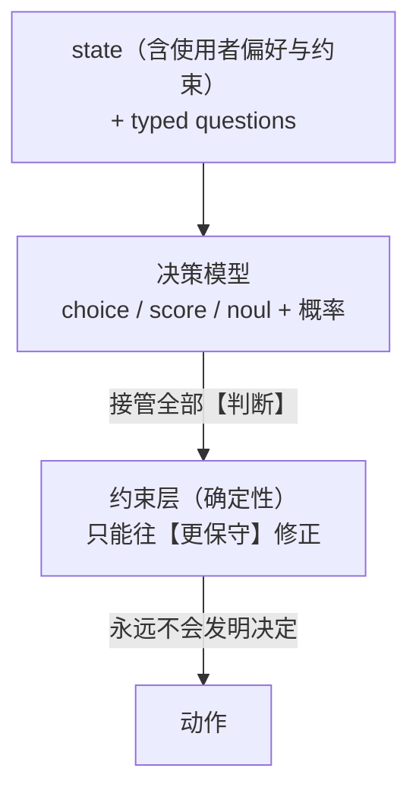

出处：`README.md:26-34`、`docs/adr/0001-架构与边界.md:107-115`。

这条链条的形状借自本项目自身的既有设计原则：**能力可以下放，安全边界只能收紧**
（`README.md:36`）。落到代码上就是 `companion.rs` 模块文档里那句
"约束层永远不会「发明」一个决定，只会否决或降级到更保守的选项"
（`crates/yunxi-bot-core/src/companion.rs:17`）。

**修正方向是单向的**，`Speak → Hold → Quiet`，绝不反向
（`crates/yunxi-bot-core/src/companion.rs:22-23`）。实现上有一个必须写对的地方：

```rust
// crates/yunxi-bot-core/src/companion.rs:58-60
pub fn more_conservative(self, other: Intervention) -> Intervention {
    self.max(other)
}
```

用 `max` 而不是 `min`——`Ord` 按声明顺序派生，`Speak < Hold < Quiet`，越"大"越保守。
写成 `min` 会拿到最激进的动作，**约束收紧会完全失效**（`crates/yunxi-bot-core/src/companion.rs:52-53`）。

安静时段、每日上限、最小间隔是使用者设定的**硬事实**，不归模型判断
（`README.md:82-83`、`crates/yunxi-bot-core/src/companion.rs:63`）。
模型概率不可靠这件事，被挡在安全边界之外。

### 1.4 记忆的作用：提供「凭什么亲近」

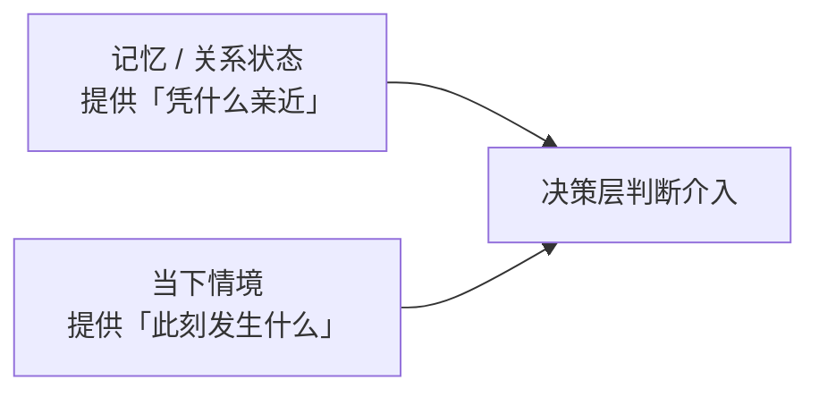

出处：`README.md:87-91`、`docs/adr/0001-架构与边界.md:70-74`。

ADR 把这条写成一句必须守住的前提：**陪伴的温度来自「连续性」，不是来自「判断」**
（`docs/adr/0001-架构与边界.md:68`）。决策模型越强，越需要一个像样的 state，
而 state 的质量取决于记忆系统——**两者不能互相替代，记忆不能推迟到最后做**
（`docs/adr/0001-架构与边界.md:76-77`）。

state 必须**主动裁剪**。上游原话是"A good state contains the evidence needed for
the decision, not merely a long dump of everything your service knows"
（`docs/adr/0001-架构与边界.md:192`）。落到代码：

- `Memory::build_decision_state` 负责裁剪，**密钥与无关字段一律不进 state**
  （`crates/yunxi-bot-core/src/memory.rs:16-18`）；
- `Situation` 结构体"刻意保持小"：安静时段、距上次互动分钟数、待处理事件数、
  近期失败数、今日打扰次数、关系阶段标签——六个字段（`crates/yunxi-bot-core/src/memory.rs:750-765`）。

### 1.5 从哲学到不可动摇的边界

哲学最终落成九条硬边界，写在 `AGENTS.md:19-29`；其中四条也被抄进了内核 crate 的
文档注释（`crates/yunxi-bot-core/src/lib.rs:9-14`）。README 列出的八条
（`README.md:244-251`）是 AGENTS.md 那张表的对外版本。

这份文档里出现的所有取舍——失败方向朝不执行、模型给概率约束层做决定、
不静默降级、不把进程内策略包装成沙箱——都是这九条的推论，而不是独立的设计偏好。

---

## 二、技术栈

### 2.1 Rust：edition 2024，rust-version 1.88

```toml
# Cargo.toml:5-10
[workspace.package]
version = "0.1.0"
edition = "2024"
license = "Apache-2.0"
rust-version = "1.88"
repository = "https://github.com/sjxbbdb/YunXi-Bot"
```

`resolver = "3"`（`Cargo.toml:2`）——edition 2024 配套的解析器版本。

选 Rust 的三条理由写在 ADR §四（`docs/adr/0001-架构与边界.md:144-148`）：

1. YunXi 家族已有 **12 万行 Rust** 的内核与治理实现可供参考，语言一致才能实质性复用其设计；
2. 常驻进程的长期诉求是**低资源占用 + 长期稳定 + 单二进制分发**；
3. Rust 的显式类型与编译期依赖，契合本项目"边界必须写死在代码里"的要求。

ADR D1 同时记下了被否决的两个选项和**当时为什么倾向过 Node**——那份判断建立在
"只看过 5 个开源项目 README"的基础上（`docs/adr/0001-架构与边界.md:207`）。

> **版本号的一处不一致（如实记录）：** `README.md:206` 写的是"Rust stable 1.85+"，
> `AGENTS.md:84` 也写 `rust-version = 1.85`，而 `Cargo.toml:9` 实际是 `1.88`。
> 抬门槛的原因与代价记在 ADR D32：rmcp 3.5.1 要求 rustc 1.88，
> 抬到 1.88 之后 let-chains 稳定、clippy 在整个代码库启用 `collapsible_if`，
> 19 个文件冒出建议，用 `cargo clippy --fix` 全部修掉
> （`docs/adr/0001-架构与边界.md:1106-1116`）。**README 与 AGENTS.md 这两处是旧的。**

### 2.2 关于「没有第三方异步运行时」——这个前提已经过期

项目**曾经**是纯同步的：ADR D9 只引入一个 TLS 依赖（`docs/adr/0001-架构与边界.md:438-451`），
`decide/http.rs` 的 HTTP 客户端是纯 TCP 手写的（`crates/yunxi-bot-core/src/decide/http.rs:1-8`）。

但接 MCP 之后，**唯一引入异步运行时的依赖出现了**（`Cargo.toml:27-28`）：

> MCP 客户端。**这是唯一引入异步运行时的依赖**，代价是量出来的：
> 67 个包 -> 104 个包，构建约 16 秒

处理方式是**把异步关在一个模块里**（ADR D20，`docs/adr/0001-架构与边界.md:765-797`）：

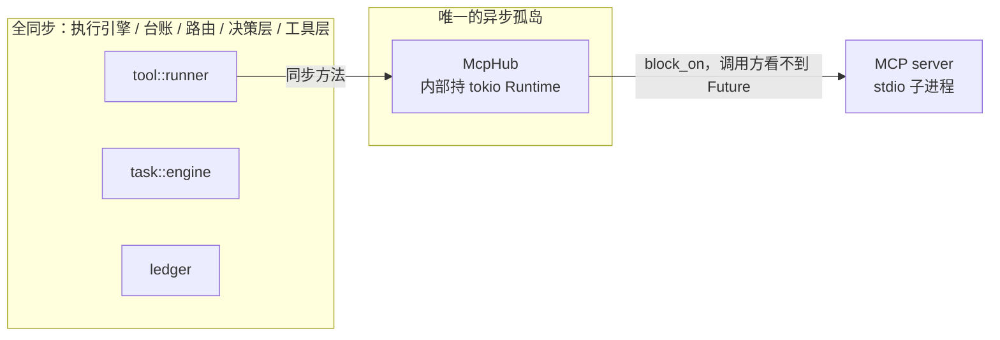

落地证据：`McpHub` 的定义是 `{ rt: Runtime, servers: Vec<RunningServer> }`
（`crates/yunxi-bot-core/src/mcp.rs:279-283`），对外方法如 `connect` / `list_tools` / `call`
全是同步签名（`crates/yunxi-bot-core/src/mcp.rs:293-316`）。只开当前线程运行时
`rt` 而不是 `rt-multi-thread`——MCP 客户端是"发一条等一条"的形状，多线程运行时是白付的
（`Cargo.toml:37-38`、`crates/yunxi-bot-core/src/mcp.rs:16-18`）。

### 2.3 Python 侧是什么

跨语言能力**通过进程边界解决，而不是通过统一语言**（`docs/adr/0001-架构与边界.md:150-154`）。
Python 侧共四类进程，全部只绑回环：

| 进程 | 端口 | 干什么 | 出处 |
|---|---|---|---|
| `sidecar/verdict_server.py` | 17870 | 决策模型（Verdict）包装成固定 `/decide` 契约 | `sidecar/verdict_server.py:3`、`:36` |
| `sidecar/laya_server.py` | 17870 | 同一契约的 Laya 实现（历史后端） | `sidecar/laya_server.py:3`、`:41` |
| `sidecar/mock_laya.py` | 17870 | **测试替身**，按脚本作答，绝不用于生产 | `sidecar/mock_laya.py:3`、`:21` |
| `sidecar/mail_server.py` | 17871 | **只读** IMAP 信息源 | `sidecar/mail_server.py:3`、`:30-40` |

端口刻意错开，免得两个 sidecar 抢同一个端口时错误信息指向错的那个
（`crates/yunxi-bot-core/src/info/mail.rs:34-36`）。

Rust 侧只认一个固定 JSON 契约（`crates/yunxi-bot-core/src/decide/laya.rs:3-18`）：

```text
POST /decide
{ "state": {...},
  "questions": [ {"id":"q1","kind":{"type":"noul"},"instructions":"..."} ] }

→ 200
{ "answers": { "q1": {"noul": 0.83} },
  "model": "laya-multilingual" }
```

把上游库差异关在 Python 侧这件事**被兑现过一次**：决策层后端从 Laya 换成 Verdict，
而 **Rust 侧一行未改**（`README.md:372`、`docs/adr/0001-架构与边界.md:503-504`）。

Python 版本：`scripts/setup.ps1` 默认 `py -3.12`（`scripts/setup.ps1:13`）。

### 2.4 发布构建

```toml
# Cargo.toml:42-45
[profile.release]
lto = true
codegen-units = 1
strip = true
```

常驻进程 + 单二进制分发的诉求，对应 ADR §四第 2 条（`docs/adr/0001-架构与边界.md:147`）。

---

## 三、依赖清单

### 3.1 workspace 依赖（`Cargo.toml:12-40`）

| crate | 版本 / features | 解决什么问题 | 出处与理由 |
|---|---|---|---|
| `serde` | `1`，`features = ["derive"]` | 事件、会话、配置的序列化 | `Cargo.toml:13` |
| `serde_json` | `1` | 台账是 JSONL，sidecar 契约是 JSON | `Cargo.toml:14` |
| `chrono` | `0.4`，`default-features = false`，`["clock","std"]` | **唯一的时区依赖**。cron 必须按本地时间解析，而 std 不提供本地时区；个人助理的"每天早上 9 点"不能按 UTC 算 | `Cargo.toml:15-17` |
| `ureq` | `2`，`default-features = false`，`["tls","json","gzip"]` | **唯一的 TLS/网络依赖**。Agnes 走 HTTPS，而 std 没有 TLS；自己实现 TLS 是不负责任的 | `Cargo.toml:18-26` |
| `rmcp` | `3.5.1`，`default-features = false`，`["client","transport-child-process","transport-io"]` | MCP 客户端。通用助理的能力长尾只有 MCP 覆盖得住 | `Cargo.toml:27-36`、`crates/yunxi-bot-core/src/mcp.rs:5-9` |
| `tokio` | `1`，`default-features = false`，`["sync","macros","rt","time","process","io-util"]` | rmcp 自带 tokio 但需调用方提供运行时；只用当前线程运行时 | `Cargo.toml:37-39` |
| `yunxi-bot-core` | `path = "crates/yunxi-bot-core"` | 内核 | `Cargo.toml:40` |

**三条被显式记下来的取舍，值得单独抄一遍：**

1. **为什么不用 `reqwest`：** 它会把 tokio 整套异步运行时也带进来，而本项目的守护
   循环是同步的（`Cargo.toml:24-25`）。选 `ureq` 而不是它，是阻塞式、体积小的选择，
   底层是 rustls（同上）。
2. **为什么 rmcp 只开三个 feature、刻意不引 `reqwest`：** HTTP 传输会带来**第二套
   TLS 栈**（我们已用 ureq + rustls）。绝大多数 MCP server 就是 `npx`/`uvx`/独立二进制，
   stdio 覆盖得住（`Cargo.toml:33-35`，ADR D20 第 3 条在
   `docs/adr/0001-架构与边界.md:806-809`）。
3. **为什么是 `rmcp` 3.5.1 而不是 2.2.0：** 后者是 cargo 因 `rust-version` 门限自动
   退回的旧大版本；两者代价几乎一样（105 vs 104 包），但 MCP 规范变化很快，
   为一个新集成钉在旧大版本上没有道理（`Cargo.toml:29-31`）。

### 3.2 两个 crate 各自的依赖

```toml
# crates/yunxi-bot-core/Cargo.toml:10-16
[dependencies]
serde = { workspace = true }
serde_json = { workspace = true }
chrono = { workspace = true }
ureq = { workspace = true }
rmcp = { workspace = true }
tokio = { workspace = true }
```

```toml
# crates/yunxi-bot-cli/Cargo.toml:14-18
[dependencies]
yunxi-bot-core = { workspace = true }
serde_json = { workspace = true }
# 展示决策时间用。核心已依赖它，这里只是复用同一个 workspace 依赖。
chrono = { workspace = true }
```

**CLI 侧没有引入任何核心没有的依赖。** 这条不是巧合，是分层的证据：
入口层只做参数解析、交互、组装，能力全部来自内核（见 §六）。

工作区里**没有** `[dev-dependencies]` 与 `[build-dependencies]`
（实测：两个 crate 的 `Cargo.toml` 全文只有 `[package]`、`[[bin]]`、`[dependencies]` 三段，
`crates/yunxi-bot-cli/Cargo.toml:1-18`、`crates/yunxi-bot-core/Cargo.toml:1-16`）。

### 3.3 依赖代价的记账

`Cargo.lock` 当前有 **136** 个 `[[package]]` 条目（实测计数，含工作区自身的两个 crate
以及同一 crate 的多个版本）。ADR 记下了几次扩张的代价，都是**量出来的**：

| 事件 | 代价 | 出处 |
|---|---|---|
| 引入 `ureq`（D9） | 传递依赖从 **3 个涨到 57 个包** | `docs/adr/0001-架构与边界.md:450-451` |
| 引入 `rmcp`（D20） | **67 个包 -> 104 个包**，构建约 16 秒 | `Cargo.toml:28-29` |
| 同上（D32 复核） | rmcp 2.2.0 路线 67→105 / 19s；**3.5.1 路线 67→104 / 16s** | `docs/adr/0001-架构与边界.md:1104-1107` |

"先量出代价再引"是本项目的依赖纪律，`diff.rs` 里自己写 LCS 而不引 `similar`
就是这个纪律的又一次应用（`crates/yunxi-bot-core/src/diff.rs:18-26`）。

### 3.4 Python 侧依赖（`sidecar/requirements.txt`）

只有一行真实依赖（`sidecar/requirements.txt:11`）：

```text
verdictml @ git+https://github.com/Manavarya09/verdict
```

文件里的注释解释了两件事：

1. **为什么钉仓库而不是 PyPI：** PyPI 上已有 0.1.0，但官方 README 推荐从仓库装
   （修得更勤），这里固定到仓库来源，实测可用（`sidecar/requirements.txt:8-10`）。
2. **verdictml / torch 的关系：** 它会把 `sentence-transformers` / `transformers` /
   `torch(CPU)` 一并带进来，venv 大约 1 GB——这是跑编码器模型的必要成本
   （`sidecar/requirements.txt:9-10`）。而且**即使只要 ONNX 引擎，安装期仍会拉 torch**，
   因为那是 `sentence-transformers` 的基础依赖；只有**运行时**
   `Verdict(engine="onnx")` 才不需要 torch。想彻底免 torch 要用 `verdictml[onnx]`
   并自行裁剪依赖，但**那样没被实测过**（`sidecar/requirements.txt:13-15`）。

除 `verdictml` 外，邮件 sidecar **零新依赖**：`imaplib` + `ssl` + `email` 都在
Python 标准库里（`sidecar/mail_server.py:13-14`）。

---

## 四、模块地图

`crates/yunxi-bot-core/src/` 下有 **26 个 `.rs` 文件**（实测计数）：
**25 个模块 + crate 根 `lib.rs`**。另有 5 个子目录
（`decide/` `info/` `task/` `think/` `tool/`，共 23 个 `.rs` 文件）。

下表每一行的职责都摘自该文件顶部的 `//!` 文档注释，**不是从文件名推的**。
（§4.1 至 §4.4 四张表的"出处"列里，路径都省去了
`crates/yunxi-bot-core/src/` 前缀，只有文件名与行号。）

### 4.1 根目录的 25 个模块 + crate 根

| 文件 | 职责（摘自模块文档） | 出处 |
|---|---|---|
| `lib.rs` | crate 根。**内聚的具体内核，不是元内核**：明确知道自己管什么——任务、台账、触发、约束、决策、执行。没有服务查找、没有事件总线、没有插件生命周期 | `lib.rs:1-14` |
| `agent.rs` | Agent 循环：把记忆、决策、思考三层串成一个回合；只依赖台账作为事实来源 | `agent.rs:1-27` |
| `assistant.rs` | 助理巡览：取信息 → 判断 → 通知 → 落台账，一轮走完。放在内核里因为有两个调用方 | `assistant.rs:1-22` |
| `companion.rs` | 陪伴层：把「何时介入」交给决策层判断，再用确定性约束兜底 | `companion.rs:1-23` |
| `costlog.rs` | 模型调用的成本台账。**先记账、后算钱** | `costlog.rs:1-18` |
| `diff.rs` | 最小的行级 diff：为了让人在批准前看清"文件会变成什么样" | `diff.rs:1-32` |
| `embedding.rs` | 本地字符 n-gram 向量，**零依赖**；派生数据不落盘 | `embedding.rs:1-27` |
| `exec.rs` | 执行层：以子进程运行任务。不用 shell、凭证剥离、硬超时 + 进程树清理、绝不无隔离派生 | `exec.rs:1-9` |
| `feedback.rs` | 反馈回写：使用者的处置，以及下一次判断要不要记得它 | `feedback.rs:1-39` |
| `instance.rs` | 单实例锁。锁文件记 pid，启动时判断该 pid 是否真的还活着 | `instance.rs:1-6` |
| `job.rs` | 任务域模型与状态机。状态迁移是**显式白名单** | `job.rs:1-4` |
| `ledger.rs` | 任务台账：append-only 事件日志 + 可丢弃投影 | `ledger.rs:1-8` |
| `mcp.rs` | MCP 客户端：**把异步关在这一个模块里** | `mcp.rs:1-32` |
| `memory.rs` | 记忆层：为决策层提供可用的 state；事件溯源，不另起存储 | `memory.rs:1-18` |
| `notify.rs` | 通知出口：助理把事告诉使用者的那条路。**不许虚报送达** | `notify.rs:1-43` |
| `notify_windows.rs` | Windows toast 后端。走 PowerShell 而不是引 `windows` crate；核心价值是能**验证**送达 | `notify_windows.rs:1-33` |
| `persona.rs` | 人格：`<数据目录>/persona.md`。**可改，不再写死在代码里** | `persona.rs:1-38` |
| `policy.rs` | 约束层：权限旋钮、预设，与审批结果的封闭词汇表 | `policy.rs:1-7` |
| `profile.rs` | 用户画像：`<数据目录>/profile.md`。它和记忆不是一回事 | `profile.rs:1-34` |
| `recall_gate.rs` | 召回触发门控：**先判"有没有记忆需求"，再决定要不要召回** | `recall_gate.rs:1-31` |
| `rules.rs` | 项目规则加载：让它在某个项目里工作时**自动知道那个项目的约定** | `rules.rs:1-45` |
| `runner.rs` | 调度循环：把 job / ledger / trigger / policy / exec 串成一个可运行的回合 | `runner.rs:1-10` |
| `triage.rs` | 打扰判定：这条信息值不值得**现在**告诉你。**复用陪伴层的三层，不另造一套** | `triage.rs:1-43` |
| `trigger.rs` | 触发器与调度：`manual` / `every` / `cron` / `watch` 四种；单飞 + 崩溃残留检测 | `trigger.rs:1-10` |
| `win_job.rs` | Windows Job Object 隔离。开头就写明**它不保证什么**：不做文件系统写入隔离 | `win_job.rs:1-16` |
| `win_token.rs` | Windows 写入隔离：受限令牌 + 低完整性级别。含被证伪的能力 SID 路线 | `win_token.rs:1-45` |

其中三个模块在 `lib.rs` 里带**额外的**行内文档，说明为什么这样区分：

- `assistant`：因为有两个调用方，抄两份的话漂移的表现是"手动跑没问题，常驻跑出问题"
  （`crates/yunxi-bot-core/src/lib.rs:17-22`）；
- `notify_windows`：**不在非 Windows 平台上编译**，在没有 WinRT 的平台上放一个永远
  返回失败的实现只会制造噪音（`crates/yunxi-bot-core/src/lib.rs:39-42`）；
- `win_token`：`#[cfg(windows)]`（`crates/yunxi-bot-core/src/lib.rs:56-57`）。

### 4.2 `task/` —— 人类给目标，系统拆解、逐步执行

| 文件 | 职责 | 出处 |
|---|---|---|
| `task/mod.rs` | 数据结构与状态机在 `model`，拆解在 `plan`，决策点在 `decide`，执行循环在 `engine` | `task/mod.rs:1-4` |
| `task/model.rs` | 把"人类给一个目标"变成"一组有序执行的步骤"。三条设计约束：台账是唯一事实来源、每个任务路由一次、预算是硬上限 | `task/model.rs:1-37` |
| `task/plan.rs` | 任务拆解。解析**要容错，但不能猜**：只认位置，不认语法 | `task/plan.rs:1-21` |
| `task/decide.rs` | 决策点：模型给选项，本地决策模型选，弃权就升级人工。**整个框架里最重要的一处分工** | `task/decide.rs:1-19` |
| `task/engine.rs` | 执行循环：取可跑的步骤 → 执行 → 回填 → 再取，直到全部终态。并行是"设计好但先不接线" | `task/engine.rs:1-23` |
| `task/schedule.rs` | 任务调度：守护进程该推进哪些任务。两条边界：不碰 `AwaitingHuman`、不碰刚还在动的任务 | `task/schedule.rs:1-32` |

`task/schedule.rs` 的模块文档开头就点明它补的是哪条断链——"任务卡住后
**没有任何东西自动推进它**"（`task/schedule.rs:5`）。

### 4.3 `think/` —— 思考层（System 2）

| 文件 | 职责 | 出处 |
|---|---|---|
| `think/mod.rs` | 思考层：Agent 的通用能力来自这里。默认接远端 Agnes；**Laya 不负责思考，只负责判断要不要打扰你** | `think/mod.rs:1-18` |
| `think/agnes.rs` | Agnes AI 接入（OpenAI 兼容）。Base URL、端点、默认模型、密钥从类型上就打印不出来 | `think/agnes.rs:1-8`、`:23-27` |
| `think/router.rs` | 模型选择器：每个任务决定一次「用哪个模型 + 要不要思考」。**两个轴，不要混在一起** | `think/router.rs:1-60` |
| `think/prompt.rs` | 缓存友好的提示词组装。三段式，顺序不可变 | `think/prompt.rs:1-30` |
| `think/context.rs` | 上下文预算与压缩。**通用 agent 里唯一一条"做错了比不做更糟"的东西** | `think/context.rs:1-47` |
| `think/cost.rs` | 成本记账：把 token 用量换算成钱，并暴露缓存命中率 | `think/cost.rs:1-10` |
| `think/session.rs` | 会话落盘：让一次对话能跨进程活下去 | `think/session.rs:1-36` |

`think/mod.rs` 里还有一个 `thresholds` 重导出模块，注释写着"路由阈值。**集中在一处**，
便于按实际账单调整"（`crates/yunxi-bot-core/src/think/mod.rs:26-29`），
实际常量定义在 `crates/yunxi-bot-core/src/think/router.rs:327-342`。

### 4.4 `tool/`、`decide/`、`info/`

| 文件 | 职责 | 出处 |
|---|---|---|
| `tool/mod.rs` | 工具层：模型能对世界做的事，以及"哪些必须先问人"。审批按**能力类别**判定，不逐个工具写规则 | `tool/mod.rs:1-40` |
| `tool/runner.rs` | 工具循环：模型决定调工具 → 审批 → 执行 → 结果回灌 → 再问，直到模型不再调工具 | `tool/runner.rs:1-36` |
| `tool/files.rs` | 文件类工具：读、列目录、搜内容、写、改。**先读后写** | `tool/files.rs:1-33` |
| `tool/system.rs` | 系统类工具：时间、执行命令、问人 | `tool/system.rs:1-30` |
| `tool/web.rs` | 网络类工具：抓网页、搜索。Jina Reader 主路 + 直连回退 | `tool/web.rs:1-45` |
| `decide/mod.rs` | 决策层：System-1 决策模型的接入、结果归一与降级。三条不可动摇的规则 | `decide/mod.rs:1-9` |
| `decide/laya.rs` | `Decider` 抽象、Laya 的本地 sidecar 适配器，以及测试用 Stub | `decide/laya.rs:1-23` |
| `decide/http.rs` | 最小 HTTP/1.1 客户端，只服务本机回环上的 JSON 接口。**模块位置是历史原因** | `decide/http.rs:1-18` |
| `info/mod.rs` | 信息源：助理"看外面"的入口。两条纪律：取不到不能伪装成没有、摘要不是正文 | `info/mod.rs:1-31` |
| `info/mail.rs` | 邮件信息源：连本机的只读邮件 sidecar。三种失败必须分开 | `info/mail.rs:1-24` |

`decide/http.rs` 的模块注释里有一句值得单独记住的话：**回环限制才是它最值钱的地方**——
决策 state 和邮件内容都是私人信息，这个限制保证它们不可能被发到外部主机；
加一个新 sidecar 就白拿这条保证（`crates/yunxi-bot-core/src/decide/http.rs:16-18`）。

### 4.5 CLI crate 的 6 个文件

| 文件 | 职责 | 出处 |
|---|---|---|
| `main.rs` | 命令行入口 + 全部 `cmd_*` 子命令 + 守护循环 | `crates/yunxi-bot-cli/src/main.rs:1-15` |
| `approval.rs` | 命令行侧的审批交互与工具装配。**默认答案是否** | `crates/yunxi-bot-cli/src/approval.rs:1-17` |
| `chat.rs` | 交互式会话 REPL：**通用 agent 的核心体验** | `crates/yunxi-bot-cli/src/chat.rs:1-29` |
| `chat_handler.rs` | 接入真实模型的 `TaskHandler` 实现。三套独立的会话、按 provider 分开记历史 | `crates/yunxi-bot-cli/src/chat_handler.rs:1-18` |
| `tooling.rs` | 工具装配：把工具注册成一套，把命令行参数变成审批策略 | `crates/yunxi-bot-cli/src/tooling.rs:1-7` |
| `tool_sink.rs` | 把每次工具调用写进台账。**包括被拒绝和没人应答的** | `crates/yunxi-bot-cli/src/tool_sink.rs:1-30` |

---

## 五、分层架构

### 5.1 总体分层

ADR §三给出的分层（`docs/adr/0001-架构与边界.md:83-103`），映射到本仓库的实际代码：

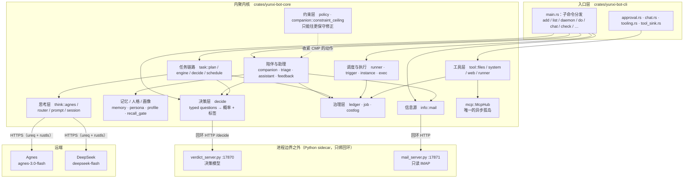

图中每条边的依据：

| 边 | 出处 |
|---|---|
| 入口层只调内核 | `crates/yunxi-bot-cli/src/main.rs:21-26`（import 全部来自 `yunxi_bot_core`） |
| CLI 直接驱动陪伴层与助理回合 | `crates/yunxi-bot-cli/src/main.rs:632-636`、`:3871-3872` |
| CLI 直接连信息源 | `crates/yunxi-bot-cli/src/main.rs:3077`、`:3220` |
| CLI 子模块装配工具 | `crates/yunxi-bot-cli/src/tooling.rs:12-19` |
| 决策层走回环 HTTP | `crates/yunxi-bot-core/src/decide/laya.rs:3-18` |
| 助理调信息源 | `crates/yunxi-bot-core/src/assistant.rs:29` |
| 信息源走回环 HTTP | `crates/yunxi-bot-core/src/info/mail.rs:10-12`、`:34-36` |
| 任务链路既用决策层也用思考层 | `crates/yunxi-bot-core/src/task/engine.rs:27-30` |
| 思考层走 HTTPS | `crates/yunxi-bot-core/src/think/agnes.rs:3-8`、`Cargo.toml:18-26` |
| 工具层接 MCP | `crates/yunxi-bot-core/src/mcp.rs:29-32` |
| 约束层收紧陪伴层动作 | `crates/yunxi-bot-core/src/companion.rs:10-12`、`:17` |
| 内核保持同步 | `docs/adr/0001-架构与边界.md:796`（"执行引擎、台账、路由、决策层全部保持同步"） |
| 一切写回台账 | `crates/yunxi-bot-core/src/ledger.rs:5`（事件日志是唯一真相来源） |

### 5.2 一个 Agent 回合

`agent::run_cycle` 把三层串起来（`crates/yunxi-bot-core/src/agent.rs:167`），
顺序在模块文档里写死了（`crates/yunxi-bot-core/src/agent.rs:14-27`）：

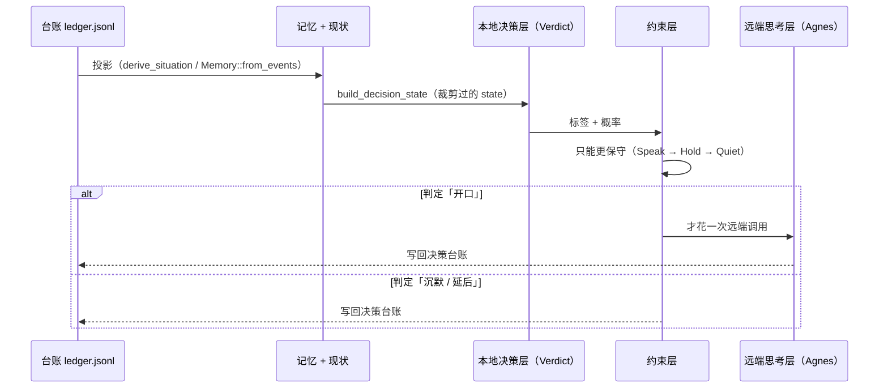

**顺序不能反**：Agnes 免费档只有 **10 RPM**（`crates/yunxi-bot-core/src/think/agnes.rs:20-21`），
常驻进程每轮都打远端几秒就把配额烧光。本地那一层先筛，是这套配额下的结构必然，
不是优化（`crates/yunxi-bot-core/src/agent.rs:26-27`、`README.md:287-288`）。

### 5.3 任务链路（与调度并列的另一条）

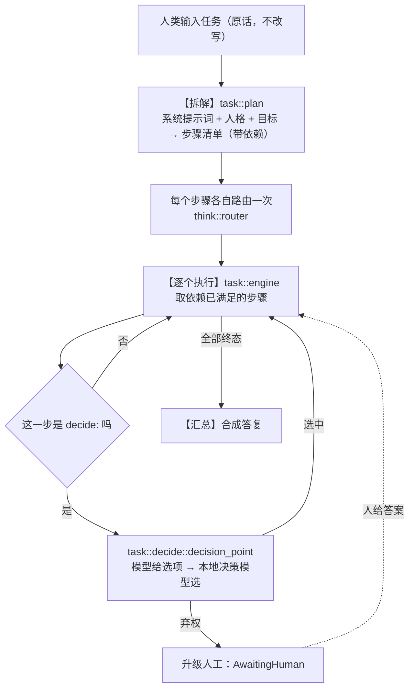

出处：`crates/yunxi-bot-core/src/task/model.rs:5-21`（链路图）、
`crates/yunxi-bot-core/src/task/decide.rs:1-19`（决策点）、
`crates/yunxi-bot-core/src/task/model.rs:111-126`（`TaskState`，含 `Stalled`）。

**`Stalled` 是一个必须存在的状态**：没有它，"依赖成环"和"还在跑"会长得一模一样，
于是死锁表现为无限等待（`crates/yunxi-bot-core/src/task/model.rs:116-119`）。

### 5.4 数据落在哪：一条解析规则，一份定义

数据目录的解析**在内核里只有一份定义**（`crates/yunxi-bot-core/src/lib.rs:111`），
CLI 直接委托，不重算（`crates/yunxi-bot-cli/src/main.rs:28-35`、`:49-51`）：

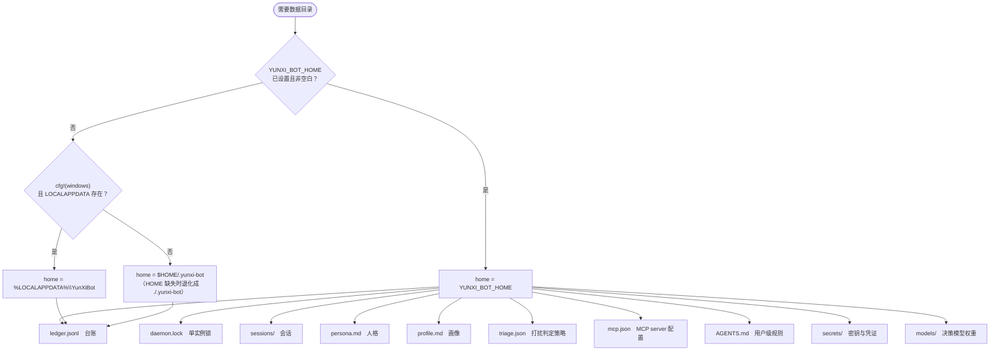

解析顺序的代码依据：`crates/yunxi-bot-core/src/lib.rs:127-141`。
各落盘位置的依据见 §七。

**为什么这件事值得有"唯一一份"**：之前 CLI 自己算一份、sidecar 在 Python 里再算一份。
两边算法看起来一样，但只要有一处漏了对齐，表现就是最难查的那类错——
sidecar 说"没配置"，而使用者的配置文件明明就在那儿。端到端测试抓到过一次真实的路径
不一致（`crates/yunxi-bot-core/src/lib.rs:113-126`，ADR D27 在
`docs/adr/0001-架构与边界.md:1010-1015`）。

修法不是"让两边神奇地一致"（不可靠），而是**让不一致可被看见**——
sidecar 报出自己算的 `config_path`，Rust 侧发现不同就直接把两个路径摆出来
（`crates/yunxi-bot-core/src/info/mail.rs:126`、`:251`）。

---

## 六、两个 crate 的分工

### 6.1 依赖方向

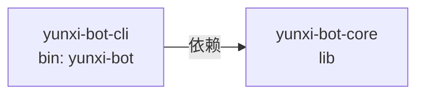

- `yunxi-bot-cli` 依赖 `yunxi-bot-core`（`crates/yunxi-bot-cli/Cargo.toml:15`）；
- **反向没有**：`crates/yunxi-bot-core/Cargo.toml:10-16` 的依赖里没有 `yunxi-bot-cli`。
  所以上图只有一条边——这正是"边界写死在编译期"的意思。

### 6.2 边界怎么划

| | `yunxi-bot-core` | `yunxi-bot-cli` |
|---|---|---|
| 类型 | 库（`lib.rs`） | 可执行（`[[bin]] name = "yunxi-bot"`，`crates/yunxi-bot-cli/Cargo.toml:10-12`） |
| 自我描述 | "内聚内核：任务、台账、触发、约束、决策"（`crates/yunxi-bot-core/Cargo.toml:3`） | "命令行与常驻守护入口"（`crates/yunxi-bot-cli/Cargo.toml:3`） |
| 依赖 | serde / serde_json / chrono / ureq / rmcp / tokio | core + serde_json + chrono |
| 管什么 | 内核原语、决策、执行、工具、思考、任务链路 | 参数解析、终端交互、进程编排（daemon / supervise / 自启） |

**判据是"有没有两个调用方"，不是"像不像 UI"。** 两处明确记下的边界判断：

1. **`assistant` 为什么在内核里而不是 CLI 里**——因为它有**两个调用方**：
   `yunxi-bot check`（你主动问）与 daemon 的每一轮（它自己看）。抄两份的话两边迟早
   漂移，而漂移的表现最恶心：手动跑没问题，常驻跑就出问题
   （`crates/yunxi-bot-core/src/assistant.rs:3-12`，ADR D27 在
   `docs/adr/0001-架构与边界.md:1002-1008`）。
2. **CLI 侧的东西为什么留在 CLI**——审批交互要读 stdin（`approval.rs`）、
   工具调用写台账需要一个自己的 `Ledger` 句柄因为可变借用会打架
   （`crates/yunxi-bot-cli/src/tool_sink.rs:41-47`）。这些是"入口形态"的问题，
   不是内核语义的问题。

**内核文档里明确写了它不是什么**：没有服务查找、没有事件总线、没有插件生命周期，
依赖全部是编译期显式的（`crates/yunxi-bot-core/src/lib.rs:5-7`）。
ADR D2 记下了否决元内核范式的理由——**该范式已经实现过**，重做一遍既没有学习，
也构不成差异化（`docs/adr/0001-架构与边界.md:210-214`）。

### 6.3 内核的公开面

`lib.rs` 只重导出少量稳定类型（`crates/yunxi-bot-core/src/lib.rs:59-65`）：

```rust
pub use exec::{ExecError, ExecOptions, ExecOutcome, IsolationLevel, IsolationRequirement};
pub use job::{Job, JobId, JobSpec, JobState, Trigger};
pub use ledger::{Event, EventKind, Ledger, LedgerError, SpanGuard};
pub use policy::{ApprovalOutcome, ApprovalPolicy, PermissionState, SandboxMode, normalize_outcome};
pub use runner::{TickOptions, TickReport, tick};
```

其余通过 `pub mod` 路径访问——`lib.rs` 里一共声明了 **30 个模块**
（25 个根目录模块 + 5 个子目录模块），集中在
`crates/yunxi-bot-core/src/lib.rs:16-57`。CLI 用的正是模块路径形式，例如
`yunxi_bot_core::task::engine::{LedgerTaskStore, TaskStore}`
（`crates/yunxi-bot-cli/src/main.rs:24`）。

---

## 七、数据落地

### 7.1 目录总表

| 文件 / 目录 | 内容 | 格式 | 出处 |
|---|---|---|---|
| `<home>/ledger.jsonl` | 台账（唯一事实来源） | JSONL，首行是版本头 | `crates/yunxi-bot-cli/src/main.rs:53-55` |
| `<home>/daemon.lock` | 单实例锁 | 文本（记 pid），与台账同目录便于一起备份/清理 | `crates/yunxi-bot-cli/src/main.rs:57-59` |
| `<home>/sessions/<id>.json` | 会话（稳定前缀 + 历史 + 指纹） | JSON（pretty），先写 `.json.tmp` 再改名 | `crates/yunxi-bot-core/src/think/session.rs:50`、`:99-103`、`:138-141` |
| `<home>/persona.md` | 助理人格 | Markdown，第一个一级标题是名字 | `crates/yunxi-bot-core/src/persona.rs:1-2`、`:42-43` |
| `<home>/profile.md` | 使用者画像 | Markdown，**原样进提示词** | `crates/yunxi-bot-core/src/profile.rs:1`、`:38-39` |
| `<home>/triage.json` | 打扰判定策略（黑白名单等） | JSON | `crates/yunxi-bot-core/src/triage.rs:138` |
| `<home>/mcp.json` | MCP server 配置 | JSON | `crates/yunxi-bot-core/src/mcp.rs:109` |
| `<home>/AGENTS.md` | 用户级项目规则 | Markdown | `crates/yunxi-bot-core/src/rules.rs:120-124` |
| `<home>/secrets/agnes.key` | Agnes 密钥 | 纯文本 | `crates/yunxi-bot-core/src/think/agnes.rs:131-141` |
| `<home>/secrets/deepseek.key` | DeepSeek 密钥 | 纯文本 | `crates/yunxi-bot-core/src/think/agnes.rs:120` |
| `<home>/secrets/mail.json` | IMAP 凭证 | JSON（`imap_host` / `imap_port` / `username` / `password`） | `crates/yunxi-bot-core/src/info/mail.rs:297-299`、`sidecar/mail_server.py:30-37` |
| `<home>/secrets/bocha.key` | 博查搜索密钥 | 纯文本 | `crates/yunxi-bot-cli/src/tooling.rs:78-81` |
| `<home>/models/verdict-small/` | 决策模型权重 | safetensors | `scripts/fetch_model.py:149`、`sidecar/verdict_server.py:124` |

`secrets/` 与 `*.key` 都在 `.gitignore` 里（`.gitignore:29-31`），
`data/` 与 `*.jsonl` 也是——**台账绝不入库**（`.gitignore:4-6`）。

密钥的读取顺序是 `YUNXI_BOT_AGNES_KEY` 环境变量 → `key_file`；**文件方式优先于
命令行参数，避免密钥出现在进程列表里**（`crates/yunxi-bot-core/src/think/agnes.rs:36-39`）。
而 `ApiKey` 刻意不实现 `Display`、`Debug` 只打印前 6 位——**从类型上堵住"密钥被打进日志"
这条路**，而不是靠"记得别打印"（`crates/yunxi-bot-core/src/think/agnes.rs:23-27`）。

### 7.2 台账：append-only + 边界 + 版本

**文件结构**（`crates/yunxi-bot-core/src/ledger.rs:21-30`、`:346-356`）：

```text
第 1 行   {"yunxi_bot_ledger":1}                     ← 头部，固定，写一次
第 2 行   {"seq":1,"at":1759...,"kind":"...",...}    ← 事件，一行一条，只追加
第 3 行   {...}
...
```

**四条不可让步的性质：**

1. **事件日志是唯一真相来源**，状态全部是投影，可随时丢弃重建
   （`crates/yunxi-bot-core/src/ledger.rs:5`，`Ledger::rebuild` 在 `:572-575`）。
2. **事件流中任何无法解析的行都视为损坏，而不是跳过**——静默跳行会让投影悄悄偏离真相
   （`crates/yunxi-bot-core/src/ledger.rs:301-302`、`:334-343`）。
3. **审计事件必须被「边界」包住**：落在边界之外的事件与崩溃残尾无法区分，
   reload 时会被静默丢弃。所以宁可直接返回错误，也不写入边界外的事件
   （`crates/yunxi-bot-core/src/ledger.rs:6-7`）。执行点是 `append` 的第一句：

   ```rust
   // crates/yunxi-bot-core/src/ledger.rs:537-539
   if kind.requires_span() && self.open_span.is_none() {
       return Err(LedgerError::AuditOutsideSpan(kind));
   }
   ```

   需要边界的只有四个类型：`DecisionAsked` / `DecisionDecided` / `ApprovalAsked` /
   `ApprovalDecided`（`crates/yunxi-bot-core/src/ledger.rs:138-156`）。
4. **拒绝非无损 JSON**（`crates/yunxi-bot-core/src/ledger.rs:540`），
   包括 `-0` 这类 JSON 往返不稳定的值（`docs/adr/0001-架构与边界.md:273`）。

**事件词汇表是封闭的**：不在 `EventKind` 里的类型无法反序列化，直接报错
（`crates/yunxi-bot-core/src/ledger.rs:32`）。当前共 **42 个变体**
（实测计数），定义在 `crates/yunxi-bot-core/src/ledger.rs:35-143`。
下表按用途归组：

| 组 | 事件 |
|---|---|
| 权限 | `PermissionPreset` / `SandboxModeSet` / `ApprovalPolicySet` / `SessionSeeded` |
| 任务生命周期 | `JobCreated` / `JobApprovalRequired` / `JobApproved` / `JobStarted` / `JobSucceeded` / `JobFailed` / `JobSkipped` / `JobWatchObserved` |
| 任务执行框架 | `TaskCreated` / `TaskPlanning` / `TaskPlanned` / `TaskStateChanged` / `StepPending` / `StepRunning` / `StepSucceeded` / `StepFailed` / `StepSkipped` / `StepRouted` / `TaskFinished` |
| 成本 | `ModelCalled` |
| 助理链路 | `InfoFetched` / `InfoTriaged` / `NoticeSent` / `ToolCalled` |
| 人工与压缩 | `HumanAnswered` / `ContextCompacted` / `TaskAttentionNotified` / `FeedbackRecorded` |
| 记忆与画像 | `MemoryRecorded` / `MemoryReinforced` / `MemoryForgotten` / `ProfileProposed` / `ProfileAccepted` / `ProfileRejected` |
| 审计对 | `DecisionAsked` / `DecisionDecided` / `ApprovalAsked` / `ApprovalDecided` |

**多写入者怎么处理。** 同一个文件可以被多本 `Ledger` 打开（任务 store 一本、
工具调用记录一本、调用方自己一本）。两件事因此必须显式做：

- **读**：`Ledger::events()` 是**快照**，不是实时视图。别人写的不出现在你的 `events` 里，
  要拿最新状态就调 `reload()`（`crates/yunxi-bot-core/src/ledger.rs:386-399`、`:408`）。
- **写**：每次 `append` 前先 `sync_seq_from_disk()` 对齐磁盘序号，
  否则会产生**重复 seq**（`crates/yunxi-bot-core/src/ledger.rs:493-526`、`:542-544`）。
  这里有一个必须用自己记的 `seen_len` 而不是现查 `File::metadata()` 的细节——
  后者返回的是"当前"长度，会让"长度变了没有"这个判断永远为假（`:502-507`）。

这两条都是端到端测试抓出来的，记在 ADR D30（`docs/adr/0001-架构与边界.md:1063-1079`）。

### 7.3 会话：跨进程存活

存什么、不存什么，模块文档列了一张表（`crates/yunxi-bot-core/src/think/session.rs:16-26`）：

| 存 | 不存 |
|---|---|
| 稳定前缀（含人格、规则、工具定义） | 模型客户端（每次重建） |
| 历史消息（含工具调用与结果） | 工具注册表 |
| 轮次、时间戳、fingerprint | 密钥、审批状态 |

**稳定前缀要一起存**：它是缓存命中的依据。重建时如果重新拼一遍，只要拼法有任何差别
（顺序、空白），缓存就全废——而那种失效是静默的，只会表现为账单变贵
（`crates/yunxi-bot-core/src/think/session.rs:24-26`）。

**写盘用"先写临时文件再改名"**（`crates/yunxi-bot-core/src/think/session.rs:151-159`）：

```rust
let tmp = path.with_extension("json.tmp");
std::fs::write(&tmp, &text)?;
std::fs::rename(&tmp, &path)?;
```

直接覆写的话，写到一半被杀（或磁盘满）会留下半个 JSON，下一次载入报"不可解析"，
**整个会话就废了**；改名在同一文件系统上是原子的（`:151-156`）。

**会话 id 是安全边界。** id 会被拼进文件路径，所以只允许字母数字和 `-` `_`——
`../` 能让"保存会话"写到数据目录外面去；拒绝发生在拼路径**之前**
（`crates/yunxi-bot-core/src/think/session.rs:114-119`、`:138-141`）。

### 7.4 persona.md 与 profile.md：两个文件，两件事

| | 写的是谁 | 谁写的 | 例子 | 出处 |
|---|---|---|---|---|
| **`persona.md`** | **助理是谁** | 使用者 | "你叫云熙，说话简洁" | `crates/yunxi-bot-core/src/persona.rs:30-38` |
| `profile.md` | **使用者是谁** | 使用者自己 | "叫我老王，别用感叹号" | `crates/yunxi-bot-core/src/profile.rs:5-16` |

**混在一起的话，"我想换个助理的性格"和"我想让它更懂我"就变成了同一件事**——
而它们该分开改（`crates/yunxi-bot-core/src/persona.rs:38`）。

**画像为什么和记忆不是一回事**：画像的权威性来自"使用者自己写的"，
记忆是"助理攒的、可能有错"。来源不同、权威性不同，所以不合并成一张表
（`crates/yunxi-bot-core/src/profile.rs:5-16`）。作者在这里记了一次判断失误：
"我一开始判断画像就是事实/偏好的聚合视图，不该造新概念——**错了**"（`:14`）。

**格式都是 Markdown，理由是人要能改它**（`crates/yunxi-bot-core/src/profile.rs:18-25`）：
JSON 的引号、逗号、转义全是给机器的负担，而画像本来就是一段话；
而且它**原样进提示词**，写成 JSON 再渲染一道，等于把人的话翻译成机器的再翻译回来。

**上限**（都进稳定前缀，而且每轮都发）：

| 文件 | 上限 | 出处 |
|---|---|---|
| `persona.md` | 16 KiB | `crates/yunxi-bot-core/src/persona.rs:50` |
| persona 名字 | 32 字符 | `crates/yunxi-bot-core/src/persona.rs:56` |
| `profile.md` | 8 KiB | `crates/yunxi-bot-core/src/profile.rs:48` |

超限是**截断并说明**，不是静默丢弃——一份 200KB 的"自我介绍"会把前缀和预算一起毁掉，
但"它被截断了"这件事必须说出来（`crates/yunxi-bot-core/src/profile.rs:41-45`，
同样的话也在 `crates/yunxi-bot-core/src/persona.rs:47-49`）。

### 7.5 版本号机制

三个独立版本号 + 两个内容哈希。**它们不共用一个**——`SESSION_FORMAT_VERSION`
的注释写明了理由："独立于台账版本：两者的演进节奏不同，绑在一起会让改一个就得动另一个"
（`crates/yunxi-bot-core/src/think/session.rs:44-47`）。

| 名字 | 值 | 落在哪 | 出处 |
|---|---|---|---|
| `LEDGER_FORMAT_VERSION` | `1` | 台账首行 `{"yunxi_bot_ledger":1}` | `crates/yunxi-bot-core/src/ledger.rs:21-24`、`:353` |
| `SESSION_FORMAT_VERSION` | `1` | 会话文件字段 `yunxi_bot_session` | `crates/yunxi-bot-core/src/think/session.rs:47`、`:55`、`:287` |
| `EMBEDDING_VERSION` | `1` | **不落盘**，只给日志一个可查的锚点 | `crates/yunxi-bot-core/src/embedding.rs:29-33` |

**版本不匹配一律拒绝，不"将就"。**

- 台账：`不支持的台账版本 {n}，本程序只支持 {m}`，直接报错
  （`crates/yunxi-bot-core/src/ledger.rs:328-333`）；
- 会话：`不支持的会话版本 {n}，本程序只支持 {m}`
  （`crates/yunxi-bot-core/src/think/session.rs:172-177`）；
- 迁移规则：**必须新增相邻迁移（vN → vN+1），不可跳版、不可重命名**
  （`crates/yunxi-bot-core/src/ledger.rs:23`）。

**内容哈希之一：稳定前缀指纹。** `PromptLayout::fingerprint()` 对稳定前缀字符串
求 `DefaultHasher` 值（`crates/yunxi-bot-core/src/think/prompt.rs:156-165`），
会话文件里存的就是它（`crates/yunxi-bot-core/src/think/session.rs:62-63`）。
作用是把"前缀是否稳定"变成**可断言的东西**，而不是一句写在文档里的叮嘱
（`crates/yunxi-bot-core/src/think/prompt.rs:29-30`）。

载入时对不上怎么办？`PrefixMismatch` 只有两种取值（`crates/yunxi-bot-core/src/think/session.rs:228-235`）：
`Same`，或 `Changed { was, now }`——处理方式是**保留历史、换用新前缀、如实报告**。
丢弃历史是过度的（使用者会莫名其妙"失忆"），静默换前缀则会让使用者以为缓存还在命中
（`crates/yunxi-bot-core/src/think/session.rs:28-36`）。

还有一个必须提前算的细节：**稳定前缀要在载入会话之前算好**（`chat_prefix`），
因为"先建会话再比"会覆盖掉存档里的指纹，于是每次都报"前缀变了"——**假警报**
（`docs/adr/0001-架构与边界.md:1187-1188`）。

**内容哈希之二：常驻记忆版本号。** `Memory::resident_version` 把常驻条目的
id + 正文 + 取整后的权重一起哈希，输出 **6 位十六进制**
（`crates/yunxi-bot-core/src/memory.rs:653-665`）。它出现在提示词里：

```text
# 关于使用者（记忆 v3f2a1c）
- [事实] 使用者最喜欢的颜色是青绿色
- [偏好] 使用者不喜欢被叫「亲」
```

出处：`crates/yunxi-bot-core/src/think/prompt.rs:436-461`。

它的价值是**可诊断**：版本没变 → 前缀没变 → 缓存该命中；版本变了 → 就是这次换了记忆，
一次未命中是预期内的。缓存失效是**静默**的（不报错、不变慢，只表现为账单变贵），
所以需要一个能对账的东西（`crates/yunxi-bot-core/src/memory.rs:645-652`、
`crates/yunxi-bot-core/src/think/prompt.rs:444-448`）。

### 7.6 常量速查

用到哪一个就去确认哪一个。全部实测自源码：

| 常量 | 值 | 出处 |
|---|---|---|
| `DIMS`（n-gram 向量维度） | `256` | `crates/yunxi-bot-core/src/embedding.rs:39` |
| `RRF_K`（倒数排名融合的 K） | `60.0` | `crates/yunxi-bot-core/src/embedding.rs:297` |
| `CHANNEL_DEPTH`（每路取前几名进融合） | `12` | `crates/yunxi-bot-core/src/embedding.rs:304` |
| `MAX_NGRAM` | `3` | `crates/yunxi-bot-core/src/embedding.rs:46` |
| `RESIDENT_MEMORY_CHARS`（常驻记忆段上限） | `1200` | `crates/yunxi-bot-core/src/think/prompt.rs:426` |
| `RESIDENT_PER_KIND`（每类最多几条） | `20` | `crates/yunxi-bot-core/src/think/prompt.rs:432` |
| `RECALL_BUDGET_CHARS`（召回段上限） | `320` | `crates/yunxi-bot-core/src/think/prompt.rs:372` |
| `MAX_RULE_BYTES` | `32 * 1024` | `crates/yunxi-bot-core/src/rules.rs:54` |
| `MAX_RULE_FILES` | `8` | `crates/yunxi-bot-core/src/rules.rs:57` |
| `MAX_DEPTH`（向上找规则的深度上限） | `12` | `crates/yunxi-bot-core/src/rules.rs:60` |
| `FREE_TIER_RPM`（Agnes 免费档） | `10` | `crates/yunxi-bot-core/src/think/agnes.rs:21` |
| `DEFAULT_TIMEOUT_MS`（决策模型调用） | `2_000` | `crates/yunxi-bot-core/src/decide/laya.rs:86` |
| `LOOPBACK_CONNECT_MS`（回环连接超时） | `300` | `crates/yunxi-bot-core/src/decide/http.rs:45` |
| `MAX_RESPONSE_BYTES` | `4 * 1024 * 1024` | `crates/yunxi-bot-core/src/decide/http.rs:25` |
| `DEFAULT_PORT`（邮件 sidecar） | `17871` | `crates/yunxi-bot-core/src/info/mail.rs:36` |
| `DEFAULT_TIMEOUT_MS`（邮件读取） | `30_000` | `crates/yunxi-bot-core/src/info/mail.rs:43` |
| `MAX_CAPTURE_BYTES`（单条输出流） | `200_000` | `crates/yunxi-bot-core/src/exec.rs:18` |
| 任务默认内存上限 | `2 * 1024 * 1024 * 1024`（2 GiB） | `crates/yunxi-bot-core/src/runner.rs:44` |
| 任务默认进程数上限 | `16` | `crates/yunxi-bot-core/src/runner.rs:45` |
| `DEFAULT_MAX_ROUNDS`（工具循环） | `8` | `crates/yunxi-bot-core/src/tool/runner.rs:338` |
| `STEP_MAX_TOKENS` | `1024` | `crates/yunxi-bot-core/src/task/engine.rs:40` |
| `PLAN_MAX_TOKENS` | `2048` | `crates/yunxi-bot-core/src/task/engine.rs:43` |
| `THINKING_OUTPUT_HEADROOM` | `2048` | `crates/yunxi-bot-core/src/task/engine.rs:56` |
| `OPTIONS_MAX_TOKENS` | `512` | `crates/yunxi-bot-core/src/task/engine.rs:59` |
| `MIN_OPTIONS` / `MAX_OPTIONS` | `2` / `6` | `crates/yunxi-bot-core/src/task/decide.rs:32`、`:36` |
| `MAX_OPTION_CHARS` / `MAX_QUESTION_CHARS` | `120` / `300` | `crates/yunxi-bot-core/src/task/decide.rs:42`、`:46` |
| `MAX_LINES`（diff 参与行数） | `400` | `crates/yunxi-bot-core/src/diff.rs:38` |
| `READ_DEFAULT_LIMIT` | `400` | `crates/yunxi-bot-core/src/tool/files.rs:44` |
| `READ_MAX_FILE_BYTES` | `64 * 1024 * 1024` | `crates/yunxi-bot-core/src/tool/files.rs:56` |
| `SEARCH_MAX_FILE_BYTES` | `1024 * 1024` | `crates/yunxi-bot-core/src/tool/files.rs:82` |
| `DEFAULT_MAX_CHARS`（web_fetch） | `20_000` | `crates/yunxi-bot-core/src/tool/web.rs:111` |
| `DEFAULT_TIMEOUT_MS`（run_command） | `60_000` | `crates/yunxi-bot-core/src/tool/system.rs:73` |
| `MAX_TURNS`（REPL 会话） | `200` | `crates/yunxi-bot-cli/src/chat.rs:45` |
| `MAX_BODY_BYTES`（sidecar 请求体） | `1 << 20` | `sidecar/laya_server.py:43` |
| 路由器阈值组 | `MULTI_CALL=4` / `SHORT_PROMPT_CHARS=200` / `CHARS_PER_TOKEN=2` / `OVERHEAD_CHARS=1200` / `ANSWER_CHARS=400` / `THINKING_OUTPUT_MULTIPLIER=2.5` | `crates/yunxi-bot-core/src/think/router.rs:332-342` |

**权限的两个正交旋钮 + 四个命名预设**（`crates/yunxi-bot-core/src/policy.rs:13-70`）：

| 旋钮 | 取值 | 出处 |
|---|---|---|
| `sandbox` | `read-only` / `workspace-write` / `danger-full-access` | `crates/yunxi-bot-core/src/policy.rs:16-23` |
| `approval` | `ask` / `never` | `crates/yunxi-bot-core/src/policy.rs:28-33` |

| 预设 | sandbox | approval |
|---|---|---|
| `readonly` | `ReadOnly` | `Ask` |
| `standard` | `WorkspaceWrite` | `Ask` |
| `unattended` | `WorkspaceWrite` | `Never` |
| `full` | `DangerFullAccess` | `Ask` |

`custom` 只作展示，**永不作为切换目标或事件载荷**——未知状态不许写进日志
（`crates/yunxi-bot-core/src/policy.rs:35-38`、`:81-87`）。
`approval = never` 的含义是「需要批准的动作自动拒绝」，**不是**「自动放行」
（`crates/yunxi-bot-core/src/policy.rs:31`）。

---

## 八、这张地图上最容易记错的三件事

1. **不是"没有异步运行时"，而是"只有一个异步孤岛"。** tokio 与 rmcp 是真的在依赖里
   （`Cargo.toml:27-39`），代价也是真的（67 → 104 个包）。区别在于它被关在 `mcp`
   模块内部，对外只暴露同步方法（`crates/yunxi-bot-core/src/mcp.rs:11-18`）。

2. **不是"一个模型"，是两层模型 + 一道约束。** 本地 Verdict 只管"该不该介入"
   （快、免费、离线），远端 Agnes 管干活（慢、贵、有配额）。**Laya 不负责思考，
   只负责判断要不要打扰你**（`crates/yunxi-bot-core/src/think/mod.rs:10`）。
   而两层之上还有约束层，它**永远不会发明一个决定**，只会把动作往更保守压
   （`crates/yunxi-bot-core/src/companion.rs:17`）。

3. **不是"内存里有一份状态"，是"台账是唯一事实来源"。** 现状全部从台账投影得出，
   不引入第二份状态（ADR D11，`docs/adr/0001-架构与边界.md:472-477`）。
   推论是硬的：`events()` 是快照，多写入者时必须显式 `reload()` 或
   `sync_seq_from_disk()`，而且跨重启续跑靠的是重放事件，不是靠把内存写进磁盘
   （`crates/yunxi-bot-core/src/ledger.rs:386-399`、`:572-575`）。

---

## 九、我没能核实的

以下是**在写这篇文档时没能确认**的东西。列在这里而不是写进正文——
这个项目历史上为"凭猜写文档"付过代价，宁缺勿错。

1. **`Cargo.lock` 的 136 个 `[[package]]` 与 ADR 里"104 个包"的口径差异。**
   136 是我实际数出来的条目数（含工作区自身的两个 crate，以及同一 crate 的多个版本），
   而 ADR D32 记的是"67 → 104"。我**没能核实**这两个数字的口径是否一致
   （是否统计了不同版本的重复项、是否含 dev 依赖），所以正文里两个数字都给了原始出处，
   没有做换算。

2. **`README.md` 与 `AGENTS.md` 里的 `rust-version = 1.85` 是何时、是否有意留下的。**
   我只核实了 `Cargo.toml:9` 是 `1.88`，以及 ADR D32 记了抬门槛的原因
   （`docs/adr/0001-架构与边界.md:1106-1116`）。**这两处文档没同步的原因我没有核实**，
   也没有去改它们（不在本次任务范围内）。

3. **`AGENTS.md:92` 说"运行时依赖只有一个 `chrono`"与现状不符。**
   现状是 core 依赖六个（`crates/yunxi-bot-core/Cargo.toml:10-16`）。
   ADR D20 末尾其实写了这是**收窄**而不是推翻：D9 的"只加一个 TLS 依赖"是自定纪律，
   不是硬约束（`docs/adr/0001-架构与边界.md:770-774`、`:811-813`）。
   但 `AGENTS.md` 那一行没有跟着更新，**它是有意保留还是漏改，我没核实**。

4. **`win_job.rs:13-14` 的注释已经过期。**
   它写的是"写入隔离需要受限令牌 + 能力 SID，**尚未实现**"，
   而 `win_token.rs` 的模块文档与 `exec::IsolationLevel::WindowsRestrictedToken`
   都表明**低完整性路线的写入隔离已实现并自检通过**
   （`crates/yunxi-bot-core/src/win_token.rs:1-17`、
   `crates/yunxi-bot-core/src/exec.rs:98-107`）。
   这两处注释互相矛盾，**哪一处是权威、`win_job` 那句该不该删，我没有核实**。

5. **决策模型权重文件的精确大小与当前 `models/manifest.json` 的内容。**
   README 写的是"编码器权重 347.7 MB"（`README.md:350`）、
   ADR 写"单个 `model.safetensors` 有 448.8 MB"（`docs/adr/0001-架构与边界.md:506`）。
   我**没有打开 `models/manifest.json` 核对当前的 SHA256 与字节数**，
   所以正文里没有复述任何权重体积数字。

6. **`sidecar/` 下 20 余个 `e2e_*.py` / `stress_*.py` 脚本各自的覆盖范围。**
   我只核对了 `laya_server.py` / `verdict_server.py` / `mail_server.py` /
   `mock_laya.py` 四个的模块文档，**没有逐个读端到端脚本**，
   所以正文里没有对测试覆盖做任何断言。

7. **`data/` 与 `dist/` 两个目录当前是空的**（实测）。
   `.gitignore` 把它们排除在外（`.gitignore:5`、`:19`），
   但**它们是被谁创建、在什么流程里被写入，我没有核实**。

8. **本仓库根目录下的 `diag_realtask.py`、`tight.txt` 是什么、还算不算有效资产。**
   `vs_out.txt` / `vs_err.txt` 被 `.gitignore` 显式排除（`.gitignore:39-40`），
   而 `diag_realtask.py` 与 `tight.txt` **既没被排除、也没有任何文档提及它们的用途**。
   我没有核实它们是什么，也没有动它们。
---

## 02 · 任务链路与决策模型

本文回答两个问题：

1. 敲下 `yunxi-bot do "把这件事办了"` 之后，**这条命到底经过了哪些代码**。
2. **决策模型（本地 Verdict）到底在哪些时刻被问到**，问的是什么，答案怎么用。

## 怎么读这份文档

- 每一条事实后面都跟 `文件:行号`。**没有出处的说法不写进来。**
- 行号对应本文写作时的代码。文件路径相对仓库根。
- 本文只描述**代码里现在是什么样**，不描述"应该是什么样"。发现代码与注释不一致的地方，会明确标出来。
- 文末有「我没能核实的」一节，列的是没有读到、或读到但无法确认运行时行为的事。

---

## 一、一条任务的完整链路

### 1.1 全景流程图

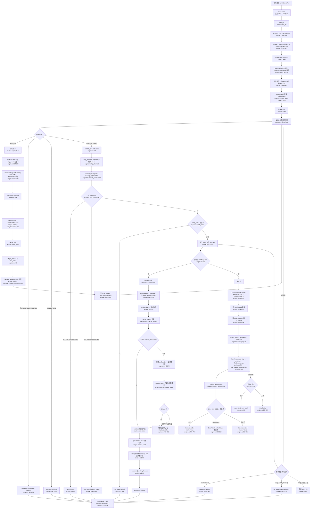

同一张图的分段读法：

| 段 | 入口函数 | 文件的哪一段 |
|---|---|---|
| CLI 入口 | `cmd_do` | `crates/yunxi-bot-cli/src/main.rs:2394` |
| 拆解 | `Engine::plan_task` | `crates/yunxi-bot-core/src/task/engine.rs:583` |
| 计划解析 | `parse_plan` | `crates/yunxi-bot-core/src/task/plan.rs:111` |
| 状态机主循环 | `Engine::run_inner` | `crates/yunxi-bot-core/src/task/engine.rs:387` |
| 单步执行 | `Engine::run_step` | `crates/yunxi-bot-core/src/task/engine.rs:680` |
| 决策步 | `Engine::run_decision` | `crates/yunxi-bot-core/src/task/engine.rs:891` |
| 升级人工 | `Engine::escalate` | `crates/yunxi-bot-core/src/task/engine.rs:992` |
| 路由 | `ModelRouter::route` | `crates/yunxi-bot-core/src/think/router.rs:693` |
| 工具循环 | `ToolRunner::run` | `crates/yunxi-bot-core/src/tool/runner.rs:407` |

### 1.2 为什么主循环是"每轮重新投影"

`Engine::run` 先把预算账本和用量收集器建好（`engine.rs:377-381`），然后调 `run_inner`，最后统一 `flush_records`（`engine.rs:382-384`）。

`run_inner` 的循环体第一件事是 `let mut task = self.load(task_id)?`（`engine.rs:400`），而 `load` 走的是 `self.store.project()`（`engine.rs:1107-1109`），`LedgerTaskStore::project` 又是 `task_from_events(self.ledger.events())`（`engine.rs:1229-1231`）。

**这样做的理由是：内存里的 `Task` 只是台账的视图，不是真相。** 每轮重新投影，就不存在"内存与台账不一致"这个失效形态（`task/model.rs:25-26` 把这条列为三条设计约束的第一条）。

一个直接后果：循环体里每个分支要么 `return`、要么 `continue`。`engine.rs:393-395` 用 `let mut outcome = None` 当哨兵，让"循环不可达终点"这件事在类型层面成立。

### 1.3 拆解：目标怎么变成步骤清单

`plan_task`（`engine.rs:583`）做的事，按顺序：

1. **给自己的画像**：`TaskKind::Planning`，`step_count: 3`（`engine.rs:594-600`）。
   `step_count` 故意报"至少三步"——注释说明：拆解产出是多步计划，按一步报会被判成轻量档，而轻量档走 Agnes，Agnes 的思考模式是"服务端默认"（它不吃 `thinking` 字段），于是**拆解这一步永远拿不到思考**（`engine.rs:591-593`）。
2. **路由**：`self.router.route(&task.goal, kind, &profile, self.effort, Some(self.decider))`（`engine.rs:601-603`）。
3. **先扣预算再调用**：`ledger.try_charge()?`（`engine.rs:604`）。扣不动就直接出错，不排队不等待（`model.rs:318-327`）。
4. **调用模型**：`self.handler.plan(&routing, &req, records)`（`engine.rs:610`）。真实实现是 `ChatHandler::plan`（`chat_handler.rs:1160`），它把 `目标：... / 最多拆成 N 步。` 作为易变尾，走 `converse`（`chat_handler.rs:1168-1169`）。
5. **解析**：`parse_plan(&raw)`（`engine.rs:612`）。

`parse_plan` 自己分四步（`plan.rs:111-142`）：

| 步 | 函数 | 失败时说什么 |
|---|---|---|
| 取 JSON | `extract_json`（`plan.rs:277`） | 报"试了几个候选片段"+首个错误（`plan.rs:318-325`） |
| 拆步骤数组 | `steps_from_value`（`plan.rs:428`） | 逐个反序列化，报"第 N 个步骤的字段不合法"（`plan.rs:450-451`） |
| 查可用性 | `check_usable`（`plan.rs:473`） | 空清单 / id 空白 / id 重复 / instruction 空白（`plan.rs:474-513`） |
| 查依赖图 | `validate_dependencies`（`plan.rs:140`） | 引用不存在的步骤、成环 |

**"截断"有专门的一条检测**：`looks_truncated`（`plan.rs:260-265`）判断"文里出现了 `{` 或 `[`，但从第一个开始找不到配对的闭合"。命中时错误信息里会明说"**回复被截断了**……多半是输出预算不够"（`plan.rs:291-295`、`plan.rs:116-120`）。

为什么这条值得单独做：真机上回复是 `{"steps":[{"id":"s1",...` 被 `max_tokens` 从中间切断，而括号配对扫描会返回内部**每个完整的步骤对象**——那些能正常解析、但没有 `steps` 字段，于是报出来是「顶层对象里没有 steps 字段」，**指向完全错误的方向**（`plan.rs:246-259`）。

**一个必须知道的 schema 让步**：`normalize_kind`（`plan.rs:84-104`）会在 `kind == "decide"` **且** instruction 以 `decide:` 开头时，把 `kind` 字段删掉。因为 `decide` 不在 `TaskKind` 枚举里，模型顺手写上去会让**整份计划被拒**、白费一次拆解调用（`plan.rs:62-83`）。只在两件事同时成立时才丢；普通步骤写 `kind=decide` 仍然报错（`plan.rs:566-573` 的测试锁着这条）。

拆解落地时，`kind` 缺省按 `TaskKind::classify(&p.instruction).unwrap_or(TaskKind::Generation)` 兜底（`engine.rs:619-621`，同一转换在 `plan.rs:529-531` 也有一份，注释说明刻意共用 `planned_to_steps` 以免漂移，见 `plan.rs:517-520`）。

### 1.4 终态判定：`all_settled()` 回答的不是"目标达成没有"

这是整条链路里最容易读错的一处，单独说。

```rust
// task/model.rs:82-85
pub fn all_settled(&self) -> bool {
    !self.steps.is_empty() && self.steps.iter().all(|s| s.state.is_settled())
}
```

而 `is_settled` 的定义是：

```rust
// task/model.rs:235-240
pub fn is_settled(self) -> bool {
    matches!(self, StepState::Succeeded | StepState::Failed | StepState::Skipped)
}
```

**"完成 / 失败 / 跳过"三种都算终态。** 所以 `all_settled()` 回答的是"还有没有在跑的步骤"，**不是**"目标达成没有"。

引擎在 `engine.rs:446` 用它，但**没有直接把它当成成功**。命中之后还要再筛一遍 `Failed | Skipped`（`engine.rs:458-468`）：

- `broken` 为空 → `finish(TaskState::Done)`（`engine.rs:470`）
- `broken` 非空 → `set_state(TaskState::Stalled)`，然后 `break` 把 `Waiting` 交出去（`engine.rs:486-496`）

**那一段必须 `break` 不能 `continue`。** 因为 `Stalled` 不是终态——`is_terminal()` 只认 `Done | Failed | Cancelled`（`model.rs:142-147`）。回到循环顶之后 `all_settled()` 仍然为真、`broken` 仍非空，会**无限设 Stalled**。`engine.rs:475-485` 的注释记着这次事故（上一版写的 `continue`，测试套件挂死）。

**为什么这层补丁非有不可**（`engine.rs:447-457`）：真机上抓到过 `s5` 因为"需要使用者拍板"而 BLOCKED（那是对的行为），依赖它的全跳过，而任务状态报的是"**完成**"、文件一个字没改。12 次里出现 2 次。`TaskError` 层的 `needs_human()` 契约管的是单步输出，管不到整条链——这里补的就是整条链那一层。

CLI 那边同样把这两件事分开报：只有 `failed == 0 && skipped == 0` 才打印"完成"，否则打印"完成，但有 N 步失败、M 步被跳过"并返回退出码 1（`main.rs:2560-2572`）。

`TaskState` 七个取值与允许的迁移写在 `model.rs:111-162`。其中 `Stalled` 的存在理由是：没有它，"依赖成环"和"还在跑"会长得一模一样，于是死锁表现为无限等待（`model.rs:116-120`）。

### 1.5 三个"停下等人"的出口

| 出口 | 触发 | 代码 |
|---|---|---|
| 任务状态转 `AwaitingHuman` | 步骤返回 `StepRun::NeedsHuman` 或错误 `needs_human()` | `engine.rs:521-539` |
| 任务状态转 `Stalled` | `all_settled()` 但有 Failed/Skipped；或 `ready_steps` 为空 | `engine.rs:486`、`engine.rs:507` |
| 直接把错误抛出去 | `Err(e)` 且 `e.needs_human() == false` | `engine.rs:540` |

`TaskError::needs_human()` 的判据是**失败方向朝"不执行"**：只有 `StepFailed` 和 `Core` 返回 false（可以自己重试/是基础设施故障），其余（预算用尽、步骤太多、计划无法解析、依赖成环、需要人工、卡住）一律 true（`model.rs:424-435`）。

---

## 二、决策模型什么时候决策

### 2.0 决策层的形状

先把接口钉死，后面每个调用点都用到。

```rust
// decide/laya.rs:71-73
pub trait Decider: Send + Sync {
    fn decide(&self, req: &DecisionRequest) -> Result<DecisionResult, DecisionError>;
}
```

- **问题**：`Question`，三种 `QuestionKind`——`Choice { criteria }` / `Score { levels }` / `Noul`（`decide/mod.rs:21-37`）。`Question::choice(id, instructions, criteria)` 把 `&[(&str, &str)]` 收成 `选项名 → 判据` 的 `BTreeMap`（`decide/mod.rs:49-64`）。
- **请求**：`DecisionRequest { state, questions }`（`decide/mod.rs:89-99`）。`state` 是"判断所需的证据"，不是"服务知道的一切"（`decide/mod.rs:85-88`）。
- **答案**：`DecisionResult { answers: BTreeMap<String, Answer>, model }`（`decide/mod.rs:135-140`）。`Answer` 四个字段：`choice` / `distribution` / `expected_score` / `noul`（`decide/mod.rs:102-116`）。`DecisionResult::choice(id)` 返回 `Option<&str>`（`decide/mod.rs:153-155`）。
- **传输**：`POST /decide`，请求体 `{state, questions}`，响应 `{answers, model}`（`decide/laya.rs:5-15`）。`LayaDecider` 默认超时 `DEFAULT_TIMEOUT_MS = 2_000` 毫秒（`decide/laya.rs:86`）。

**校验不在适配器里，在 `DecisionEngine` 里，而且是无条件必经之路**（`decide/mod.rs:383-393`）。理由是：塞进 `LayaDecider` 的话，换一个适配器（或测试桩）就会漏掉，而未校验的模型返回值恰恰最危险（比如编出一个没声明的选项）。`laya::validate` 检查：每个问题都有答案、`choice` 落在判据里、概率在 `[0,1]`、分布非空时各项和接近 1（`decide/laya.rs:145-204`、`206-236`）。

**熔断**：连续失败阈值 `DEFAULT_FAILURE_THRESHOLD = 3`（`decide/mod.rs:277`），达到后 `circuit_open()` 为真、直接降级不再调模型（`decide/mod.rs:368-381`），要人工 `reset_circuit`（`decide/mod.rs:425-427`）。

**决策类别决定降级方向**（`decide/mod.rs:188-207`）：

| 类别 | 降级方向 | 降级动作 |
|---|---|---|
| `Interrupt` | FailClosed | 延后聚合，本轮不打扰 |
| `Escalate` | **FailOpen** | 升级给人 |
| `Irreversible` | NotApplicable | 保持强制人工批准（行为不变） |
| `Classify` | FailClosed | 归入待分类队列，不猜 |
| `Urgency` | FailClosed | 按普通处理 |
| `Anomaly` | **FailOpen** | 按可疑处理并记日志 |

第一项与第二项**方向相反**——这正是必须先分类的原因（`decide/mod.rs:191-192`）。

### 2.1 调用点一：路由时的"调用次数档位"判定

**在哪**：`ModelRouter::route`（`router.rs:693`）→ `ModelRouter::ask_call_count`（`router.rs:793`）。

**触发条件**：只有当**确定性信号判不出档位**时才会问。`route` 先试 `profile.heuristic_tier()`（`router.rs:706`），返回 `Some` 就直接定档且 `used_decider = false`；只有 `None` 才走 `decider.and_then(|d| self.ask_call_count(d, task_text))`（`router.rs:718`）。

`heuristic_tier`（`router.rs:375-390`）返回 `None` 的条件是**两个确定性判据都不成立**：
- 调用次数不 `> thresholds::MULTI_CALL`（`= 4`，`router.rs:332`）
- 不满足"小任务"：`prompt_chars > 0 && prompt_chars < SHORT_PROMPT_CHARS(200) && step_count <= 1 && !explicit_multi && !has_code`

**问的是什么**：`Question::choice("call_count", "完成这个任务预计需要多少次模型调用？", &call_count_criteria())`（`router.rs:796-800`）。判据三条（`router.rs:633-639`）：

| 选项 | 判据原文 |
|---|---|
| `few` | 一两次调用就能完成，不需要来回多轮 |
| `several` | 需要四五次调用，中间有几轮来回 |
| `many` | 需要很多轮调用，要拆成多个步骤逐步完成 |

`state` 只放 `{ "task": task_text }`（`router.rs:801`）。

**答案怎么用**（`router.rs:803-808`）：`few → Tier::Cheap`、`several → Tier::Standard`、`many → Tier::Deep`，**其余一律 `None`**（未知选项算弃权）。

**弃权/失败怎么办**：`decider.decide(&req).ok()?`（`router.rs:802`）——任何 `Err` 都变成 `None`，于是 `route` 走 `self.default_tier` 并记理由"档位信号不足且本地判断弃权，回落默认档（免费）"（`router.rs:720-724`）。**路由失败不能把任务卡住**（`router.rs:791-792`）。

**谁传了 decider**：

| 调用点 | decider 参数 | 出处 |
|---|---|---|
| 拆解 | `Some(self.decider)` | `engine.rs:603` |
| 单步执行 | `Some(decider)` | `engine.rs:741` |
| 决策点生成选项之后的路由 | **`None`** | `engine.rs:917` |
| CLI 的干跑预览 | **`None`** | `main.rs:2476` |

`run_decision` 传 `None` 是**故意的**，注释写得很清楚：调用次数我们已经知道是 1，"需要推理"也已经在 `TaskKind::Analysis` 里写明；问一次纯属浪费一个本地调用，而且被问的模型并不比我们多任何信息（`engine.rs:900-908`）。

### 2.2 调用点二：任务中途的 `decide:` 步骤

**在哪**：`decision_point`（`crates/yunxi-bot-core/src/task/decide.rs:197`），由 `Engine::run_decision` 在 `engine.rs:955` 调用，key 固定为 `"task_decision"`。

**触发条件**：引擎发现某一步的指令以 `DECIDE_PREFIX = "decide:"` 开头（`engine.rs:65`、`engine.rs:771`）。而且**顺序很要紧**：
- 先查**人有没有答过**（`engine.rs:709-713`）——在"重试次数用尽"检查**之前**；
- 再看重试次数（`engine.rs:716`）；
- 再路由、落 `StepRunning`、扣预算；
- 最后才进 `run_decision`（`engine.rs:771-776`）。

**问的是什么**：`decision_point` 只认逐字命中的选项（`task/decide.rs:17-19`）。它构造：

```rust
// task/decide.rs:240-245
let state = serde_json::json!({
    "question": question,
    "options": options,
    "criteria": criteria_map,
});
let req = DecisionRequest::new(state, vec![Question::choice(key, question, criteria)]);
```

`criteria` 是 `选项名 → 判据`。**选项名是 `opt0`/`opt1`/…，判据是选项原文**——因为本地 Verdict 是双编码器，按**判据文本**打分，所以判据必须是能读懂的原话，而它回的是键（`engine.rs:940-949`）。

**答案怎么用**：`decision_point` 返回 `TaskDecision::Chosen { choice, rationale, alternatives }` 或 `NeedsHuman { question, options }`（`task/decide.rs:83-97`）。引擎在 `Chosen` 分支里把键**换回原文**再落盘（`engine.rs:963-981`），因为台账里存 `"opt1"` 这种占位符的话，事后回看"当时选了哪个做法"完全读不出来。

**五条升级人工的路径**（全部汇到 `escalate`，`task/decide.rs:321-348`）：

| 情形 | 说明文字 | 出处 |
|---|---|---|
| 判据本身少于 `MIN_OPTIONS(=2)` | 直接 `Err(TaskError::NeedsHuman)`，**压根不问模型** | `task/decide.rs:204-211` |
| 判据里有空选项名 / 重名 | 同上 | `task/decide.rs:212-227` |
| 决策模型调用失败 | "决策模型不可用（服务未启动、超时，或响应非法）——这是故障，不是它在弃权" | `task/decide.rs:247-258` |
| 响应非法（未声明的选项 / 越界概率） | "决策模型的响应不合法" | `task/decide.rs:263-269` |
| 没有答案 / `choice` 为空 / 选项名对不上 | "没有回应这个问题" / "弃权——它没有选任何一项" / "选了一个不存在的选项" | `task/decide.rs:273-287` |

**"弃权"和"不可用"必须分得开**，这是真机上抓到的（D104）：Verdict sidecar 因为线程耗尽被杀，之后每一次决策都变成"问人"，而没有任何人知道它已经不在了——那份日志里最后一句是 `OMP: Error #137: Cannot create thread.`，而界面上显示的是"任务卡住，需要你拍板"（`task/decide.rs:327-344`）。

**选项名逐字匹配，不做 trim、不忽略大小写**：宽容匹配等于替模型猜它想说什么，而这里猜错的代价是执行了另一种做法（`task/decide.rs:283-287`）。

### 2.3 调用点三：工具审批门禁的"该不该问人"

**在哪**：`ask_local`（`crates/yunxi-bot-core/src/tool/mod.rs:738`），由 `gate` 在第二层调用（`tool/mod.rs:717`）。

**触发条件**：`gate` 是三层，从便宜到贵（`tool/mod.rs:624-732`）：

1. **确定性规则**：`deny` 黑名单命中即终点（`tool/mod.rs:642-653`）；`needs_explicit_approval()` 的能力（`Outbound` / `Unknown`）**命中白名单才放行，否则一律问人，且不问模型**（`tool/mod.rs:660-676`）；`allow` 白名单命中放行（`tool/mod.rs:678-689`）；只读且在工作区内免问（`tool/mod.rs:698-714`）。
2. **本地决策模型**：`ask_local`。
3. **保守兜底**：`GateDecision::Ask`，理由"信号不足，按最保守处理"（`tool/mod.rs:721-731`）。

`Capability` 六类：`ReadOnly` / `Write` / `Execute` / `Network` / `Outbound` / `Unknown`（`tool/mod.rs:63-98`）。`is_inert()` 只认 `ReadOnly`（`tool/mod.rs:113-115`）；`needs_explicit_approval()` 认 `Outbound | Unknown`（`tool/mod.rs:128-130`）。

**问的是什么**：`Question::choice("needs_human", "这个动作该不该先问过使用者？", ...)`，两个选项（`tool/mod.rs:748-755`）：
- `auto`：无需询问：它没有副作用，或者副作用完全在预期范围内
- `ask`：需要询问：它会改变系统状态、或把信息发到外部

`state` 带工具名、能力、粒度、参数（**截断到 600 字符**）、cwd、是否在工作区内（`tool/mod.rs:757-766`）。

**答案怎么用**（`tool/mod.rs:770-779`）：`auto → GateDecision::Allow`、`ask → GateDecision::Ask`、其余（未知选项、缺答案）**返回 `None` 交给第三层兜底**。

**失败方向**：兜底是"问人"，不是"放行"——这一层失败只会让事情更保守（`tool/mod.rs:736-737`）。`decider` 为 `None`（本地决策模型不可用）时只会走第一层和兜底，**不会因此变宽松**（`tool/mod.rs:626-627`）。

### 2.4 调用点四：陪伴/通知的"该不该打扰"

这一层是**两个调用点**，共用同一套三层结构（ADR D24 明确说"打扰判定复用陪伴层的三层，不另造一套"）。

#### 陪伴介入：`decide_intervention`

`companion.rs:206-255`。

- **触发**：陪伴层的一次完整介入决策。
- **问的**：`intervention_questions()`（`companion.rs:117-137`），一个 `Choice` 加两个 `Noul`：
  - `intervention`（Choice，问题"此刻应当如何介入？"）：`speak` = 有值得主动说明的信息，且现在说不会打扰；`hold` = 有信息但现在不适合说，应留到合适时机；`quiet` = 没有需要主动说明的信息，保持静默即可
  - `needs_support`（Noul）："使用者此刻是否处于明确需要情绪支持的状态（而非只是没说话）？"
  - `is_anomaly`（Noul）："近期的运行结果中是否出现了显著偏离常态、需要人知道的情况？"
- **答案怎么用**：`parse_action`（`companion.rs:192-200`）把 choice 解析成 `Intervention`，**未知选项按最保守处理 `Quiet`**；然后与约束层上限取更保守者：`model_action.more_conservative(verdict.ceiling)`（`companion.rs:222-223`）。
- **约束层**（`constraint_ceiling`，`companion.rs:150-189`）四条硬闸，任一命中上限就压到 `Hold`：
  - 处在安静时段（`CompanionPolicy::default()`：23 点到 8 点，`companion.rs:79-80`）
  - 情境标记为安静时段（`companion.rs:161-166`）
  - 今天已打扰次数 ≥ `max_interventions_per_day`（默认 3，`companion.rs:81`）
  - 距上次互动分钟数 < `min_minutes_between_interventions`（默认 120，`companion.rs:82`）
  - 都没命中 → 上限 `Speak`（`companion.rs:185-188`）
- **降级**：引擎类别固定 `Interrupt`（`companion.rs:267-269`），方向 fail-closed。降级时 `Intervention::Hold.more_conservative(verdict.ceiling)`——**约束仍然生效，降级不等于绕过使用者的设定**（`companion.rs:243-253`）。

`Intervention` 的 `Ord` 是 `Speak < Hold < Quiet`，所以 `more_conservative` 用 `max` 而不是 `min`；写成 `min` 会拿到最激进的动作，约束收紧会完全失效（`companion.rs:50-60`）。

#### 邮件/通知分流：`triage_item`

`triage.rs:444-510`。

- **触发**：对一条 `InfoItem` 做打扰判定。
- **顺序**：先算约束层（`triage.rs:455`，**任何路径都要过它，包括确定性规则**），再走第二层模型。
- **第一层确定性规则** `deterministic_triage`（`triage.rs:307-369`），按优先级：

  | # | 规则 | 动作 | 行号 |
  |---|---|---|---|
  | 1 | 黑名单命中 | `Quiet` | `triage.rs:316-326` |
  | 2 | 白名单命中 | `Speak` | `triage.rs:329-339` |
  | 3 | 验证码 | `Speak` | `triage.rs:343-349` |
  | 4 | 群发（`looks_bulk`） | `Hold` | `triage.rs:353-359` |
  | 5 | 机器发件人 | `Hold` | `triage.rs:362-368` |

  `TriagePolicy::default().bulk_threshold = 3`（`triage.rs:122-132`）。
- **第二层**：`triage_questions()`（`triage.rs:378-394`），一个 `Choice` 加一个 `Noul`：
  - `triage`（"这一封邮件此刻应当如何处置？"）：`speak` = 值得现在就告诉使用者，晚了他会不方便；`hold` = 有内容但不必现在说，攒着等他自己看；`quiet` = 与使用者无关或纯噪音，不值得提
  - `needs_action`（Noul）："这封邮件是否明确需要使用者本人做一件事（而不只是知会他）？"
- **`state` 主动裁剪**（`build_state`，`triage.rs:401-438`）：摘要截到 400 字符，**不喂整封正文**；时间戳取不到时 `age_minutes` 是 `null` 而不是编一个数，并另给显式标志 `received_at_known`（`triage.rs:405-412`）。
- **答案怎么用**：`parse_triage` + `apply_ceiling`（`triage.rs:475-490`、`triage.rs:514-539`）；置信度也拼进理由（`triage.rs:487-489`）。
- **降级兜底是 `Hold` 而不是 `Speak`，也不是 `Quiet`**（`triage.rs:492-508`）：`Speak` 会乱说话；`Quiet` 等于**把信息丢了**。`Hold` 保住了它，使用者主动看的时候还在。这是"不打扰"和"不丢失"之间唯一同时成立的那个选择。

### 2.5 调用点五：召回门控拿不准时的兜底

这一处和前四处形状不同：**关键词先跑，只有它判成 `Mixed`（拿不准）时才问模型。**

- **第一层**：`recall_gate::gate(query)`（`crates/yunxi-bot-core/src/recall_gate.rs:179-235`），纯关键词，返回 `MemoryNeed`（`None` / `Profile` / `Episode` / `LongTerm` / `Mixed`，`recall_gate.rs:38-49`）。优先级是刻意排的（`recall_gate.rs:166-178`）：

  | 顺序 | 判据 | 结果 | 行号 |
  |---|---|---|---|
  | 0 | 空串 | `None` | `recall_gate.rs:180-183` |
  | 1 | 明确回指（`BACK_REFERENCE`） | 有时间词 → `Mixed`，否则 `LongTerm` | `recall_gate.rs:192-199` |
  | 2 | 第一人称 + 时间词 | `Episode` | `recall_gate.rs:206-208` |
  | 3 | 第一人称 + 个人名词 / 只有个人名词 | `Profile` | `recall_gate.rs:211-216` |
  | 4 | 只有时间词 | `Mixed`（"去年 Rust 发布了什么版本"问的是世界） | `recall_gate.rs:218-221` |
  | 5 | 通用问法且**无任何第一人称** | `None` | `recall_gate.rs:223-229` |
  | 6 | **什么都没匹配到** | **`Mixed`（保守召回）** | `recall_gate.rs:231-234` |

  第 6 条是这张表里最要紧的一行：**"没看懂"不能等于"不需要"**（`recall_gate.rs:178`）。判错的两个方向不对称——判成"不用召回"而其实要，表现是"它明明记过却想不起来"，**最难查**（`recall_gate.rs:23-31`）。

- **第二层**：`ChatHandler::gate_with_model`（`crates/yunxi-bot-cli/src/chat_handler.rs:479-491`）。
  - **触发条件**：`need == MemoryNeed::Mixed`（`chat_handler.rs:557-561`）。
  - **问的**：`gate_questions()`（`recall_gate.rs:268-294`），question id 是常量 `GATE_QUESTION = "memory_need"`（`recall_gate.rs:238`），问题"为了回答使用者这一句话，需要去查关于他本人的记忆吗？"，六个选项：`none` / `profile` / `episode` / `long_term` / `knowledge` / `mixed`。
  - **state**：只放 `{ "使用者这一句": input }`（`chat_handler.rs:484-487`）——把整段上下文倒进去既浪费调用，也让"它凭什么这么判"变得不可复核。
  - **答案怎么用**：`need_from_choice`（`recall_gate.rs:304-313`）把选项翻成 `MemoryNeed`。**`knowledge` 映射成 `None`**，因为这一层的职责只是决定要不要翻私人记忆。
  - **失败方向**：`gate_with_model` 返回 `None`（没有决策器 / 调用失败 / 选项听不懂），调用方 `unwrap_or(need)` **退回关键词的判断**（`chat_handler.rs:557-558`）。门控是优化，不是对话能不能进行的前提（`chat_handler.rs:554-555`）。
  - **认不出就说认不出，不硬猜**：硬猜一个比不猜更坏，因为它看起来像有依据，事后没法归因（`chat_handler.rs:477-478`）。

### 2.6 五个调用点汇总

| # | 位置 | 函数 | 触发条件 | question id | 答案形状 |
|---|---|---|---|---|---|
| 1 | 路由 | `ModelRouter::ask_call_count`（`router.rs:793`） | `profile.heuristic_tier()` 返回 `None` 且有 decider | `call_count` | Choice：`few`/`several`/`many` |
| 2 | 任务决策步 | `task::decide::decision_point`（`task/decide.rs:197`） | 步骤指令以 `decide:` 开头 | `task_decision` | Choice：`opt0`/`opt1`/… |
| 3 | 工具审批 | `tool::ask_local`（`tool/mod.rs:738`） | 前两层确定性规则都定不了 | `needs_human` | Choice：`auto`/`ask` |
| 4a | 陪伴介入 | `companion::decide_intervention`（`companion.rs:206`） | 陪伴层一次介入决策 | `intervention` | Choice：`speak`/`hold`/`quiet`（另两个 Noul） |
| 4b | 通知分流 | `triage::triage_item`（`triage.rs:444`） | 确定性规则全不命中 | `triage` | Choice：`speak`/`hold`/`quiet`（另一个 Noul） |
| 5 | 召回门控 | `ChatHandler::gate_with_model`（`chat_handler.rs:479`） | 关键词判成 `Mixed` | `memory_need` | Choice：`none`/`profile`/`episode`/`long_term`/`knowledge`/`mixed` |

**有一条路没有被接线。** `ModelRouter::ask_kind`（`router.rs:815-823`）是 `pub` 的，问的是 `task_kind`（`shallow`/`drafting`/`deep`，`router.rs:170-176`），但它**除了 `router.rs:1211-1213` 的测试之外没有任何调用点**。`route` 里没有调用它——`kind` 是 `route` 的入参，由调用方给（`router.rs:688-692` 的文档说明了这个设计：把 `kind` 作为参数而不是内部再判一次，是为了让"任务类型是在任务执行层定的"这件事在类型上就成立）。

---

## 三、模型选择器（router）

### 3.1 三个模型

#### Agnes 3.0 Flash —— 思考用的主力

```rust
// router.rs:291-301
pub const AGNES_FLASH: Self = Self {
    tier: Tier::Standard,
    provider: "agnes",
    base_url: "https://api.agnes-ai.cn/v1",
    model: "agnes-3.0-flash",
    price: PriceTable::AGNES_30_FLASH,
    rpm: 10,
    thinking: Thinking::ServerDefault,
    key_hint: "secrets/agnes.key 或 YUNXI_BOT_AGNES_KEY",
};
```

- 端点：`https://api.agnes-ai.cn/v1`，`POST /v1/chat/completions`，`Authorization: Bearer <key>`（`think/agnes.rs:3-8`）。
- 限流：`rpm: 10`（`router.rs:297`），另有常量 `FREE_TIER_RPM = 10`（`think/agnes.rs:21`，注释记着"2026-09 起从 20 下调到 10"）。`RateLimiter::with_rpm(10)` 会算出 `60_000 / 10 = 6000` 毫秒的最小间隔（`think/mod.rs:340-347`）。
- **不吃 `thinking` 字段**：`thinking: Thinking::ServerDefault`（`router.rs:299`），注释写"Agnes 不吃 thinking 字段，传了是错的行为"。`accepts_thinking()` 因此返回 false（`router.rs:321-323`）。
- 价格：`PriceTable::AGNES_30_FLASH`，`free: true`，缓存命中 0.035 / 输入 0.35 / 输出 1.0（元每百万 token，高峰空闲同价）（`think/cost.rs:63-72`）。
- 缓存折扣 10 倍（`think/cost.rs:62`）。

#### DeepSeek Flash —— 需要多次调用或需要推理

```rust
// router.rs:309-318
pub const DEEPSEEK_FLASH: Self = Self {
    tier: Tier::Deep,
    provider: "deepseek",
    base_url: "https://api.deepseek.com/v1",
    model: "deepseek-flash",
    price: PriceTable::DEEPSEEK_FLASH,
    rpm: 60,
    thinking: Thinking::Enabled,
    key_hint: "secrets/deepseek.key 或 YUNXI_BOT_DEEPSEEK_KEY",
};
```

- 模型名 `deepseek-flash`（DeepSeek-V4.1-Flash，`router.rs:305`），端点 `https://api.deepseek.com/v1`。
- 限流：`rpm: 60`（`router.rs:315`），即最小间隔 1000 毫秒。
- `thinking: Thinking::Enabled` 表示**这个端点支持思考**，而不是"每个任务都开"（`router.rs:307-308`）。
- 价格：缓存命中 0.04（高峰）/ 0.02（空闲），输入 2.0 / 1.0，输出 8.0 / 4.0（`think/cost.rs:48-57`）。**缓存命中与未命中差 50 倍**（`think/cost.rs:46-47`）。
- 高峰时段：北京时间周一至周五 9:00–12:00 与 14:00–18:00，**不含法定节假日**（`think/cost.rs:102-109`）。

> 注意一处文档与常量的措辞差异：`router.rs:32-39` 的模块文档表格里把 DeepSeek 的限流写成"并发 2500，基本无等待"，而 `ModelSpec::DEEPSEEK_FLASH.rpm` 这个字段写的是 `60`（`router.rs:315`）。本文按字段值 60 说。

#### Verdict —— 本地决策模型

**它不是 `ModelSpec`，不在 `router.rs` 里，也不参与"选哪个模型思考"这件事。**

- 它是决策层的本地 sidecar，用 `POST /decide` 契约（`decide/laya.rs:5-18`）。
- 默认端口 `DEFAULT_PORT = 17870`（`sidecar/verdict_server.py:36`），Rust 侧默认端点 `http://127.0.0.1:17870/decide`（`main.rs:2382`、`main.rs:2545`）。
- 超时 `DEFAULT_TIMEOUT_MS = 2_000`（`decide/laya.rs:86`）。
- 选 Verdict 不选 Laya 的四条理由写在 `sidecar/verdict_server.py:5-17`：选项顺序不变性（Laya 翻转率 0.23）、校准诚实（ECE 0.014–0.030）、保形弃权（`calibrate()` 给分布无关的覆盖率保证）、适配成本（`fit()` 在笔记本 CPU 上 0.9 秒）。
- **`think/mod.rs:6-10` 的措辞是过期的**：它写"决策层（`crate::decide`）……本地跑（Laya）"，而现在的实现是 Verdict（`decide/laya.rs:1` 也已经写着"Laya 的本地 sidecar 适配器"这个名字保留）。`LayaDecider` 是**类型名**，指"实现 `Decider` 的 HTTP 适配器"，不必然指向 Laya 模型。

### 3.2 `TaskKind` 七类与它对选择的影响

```rust
// router.rs:93-110
pub enum TaskKind {
    Conversation,  // 寒暄、确认、报个状态。不需要推理。
    Lookup,        // 查一个事实、取一个值、转述一条记录。
    Generation,    // 起草一段文字、写一封邮件、生成一段代码。
    Edit,          // 改一个已有的东西（文件、配置、数据）。
    Analysis,      // 分析、比较、诊断、算一笔账。需要推理。
    Planning,      // 拆解目标、排步骤、定方案。需要推理。
    Execution,     // 跑一条命令、调一个工具、执行一个动作。
}
```

`kind` 对选择的**唯一直接影响**是"要不要思考"：

```rust
// router.rs:126-128
pub fn needs_reasoning(self) -> bool {
    matches!(self, TaskKind::Analysis | TaskKind::Planning)
}
```

**七类里只有分析与规划需要推理**。

分类链 `TaskKind::classify`（`router.rs:134-167`）**顺序即优先级**，推理信号最强所以排最前：

| 顺序 | 判据函数 | 命中给 | 行号 |
|---|---|---|---|
| 1 | `is_complex_reasoning`（15 个词：分析/对比/比较/评估/权衡/诊断/排查/推理/为什么/为何/判断/可行性/利弊/方案/预算多少） | `Analysis` | `router.rs:135-137`、`router.rs:492-511` |
| 2 | `detect_planning`（8 个词：拆解/拆成/排期/规划/路线图/分期/分几个阶段/先后顺序） | `Planning` | `router.rs:138-140`、`router.rs:514-526` |
| 3 | `detect_execution`（10 个词：运行/执行/跑一下/跑个/启动/部署/安装/重启/调用工具/发出去） | `Execution` | `router.rs:141-143`、`router.rs:529-543` |
| 4 | `detect_edit`（8 个词：修改/改成/改一下/删掉/删除/替换/更新一下/重命名） | `Edit` | `router.rs:144-146`、`router.rs:546-558` |
| 5 | `detect_code`（8 个记号：三个反引号组成的代码块围栏、代码、脚本、函数、编译、报错、bug、.rs）；有"写一个/写个/实现一个/新写/从零"算 `Generation`，否则 `Edit` | `Generation`/`Edit` | `router.rs:147-154`、`router.rs:627-630` |
| 6 | `detect_generation`（12 个词：写一封/写个/写一个/写一段/写一份/起草/拟定/拟一份/生成/润色/扩写/缩写） | `Generation` | `router.rs:155-157`、`router.rs:565-581` |
| 7 | `detect_lookup`（8 个祈使式 + 6 个疑问式："哪/几/多少/有没有/吗/谁"） | `Lookup` | `router.rs:158-160`、`router.rs:588-610` |
| 8 | 短、无信号（`0 < 长度 < SHORT_PROMPT_CHARS(200)`） | `Conversation` | `router.rs:161-165` |
| — | 都不命中 | `None`（"该问下一步了"的信号） | `router.rs:166` |

两条刻意的设计：
- **"对比一下"的短句是分析任务**，不该因为字少被当成寒暄（`router.rs:131-133`）。
- `detect_lookup` 有祈使式和疑问式**两条并行判据**：只留前一条会把"查一下快递到哪了"漏成对话（`router.rs:583-609`）。

`kind` 由调用方给出，不在这里判：拆解固定 `TaskKind::Planning`（`engine.rs:594`），单步用 `step.kind`（`engine.rs:738`），决策点固定 `TaskKind::Analysis`（`engine.rs:917`）。步的 `kind` 来自模型给的 `PlannedStep.kind`，缺省时按指令文本判（`engine.rs:619-621`）。

### 3.3 "不需要多次调用 → Agnes，需要多次 → DeepSeek"写在哪

**写在 `TaskProfile::heuristic_tier`（`router.rs:375-390`），依据是 `TaskProfile::estimated_calls`（`router.rs:361-370`），门槛是 `thresholds::MULTI_CALL`（`router.rs:332`）。**

```rust
// router.rs:361-370
pub fn estimated_calls(&self) -> usize {
    let steps = if self.step_count > 0 {
        self.step_count
    } else {
        // 没拆解前粗估：每 300 字算一步，至少 1 步
        (self.prompt_chars / 300).max(1)
    };
    // 拆解 1 次 + 每步 1 次 + 决策点按步数的一半估
    1 + steps + steps / 2
}
```

```rust
// router.rs:375-390
pub fn heuristic_tier(&self) -> Option<Tier> {
    let calls = self.estimated_calls();
    if calls > thresholds::MULTI_CALL {
        return Some(Tier::Deep);
    }
    // 明确的小任务
    if self.prompt_chars > 0
        && self.prompt_chars < thresholds::SHORT_PROMPT_CHARS
        && self.step_count <= 1
        && !self.explicit_multi
        && !self.has_code
    {
        return Some(Tier::Cheap);
    }
    None
}
```

`MULTI_CALL = 4`，注释给的依据是：Agnes 免费档 10 RPM ≈ 每次间隔 6 秒，4 次调用要等约 18 秒，还在"能接受"的范围；再多就该换到不排队的那个了（`router.rs:328-332`）。

`suggested Tier` 到具体模型的映射在 `ModelRouter::spec`（`router.rs:680-686`）：

```rust
self.specs.iter().find(|s| s.tier == tier)
    .or_else(|| self.specs.iter().find(|s| s.tier == self.default_tier))
    .or_else(|| self.specs.first())
```

**这里有一个必须知道的细节：默认注册表里没有 `Tier::Cheap` 的模型。** `ModelRouter::default()` 只放 `[AGNES_FLASH(Standard), DEEPSEEK_FLASH(Deep)]`，`default_tier = Tier::Standard`（`router.rs:650-658`）。所以 `Tier::Cheap` 会**回落到 Standard → Agnes**。

两句话合起来才是完整规则：

- **判成 Deep（调用次数 > 4）→ DeepSeek**
- **其余一切（Cheap / Standard / 判不出来回落默认档）→ Agnes**

一条不容易注意的推论：**拆解永远判不出确定性档位。** 因为 `plan_task` 把 `step_count` 固定成 3（`engine.rs:597`），`estimated_calls()` 得 `1 + 3 + 1 = 4`，而 `4 > 4` 为假；同时"小任务"那条要求 `step_count <= 1`，也不成立。于是 `heuristic_tier()` 必返回 `None`，**拆解的路由总是去问本地决策模型**（`router.rs:718`），除非没接 decider（那就回落 Standard/Agnes，`router.rs:720-724`）。

### 3.4 思考模式怎么决定

唯一依据是 `ReasoningEffort::applies`：

```rust
// router.rs:208-214
pub fn applies(self, kind: TaskKind, tier: Tier) -> bool {
    match self {
        ReasoningEffort::Always => true,
        ReasoningEffort::Never => false,
        ReasoningEffort::Auto => tier == Tier::Deep && kind.needs_reasoning(),
    }
}
```

**默认值是 `Auto`**（`router.rs:189-195`）。`Auto` 下要**同时**满足两条才开思考：
1. 档位是 `Tier::Deep`（即走 DeepSeek）
2. 任务类型需要推理（`Analysis` 或 `Planning`）

`Always` / `Never` 是使用者的显式覆盖。CLI 的 `do` 用 `parse_effort(args)` 解析（`main.rs:2422`），`chat` 用 `--thinking off/on/auto`（`main.rs:2635-2638`）。

为什么"只有 Deep 才开"：免费档不值得为思考花等待时间和 token 预算，而且轻量档的任务类型本来就不需要推理（`router.rs:203-207`）。

三个 `Thinking` 取值到线上字段的映射（`router.rs:250-256`）：

| `Thinking` | 请求体字段 |
|---|---|
| `ServerDefault` | **不传** |
| `Enabled` | `{"type": "enabled"}` |
| `Disabled` | `{"type": "disabled"}` |

`Routing::thinking_field()` 在这里加了一道保险：端点不支持思考（Agnes）时**返回 `ServerDefault`，绝不硬塞**（`router.rs:417-422`）。

`route` 里思考轴的计算与降级（`router.rs:756-764`）：

```rust
let mut think = effort.applies(kind, spec.tier);
if think && !spec.accepts_thinking() {
    // 选了不支持思考的端点却要思考 → 说清楚并降级，不静默
    reason.push_str(&format!("；{} 不支持思考模式，已降级为不开思考", spec.provider));
    think = false;
}
```

`reason` 字符串也在这一段拼：`Auto` 时写"思考模式按任务类型定：{类型} {需要/不需要推理}"，否则写"思考模式由使用者指定：{档}"（`router.rs:765-776`）。

**思考模式的输出预算要额外加余量。** `max_tokens` 是"思考过程 + 正文"的总和，不是正文的额度。`THINKING_OUTPUT_HEADROOM = 2048`（`engine.rs:56`），在 `converse` 里一处统一加（`chat_handler.rs:962-966`）。常量文档记着实测：拆解请求在 `max_tokens=2048` 时被截断（`finish_reason=length`），思考吃掉 280~540 token；`max_tokens=4096` 正常结束（`engine.rs:45-56`）。

**思考模式与工具调用不冲突**——实测 `finish_reason=tool_calls` 且正常带回 `reasoning_content`（`router.rs:27-28`）。工具循环每一轮都要带思考模式，只在第一轮带会让后续轮次静默退回默认（`runner.rs:426-430`）。

### 3.5 两个轴的交汇：需要推理但端点不支持思考

这是 `route` 里唯一一处"模型轴的结论被思考轴否决"的地方（`router.rs:739-753`）：

```rust
if kind.needs_reasoning()
    && !spec.accepts_thinking()
    && effort != ReasoningEffort::Never
    && let Some(better) = self
        .specs
        .iter()
        .filter(|s| s.accepts_thinking())
        .min_by_key(|s| s.tier)
{
    reason.push_str(&format!(
        "；这一步需要推理，但 {} 不支持思考模式，改用 {}",
        spec.provider, better.provider
    ));
    spec = better.clone();
}
```

**判据顺序很关键：调用次数决定"要不要换不排队的模型"（优化），需要推理决定"能不能省这次钱"（硬约束）。**（`router.rs:737-738`）

触发的场景：一个只有一句话的分析步骤，按调用次数算是轻量档 → Agnes；但 Agnes 的思考模式是"服务端默认"，于是**这一步永远拿不到思考**——而它恰恰是唯一真正需要思考的一步（`router.rs:730-736`）。这段注释写明"这是测试逼出来的一条"。

注意 `effort != ReasoningEffort::Never` 这一条：使用者显式说"不要思考"时，这个升级不发生。

### 3.6 降级与失败方向

**"fail-closed" 在本仓库的定义是：不确定时朝"不做"倒——不打扰、不升级、不动**（`decide/mod.rs:180-182`）。它的反面 `FailOpen` 是"朝告警倒：不确定就叫人"。

它在三处落地，方向并不统一——**这正是必须先分类的原因**：

| 层 | 位置 | 失败方向 | 具体行为 |
|---|---|---|---|
| 决策类别 | `DecisionClass::direction`（`decide/mod.rs:192-207`） | 逐类不同 | `Interrupt`/`Classify`/`Urgency` → FailClosed；`Escalate`/`Anomaly` → FailOpen；`Irreversible` → NotApplicable |
| 任务执行 | `TaskError::needs_human`（`model.rs:424-435`） | 朝"不执行" | 只有 `StepFailed` / `Core` 可自愈，其余一律停下等人 |
| 工具审批 | `gate` 第三层（`tool/mod.rs:721-731`） | 朝"问人" | 模型弃权/不可用 → `GateDecision::Ask`，**不是 Allow** |
| 路由 | `route` 弃权分支（`router.rs:720-724`） | **朝"免费档"** | 回落 `default_tier`（Standard → Agnes）。这是**成本方向**的保守，不是安全方向 |

最后一行值得单独说：**路由这一层的失败方向与其它三层不同。** 其它三层都朝"不执行/问人"倒，路由朝"用免费的那个"倒。这是刻意的——路由失败不能把任务卡住（`router.rs:791-792`），而且选中的模型无论如何都要过审批门禁，所以路由层不需要承担安全方向的保守。

`route` 里"说清楚，不静默"的两处：
- 端点不支持思考却要思考 → 降级为不开，并把原因拼进 `reason`（`router.rs:757-763`）
- 需要推理但端点不支持思考 → 换端点，并把原因拼进 `reason`（`router.rs:748-751`）

`reason` 会随 `RoutingRecord` 进台账（`model.rs:243-265`、`engine.rs:743-751`），"只存能解释账单的字段，不存整个 `Routing`"（`model.rs:243`）。

**熔断与置信度**（`decide/mod.rs:376-422`）：
- `DecisionEngine::decide` **永不返回 `Err`**——失败一律转成降级，因为调用方必须拿到一个明确的、可留痕的走向（`decide/mod.rs:376-377`）。
- 连续失败达到 `DEFAULT_FAILURE_THRESHOLD = 3` 后 `circuit_open()`，暂停调用模型（`decide/mod.rs:277`、`decide/mod.rs:379-381`）。
- `with_min_confidence` 可设置信度下限，低于它按"模型自己不确定"降级；但注释强调**只应在用自己的数据校准过之后设置**（`decide/mod.rs:355-361`、`decide/mod.rs:396-406`）。
- 降级必须可见：`DecisionOutcome::ledger_data` 给出 `degraded: true` + `class`/`direction`/`action`/`reason`（`decide/mod.rs:253-273`）。

### 3.7 路由决策流程图

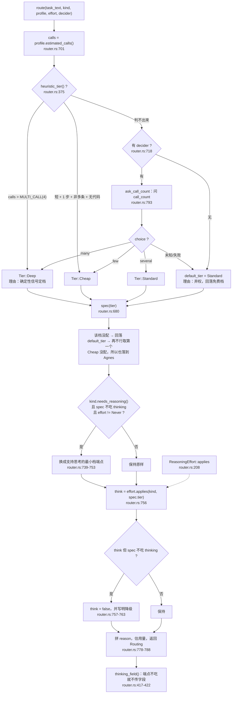

---

## 四、`decide:` 步骤的完整生命周期

### 4.1 时序

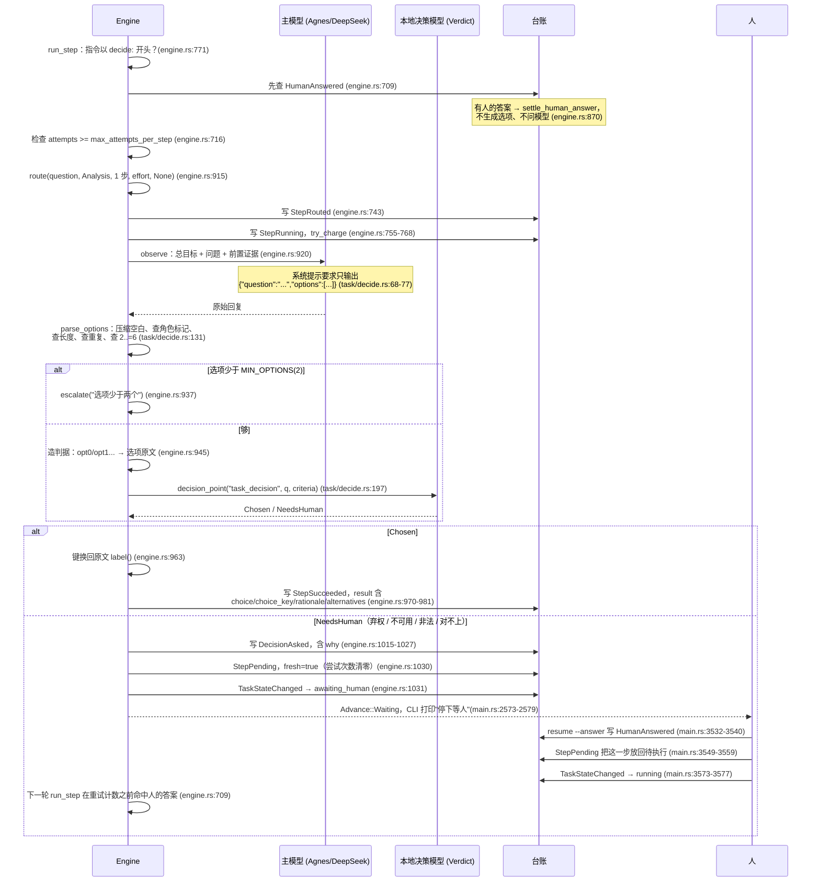

### 4.2 各阶段的关键判断

**选项生成侧**（`task/decide.rs` 的模块文档把它叫"第一道闸"，`task/decide.rs:12-16`）：

- `OPTIONS_SYSTEM_PROMPT` 是**常量**（`task/decide.rs:68-77`）。任何随调用变化的字节混进来，缓存前缀就作废，所以目标与步骤只能进用户消息（`task/decide.rs:64-67`）。
- `options_request`（`task/decide.rs:103-112`）用 `PromptLayout` 把稳定前缀进 system、`# 任务目标 / # 当前步骤` 进用户消息，温度 `OPTIONS_TEMPERATURE = 0.2`（`task/decide.rs:48-53`）——列做法不需要创造性，需要的是**稳定**。
- `parse_options`（`task/decide.rs:131-187`）的消毒清单：

  | 检查 | 常量/取值 | 失败 |
  |---|---|---|
  | `question` 非空 | — | 拒绝整份 |
  | `question` 长度 | `MAX_QUESTION_CHARS = 300` | 拒绝 |
  | 选项非空 | — | 拒绝 |
  | 单条选项长度 | `MAX_OPTION_CHARS = 120` | 拒绝 |
  | 角色冒充标记 | `ROLE_MARKERS = ["system", "assistant", "developer"]` | 拒绝 |
  | 选项去重（按小写归一） | — | 拒绝 |
  | 选项条数 | `MIN_OPTIONS = 2` .. `MAX_OPTIONS = 6` | 拒绝 |

  **超限拒绝而不是截断**：截断会悄悄改掉做法本身，而本地决策模型是照字面选的，它选中的将是一句我们没写完整的话（`task/decide.rs:38-46`）。
  **任何一条不合格都拒绝整份响应**，而不是丢掉坏的那条：丢一条会悄悄改变模型的提案（`task/decide.rs:128-130`）。
  消毒放在解析里而不是留给调用方：解析是唯一入口，只要有一条路径忘了消毒，"选项"就能变成塞进决策模型提示里的新指令（`task/decide.rs:124-127`）。选项会进决策模型的 `state`，而 `state` 是给模型看的指令区（`task/decide.rs:55-62`）。

  注意这里有**两个同名常量**：`task/decide.rs:32` 的 `MIN_OPTIONS = 2`（用于 `parse_options` 与 `decision_point`）和 `engine.rs:68` 的 `pub const MIN_OPTIONS: usize = 2`（用于 `run_decision` 里"选项少于两个"的检查）。值相同，是两处独立声明。

**判据构造**（`engine.rs:945-949`）：键是 `format!("opt{i}")`，值是选项原文。注释说明：本地决策模型是双编码器，它按**判据文本**打分，所以判据必须是能读懂的原话；而它回的是键（`engine.rs:940-944`）。

**`DecisionAsked` 里记了什么**（`engine.rs:1015-1027`）：

```rust
self.store.write(
    task_id,
    EventKind::DecisionAsked,
    serde_json::json!({
        "task": task_id,
        "step": step.id,
        "question": question,
        "options": options,
        // 说清是"谁"没定下来
        "why": why,
    }),
)?;
```

五个字段：`task` / `step` / `question` / `options` / `why`。`why` 的取值来自 `escalate` 的第三个参数，两处调用点给的分别是：
- `"选项少于两个"`（`engine.rs:937`）
- `"决策模型弃权"`（`engine.rs:987`）

而 `decision_point` 内部的 `escalate`（`task/decide.rs:325-348`）把原因写进**问题文本**末尾：`question: format!("{question}\n（{why}）")`——因为 `NeedsHuman` 只有问题和选项两个字段，不新造变体（那会牵动引擎、台账、界面三处，而这里要的只是"让原因可见"，`task/decide.rs:342-344`）。

**为什么弃权也要进台账**（`engine.rs:1004-1014`）：决策模型**拍板**那条路已经留了痕（`StepSucceeded` 的 result 里有 choice / rationale / alternatives），但**弃权这条路没有**——`why` 只进了返回值，谁没接住就没了。而**决策模型接管之后，人从回路里退出了**：以前每个 `decide:` 都问人，人看到问题本身就是一道检查；现在它自己拍板，"它拍了什么、凭什么"只能靠台账。**弃权是最需要解释的那一种**——"它为什么不敢定"直接说明那一类问题它判不了。

**`fresh: true` 的作用**（`engine.rs:1030` 与 `engine.rs:1035-1044`）：弃权不该消耗重试次数。真机上决策模型弃权两次就把步骤硬判失败，任务从"等人工"变成"卡住"，人再想答也没机会了（`engine.rs:1042-1044`）。

**成功那条路的产物形状**（`engine.rs:970-976`）：

```json
{
  "choice": "<选项原文>",
  "choice_key": "opt1",
  "rationale": "<本地决策模型 模型名 选择「...」（判据）；置信度 0.87>",
  "alternatives": ["<其余选项原文>"]
}
```

`rationale` 由 `decision_point` 拼（`task/decide.rs:311-318`），带上模型名与置信度——"事后要能回答这个选择是谁在什么把握下做的"（`task/decide.rs:296-299`）。

### 4.3 人给答案时产物形状一致，只多一个 `source`

`settle_human_answer`（`engine.rs:870-889`）产出：

```json
{"choice": "<人的答案>", "rationale": "人工给出", "alternatives": [], "source": "human"}
```

**形状和决策模型选了某个选项时一致，只多了一个 `source: "human"`**——事后回看要能分清"这是模型选的"还是"人定的"，那两种的可信度完全不同（`engine.rs:866-869`）。

取答案时**取最新的一条**：人可能改主意，而最后说的那句才算数（`engine.rs:1174-1178`、`engine.rs:1184-1197`）。**空白答案当"没答过"**（`engine.rs:1198-1201`）。

`resume` 那边也有两处刻意的顺序（`main.rs:3497-3516`）：
- **不能只认 `AwaitingHuman`**——真机上决策模型弃权两次把重试次数耗光，步骤硬判失败，依赖它的全跳过，任务变成 `Stalled`，而人在这个状态下给答案会被守卫**静默丢掉**。
- **先把人的答案落进台账，再把状态放回执行中**——顺序不能反：状态一变成 running，引擎下一轮就会去看"这一步有没有人答过"。

### 4.4 一处接线缺口（读代码得到的推论，未在真机确认）

`DecisionAsked` 在 `EventKind` 里被归入"审计对（必须位于边界内）"，`requires_span()` 对它返回 true（`ledger.rs:138-155`）。`Ledger::append` 在 `open_span.is_none()` 时对这类事件返回 `AuditOutsideSpan`（`ledger.rs:537-538`）。

而 `LedgerTaskStore::write` 也会拦一道：

```rust
// engine.rs:1215-1222
// 审计事件必须落在边界内——台账会拒绝边界外的审计事件。
// 任务执行框架目前没有审计事件（DecisionAsked 由 decide 模块写），
// 所以这里直接追加；等决策点接入台账审计时在这里开边界。
if kind.requires_span() && !self.ledger.has_open_span() {
    return Err(TaskError::Core(crate::CoreError::Ledger(format!(
        "{kind:?} 需要边界，但当前没有开启"
    ))));
}
```

但 `Engine::escalate` 恰恰是直接写 `DecisionAsked` 的（`engine.rs:1015-1027`），而且带 `?` 向上传播。任务执行路径上**没有任何地方开边界**（全仓库 `begin_span` 只出现在 `decide/mod.rs:300` 的 `record_decision` 和 `agent.rs:692` 的测试里）。

`MemoryTaskStore::write` 不检查 span（`engine.rs:1265-1282`），所以引擎的测试（`engine.rs:2283` 那条"弃权要进台账"）用的是内存 store，不会碰到这个检查。

推论：在真实 CLI 路径（`cmd_do` 用 `LedgerTaskStore`，`main.rs:2502`）上，**任何一次走到 `escalate` 的决策步骤都会得到一个 `TaskError::Core`**，而 `Core` 的 `needs_human()` 是 false（`model.rs:431`），于是它会从 `engine.rs:540` 直接抛出去，而不是转成"等人工"。

`engine.rs:1216` 那句注释（"任务执行框架目前没有审计事件（DecisionAsked 由 decide 模块写）"）与 `engine.rs:1015-1027` 的实际代码相互矛盾，看起来是过期的。

**我没有运行端到端程序来确认这个推论的运行时表现**，所以把它放在这里并同时在文末列出。这是一个"读代码一定能看出来、但没实测"的点，请以后续实测为准。

---

## 五、工具循环

工具循环在 `ToolRunner::run`（`crates/yunxi-bot-core/src/tool/runner.rs:407`）。它是**每一步、每一轮对话**底下真正发请求的地方

> 本节里所有写成 `runner.rs:行号` 的出处，都指 `crates/yunxi-bot-core/src/tool/runner.rs`。仓库里另有一个同名的 `crates/yunxi-bot-core/src/runner.rs`，那是另一条链路，本节不涉及。：`ChatHandler::converse` 组好 `PromptLayout` 之后交给它（`chat_handler.rs:968`），三种意图（Plan / Step / Options / Chat）都走这一条（`chat_handler.rs:855-856` 的注释："没挂工具时它等价于一次普通调用"）。

### 5.1 轮数上限

```rust
// runner.rs:338
pub const DEFAULT_MAX_ROUNDS: u32 = 8;
```

在 `ToolRunner::new` 里设为默认（`runner.rs:356`），可用 `with_max_rounds` 覆盖（`runner.rs:390-393`）。选 8 的理由：8 轮足够"查一下再算一下再写一下"这类复合任务；再多通常意味着打转，而打转的代价是实打实的 token 和配额（`runner.rs:294-297`）。

轮数用 `for round in 1..=self.max_rounds` 的 `round` 本身当计数，不另开变量（否则两者一旦漂移就是账目不对，`runner.rs:416-418`）。轮数就是模型调用次数——一轮一次，没有别的调用点（`runner.rs:416`）。

**跑到上限还没收敛不是"模型还没说完"，而是一个真实的失败形态**：`ToolLoopError::RoundsExhausted { rounds }`（`runner.rs:166-170`、`runner.rs:520-522`）。

### 5.2 重复检测：同一工具 + 同样参数，连着 3 次

```rust
// runner.rs:308
pub const REPEAT_LIMIT: usize = 3;
```

`detect_repeat`（`runner.rs:317-336`）只看**末尾连续的 N 条**：

```rust
fn detect_repeat(seen: &[(String, String)], limit: usize) -> Option<(String, u32)> {
    if seen.len() < limit { return None; }
    let tail = &seen[seen.len() - limit..];
    let first = &tail[0];
    if tail.iter().all(|c| c == first) {
        // 把真正连续的次数报出来（可能不止 limit 次）
        let mut n = 0usize;
        for c in seen.iter().rev() {
            if c == first { n += 1; } else { break; }
        }
        return Some((first.0.clone(), n as u32));
    }
    None
}
```

**比的是"工具名 + 参数"的完整文本**，不是模糊相似——模糊相似会把"读 a.rs、读 b.rs、读 c.rs"这种正常的批量读判成重复；要拦的是**字面上一模一样**那种（`runner.rs:310-314`）。

检查位置在**执行之前**（`runner.rs:449-458`）：

```rust
for tr in &reqs {
    seen.push((tr.name.clone(), tr.arguments.to_string()));
}
if let Some((tool, times)) = detect_repeat(&seen, REPEAT_LIMIT) {
    return Err(ToolLoopError::Repeating { tool, times });
}
```

**放在执行之前**：重复的那些调用没必要再跑一遍——跑了也只是再拿一次同样的结果，然后下一轮再来（`runner.rs:449-452`）。

`REPEAT_LIMIT = 3` 是权衡出来的（`runner.rs:298-307`）：
- **2 次太紧**——正常流程里"读一遍、改一下、再读一遍确认"是合理的
- **4 次太松**——真机上那次是 11 次连写同一个文件，等到第 4 次才拦也已经白花了三轮
- 3 次的意思是：**同一个工具、同样的参数、连着来三遍**

### 5.3 两种"打转"的区别

它们是两个不同的错误变体，因为**给模型的信息完全不同**（`runner.rs:176-184`）：

| | `RoundsExhausted` | `Repeating` |
|---|---|---|
| 触发 | 8 轮跑完还没收敛（`runner.rs:520-522`） | 末尾连续 3 次同一工具同一参数（`runner.rs:456-458`） |
| 给模型的文字 | "工具循环跑了 {rounds} 轮仍未结束——模型可能在原地打转"（`runner.rs:192-194`） | "连续 {times} 次调用都是同一个动作（{tool}），参数也一样——这是在原地打转，不是在做新的事。**换个做法，或者说明为什么做不下去。**"（`runner.rs:195-199`） |
| 模型能做什么 | **它对这个毫无办法，因为它不知道自己做错了什么** | **它至少能换个做法**（`runner.rs:181`） |

真机上抓到的（D100）：一次运行调了 40 次工具、最后 12 次里 11 次是 `write_file`，把 19 行的文件撑到 **49 行**，直到撞上 8 轮上限才停（`runner.rs:173-174`）。**这种事本来就不该磨到轮数上限**——磨到上限意味着白花了 5 轮的钱和时间（`runner.rs:183-184`）。

两处返回的都是 `Err(ToolLoopError)`，被 `converse` 转成 `TaskError::Core`（`chat_handler.rs:968-972`）。而在 `run_step` 里，`TaskError::Core` 的 `needs_human()` 是 false（`model.rs:431`），所以会走"还能重试吗"那一支（`engine.rs:832-846`）。

### 5.4 失败时给模型看什么

`render_tool_result`（`runner.rs:890-910`）把一次调用的结局渲染成回灌文本，**三种结局都要说清楚**，因为模型下一步的动作完全取决于它：成功 → 用结果；失败 → 换条路；被拒绝 → 别重试，另想办法（`runner.rs:886-889`）。

| 结局 | 回灌文本 |
|---|---|
| 成功 | 工具输出原文，原样透传（`runner.rs:892`） |
| 执行失败 | `工具 {tool} 执行失败：{e}`（`runner.rs:893`） |
| 被拒绝 | `工具 {tool} 被拒绝，不会执行：{reason}。不要重复请求同一个调用，请换一种做法，或者用 BLOCKED: 说明你缺什么。`（`runner.rs:895-899`） |
| 需要人工但无人应答 | `工具 {tool} 需要人工确认，当前无人可应答（{reason}）。不要重复请求，请用 BLOCKED: 说明你需要什么才能继续。`（`runner.rs:900-904`） |
| 放行但无输出 | `工具 {tool} 未产生输出`（`runner.rs:905-907`） |

**无论成败都要回灌**——被拒绝、失败、成功，模型都得知道，否则它会以为工具没被调用过而重复请求同一个（`runner.rs:512-513`）。

另外一条同样重要的"给模型看什么"：**助手请求调工具的 `arguments` 如果不是合法 JSON，不能原样进历史。** 真机上抓到的 400 报文是 `Assistant tool call <id>.arguments must be valid JSON.`，根因是模型产出的参数被输出预算截断在中间（`{"path": "src/bill`），而**我们把它原样塞进历史，下一轮服务端校验历史时整条请求被拒**——一条坏的工具调用，废掉后面所有的回合（`runner.rs:471-486`）。所以进历史前先过 `sanitize_tool_calls`（`runner.rs:487-489`）。

每一轮循环的完整动作顺序（`runner.rs:423-518`）：
1. `layout.build()` 取消息（`runner.rs:424`）
2. 带 `max_tokens` 和思考模式（`runner.rs:425-430`）
3. 非空注册表则带 `tools`（`runner.rs:431-433`）
4. `think_stream` 发请求（`runner.rs:437-445`）
5. `parse_tool_calls`（`runner.rs:447`）
6. 记 `seen`，查重复（`runner.rs:453-458`）
7. **没有工具调用 → 这一轮就是最终答复**，连正文一起进历史后返回（`runner.rs:459-469`）
8. 助手消息经消毒后进历史（`runner.rs:487-489`）
9. **先全部判定（串行），再批量执行**（`runner.rs:491-496`）
10. 每条记录交给 sink，回灌结果，进 `calls`（`runner.rs:498-517`）

第 9 步为什么这样分（`runner.rs:525-535`、`runner.rs:247-257`）：**判定阶段（门禁 + 问人）必须串行**——审批者是一个 `&mut`，而且更重要的是那是人的现实：**同时弹三个审批框，使用者根本不知道自己在批哪一条**。执行阶段才可以并行，而且只有只读的可以。

`Decided::parallelizable`（`runner.rs:283-291`）只对 `Capability::ReadOnly` 返回 true。理由三条（`runner.rs:273-282`）：并行写同一个文件是灾难，结果取决于调度且事后无法复现；有副作用的调用之间有隐式依赖；`Network` 也不并行——搜索和抓取有各自的限流，并发打过去只会更快撞上配额。

### 5.5 工具循环流程图

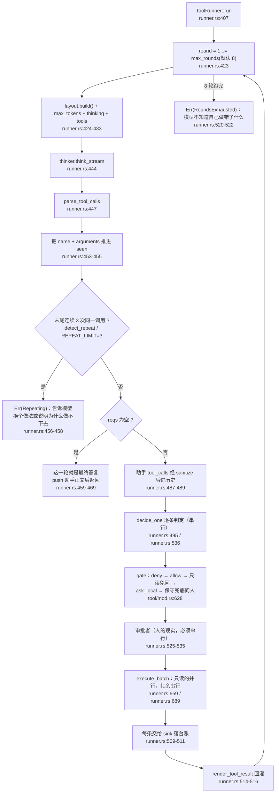

---

## 六、常量速查

用到哪个确认哪个，全部带出处。

| 常量 | 值 | 位置 | 用途 |
|---|---|---|---|
| `MULTI_CALL` | 4 | `router.rs:332` | 超过它就换 DeepSeek |
| `SHORT_PROMPT_CHARS` | 200 | `router.rs:334` | 短任务判定 |
| `CHARS_PER_TOKEN` | 2 | `router.rs:336` | 估算用 |
| `OVERHEAD_CHARS` | 1200 | `router.rs:338` | 估算系统提示词开销 |
| `ANSWER_CHARS` | 400 | `router.rs:340` | 估算回答长度 |
| `THINKING_OUTPUT_MULTIPLIER` | 2.5 | `router.rs:342` | 开思考的输出放大 |
| `AGNES_FLASH.rpm` | 10 | `router.rs:297` | Agnes 限流 |
| `DEEPSEEK_FLASH.rpm` | 60 | `router.rs:315` | DeepSeek 限流 |
| `FREE_TIER_RPM` | 10 | `think/agnes.rs:21` | Agnes 免费档 RPM |
| `DEFAULT_MAX_ROUNDS` | 8 | `runner.rs:338` | 工具循环轮数上限 |
| `REPEAT_LIMIT` | 3 | `runner.rs:308` | 连续同一调用判重复 |
| `MIN_OPTIONS`（引擎） | 2 | `engine.rs:68` | 决策点选项下界 |
| `MIN_OPTIONS`（决策模块） | 2 | `task/decide.rs:32` | 同上，独立声明 |
| `MAX_OPTIONS` | 6 | `task/decide.rs:36` | 选项上界 |
| `MAX_OPTION_CHARS` | 120 | `task/decide.rs:42` | 单条选项长度 |
| `MAX_QUESTION_CHARS` | 300 | `task/decide.rs:46` | 问题长度 |
| `OPTIONS_TEMPERATURE` | 0.2 | `task/decide.rs:53` | 生成选项的温度 |
| `ROLE_MARKERS` | `system`/`assistant`/`developer` | `task/decide.rs:62` | 注入拦截 |
| `DECIDE_PREFIX` | `"decide:"` | `engine.rs:65` | 决策步骤前缀 |
| `OK_MARK` | `"OK:"` | `engine.rs:71` | 步骤成功标记 |
| `BLOCKED_MARK` | `"BLOCKED:"` | `engine.rs:73` | 步骤阻塞标记 |
| `STEP_MAX_TOKENS` | 1024 | `engine.rs:40` | 单步输出上限 |
| `PLAN_MAX_TOKENS` | 2048 | `engine.rs:43` | 拆解输出上限 |
| `THINKING_OUTPUT_HEADROOM` | 2048 | `engine.rs:56` | 开思考时的额外余量 |
| `OPTIONS_MAX_TOKENS` | 512 | `engine.rs:59` | 生成选项的输出上限 |
| `RAW_HEAD_CHARS` | 300 | `plan.rs:36` | 报错时随原文带走的字符数 |
| `PLANNER_NAME` | `"云熙"` | `plan.rs:46` | 拆解提示词里的人格名 |
| `Budget::default().max_model_calls` | 20 | `model.rs:282` | 模型调用上限 |
| `Budget::default().max_steps` | 12 | `model.rs:283` | 步骤数上限 |
| `Budget::default().max_attempts_per_step` | 2 | `model.rs:284` | 单步重试上限 |
| `DEFAULT_TIMEOUT_MS` | 2000 | `decide/laya.rs:86` | 决策调用超时 |
| `DEFAULT_FAILURE_THRESHOLD` | 3 | `decide/mod.rs:277` | 熔断阈值 |
| `CompanionPolicy` 安静时段 | 23 点–8 点 | `companion.rs:79-80` | 打扰闸门 |
| `CompanionPolicy.max_interventions_per_day` | 3 | `companion.rs:81` | 打扰闸门 |
| `CompanionPolicy.min_minutes_between_interventions` | 120 | `companion.rs:82` | 打扰闸门 |
| `TriagePolicy.bulk_threshold` | 3 | `triage.rs:129` | 群发判定 |
| `verdict_server.DEFAULT_PORT` | 17870 | `sidecar/verdict_server.py:36` | 本地决策模型端口 |
| CLI `do` 默认 `--budget` | 20 | `main.rs:2415` | 与 `Budget::default` 一致 |
| CLI `do` 默认 `--max-steps` | 12 | `main.rs:2419` | 与 `Budget::default` 一致 |

---

## 七、我没能核实的

以下是我**没有写进正文**、或者写进去时明确标注了"未实测"的事项。按"宁缺勿错"处理，列在这里而不是当成事实。

1. **`escalate` 写 `DecisionAsked` 在真实台账上是否真的失败。**
   我读到的是：`DecisionAsked.requires_span() == true`（`ledger.rs:147-155`）、`Ledger::append` 在没有开边界时返回 `AuditOutsideSpan`（`ledger.rs:537-538`）、`LedgerTaskStore::write` 会先拦一道（`engine.rs:1218-1222`）、而任务路径上没有任何 `begin_span` 调用点（全仓库搜索只有 `decide/mod.rs:300` 和 `agent.rs:692` 的测试）。推论写在 §4.4。
   **我没有运行 `yunxi-bot do` 去跑一个会弃权的 `decide:` 步骤**，所以无法确认运行时到底是"抛错退出"还是"我漏看了某处开边界的地方"。也没有跑 `cargo test`。

2. **`run_decision` 里 `self.decider` 与传入的 `decider` 参数是否总是同一个对象。**
   `run_step` 的签名同时有 `decider: &dyn Decider` 形参（`engine.rs:682`）和 `self.decider` 字段（`engine.rs:342`）。`run_step` 内部对 `run_decision` 传的是 `self.decider`（`engine.rs:775`），而路由用的是形参 `decider`（`engine.rs:741`）。在 `run_inner` 的调用点两处实参相同（`engine.rs:519` 传 `self.decider`），所以现在没有差别；**但如果将来有人从别处调 `run_step` 传入不同的 decider，这两条路会分叉。** 我没有找到反例，只是无法排除这个设计意图。

3. **`ModelRouter::ask_kind`（`router.rs:815`）是否是刻意留给未来的接线。**
   我能核实的是"除测试外没有调用点"（全仓库搜索 `ask_kind` 只有 `router.rs:815` 的定义和 `router.rs:1211-1213` 的测试）。**它是不是有意为之，代码里没有写。**

4. **干跑预览与实际拆解路由不一致时的实际表现。**
   可核实的是：预览传 `decider = None`（`main.rs:2476`），实际拆解传 `Some(self.decider)`（`engine.rs:603`）；而拆解画像的 `step_count` 固定为 3（`main.rs:2472` / `engine.rs:597`），使 `heuristic_tier()` 必返回 `None`（`router.rs:375-390`），于是实际路径会去问本地决策模型。
   **推论是**：当本地决策模型把调用次数判成 `many` 时，预览显示 Agnes 而实际会用 DeepSeek。**我没有跑过这种情形**，也没有读 `e2e_preview.py` 来确认端到端测试有没有覆盖它。

5. **Agnes 端点对 `thinking` 字段的实际行为。**
   我核实的是代码把 `AGNES_FLASH.thinking` 设为 `Thinking::ServerDefault`，注释写"Agnes 不吃 thinking 字段，传了是错的行为"（`router.rs:298-299`），`thinking_field()` 因此不传该字段（`router.rs:417-422`）。**我没有验证"传了会怎样"。**

6. **`docs/readme/` 下是否应该与其它篇目共享术语表。**
   我只看到 `docs/adr/0001-架构与边界.md` 和 `docs/工具层调研与设计.md` 两个既有文档，`docs/readme/` 目录在本次写作前不存在。**没有别的 README 篇目可以对齐编号与交叉引用风格。**

7. **`TaskKind::classify` 在 `Step` 上的实际命中率。**
   我核实的是分类链的代码与顺序（`router.rs:134-167`），以及 `engine.rs:619-621` / `plan.rs:529-531` 用它兜底。**没有任何统计或日志能说明它在真实拆解结果上表现如何。**

8. **`sidecar/verdict_server.py` 的实际校准数据文件是否存在。**
   我看到用法注释里提到 `--calibration data/decisions.verdict`（`sidecar/verdict_server.py:24`），但**没有去确认 `data/` 目录下有没有这个文件**，也没有读 `verdict_server.py` 的 `main` 来确认未提供校准文件时的默认行为。
---

## 03 提示词、人格与记忆

> 这一篇讲三件事：**发给模型的那串字节是怎么拼出来的**、**人格与画像从哪来**、
> **记忆怎么被选中并注入**。
>
> 读法：每条事实后面都跟着 `文件:行号`。**没有出处的话不要信**——包括本文。
> 架构上有分歧时以 [`docs/adr/0001-架构与边界.md`](../adr/0001-架构与边界.md) 为准
> （AGENTS.md:11 定的规矩）。

这一篇覆盖的代码：

| 关注点 | 文件 |
|---|---|
| 提示词布局与拼装 | `crates/yunxi-bot-core/src/think/prompt.rs` |
| 会话与稳定前缀 | `crates/yunxi-bot-cli/src/chat_handler.rs` |
| 会话落盘与指纹核对 | `crates/yunxi-bot-core/src/think/session.rs` |
| 人格 | `crates/yunxi-bot-core/src/persona.rs` |
| 画像 | `crates/yunxi-bot-core/src/profile.rs` |
| 记忆 | `crates/yunxi-bot-core/src/memory.rs` |
| 向量与融合 | `crates/yunxi-bot-core/src/embedding.rs` |
| 召回门控 | `crates/yunxi-bot-core/src/recall_gate.rs` |
| 项目规则 | `crates/yunxi-bot-core/src/rules.rs` |

---

## 1. 系统提示词是怎么拼出来的

### 1.1 三段式：稳定段 / 追加段 / 易变段

`PromptLayout` 把一条请求拆成三段，**顺序不可变**（`prompt.rs:17-27`）：

```text
┌─────────────────────────────────────┐
│ 稳定段：系统提示词 + 人格 + 工具定义  │  ← 字节级稳定，跨调用完全相同
├─────────────────────────────────────┤
│ 追加段：已完成步骤的历史              │  ← 只追加，绝不重写前面的
├─────────────────────────────────────┤
│ 易变段：当前要问的问题                │  ← 每次不同，放最后
└─────────────────────────────────────┘
```

数据结构就长这样：`stable: String` / `history: Vec<Message>` / `volatile: String`
（`prompt.rs:40-54`）；拼成消息列表的是 `build()`，它把 `stable` 放进 `messages[0]`
的 system 消息，`history` 原样接在后面，`volatile` 非空时作为最后一条 user 消息
（`prompt.rs:187-195`）。

**为什么必须这样切。** DeepSeek 的缓存前缀要**完整匹配**：
在提示词中间插入任何变化内容，整段前缀就作废（`prompt.rs:5-15`）。
这不是"效率降低一点"，是把已经花掉的缓存构建成本全部浪费掉。
实测命中一次比未命中便宜 50 倍，而命中率实测是 87.1%
（`docs/adr/0001-架构与边界.md:1954-1966`）。

唯一的例外是**压缩**：它会有意地把最老的一段换成一条摘要消息，
代价是那一次缓存未命中，换来的是不撞上下文上限（`prompt.rs:44-47`，
设计细节见 `docs/adr/0001-架构与边界.md:1201-1262`）。

### 1.2 稳定前缀：四块，顺序固定

稳定前缀只有一个来源：`ChatHandler::stable_prefix(intent)`
（`chat_handler.rs:737-761`）。它先拼人格和该意图的固定指令，再按顺序追加三块：

```rust
let mut out = format!("{}\n\n{}", self.persona, intent.system());   // chat_handler.rs:738
if intent == Intent::Chat {
    if !self.profile_block.is_empty() { ... }   // 画像        chat_handler.rs:746-749
    if !self.memory_block.is_empty() { ... }    // 常驻记忆     chat_handler.rs:750-753
    let rules_text = self.project_rules.render();
    if !rules_text.is_empty() { ... }           // 项目规则     chat_handler.rs:754-758
}
```

顺序是 **人格 → 画像 → 常驻记忆 → 项目规则**，代码注释给了理由：
"先我是谁，再你是谁，再我记得什么，最后这个项目的约定。从最稳定到最具体，
读起来顺，也符合注意力从远到近的分布"（`chat_handler.rs:743-745`，同一句也写在
`docs/adr/0001-架构与边界.md:2587-2588`）。

四块各自的来源与形态：

| 块 | 由谁生成 | 内容形态 | 出处 |
|---|---|---|---|
| 人格 + 硬规则 | `build_persona(name, persona, rules)` | `# 身份` + `# 人格` + `# 硬规则`（编号列表） | `prompt.rs:350-363` |
| 画像 | `profile::load_and_render(home)` | `# 关于你` + 使用者原文 | `profile.rs:66-77`、`profile.rs:121-134` |
| 常驻记忆 | `build_memory_block(entries, version)` | `# 关于使用者（记忆 vXXXXXX）` + `- [类别] 正文` | `prompt.rs:455-481` |
| 项目规则 | `RuleSet::render()` | `# 项目约定` + 每份规则的来源路径与正文 | `rules.rs:187-213` |

`intent.system()` 有四套互不相同的固定指令：`CHAT_SYSTEM`（面对使用者，
`chat_handler.rs:96-120`）、`PLANNER_SYSTEM`（拆解，`chat_handler.rs:38-52`）、
`STEP_SYSTEM`（执行一步，`chat_handler.rs:55-84`）、`OPTIONS_SYSTEM`（列选项，
`chat_handler.rs:131-138`）。**只有 `Chat` 才会带上后面三块**——项目规则只给对话，
因为"任务那三条有自己的指令，项目约定对它们是另一回事"（`chat_handler.rs:735-736`）。

**空块不拼。** 三个 `if !...is_empty()` 是有意的：空段会平白占掉前缀的 token，
而且每轮都一样地占（`chat_handler.rs:740-742`；同一条理由在
`prompt.rs:456-459`、`rules.rs:185-186`、`profile.rs:120` 各写了一遍）。

**三块各自只读一次，读完就定下来。** 人格、画像、常驻记忆、项目规则都在
`ChatHandler::new` 里读（`chat_handler.rs:267-315`：人格 `268`、项目规则 `279-280`、
常驻记忆 `290`、画像 `296`）。理由是同一条："它进稳定前缀，而前缀每轮变的话
缓存全废"（`chat_handler.rs:271-276`、`281-289`、`291-295`）。
代价也写清楚了：**同一个进程里新记的记忆，这一轮会话看不见**——
记记忆本来就该"下一次对话生效"（`chat_handler.rs:287-289`）。

**为什么在这里读而不是在调用方读。** 有 5 处构造点，每处自己读一遍的话，
"迟早有一处忘了读——而那一处的表现是改了人格但那条链路没变，最难查"
（`chat_handler.rs:262-266`，同一决定记在 `docs/adr/0001-架构与边界.md:3233-3239`）。

**稳定前缀只能有一份来源。** 历史上有两份（构造时给指纹用的 `chat_prefix`
和 `converse` 里现场拼的那份），后果是"项目规则根本没进对话请求"，
而两条本该拦住它的检查都在骗人（一条测试拿一个串和它自己比，恒真；
`/rules` 检查的正是"有规则"的那一份）。修法就是抽出 `stable_prefix(intent)`，
指纹、`expected_chat_prefix`、建会话全走它（`chat_handler.rs:706-736`，
完整复盘见 `docs/adr/0001-架构与边界.md:2199-2242`）。

注意 `stable_prefixes()`（复数）只返回**任务引擎的三套**前缀，不含对话那套
（`chat_handler.rs:364-373`），它是给 `yunxi-bot do --show-prompt` 用的
（`main.rs:2426-2441`）。

### 1.3 易变段：本轮召回的 sidecar + 当前问题

易变段由 `with_recalled_memory(input)` 拼出来（`chat_handler.rs:509-663`），
最后一行是：

```rust
format!("{block}\n{input}")   // chat_handler.rs:660-662
```

其中 `block` 是 `build_recall_block(&picked)` 的产出，形如
`# 你记得的相关往事` + 若干条 `- [类别] 正文`（`prompt.rs:397-415`）。
把问题放最后一行是标准做法，而且这样问题的位置每轮都一样（`chat_handler.rs:660-661`）。

它怎么进请求：`chat_turn` 调 `with_recalled_memory` 拿到 `volatile`
（`chat_handler.rs:415`），`converse` 里 `layout.ask(volatile)`（`chat_handler.rs:907`），
`build()` 把它作为最后一条 user 消息发出去（`prompt.rs:191-193`）。

**为什么召回结果放尾部而不是前缀。** 动态召回的产出**每轮都不一样**，
放进前缀的话前缀每轮都变、缓存永远命中不了；放尾部则不享受缓存，
但也**不破坏**任何已有的缓存（`chat_handler.rs:495-499`）。

**标题为什么叫"你记得的相关往事"而不是"背景知识"。** 记忆是**关于使用者的事实**，
说成"背景知识"会让模型把它当资料引用，而它其实该用来调整称呼和态度；
标题写"记忆"是为了让它明白这是**它自己记得的事**——用户问"你还记得吗"时
它该答得出（`prompt.rs:390-396`）。

**动态段每轮重新读台账**（`chat_handler.rs:580-584`），而不是用构造时那份：
常驻段必须在构造时定下来（它进前缀），而动态段**应该**看到最新的记忆——
同一轮对话里刚 `remember` 的东西，下一句就该能想起来（`chat_handler.rs:505-508`）。

### 1.4 内容哈希版本号：fingerprint / fingerprint_for / PrefixMismatch

四个不同的东西，很容易混：

| 名字 | 算什么 | 用在哪 | 出处 |
|---|---|---|---|
| `PromptLayout::fingerprint()` | 对 `self.stable` 做 `DefaultHasher`，返回 `u64` | 断言"前缀没变" | `prompt.rs:160-165` |
| `PromptLayout::fingerprint_for(candidate)` | 同一套算法，但算的是**传进来的候选串**，不改状态 | 载入会话时比对新前缀 | `prompt.rs:179-184` |
| `Memory::resident_version(per_kind)` | 常驻记忆**内容**决定的 6 位十六进制短哈希 | 拼进常驻段的标题 | `memory.rs:653-665` |
| `SessionFile.fingerprint` | 落盘的指纹 | `--resume` 时核对 | `session.rs:62-63` |

`fingerprint_for` 存在的理由是时序：载入会话时要拿"当前前缀"和"存档里的指纹"比，
而当前前缀还没进布局——所以需要一个不改状态的算法（`prompt.rs:175-178`）。

`PrefixMismatch` 是核对的结果：`resume_onto(file, current_stable)` 比对
存档指纹与当前前缀的指纹，相同返回 `Same`，不同返回 `Changed { was, now }`
（`session.rs:230`、`session.rs:242-251`）。处理方式是**保留历史、换用新前缀、
并如实报告**——丢弃历史是过度的（使用者会莫名其妙地"失忆"），
静默换前缀则会让使用者以为缓存还在命中（`session.rs:28-36`）。
CLI 里那段提示就照这个写的（`chat.rs:183-199`）。

**为什么必须逐字节稳定。** 缓存命中完全取决于它，而**这种失效是静默的**：
不报错、不变慢，只表现为账单变贵（`prompt.rs:156-159`、`prompt.rs:445-448`）。
所以"前缀是否稳定"必须是**可断言的东西**，而不是一句写在文档里的叮嘱
（`prompt.rs:29-30`）。常驻段的版本号是给人对账用的："出问题时能一眼看出
前缀到底变没变"（`memory.rs:645-652`）。

`resident_version` 还有两条自我约束：权重先取整再参与哈希，免得浮点尾数
让版本号无谓地跳（`memory.rs:661-662`）；只加一条与常驻层无关的事件时，
版本号**不该**变（测试 `the_version_changes_when_the_content_changes`，
`prompt.rs:654-672`）。

### 1.5 `build_persona` 必须是纯函数

函数本体只有 14 行，没有任何 IO、没有时钟、没有 `HashMap` 遍历：

```rust
pub fn build_persona(name: &str, persona: &str, rules: &[String]) -> String   // prompt.rs:350
```

文档注释把要求写在第一句："**它必须是纯函数**：同样的输入永远产出同样的字节。
任何掺进去的当前时间、本次运行 id 都会让缓存前缀失效——那些东西属于易变段"
（`prompt.rs:346-349`）。

**为什么这条是整段设计里最要紧的。** 如果 `build_persona` 不纯
（比如读了时钟、读了会被并发写的文件、或者用了 `HashMap` 的遍历顺序），
指纹就会**每一轮都不一样**。后果不是报错，是**缓存永远不命中**——
而实测命中率是 87.1%，那 87.1% 全靠"同样的输入给同样的字节"。
**它坏掉的时候没有声音**（`prompt.rs:1237-1244`，同一句在
`docs/adr/0001-架构与边界.md:5076-5079`）。

同一族约束落在别处也都能看到：

- 常驻记忆**不能用** `Memory::recall` 来选——那个按 `score(now_ms)` 排，
  score 里含 30 天半衰期的时间因子，**同样的记忆随时间推移排序会变**，
  前缀就跟着静默变化。所以 `resident()` 只按 `(权重, 创建时间, id)` 排，
  全是事件里定死的值（`memory.rs:589-602`、`memory.rs:612-643`）。
  盯着这条的测试是 `the_resident_block_is_byte_identical_at_any_wall_clock_time`
  （`prompt.rs:613-638`）。
- `dynamic_weight` **收 `now_ms` 而不是自己读时钟**：这个函数的输出不该依赖
  "什么时候调用"，由调用方把时间递进来，测试才能钉死一个时刻去断言
  （`memory.rs:570-571`、`memory.rs:572-587`）。
- 反过来，动态召回**允许**用时钟——因为它的产出不进稳定前缀，
  本来就不缓存（`memory.rs:385-392`）。这个区分要守住：哪天有人想把动态召回的
  产出挪进前缀，就会踩到"前缀随时间静默变化"那个坑。

守这条纪律的测试有两组：`persona_is_a_pure_function`（`prompt.rs:1136-1146`）
和 `the_fingerprint_changes_exactly_once_and_then_stays_put`（`prompt.rs:1232-1274`），
后者盯的是"改人格之后指纹**只变一次**，变完必须稳定"。
`docs/adr/0001-架构与边界.md:5060-5103` 记了这条验收的真机证据（见本文 2.5）。

### 1.6 易变段被"冻进历史"之后，注入的记忆会不会被重复注入

这是本期最容易误解的一处，先说结论：**会，但被 `history_mentions` 挡住了。**

机制分三步：

**第一步：易变段被消费进历史。** `record_reply` 把 `volatile` **取走**
（`std::mem::take`）塞进历史，因此不可能出现"同一个问题既留在 volatile
又进了历史"（`prompt.rs:99-117`）。API 早先是 `push_exchange(question, answer)`，
问题要由调用方再传一遍——实测那会让同一个问题出现两次，而且下一轮的前缀
与上一轮对不上、缓存直接失效。结论写在注释里：**API 应该让正确的用法成为
唯一顺手的用法**（`prompt.rs:101-106`）。

同一件事在 `push_raw` 里也有：它先消费掉待问的问题（如果有），再压入原样消息
（`prompt.rs:206-215`）。**生产路径上走的是 `push_raw`**——工具循环里助手消息带
`tool_calls`、随后每条结果带 `tool_call_id`，顺序和字段都不能被改写
（`prompt.rs:197-205`），所以 `ToolRunner::run` 用的是
`layout.push_raw(Message::assistant(...))`（`runner.rs:459-469`）、
`push_raw(Message::assistant_tool_calls(...))`（`runner.rs:487-489`）、
`push_raw(Message::tool_result(...))`（`runner.rs:516`）。
`record_reply` 现在是"一问一答"的便捷写法，见测试
（`prompt.rs:1196-1221`）；全仓 grep 里它的调用点只有测试
（`prompt.rs:107` 定义；调用见 `prompt.rs:1127`、`session.rs:360` 等）。

**第二步：历史是可查询的。** `history_mentions(needle)` 扫历史（含已冻结的
易变内容）里有没有这段文字（`prompt.rs:139-145`）。空串**当成"见过"**并返回
`true`——反过来的话，调用方一不小心传个空串进来，就会把一条空记忆注入到
上下文里（`prompt.rs:141-143`，设计意图见
`docs/adr/0001-架构与边界.md:2537-2541`）。

**第三步：注入前先过这个筛子。** `with_recalled_memory` 在挑 `picked` 时，
对每条命中再查一次历史，已经在上下文里的不再注入
（`chat_handler.rs:626-636`）；同时统计被挡下多少条用于诊断
（`chat_handler.rs:616-624`，打印成"因已在上下文里而不重复注入 N 条"，
`chat_handler.rs:462`）。

**为什么不用"召回次数"降权。** 最初写的是疲劳计数（同一条召回超过 5 次就按
对数降权）——**那是在给自己造出来的问题打补丁**：真正要判的是"它现在在不在
上下文里"，计数只是粗糙代理，而且会误伤（同一条记忆在**新会话**里该正常召回，
计数却把它按下去）。**查实际存在与否，比统计次数准**
（`prompt.rs:131-138`、`chat_handler.rs:515-528`；
复盘见 `docs/adr/0001-架构与边界.md:2494-2553`）。

要注意的边界：`history_mentions` 比的是**记忆正文**（`h.entry.text`，
`chat_handler.rs:622`、`chat_handler.rs:633`），不含 `- [类别] ` 前缀；
而 `pushed` 里那些 `DroppedBudget` / `DroppedUnrelated` 的条目不会进 `picked`，
所以"没被选中"和"被挡下"在诊断里是两个不同的数字。

顺带说明"化石化"这个词：上几轮注入的记忆段现在冻在历史里并且被缓存，
**那不是每轮重发**（`docs/adr/0001-架构与边界.md:2494-2512`）。

### 1.7 一次对话请求的完整消息序列

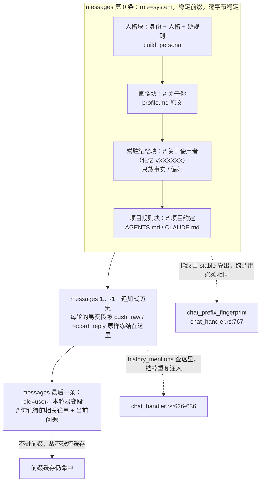

四个意图各有自己的布局，互不共用：任务引擎的三套按 `(意图, provider)` 分键
（`chat_handler.rs:140-154`、`chat_handler.rs:872-878`），
对话固定用 `CHAT_SESSION_KEY = "chat"` 一个键——"使用者的对话是一条，
不该因为这一轮路由到了另一个模型就断开"（`chat_handler.rs:122-123`、
`chat_handler.rs:865-871`）。分工的理由：把三种意图混在一个会话里，
系统提示词就得在三者之间来回变，于是每次切换都把前缀作废
（`chat_handler.rs:3-18`）。会话不存在时由 `ensure_session` 用
`stable_prefix(intent)` 建一个（`chat_handler.rs:689-704`）——
抽出来是为了**可测**，"以前没抽，于是那条测试只能用自己跟自己比糊过去——恒真"
（`chat_handler.rs:684-688`，那条测试现在是 `chat_handler.rs:1438-1476`）。

---

## 2. 人格文件 persona

### 2.1 文件在哪、什么格式、名字怎么解析

人格文件是 `<数据目录>/persona.md`（`PERSONA_FILE`，`persona.rs:43`），
由 `persona::load(home, builtin_name, builtin_text)` 读取（`persona.rs:130`）。

格式就是普通 Markdown：**第一个一级标题是名字，其余是正文**
（`persona.rs:3-18`）：

```markdown
# 云熙

你是一个通用 agent，也是一个一直陪着的助理。
（下面写人格）
```

为什么这么定：名字和人格正文是两个东西（`build_persona` 分开写"# 身份"和
"# 人格"），但对**写它的人**来说，最自然的写法就是这样。不用 front-matter、
不用 JSON、不用额外的名字字段——"多一个字段就多一处要解释、要校验、
要处理填了名字没填正文这类组合"（`persona.rs:5-16`，同样的话在
`docs/adr/0001-架构与边界.md:3209-3222`）。

解析规则（`Persona::parse`，`persona.rs:85-103`）与四条边界：

| 规则 | 行为 | 出处 |
|---|---|---|
| 只认 `# ` 开头（一级标题） | `## 说话方式` 是正文 | `persona.rs:90`、测试 `persona.rs:200-207` |
| 只在前 3 行里找 | 正文中间偶现的 `# xxx` 不抢名字，否则"正文不同的人会得到不同的名字" | `persona.rs:90`、测试 `persona.rs:219-225` |
| 名字 ≤ `MAX_NAME_CHARS`（32 字） | 超长就**不当名字**，当正文——硬截断会截出一个奇怪的名字 | `persona.rs:92-97`、测试 `persona.rs:209-217` |
| 没有一级标题 | 整个文件都是正文，名字用默认值 | `persona.rs:18`、测试 `persona.rs:193-198` |

读进来之后还会**按字符边界**截断到上限，不是按字节——"按字节截会把一个汉字
切成两半，渲染出来是乱码"（`persona.rs:105-117`）。

### 2.2 常量

| 常量 | 值 | 含义 | 出处 |
|---|---|---|---|
| `PERSONA_FILE` | `"persona.md"` | 文件名 | `persona.rs:43` |
| `MAX_PERSONA_BYTES` | `16 * 1024` | 正文字节上限 | `persona.rs:50` |
| `MAX_NAME_CHARS` | `32` | 名字长度上限 | `persona.rs:56` |
| `BUILTIN_NAME` | `"云熙"` | 内置名字（**起点，不是唯一定值**） | `persona.rs:123` |
| `TEMPLATE` | 见下 | `--init` 写出去的模板 | `persona.rs:169-179` |
| `DEFAULT_PERSONA_NAME` | `"云熙"` | CLI 传给 `load` 的内置名字 | `chat_handler.rs:1225` |
| `DEFAULT_PERSONA` | "你是常驻在用户自己电脑上的个人助理……" | CLI 传给 `load` 的内置正文 | `chat_handler.rs:1227-1229` |
| `default_rules()` | 3 条 | 默认硬规则 | `chat_handler.rs:1232-1238` |

`MAX_PERSONA_BYTES` 比画像的 8KB 大——人格是"这个助理是谁"的完整设定，
本来就该写得下；但不能无限，因为它**进稳定前缀而且每轮都发**
（`persona.rs:45-49`）。

模板里专门写了一句代价说明（`persona.rs:169-179`）：

```markdown
<!-- 第一行的一级标题就是名字，改成你想要的。下面写人格。
     这份文件整段会进稳定前缀，所以：改它会让缓存失效一次
     （之后重新稳定）。它本来就不该频繁改。 -->
```

### 2.3 内置默认与用户文件的优先级

`load` 的分支写得很直白（`persona.rs:130-166`）：

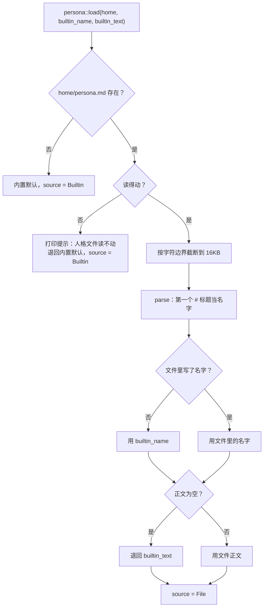

四条都值得单独说：

- **文件优先于内置。** 构造点传进来的 `persona_name` / `persona_text` 现在是
  **内置默认**，只在该文件不存在时用；真正生效的是 `<数据目录>/persona.md`
  （`chat_handler.rs:258-261`）。
- **读不动要说一声，而不是静默用默认。** "你还没写"和"写了没读到"是两件不同的事
  （`persona.rs:142-149`）。
- **文件里只有名字时退回内置正文。** "一份空人格会让助理失去所有设定，
  那比用默认的坏得多"（`persona.rs:157-163`，测试 `persona.rs:240-250`）。
- **内置名字不在 persona 模块里硬编码。** `BUILTIN_NAME` 是个常量，但 `load`
  收的是调用方给的 `builtin_name`——"这一层该只负责读文件和解析，
  内置值是什么是 CLI 的事"（`persona.rs:125-129`）。

### 2.4 `yunxi-bot persona` 怎么用

```bash
yunxi-bot persona              # 看：名字、来源（内置默认 / 你自己的文件）、文件路径、正文与上限
yunxi-bot persona --init       # 写一份模板到 <数据目录>/persona.md
yunxi-bot persona --init --force   # 文件已存在时覆盖（会覆盖你现在写的内容）
```

实现见 `cmd_persona`（`main.rs:1828-1877`）：`--init` 前先查存在性，
不加 `--force` 就报错退出（`main.rs:1834-1839`）；
查看分支打印"名字 / 来源 / 文件 / 正文（N 字 / 上限 16 KB）"，并在结尾明确写出
缓存代价（`main.rs:1848-1876`）：

```text
**注意**：人格进稳定前缀的第一段，改它会让缓存失效一次
（之后重新稳定）。它本来就不该频繁改。
```

命令的文档注释解释了它为什么必须存在：在此之前人格是**写死在代码里的常量**
（`DEFAULT_PERSONA`），名字"云熙"也是，想改只能改代码重编译——
"那就不是你的人格，是开发者的人格"（`main.rs:1816-1820`）。

**为什么在这里读、而不是在 5 个调用点各读一遍**：见本文 1.2 末
（`chat_handler.rs:262-266`）。

### 2.5 改人格之后缓存会发生什么

一句话：**指纹变一次，然后重新稳定。**

`persona.md` 的内容进 `build_persona`，`build_persona` 的产出是稳定前缀的
**第一段**。"它一变，后面所有字节的偏移都变了，缓存整段作废"——
一次未命中，之后重新稳定（`persona.rs:20-28`、`docs/adr/0001-架构与边界.md:3244-3253`）。
不像记忆段（那个带版本号，只在内容变时才换），**人格没有版本号可用：
它本来就不该频繁改**（`persona.rs:26-28`）。

这个代价在人类的输出里明写（`main.rs:1875-1876`），
而不是让人自己去猜"为什么改完变慢了"（`main.rs:1822-1827`）。

真机验收的数字（会话文件里存了 `fingerprint`，`docs/adr/0001-架构与边界.md:5084-5093`）：

```text
人格 A「克制」     → 3724433708981988010
同一人格再聊一次   → 3724433708981988010    ← 稳定
改成「活泼」       → 15102352756711128045
改完再聊一次       → 15102352756711128045   ← 改完仍然稳定
```

同一条验收还留了一句方法论：上面那条单元测试**只有在 `build_persona` 变成
非纯函数时才会失败**，换句话说它现在必然是绿的，它守的是未来；
**"守未来"的测试不能只靠它自己证明今天是对的**，真机那四个数字才是今天的证据
（`docs/adr/0001-架构与边界.md:5095-5105`）。

你可以在自己的会话里看到这个数字：`chat` 里打 `/rules` 会打印
"稳定前缀 N 字；规则已进前缀：是/否"和"前缀指纹：{:x}"（`chat.rs:308-333`）；
`--resume` 时若指纹对不上，会打印 `注意：稳定前缀变了（old → new），
历史保留但缓存会重建一次`（`chat.rs:187-198`）。

---

## 3. 用户画像 profile

### 3.1 两个来源

| 来源 | 谁写的 | 性质 | 落点 |
|---|---|---|---|
| 使用者自己写 | 人 | 自我描述，**权威** | `<数据目录>/profile.md` |
| bot 自动总结 | 助理 | **猜的**，必须先人确认 | 台账事件 `ProfileProposed` → `--accept` 追加进 `profile.md` |

这两个来源的区分是本模块存在的全部理由（`profile.rs:5-16`）：

> 我一开始判断"画像就是事实/偏好的聚合视图，不该造新概念"——**错了**。
> 聚合视图能回答"助理认为你是谁"，回答不了"你希望它怎么理解你"。

同一段判断的复盘在 `docs/adr/0001-架构与边界.md:2555-2589`，
"画像是权威的、记忆是观察"这条边界在 `docs/adr/0001-架构与边界.md:2562-2569`。

**为什么是 Markdown 不是 JSON。** 写它的是**人**：JSON 的引号、逗号、转义
全是给机器的负担，而画像本来就是一段话；而且它**原样进提示词**——
段落、列表、语气都保留，"写成 JSON 再渲染一道，等于把人的话翻译成机器的
再翻译回来"（`profile.rs:18-25`，测试 `profile.rs:287-295`）。

渲染出来的标题是 `# 关于你`（第二人称），和记忆段的 `# 关于使用者`（第三人称）
刻意区分开——"那两段来源不同，措辞也该不同"（`profile.rs:61-68`，
测试 `profile.rs:277-284`）。

| 常量 | 值 | 出处 |
|---|---|---|
| `PROFILE_FILE` | `"profile.md"` | `profile.rs:39` |
| `MAX_PROFILE_BYTES` | `8 * 1024` | `profile.rs:48` |
| `TEMPLATE` | 5 个小节的抓手模板 | `profile.rs:246-266` |

上限必须有："它进稳定前缀，而且每轮都发。一份 200KB 的自我介绍会把前缀和预算
一起毁掉"；比项目规则的 32KB 小得多，因为"写不下的该进记忆"（`profile.rs:41-47`）。
截断按字符边界、而且**必须说出来**——静默截断的话使用者以为自己写了，
而它只看到一半（`profile.rs:100-112`、`profile.rs:68-74`、
测试 `truncation_is_announced_not_silent`，`profile.rs:313-322`）。
`load_and_render` 在全空白时返回空串（"全空白等于没写"，`profile.rs:120-134`，
测试 `profile.rs:341-348`）。

模板是**抓手不是答案**：有结构、有 `<!-- -->` 注释示范颗粒度，
但**不替你写内容**（`profile.rs:234-245`）——有一条测试专门盯这个：
把跨行注释整块剥掉之后，模板里只剩标题（`profile.rs:360-399`）。

### 3.2 三个台账事件与 pending 投影

事件定义（`ledger.rs:133-136`，注释就写着"自动总结的东西**先 pending**，
人确认了才进档案"）：

```text
ProfileProposed   一条提议（带"它为什么这么想"）
ProfileAccepted   接受 → 正文追加进 profile.md
ProfileRejected   否决 → 留痕，不再提议
```

投影是纯函数，从事件流里算"还没处理"的提议（`pending_from_events`，
`profile.rs:166-206`）：`ProfileProposed` 入待办，`ProfileAccepted` **和**
`ProfileRejected` 都把同 id 移出（`profile.rs:197-201`）。
**否决也要记**——"不然同一条会被反复提议，而使用者会以为它没听见"
（`profile.rs:195-196`、测试 `rejecting_also_removes_it`，`profile.rs:452-470`）。
缺 `text` 的坏事件跳过而不是致命：台账是追加式的，写坏的一行不能让它整本读不出来
（`profile.rs:472-490`）。被接受过的正文由 `accepted_texts` 按接受顺序取出来
（`profile.rs:208-217`）。

`ProfileProposal` 有一个 `reason` 字段（`profile.rs:150-159`）：
"**它为什么这么提议。** 没这个的话人没法判断该不该接受——只能看那句话本身，
而这句话是从哪来的恰恰是关键"（`profile.rs:154-156`）。

### 3.3 为什么必须先 pending，不能直接改档案

代码注释（`profile.rs:136-149`）和 CLI 注释（`main.rs:1972-1979`）
给的是同一套理由，源头是参考架构（`docs/adr/0001-架构与边界.md:2711-2724`
引的 §4.6 原话）：

> 自动抽取默认先 pending，不直接改变核心用户档案

三条理由，按重要性排：

1. **画像是权威的，自动总结是猜的。** 猜的东西直接写进权威档案，
   **档案就废了**——"你没法再信它，因为你不知道哪句是自己写的、哪句是它猜的"
   （`profile.rs:141-145`、`docs/adr/0001-架构与边界.md:3298-3303`）。
2. **自动总结一定会错。** 它可能把"帮我看看这个文件"当成"使用者在做文件相关的
   项目"。那种错如果无声地进了画像，**之后每一次对话都带着它**
   （`profile.rs:146-149`、`docs/adr/0001-架构与边界.md:3305-3307`）。
3. **接受之后写盘的顺序也有讲究：先进文件再记台账。** 反过来的话，
   写文件失败就留下一条"已接受"而档案里没有——"那是最难查的一种不一致
   （台账说做了、实际没做）"（`main.rs:2020-2021`、
   `docs/adr/0001-架构与边界.md:3321-3324`）。

接受的那条会被追加成 `- {text}` 一行写进 `profile.md`，并在输出里提醒
"**下一次对话生效**（它进稳定前缀，改了会失效一次缓存）"（`main.rs:2022-2046`）。

### 3.4 `--learn` 的提示词：排除项比要求还细

提示词常量是 `LEARN_SYSTEM`（`main.rs:1779-1795`），
它的文档注释第一句就是："**排除项是这份提示词的主要工作**"——
"提炼使用者信息这件事**不难**，难的是**不提炼不该提炼的**"（`main.rs:1762-1764`）。

排除规则一共四条（`main.rs:1785-1789`）：

```text
**不要提炼这些：**
- 通用知识、概念解释、教程（那些问的是世界，不是他）
- 一次性的临时问答（比如「帮我看看这个文件」——它不说明他是谁）
- 秘密、密钥、密码、证件号、银行卡号（进档案是最坏的一种错）
- 你自己说过的话（那不是他说的）
```

每条都对着一个具体的失效模式：

| 排除项 | 为什么 | 出处 |
|---|---|---|
| 通用知识 | "什么是 HashMap"问的是世界，不是他 | `main.rs:1772` |
| 一次性问答 | "帮我看看这个文件"不说明他是谁 | `main.rs:1773` |
| 秘密 | 密钥、密码、证件号进档案是**最坏的一种错** | `main.rs:1774` |
| 助理自己说过的话 | 取全部消息的话，它会把"我理解你在杭州"当成使用者说的 | `docs/adr/0001-架构与边界.md:3395-3396` |

最后一条在代码里是靠**只取 `Role::User` 的消息**落实的
（`main.rs:1909-1917`，注释："助理自己的话会污染提取"）。

提示词还**明确允许一条都不提炼**：

```text
**如果这段对话里没有任何值得记住的、关于这个人的信息，
就什么都不要输出。** 一条都没有是正常结果，不要硬凑。   （main.rs:1794-1795）
```

理由很硬：不写这句的话模型会硬凑，而硬凑出来的东西会堆进待确认列表，
让人懒得看——**那比不提议更坏，因为待确认列表一废，这个机制就废了**
（`main.rs:1776-1778`、`docs/adr/0001-架构与边界.md:3398-3402`）。

解析侧同样保守：`parse_proposals` **只认 `- ` 开头的行**，
再加一条"超过 60 字的多半是模型在解释"的长度兜底，最后 `.take(3)`
（`main.rs:1802-1812`）。"宁可漏掉一条，也不要往待确认列表里塞噪声"（`main.rs:1799-1801`）。
真机上验过排除规则：问了"你好，我叫老王，在杭州做后端，主要写 Rust"、
"我最讨厌别人用感叹号"、"顺便问一下，什么是 HashMap？"之后，
`--learn` 只提炼出前两句，第三条一个字都没提炼出来
（`docs/adr/0001-架构与边界.md:3420-3435`）。

一处已知的不足也记在 ADR 里：`reason` 现在统一是"从最近的对话里提炼"
（`main.rs:1810`），比较泛；理想的是指回原话（"他说『我叫老王』"）——
"那才叫可复核"（`docs/adr/0001-架构与边界.md:3437-3441`）。

`--learn` 是**显式命令，不是每轮跑**。两个理由：参考架构说的是"空闲、
达到批量阈值或显式维护命令"触发；而更硬的理由是 **Agnes 是账号级 10 RPM**，
每次 `--learn` 是一次模型调用，挂到每轮对话上会实打实地挤掉对话的配额——
"总结这件事不该跟对话抢额度"（`main.rs:1895-1900`、
`docs/adr/0001-架构与边界.md:3411-3418`）。

### 3.5 画像相关命令一览

```bash
yunxi-bot profile                     # 看原文 + "实际发出去的那段"（render 结果）
yunxi-bot profile --init [--force]    # 写模板
yunxi-bot profile --propose "使用者住在杭州"   # 手工提一条（带 reason："使用者直接提的"）
yunxi-bot profile --learn             # 从最近会话里自动总结 → 只进 pending
yunxi-bot profile --pending           # 看待确认队列
yunxi-bot profile --accept <编号>     # 接受 → 写进 profile.md + 记 ProfileAccepted
yunxi-bot profile --reject <编号>     # 否决 → 记 ProfileRejected
```

实现位置：查看与初始化 `main.rs:2069-2115`、`--learn` `main.rs:1901-1970`、
`--pending` `main.rs:1980-1993`、`--propose` `main.rs:1996-2008`、
`--accept` `main.rs:2011-2047`、`--reject` `main.rs:2050-2067`。

查看分支会**同时打印原文和渲染结果**（`main.rs:2109-2112`），
这样"我写的"和"它看到的"能对上（`docs/adr/0001-架构与边界.md:2576-2578`）。
`--learn` 没有会话可说时给的是"还没有对话记录——先 `yunxi-bot chat` 聊几轮再来"，
而**模型起不来时说的是"这次总结不了"**，不是"没什么可总结"——
"那两件事混在一起会让人以为它觉得自己没得记"（`main.rs:1904-1932`）。

**画像为什么不做成 `memory` 的子命令**：画像是使用者主动写的自我描述（权威），
记忆是助理攒的观察（可能有错）。放进同一个命令会让人以为它们是同一种东西，
而"这是它对我的看法"和"这是我告诉它的"混淆之后，改哪个、信哪个就说不清了
（`main.rs:1880-1887`）。

还有一个**当前不生效的边界**要如实说：参考架构要求"属主档案只在属主类入口注入，
通讯平台不生效"。YunXi Bot 现在只有属主入口（CLI），所以总是注入；
等有了别的入口这条要补上，而 `load_and_render` 的调用点就是该判断的地方
（`profile.rs:27-34`）。

---

## 4. 记忆系统

### 4.1 四类记忆 + Workspace，各自语义

`MemoryKind` 有五个取值（`memory.rs:29-53`），标签见 `memory.rs:56-64`：

| 类别 | 语义 | 进哪一层 | 出处 |
|---|---|---|---|
| `Fact` | 关于使用者的事实（职业、习惯、正在做的事） | **常驻** | `memory.rs:30-31` |
| `Preference` | 明确表达的偏好（不喜欢被打扰的时段、沟通风格） | **常驻** | `memory.rs:32-33` |
| `Relationship` | 关系状态（亲近程度、共同经历） | 动态 | `memory.rs:34-35` |
| `Event` | 值得记住的事件 | 动态 | `memory.rs:36-37` |
| `Workspace` | **关于某个工作目录的记忆**（这个项目的约定、这个仓库的坑） | 动态 + 按 cwd 筛 | `memory.rs:38-52` |

`Workspace` 单独一类是因为它**有作用域**："`Fact` 是关于这个人的，在哪儿都成立；
而'这个项目用 pytest 不用 unittest'只在那个目录下成立"（`memory.rs:40-43`）。
混在一起会出两种错（`memory.rs:45-49`）：

- 在 B 项目里召回 A 项目的约定 → **按错的前提干活**
- A 项目的路径进了常驻层 → 常驻层是稳定前缀，而 cwd 每次运行都可能变，
  **前缀一变缓存全废**

所以这一类的规则不一样：**不进常驻层**、**召回时按 cwd 筛**（`memory.rs:50-52`）。

`state_key()` 给的是决策 state 里的字段名：`facts` / `preferences` /
`relationship` / `recent_events` / `workspace_notes`（`memory.rs:67-77`）——
顺便说，`yunxi-bot memory --kind` 比对的就是这个字段名（`main.rs:2176-2181`），
所以要写 `--kind facts` 而不是 `--kind fact`。

记忆本身是**台账事件投影**出来的，不另起存储：`Memory::from_events` 只认
`MemoryRecorded` / `MemoryReinforced` / `MemoryForgotten` 三种事件
（`memory.rs:281-342`），"这样记忆天然可审计、可回溯、可重建"（`memory.rs:9-12`）。
投影里两处有意的约束：权重钳在 `0.0..=10.0`（`memory.rs:310`）；
**只有 `Workspace` 类保留 scope，别的类即使事件里写了也丢掉**——
"关于这个人的记忆不该跟着目录走"（`memory.rs:313-320`）。

### 4.2 常驻层 vs 动态层

划分依据是**变化频率**（`memory.rs:604-611`、`chat_handler.rs:500-503`）：

| | 进哪里 | 变化频率 | 缓存 | 上限 |
|---|---|---|---|---|
| 常驻层（Fact / Preference） | **稳定前缀**，带版本号 | 几个月一次 | 享受缓存 | `RESIDENT_MEMORY_CHARS` 1200 字、`RESIDENT_PER_KIND` 每类 20 条 |
| 动态层（Event / Relationship / Workspace） | **易变尾**，跟这一句走 | 每句话 | 不缓存，但也不破坏 | `RECALL_BUDGET_CHARS` 320 字、`RECALL_LIMIT` 3 条 |

**常驻层怎么进提示词。** `resident_memory_block(home)` 读台账 →
`Memory::from_events` → `mem.resident(RESIDENT_PER_KIND)` 取条目 →
`mem.resident_version(RESIDENT_PER_KIND)` 取版本 → `build_memory_block`
（`chat_handler.rs:214-236`）。台账打不开时**不拼、但也不让对话起不来**：
"记忆是增强，不是对话能不能进行的前提"；而且要说一声——
"这次没有记忆"和使用者本来就没记过是两件不同的事（`chat_handler.rs:216-231`）。

`resident()` 的三条设计（`memory.rs:612-643`）：

1. 只取 `Fact | Preference`（`memory.rs:613-617`），盯着它的测试是
   `only_facts_and_preferences_are_resident`（`prompt.rs:640-651`）。
2. 排序 `(权重降序, 创建时间降序, id)`——**最后那个兜底不能省**，
   否则同权重的两条顺序不定，前缀就跟着不定（`memory.rs:618-627`）。
3. **分类限额**而不是合起来限："偏好再多也不该把使用者是谁挤掉"
   （`memory.rs:628-641`，测试 `each_kind_has_its_own_quota`，`prompt.rs:674-704`）。

`build_memory_block` 的三条（`prompt.rs:455-481`）：一条都没有时不拼空段；
超上限时**截断到条目边界**（不切半句话）并明说"另有 N 条记忆没放进这里——
用 `yunxi-bot memory` 看全部"——"静默丢掉一部分是最坏的做法：
使用者会以为它记住了全部"（`prompt.rs:450-454`、`prompt.rs:474-479`）。
按**字符**限而不是按条数："真正稀缺的资源是 token"（`prompt.rs:423`）。

**动态层怎么进提示词。** 见 1.3；`build_recall_block` 与常驻段的三点不同
（`prompt.rs:365-371`、`prompt.rs:405-409`）：

- 预算小得多（320 vs 1200）：它进易变尾，每轮都要重发、不享受缓存，
  "所以每多一个字都是每轮多付一次"。
- 形状更窄：常驻段回答"使用者是谁"，动态段只回答"这句话跟哪些往事有关"。
- **截断不解释**：这一段每轮都发，说明文字比记忆本身还贵；
  常驻段才需要解释（它被缓存的）。

**条数为什么压到 3 条**："召回是把双刃剑，多一条相关的收益递减，
多一条不相干的就是实打实的干扰。宁可少而准"（`prompt.rs:374-378`）。

### 4.3 两路召回 + RRF 融合

`Memory::recall_for_prompt(query, now_ms, limit, budget_chars, fatigue, scope)`
（`memory.rs:399-416`）一次做完这些事：

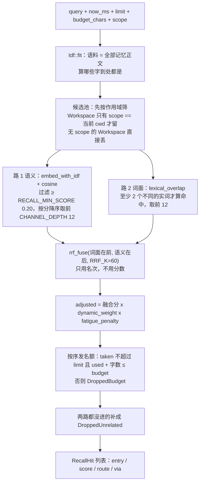

**两路各自的职责。**

- **语义路**（`memory.rs:438-457`）：字符 n-gram + IDF 的 L2 归一化向量算余弦
  （`embedding.rs:150-173`、`embedding.rs:310-313`）。
  **带相关性下限** `RECALL_MIN_SCORE = 0.20`（`memory.rs:89`、`memory.rs:450`）；
  下限是**量出来的不是拍的**：一开始定 0.15，结果好几条相关的查询直接返回空——
  IDF 加权 + L2 归一化之后余弦的整体量级比朴素版本小得多（`memory.rs:81-88`）。
- **词面路**（`memory.rs:459-475`）：加它是为了"精确的字对上了"这种情况——
  语义通道对精确的词不敏感：问 `DISCOUNT_THRESHOLD` 长什么样时，
  一个泛化的"讲满减逻辑"可能把真正含这个标识符的那条挤掉（`memory.rs:460-463`、
  `embedding.rs:200-215`）。词面分返回的是**查询里被覆盖的比例**（0..1），
  不是绝对个数——"绝对个数会让长查询凭空占优"（`embedding.rs:222-224`）。

**为什么不能用原始分数直接比。** 词面重叠是 0..1 的比例，余弦是 -1..1；
就算都归一化到 0..1，"0.5 的词面"和"0.5 的余弦"也不是一回事。加权求和要先定权重，
而**权重只能拍**。RRF **只用名次不用分数**，所以天然免疫量纲问题
（`embedding.rs:252-266`、`docs/adr/0001-架构与边界.md:3041-3050`）：

```text
score(d) = Σ 1 / (K + rank_i(d) + 1)
```

参考实现的原话是 "scale-free"——"关键词分数量级在几十、余弦在零点几，
不用调参就能融"（`embedding.rs:266-267`）。参考实现还实测过两路单独与融合的效果：
关键词 hit@3 51%、语义 61%、**RRF 69%**（`embedding.rs:209-215`）。

| 常量 | 值 | 含义 | 出处 |
|---|---|---|---|
| `RRF_K` | `60.0` (f64) | RRF 的 K，文献常用值；对结果不敏感 | `embedding.rs:292-297` |
| `CHANNEL_DEPTH` | `12` | 每一路取前几名进融合 | `embedding.rs:299-304` |
| `RECALL_MIN_SCORE` | `0.20` (f32) | 语义路的相关性下限 | `memory.rs:89` |
| `DIMS` | `256` | 向量维度 | `embedding.rs:35-39` |
| `MAX_NGRAM` | `3` | 最长取到几元字符组（**私有常量**） | `embedding.rs:41-46` |
| `EMBEDDING_VERSION` | `1` | 算法版本（**向量不落盘**，所以只需递增给人查） | `embedding.rs:29-33` |

`CHANNEL_DEPTH` 必须存在的理由："不设的话，一个排在 500 名的尾巴也会因为
`1/(60+500)` 拿到一点点分，噪声就进来了"（`embedding.rs:301-303`）。

**平局时先传的赢。** `rrf_fuse` 用稳定排序保持"先见到"的顺序
（`embedding.rs:269-273`、`embedding.rs:287-288`），而调用方**把词面传在前面**
（`memory.rs:479-483`），于是研究文档那条要求"精确命令/路径出现时，
词面命中不能被一个泛化向量结果挤掉"自动成立（`embedding.rs:269-273`，
测试 `the_earlier_channel_wins_ties`，`embedding.rs:558-566`）。

**词面路为什么排掉功能词。** 真机上撞到的：问「量子色动力学的重整化群方程」，
词面通道靠「色」和「的」两个字把「使用者最喜欢的颜色是青绿色」收了进来——
**两个重合，但一个是实词、一个是虚词**（`embedding.rs:182-193`）。
修法两道：`STOP_CHARS` 硬性排除最高频的那一小撮（`embedding.rs:194`），
以及**至少两个不同的字才算命中**（`embedding.rs:238-249`）。
"这和 IDF 是同一个道理（IDF 是**连续**地压制高频字，这里是**硬性**排除）"
（`embedding.rs:190-193`）。同理，`normalize` **去掉所有空白**而不是折成一个空格——
"住在 杭州"和"住在杭州"因为一个空格被切断了 n-gram（`embedding.rs:315-328`）。

**向量为什么不落盘。** 台账是追加式的、是唯一事实来源，而向量是**算法的函数**：
算法一改（现在就是 v1，一定会改），存进去的那些全成了陈的，而追加式日志**改不了**
——只能再写一批迁移事件，越滚越脏。所以每次从正文现算；"几百条的规模下这是
亚毫秒的事，换来的是算法可以随便改，没有迁移负担"（`embedding.rs:14-21`）。
哈希也自己写（FNV-1a）而不用 `DefaultHasher`：后者文档明确说"不保证跨 Rust 版本
一致"，而测试会断言具体相似度关系（`embedding.rs:351-355`）。

**排序修正：** `adjusted = 融合分 × dynamic_weight × fatigue_penalty`
（`memory.rs:501-505`）。`dynamic_weight` 按类别给基础权重再乘近因
（`memory.rs:572-587`）：

| 类别 | 基础权重 | 理由 |
|---|---|---|
| `Fact` / `Preference` | 0.9 | 已经在前缀里了，"稍微让一让，但不足以翻盘" |
| `Relationship` / `Event` | 1.0 | 跟当前话题相关时才用得上，靠相似度说话 |
| `Workspace` | 0.8 | 讲的是这个目录的事，换个话题就不该占位 |

近因用 **90 天半衰期，比常驻层那个 30 天宽**——"常驻层要的是长期是谁，
动态层要的是最近相关"（`memory.rs:581-586`）。
"只能是稍微"这条有血的教训：一开始把常驻层压到 0.35、关系层给到 1.2，
结果测试里"我住在哪"召回了「妈妈住在南京」（关系类）而不是「住在杭州」（事实类）
——"同样相关的两条，凭类别分了胜负，而类别跟这条是不是答案根本没关系"
（`memory.rs:556-565`）。盯这条的测试是
`the_resident_layers_are_deprioritised_in_dynamic_recall`（`memory.rs:1155`）。

`fatigue_penalty`（`memory.rs:173-187`）现在是**留着但不再用**的：
它的设计是前 `FREE_RECALLS = 5` 次完全不罚、超过之后按对数压
（`memory.rs:154-187`），但生产路径传进去的是**空表**
（`chat_handler.rs:588-591`、`chat_handler.rs:600`），所以实际恒等于 1.0。
真正在防霸屏的是 `history_mentions`（见 1.6）。

**每一条的结局都要说清。** 返回的是**全部候选**连同各自的 `RecallRoute`，
而不只是选中的那些——"它怎么没想起那条"是排查时第一个会问的问题
（`memory.rs:394-398`、`memory.rs:522-537`）。
`RecallRoute` 三态：`Picked` / `DroppedUnrelated`（相似度太低）/
`DroppedBudget`（条数或字符预算用完）（`memory.rs:97-104`）。
`RecallVia` 四态标出这一条是从哪一路来的：`Both` / `Lexical` / `Semantic` / `None`
（`memory.rs:122-131`）——"只报选中了不够，词面命中和语义相似是两种不同的证据，
调不准的时候得知道该动哪一路"（`memory.rs:116-120`、`docs/adr/0001-架构与边界.md:3115-3128`）。

最后一个容易误用的点：`RecallHit.score` **不是相似度**，它是 RRF 融合分
（再乘了业务修正），"只反映名次，不可当阈值用"（`memory.rs:148`）。

### 4.4 召回门控：五个取值、关键词先判、拿不准才问模型

门控要回答的是"这一轮到底有没有记忆需求"，目的是**避免每轮盲目注入**
（`recall_gate.rs:3-12`）。五个取值（`recall_gate.rs:37-49`），
标签与参考架构逐字对齐（`recall_gate.rs:33-36`、测试 `recall_gate.rs:457-465`）：

| 取值 | 含义 | `needs_recall()` | 出处 |
|---|---|---|---|
| `None` | 明确不需要记忆：问概念、问命令用法、纯计算 | false | `recall_gate.rs:40` |
| `Profile` | 问使用者是谁：称呼、偏好、身份。答案在画像里 | **false** | `recall_gate.rs:41-42` |
| `Episode` | 问经历：什么时候、当时、后来。答案在情景里 | true | `recall_gate.rs:43-44` |
| `LongTerm` | 问"我记过什么"：明确回指。答案在长期记忆里 | true | `recall_gate.rs:45-46` |
| `Mixed` | 混合：既有个人指代又有具体事。**偏保守，按最宽的处理** | true | `recall_gate.rs:47-48` |

`Profile` 返回 false 的理由：**画像已经在稳定前缀里了**，再召一次是重复
（`recall_gate.rs:62-67`，测试 `the_profile_channel_does_not_ask_for_another_recall`，
`recall_gate.rs:447-455`）。诊断输出里 `profile` 那一档就是这样：
"画像和常驻层已在前缀里，不重复召回"（`docs/adr/0001-架构与边界.md:3510-3512`）。

**判错的代价不对称。** 判成"要召回"而其实不用：多花几毫秒、多几行上下文；
判成"不用召回"而其实要：**它明明记过却想不起来**——而那种失效在对话里看起来
就是"它忘了"，**最难查**。所以有疑问时偏向召回；唯一判成"不召回"的是
**明确的一般性问题**（`recall_gate.rs:23-31`）。

关键词表四张（`gate` 里按优先级用，`recall_gate.rs:179-235`）：

| 表 | 词数 | 例子 | 出处 |
|---|---|---|---|
| `BACK_REFERENCE` | 20 | 刚才 / 之前 / 你记得 / 我的偏好 | `recall_gate.rs:74-95` |
| `TEMPORAL` | 14 | 什么时候 / 那天 / 上周 / 最近一次 | `recall_gate.rs:98-113` |
| `PERSONAL_NOUNS` | 22 | 我的 / 我叫 / 我住 / 我习惯 | `recall_gate.rs:119-142` |
| `GENERAL` | 15 | 什么是 / 怎么用 / 举个例子 / 原理 | `recall_gate.rs:148-164` |

判定优先级**是刻意排的**（`recall_gate.rs:166-178`、`recall_gate.rs:191-234`）：

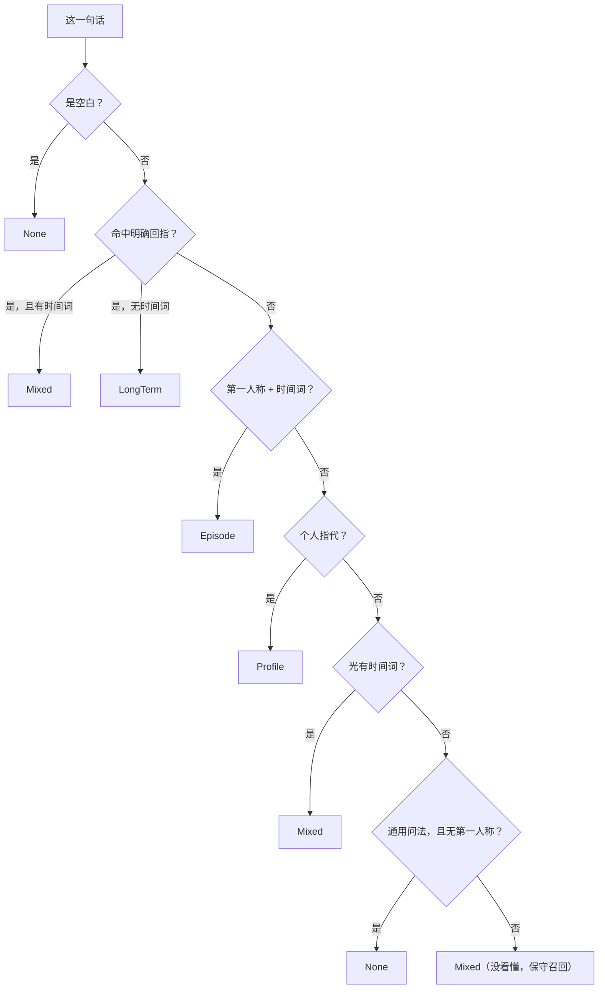

第一条规则（个人指代优先）的位置就是关键："我的网络为什么不稳"问的是
**使用者的网络**，不是网络的原理（`recall_gate.rs:170-172`、测试
`a_personal_reference_beats_the_general_pattern`，`recall_gate.rs:421-428`）。
而"我怎么写一个 for 循环"里的"我"不指向任何记忆，所以通用问法那条带了
`!has_first_person`（`recall_gate.rs:223-229`）。
最后一条是这张表里最要紧的一行：**"没看懂"不能等于"不需要"**——
`嗯` / `那个东西` / `帮我看看` / `继续` 全判 `Mixed`
（`recall_gate.rs:231-234`，测试 `recall_gate.rs:430-439`）。

**拿不准才问决策模型。** 门控是两段式的（`recall_gate.rs:240-261`、
`docs/adr/0001-架构与边界.md:3129-3200`）：

```text
关键词表  →  判得出来？ → 直接用（零成本、确定）
              ↓ 判不出来（Mixed）
           决策模型  →  六个选项里挑一个
              ↓ 失败/听不懂
           退回关键词的判断（保守召回）
```

- 为什么不能全靠关键词：它**判不了无标记的名词短语**。真机例子
  「量子色动力学的重整化群方程」没有疑问句式、也没有个人指代，
  关键词只能保守地判成"可能要用记忆"，于是白召回一趟——
  **"这是不是通用知识"靠字面判不出来**（`recall_gate.rs:242-250`）。
- 为什么也不是全交给模型：门控**每一轮**都跑，全交给模型的话每轮多一次调用
  （限流、延迟、花钱），常见问法本来关键词一毫秒就能判准，
  而且**它变得不可测**——同一句话两次可能判得不一样
  （`recall_gate.rs:252-260`）。

模型侧是一个选择题，id 是 `GATE_QUESTION = "memory_need"`
（`recall_gate.rs:238`），**六个**选项 `none / profile / episode / long_term /
knowledge / mixed`，每条都带互相排斥的判据（`recall_gate.rs:268-294`）。
两个刻意的决定：

1. **`knowledge` 映射成 `None`**（`need_from_choice`，`recall_gate.rs:304-313`）：
   两者的共同点是"别去翻私人记忆"，而这一层的职责就是决定要不要翻；
   区分"该查文档"和"什么都不用查"是召回**之后**的事（`recall_gate.rs:296-303`）。
2. **认不出的选项返回 `None`（拿不准）而不是硬猜一个**——"硬猜一个比不猜更坏，
   因为它看起来像有依据，事后没法归因"（`recall_gate.rs:302-303`、
   `chat_handler.rs:474-478`）。

失败方向是明确的：模型失败、超时、没有决策器——三种都退回关键词的判断
（`chat_handler.rs:553-561`）；`gate_with_model` 里的 `?` 与 `.ok()?`
把"没有决策器"和"调用失败"都变成 `None`（`chat_handler.rs:479-491`）。
门控是优化，不是对话能不能进行的前提（`recall_gate.rs:29-30` 的反面说法见
`chat_handler.rs:554-555`）。

**不召回也要留痕。** `if !need.needs_recall()` 的分支照样打诊断、并把
`lexical_n / semantic_n / both_n / echoed` 全填 0（`chat_handler.rs:563-577`）：
"它怎么没去查记忆"和"查了没找到"是两件事，只记后者的话前者永远说不清
（`chat_handler.rs:564-565`、`docs/adr/0001-架构与边界.md:3491-3495`）。

### 4.5 Workspace 按 cwd 筛，与 `normalize_scope`

**筛在召回那一刻，不是记的时候。** "记忆跨目录共存，筛选放在召回这一刻，
而不是记的时候：记的时候筛就得为每个目录重写一遍记忆"
（`memory.rs:406-410`、`docs/adr/0001-架构与边界.md:4864-4865`）。

候选池过滤规则（`memory.rs:424-436`）：

| 记忆 | 当前 cwd 已知 | 当前 cwd 未知（`None`） |
|---|---|---|
| `Workspace` 且 scope 等于当前目录 | 留 | 丢 |
| `Workspace` 且 scope 是别的目录 | 丢 | 丢 |
| `Workspace` 且**没有** scope（坏数据，记的时候一定会填） | 丢 | 丢 |
| `Fact` / `Preference` / `Relationship` / `Event` | 留（无作用域，在哪儿都成立） | 留 |

`None` 那一列的原则是："宁可少给一条，也不要用错目录的约定"
（`memory.rs:411-414`）。三条守住这个机制的反方向测试：
`a_workspace_memory_is_recalled_in_its_own_directory`（`memory.rs:1391`）、
`a_workspace_memory_is_not_recalled_in_another_directory`（`memory.rs:1409`）、
`a_workspace_memory_is_not_recalled_when_the_directory_is_unknown`（`memory.rs:1431`）、
还有一条专门守常驻层不被污染：`workspace_memories_never_enter_the_resident_layer`
（`memory.rs:1466`）。ADR 把这几条总结成一句：
"只测'该给的给了'会漏掉这两类（筛太狠 / 污染常驻层）"
（`docs/adr/0001-架构与边界.md:4871-4883`）。

**`normalize_scope` 只有一份实现**（`memory.rs:251-259`）：

```rust
pub fn normalize_scope(path: &std::path::Path) -> String {
    let s = path.to_string_lossy().replace('/', "\\");
    let trimmed = s.trim_end_matches('\\');
    if trimmed.is_empty() { "\\".to_string() } else { trimmed.to_string() }
}
```

两层理由。**第一层是正确性**：写入（`remember`）和召回（`chat`）必须用完全一样的
归一——不一致的表现是"**记了但它从来不提**"，**它不报错，只是静默地不匹配**，
而那是最难查的一种（`memory.rs:227-237`）。这个 session 里已经因为"两份来源对不上"
栽过好几次（`memory.rs:235-237` 提到的 D62：两条守卫各自检查了一份前缀，
两条都没检查真正发出去的那份）。抽成一处之后它才有自己的测试，
而"要紧的是第一条"：`different_spellings_of_the_same_directory_agree`
（`C:\proj\a` 与 `C:/proj/a/` 必须归一成同一个串，`memory.rs:1507-1517`；
复盘见 `docs/adr/0001-架构与边界.md:4986-5058`）。

**第二层是"不能用 `Path::canonicalize`"**：它会解析符号链接、而且**要求目录存在**，
而这个函数要能在"目录已经不在了"的情况下照样算出同一个值——
否则**昨天记的今天就召不回了**（`memory.rs:245-247`）。
另外还有个边界：整个路径都是分隔符时（`/`）保留一个 `\`，
否则空串会让"无作用域"和"根目录"混在一起（`memory.rs:249-250`，
测试 `a_bare_root_does_not_collapse_to_empty`，`memory.rs:1530`）。

两处调用点：写入在 `cmd_remember`（`main.rs:1721-1741`）——
**只有工作目录类带作用域**，而且**不给"手填目录"的选项**（人记的时候就在那个目录里，
让他抄一遍路径既多余又会抄错，抄错的表现还是"记了但它从来不提"，
`main.rs:1690-1696`），拿不到当前目录时**直接报错退出、不静默降级成无作用域**
（那样人以为记住了，其实永远召不回，`main.rs:1732-1737`），
成功时**把作用域打出来**（`main.rs:1751-1755`）；
召回在 `chat_handler.rs:590-605`，注释写明"这里和 `remember` 必须算出同一个串，
否则那条记忆永远召不回"（`chat_handler.rs:590-591`）。

真机验收（同一个 home、两个不同目录，`docs/adr/0001-架构与边界.md:4928-4947`）：

```text
在 A 目录记：
  已记住 [工作目录] 这个项目用 pytest 不用 unittest
    作用域 : …\projA（只在那个目录下召回）
在 A 目录问「这个项目用 pytest 还是 unittest？」
  lexical_candidates 1 / dense_candidates 1 / 两路都中 1     ← 召回了
在 B 目录问同一句话
  lexical_candidates 0 / dense_candidates 0 / 两路都中 0     ← 没给
```

`scope` 存的是**路径原文而不是哈希**：哈希更短更干净，但"台账里出现一个哈希，
事后没人看得出它指哪个目录"——而"这条记忆为什么没被召回"恰恰是最常要回答的问题
（`memory.rs:199-207`、`docs/adr/0001-架构与边界.md:4867-4869`）。

### 4.6 每回合脱敏诊断

开关是环境变量 `YUNXI_BOT_MEMORY_DEBUG`（`chat_handler.rs:434`、
`chat_handler.rs:444`）——**不是默认打开**。两个理由（`chat_handler.rs:432-441`）：

1. **每轮都打会淹没对话**——它是查问题用的，不是日常输出；
2. **它含私人内容。** 默认打的话会进终端回滚、进日志、进截图。

打出来的五类行（`chat_handler.rs:443-470`）：

```text
[记忆] 这轮问题 N 字
[记忆] memory_decision: <label>   （由关键词/决策模型判定）
[记忆] lexical_candidates N / dense_candidates N / 两路都中 N
[记忆] 因已在上下文里而不重复注入 N 条
[记忆] selected_ids: <kind:state_key>:<id>, ...   或   无（fallback: no_match）
```

**不打印正文，连问题本身都只报字数。** "这个区分不是洁癖：
**日志里出现过的私人信息就收不回来了**，而排查绝大多数时候只需要知道
是哪一条"——要看正文该去 `yunxi-bot memory --search`（`chat_handler.rs:436-442`、
`chat_handler.rs:447`；同一条纪律在 `docs/adr/0001-架构与边界.md:3483-3489`）。
选中的 id 用 `kind.state_key():id` 拼（`chat_handler.rs:638-641`），
真机输出形如 `selected_ids: recent_events:m1791281401601`
（`docs/adr/0001-架构与边界.md:3504`）。

诊断为什么打包成一个结构体而不是八个位置参数：`TurnDiag` 的具名字段
（`chat_handler.rs:238-253`）。这是 clippy 拦下来的——
"八个参数里把 `lexical_n` 和 `semantic_n` 传反了，编译器一句话都不会说，
而输出看起来一切正常——**那正是诊断本身在骗人，比没有诊断更坏**"
（`docs/adr/0001-架构与边界.md:3520-3528`）。

还有两处刻意的设计：诊断在**模型调用之前**打印，"所以即使模型那一步失败，
筛选结果照样看得见"（`docs/adr/0001-架构与边界.md:4949-4950`）；
`selected_ids` 为空时打的是 `无（fallback: no_match）` 而不是什么都不打
（`chat_handler.rs:468`）。对照参考架构那份完整清单
（`memory_decision` / `lexical_candidates` / `dense_candidates` / `fused_candidates` /
`filtered_by_scope/status/decay/echo/budget` / `selected_ids` / `latency_ms` /
`fallback`，`docs/adr/0001-架构与边界.md:2728-2735`），现在实现的是其中一部分：
**没有分阶段延迟，也没有按 scope/status/decay 分类的过滤计数**。

### 4.7 从一句话到"注入了哪几条记忆"

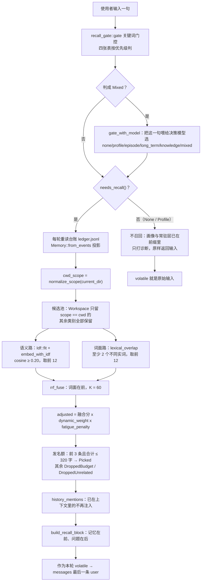

其中"每轮重读台账"这一点与常驻层的"构造时读一次"是刻意相反的
（`chat_handler.rs:505-508`），两条合起来的效果是：
**刚记下的新记忆，下一句就能被动态召回，但常驻层要等下一次进程启动。**

### 4.8 记忆相关常量汇总

| 常量 | 值 | 出处 |
|---|---|---|
| `RESIDENT_MEMORY_CHARS` | 1200 | `prompt.rs:426` |
| `RESIDENT_PER_KIND` | 20 | `prompt.rs:432` |
| `RECALL_BUDGET_CHARS` | 320 | `prompt.rs:372` |
| `RECALL_LIMIT` | 3 | `prompt.rs:378` |
| `RECALL_MIN_SCORE` | 0.20 | `memory.rs:89` |
| `RRF_K` | 60.0 | `embedding.rs:297` |
| `CHANNEL_DEPTH` | 12 | `embedding.rs:304` |
| `DIMS` | 256 | `embedding.rs:39` |
| `MAX_NGRAM` | 3（私有） | `embedding.rs:46` |
| `EMBEDDING_VERSION` | 1 | `embedding.rs:33` |
| `FREE_RECALLS` | 5（函数内局部常量，当前生产路径不生效） | `memory.rs:179` |

周边两块也会挤进稳定前缀，它们的上限一并列出：项目规则
`MAX_RULE_BYTES = 32 * 1024`、`MAX_RULE_FILES = 8`、`MAX_DEPTH = 12`
（`rules.rs:54`、`rules.rs:57`、`rules.rs:60`）；上下文估算
`CHARS_PER_TOKEN = 2`（`context.rs:54`，文档说明"宁可高估"，
`docs/adr/0001-架构与边界.md:1232-1233`）。

---

## 5. 功能清单与"怎么验证它活着"

每个功能一条命令。**单元测试守的是"以后别弄坏"，真机命令证明"现在是好的"**
——两者都要（`docs/adr/0001-架构与边界.md:5100-5102`）。
真机那几条需要一个可用的模型密钥，且 Agnes 是**账号级 10 RPM**，
别同时跑两个受限负载（`docs/adr/0001-架构与边界.md:1975-1998`）。

### 5.1 稳定前缀与指纹

| 功能 | 怎么验证它活着 | 该看到什么 | 出处 |
|---|---|---|---|
| 稳定前缀只有一个来源 | `cargo test -p yunxi-bot-cli the_expected_prefix_matches_what_a_session_would_use` | 期望前缀与会话里真正用的逐字相同 | `chat_handler.rs:1438-1476` |
| 前缀跨调用逐字节稳定 | `cargo test -p yunxi-bot-cli the_chat_prefix_is_stable_across_calls` | 两次算出同一个串 | `chat_handler.rs:1410-1418` |
| 上报指纹＝会话记录的指纹 | `cargo test -p yunxi-bot-cli the_reported_fingerprint_matches_what_a_session_would_record` | 两数相等 | `chat_handler.rs:1388-1408` |
| 规则真的进了前缀（不只是"加载了"） | `cargo test -p yunxi-bot-cli loaded_rules_actually_reach_the_stable_prefix` | 每份规则的首行都在前缀里 | `chat_handler.rs:1336-1359` |
| 前缀在压缩之间不变 | `cargo test -p yunxi-bot-core the_prefix_is_byte_stable_between_compactions` | 追加消息不改动前缀 | `prompt.rs:870-895` |
| 人格是纯函数 | `cargo test -p yunxi-bot-core persona_is_a_pure_function` | 同样输入同样字节 | `prompt.rs:1135-1146` |
| 改人格指纹只变一次 | `cargo test -p yunxi-bot-core the_fingerprint_changes_exactly_once_and_then_stays_put` | 变一次之后稳定 | `prompt.rs:1231-1274` |
| 真机：查看当前前缀与指纹 | `yunxi-bot chat --id t1`，然后 `/rules` | `稳定前缀 N 字；规则已进前缀：是` + `前缀指纹：xxxx` | `chat.rs:296-349` |
| 真机：核对跨启动稳定 | 同一会话 `/exit` 后 `yunxi-bot chat --resume --id t1` | 打印"接着上次聊（N 轮）"且**没有**"稳定前缀变了" | `chat.rs:173-199` |
| 真机：三套任务前缀 | `yunxi-bot do "随便一个目标" --show-prompt` | 拆解 / 执行 / 选项三套前缀，逐字符打印 | `main.rs:2426-2441`、`chat_handler.rs:364-373` |
| 缓存命中率 | `yunxi-bot cost` | `缓存命中率: xx.x%`（服务端没回缓存字段时显示"未知"） | `main.rs:3658-3662`、`costlog.rs:103-111` |
| 缓存命中率压力验收 | `python sidecar/stress_cost.py` | 有缓存字段的 provider 命中率 ≥ 60% | `sidecar/stress_cost.py:6-27`、`sidecar/stress_cost.py:95` |

### 5.2 人格

| 功能 | 怎么验证它活着 | 该看到什么 | 出处 |
|---|---|---|---|
| 名字取第一个一级标题 | `cargo test -p yunxi-bot-core the_first_heading_is_the_name_and_the_rest_is_the_body` | 名字与正文分离 | `persona.rs:185-191` |
| 二级标题不当名字 | `cargo test -p yunxi-bot-core a_second_level_heading_is_not_the_name` | `## 说话方式` 留在正文 | `persona.rs:200-207` |
| 超长标题不当名字 | `cargo test -p yunxi-bot-core an_overlong_first_heading_is_treated_as_body` | 100 字的标题被判成正文 | `persona.rs:209-217` |
| 只有名字时退回内置正文 | `cargo test -p yunxi-bot-core a_name_only_file_keeps_the_builtin_body` | name=文件里的、text=内置 | `persona.rs:239-250` |
| 真机：看当前人格来源 | `yunxi-bot persona` | `来源 : 内置默认（还没建过自己的）` 或 `你自己的文件` | `main.rs:1848-1866` |
| 真机：建一份自己的 | `yunxi-bot persona --init`，改名字与正文，再 `yunxi-bot persona` | 来源变成"你自己的文件"，改名生效 | `main.rs:1834-1846`、`docs/adr/0001-架构与边界.md:3255-3266` |
| 真机：确认人格真的影响输出 | 人格里写"每次回答不超过 10 个字"，然后 `yunxi-bot chat` 问"详细介绍一下你自己" | 回答明显变短 | `docs/adr/0001-架构与边界.md:3255-3264` |
| 真机：改人格指纹变一次 | 改 `persona.md` → `yunxi-bot chat --resume --id t1` | 出现"稳定前缀变了（old → new）"**一次**，之后不再出现 | `chat.rs:187-198`、`docs/adr/0001-架构与边界.md:5084-5091` |

### 5.3 画像

| 功能 | 怎么验证它活着 | 该看到什么 | 出处 |
|---|---|---|---|
| 没有画像是空段 | `cargo test -p yunxi-bot-core no_file_means_no_block` | `load_and_render` 返回空串 | `profile.rs:331-339` |
| 超上限截断且说出来 | `cargo test -p yunxi-bot-core truncation_is_announced_not_silent` | 渲染里出现"只读了前面一部分" | `profile.rs:313-322` |
| 接受/否决都出队 | `cargo test -p yunxi-bot-core rejecting_also_removes_it` | 待办清空，否决的不进画像 | `profile.rs:452-470` |
| 坏事件跳过而不是致命 | `cargo test -p yunxi-bot-core a_malformed_proposal_event_is_skipped_not_fatal` | 缺 text 的那条被跳过 | `profile.rs:472-490` |
| 真机：建画像并看到渲染结果 | `yunxi-bot profile --init` → 写"叫我老王" → `yunxi-bot profile` | 打印原文 + "下面这段就是每次对话都会发给它的内容" | `main.rs:2069-2115` |
| 真机：画像生效 | 写"叫我老王"后 `yunxi-bot chat --id p1`，问"你好" | 它按那个称呼回你 | `docs/adr/0001-架构与边界.md:2590` |
| 真机：提议 → 待确认 → 接受/否决 | `profile --propose "使用者住在杭州"` → `profile --pending` → `profile --accept <id>` / `--reject <id>` | 待办从 2 条到"没有待确认的提议"，`profile.md` 里只多出被接受的那条 | `main.rs:1980-2067`、`docs/adr/0001-架构与边界.md:3336-3349` |
| 真机：自动总结（排除规则生效） | `yunxi-bot chat` 聊几句（其中夹一个"什么是 HashMap"）→ `yunxi-bot profile --learn` | 只提炼出关于这个人的那几条，通用问题一条都不提炼 | `main.rs:1779-1795`、`docs/adr/0001-架构与边界.md:3420-3435` |
| 真机：没有可提炼的也不硬凑 | 只问几句通用知识后 `yunxi-bot profile --learn` | `这次没有提炼出关于你的新信息。（这是正常结果）` | `main.rs:1949-1955` |

### 5.4 记忆

| 功能 | 怎么验证它活着 | 该看到什么 | 出处 |
|---|---|---|---|
| 常驻段与时钟无关 | `cargo test -p yunxi-bot-core the_resident_block_is_byte_identical_at_any_wall_clock_time` | 不同"现在"渲染出同样字节 | `prompt.rs:613-638` |
| 常驻层只放事实/偏好 | `cargo test -p yunxi-bot-core only_facts_and_preferences_are_resident` | 3 条记忆里只有 2 条进常驻 | `prompt.rs:640-651` |
| 每类各自限额 | `cargo test -p yunxi-bot-core each_kind_has_its_own_quota` | 30 条事实 + 30 条偏好 → 各 20 条 | `prompt.rs:674-704` |
| 一条都没有时不拼空段 | `cargo test -p yunxi-bot-core no_memory_means_no_block_at_all` | 返回空串 | `prompt.rs:506-511` |
| 超预算截断到条目边界并说明 | `cargo test -p yunxi-bot-core over_budget_truncates_at_line_boundaries_and_says_so` | 每行都是完整一条，且出现"没放进这里" | `prompt.rs:533-573` |
| 版本随内容变、与无关事件无关 | `cargo test -p yunxi-bot-core the_version_changes_when_the_content_changes` | 内容变则版本变，只加事件则不变 | `prompt.rs:653-672` |
| 已在上下文里的不重复注入 | `cargo test -p yunxi-bot-core a_frozen_volatile_is_visible_in_history` | 冻结进历史的文本能被查到 | `prompt.rs:1058-1072` |
| 没注入过的不能报成见过 | `cargo test -p yunxi-bot-core something_never_injected_is_not_reported_as_seen` | 返回 false | `prompt.rs:1074-1083` |
| 召回挑得准（20 条以上） | `python sidecar/e2e_memory.py` | 22 条记忆、8 问，可判定里 ≥75% 命中 | `sidecar/e2e_memory.py:37-50`、`sidecar/e2e_memory.py:176-183` |
| 真机：记一条、下一句想起来 | `yunxi-bot remember "使用者最喜欢的颜色是青绿色" --kind preference` → `yunxi-bot chat` 问"我最喜欢什么颜色？" | 回答里出现"青绿" | `main.rs:1681-1758`、`sidecar/e2e_memory.py:38` |
| 真机：跨进程还在 | `yunxi-bot memory --search 豆豆` | 列出那条记忆 | `main.rs:2155-2167` |
| 真机：忘记生效 | `yunxi-bot memory --forget <编号>` → 再问同一个问题 | 答不出来；台账里仍留 `MemoryForgotten` | `main.rs:2138-2153` |
| 真机：按类别过滤 | `yunxi-bot memory --kind facts` | 只显示事实那一组 | `main.rs:2176-2211`、`memory.rs:67-77` |

### 5.5 召回、门控与 Workspace

| 功能 | 怎么验证它活着 | 该看到什么 | 出处 |
|---|---|---|---|
| 两路都中的赢过单路 | `cargo test -p yunxi-bot-core rrf_rewards_showing_up_in_both_channels` | 两路都出现的 id 分最高 | `embedding.rs:533-548` |
| 平局时词面赢 | `cargo test -p yunxi-bot-core the_earlier_channel_wins_ties` | 先传的那一路排前 | `embedding.rs:558-566` |
| 一路空不影响融合 | `cargo test -p yunxi-bot-core an_empty_channel_does_not_break_fusion` | 语义路空时词面单独工作 | `embedding.rs:576-585` |
| 功能词不算命中 | `cargo test -p yunxi-bot-core a_shared_function_word_does_not_count_as_a_match` | 「量子色动力学…」对「…青绿色」得 0.0 | `embedding.rs:592-604` |
| IDF 让近义胜出 | `cargo test -p yunxi-bot-core with_idf_the_paraphrase_wins` | 「别叫我亲」比「住在杭州」更像 | `embedding.rs:443-461` |
| 没看懂就保守召回 | `cargo test -p yunxi-bot-core an_unrecognised_question_recalls_rather_than_skips` | `嗯`/`继续` 判 Mixed | `recall_gate.rs:430-439` |
| 通用问题不翻私人记忆 | `cargo test -p yunxi-bot-core a_general_question_does_not_touch_private_memory` | 判 None | `recall_gate.rs:404-419` |
| 个人指代压过通用句式 | `cargo test -p yunxi-bot-core a_personal_reference_beats_the_general_pattern` | 「我的网络为什么不稳」判 Profile | `recall_gate.rs:421-428` |
| 同一目录的两种写法归一 | `cargo test -p yunxi-bot-core different_spellings_of_the_same_directory_agree` | `C:\proj\a` 与 `C:/proj/a/` 相等 | `memory.rs:1506-1517` |
| 换目录就不给 | `cargo test -p yunxi-bot-core a_workspace_memory_is_not_recalled_in_another_directory` | 别的 scope 全部落选 | `memory.rs:1408-1429` |
| 目录未知时不给带作用域的 | `cargo test -p yunxi-bot-core a_workspace_memory_is_not_recalled_when_the_directory_is_unknown` | scope=`None` 时不召回 | `memory.rs:1430-1449` |
| 工作目录记忆不进常驻层 | `cargo test -p yunxi-bot-core workspace_memories_never_enter_the_resident_layer` | `resident()` 里没有它 | `memory.rs:1465-1478` |
| 真机：召回诊断三件套 | `YUNXI_BOT_MEMORY_DEBUG=1 yunxi-bot chat --id d1 --thinking off`（PowerShell：`$env:YUNXI_BOT_MEMORY_DEBUG=1`） | 打印 `[记忆] ...` 五行 | `chat_handler.rs:443-470`、`docs/adr/0001-架构与边界.md:3497-3513` |
| 真机：Workspace 按 cwd 筛 | 在 A 目录 `yunxi-bot remember "这个项目用 pytest 不用 unittest" --kind workspace`；在 A、B 两个目录分别开 `YUNXI_BOT_MEMORY_DEBUG=1 yunxi-bot chat --id w1` 问同一句 | A 目录 `两路都中 1`，B 目录 `两路都中 0` | `main.rs:1726-1755`、`docs/adr/0001-架构与边界.md:4928-4947` |

---

## 6. 我没能核实的

按"不确定就不要写进去"的规矩，下面是**没有**写进正文的那些结论，
以及我卡在哪一步。每条都分开说"哪一半核实了、哪一半没核实"——
把两半混在一起，就是本文一直在批评的那种假证据：

1. **87.1% 这个命中率数字我无法复现。** 我只能核到它被写在两处
   （`prompt.rs:1241` 的注释、`docs/adr/0001-架构与边界.md:1954-1966` 的实测记录，
   那次是 deepseek-flash 34 次调用、命中 92672 / 未命中 13754）。
   我没有跑 `sidecar/stress_cost.py`，也没有可用的密钥，所以**这个数字本身
   是引用而非我亲自测得的**。它的测量方法可以核实：`yunxi-bot cost` 从台账重算，
   缓存命中率来自服务端返回的缓存字段（`main.rs:3644-3668`、`costlog.rs:103-111`）。
2. **参考架构原文我读不到。** 本文多处引用"研究文档 §4.x"（`none|profile|…` 的取值、
   "自动抽取默认先 pending"、"避免每轮盲目注入"等），这些都是从
   `docs/adr/0001-架构与边界.md:2636-2751` 的**转述**里读来的；
   被引的那份 `D:\YunXi-Native\docs\research\memory-recall-reference.md`
   （依据 `docs/adr/0001-架构与边界.md:2638-2640`）不在本仓库内，我没读到原文。
3. **`yunxi-bot rules` 这个命令不存在。** `rules.rs:240` 和 `chat_handler.rs:719`
   的注释都写着"用 `yunxi-bot rules` 看加载了什么"，但 `main.rs:191-229` 的派发表里
   没有它，仓库里只有 chat 内部的 `chat.rs:296` 那个 `/rules`。
   **我没能核实它是否曾经存在过**（没有查 git 历史）。
4. **`record_reply` 在生产路径上没有调用点。** 全仓 grep 只有测试与
   `session.rs:360` 的测试用到它；对话实际走 `ToolRunner::run` 里的 `push_raw`
   （`runner.rs:462`、`runner.rs:487`、`runner.rs:516`）。两者在"消费 volatile"
   这一点的语义相同（`prompt.rs:107-117` / `prompt.rs:206-215`），
   所以正文 1.6 按"易变段被冻进历史"这个**实际行为**写。
   我没能核实的是：`crates/` 之外是否还有脚本或别的 crate 直接调 `record_reply`。
5. **USAGE 横幅与派发表不一致，我没能核实是不是有意为之。**
   `main.rs:90-91` 只列了 4 个 `--kind`（缺 `workspace`），而
   `cmd_remember` 接受 5 个（`main.rs:1696`）；`main.rs:62-153` 的 USAGE 里
   也没有 `persona` / `profile` / `memory` 三条命令，虽然派发表里有
   （`main.rs:207-209`）。看起来是帮助文本没跟上，但**我没找到说明它是有意的注释**。
6. **疲劳降权在生产路径上不生效，但我不确定这是"临时"还是"已废弃"。**
   唯一的非测试调用点 `chat_handler.rs:595-605` 传的是空表
   （注释原话："疲劳参数留着但**不再用了**"，`chat_handler.rs:588-591`），
   而 `fatigue_penalty` 的实现还在（`memory.rs:173-187`），
   还有一条测试在钉它（`memory.rs:1094`）。
   我没能核实的是：将来是否计划恢复（比如把会话内计数接回来）。
7. **每回合诊断与 ADR 里列的完整形态有差距，但我不确定这是"没做"还是"不打算做"。**
   实现里没有分阶段延迟（`latency_ms`），也没有按 scope/status/decay
   分类的过滤计数（对照 `docs/adr/0001-架构与边界.md:2728-2735`）。
   代码里没有注释解释这个差距。
8. **`chat.rs:465-499` 那段"把模型调用写进台账"被原样写了两遍。**
   第二次的 `records.drain(..)` 必然拿到空迭代器，所以结果是对的
   （`chat.rs:473-481` 与 `chat.rs:491-499`）。
   我核到了这个重复（读代码即可确认），但**没能核实它的来源**
   （是有意的幂等保险，还是编辑事故）。
9. **六层记忆的第六层（ToolTrace）没接。** 台账里有 `tool_called` 事件，
   但它还没当成一层记忆用（`docs/adr/0001-架构与边界.md:4970-4984`、
   `docs/adr/0001-架构与边界.md:5130-5131`）。
   我可以核实 `MemoryKind` 里确实只有五个取值（`memory.rs:29-53`），
   但**"六层"这个验收项当前算不算达成，取决于口径，我不下结论**。
10. **`MAX_NGRAM` 是私有常量**（`embedding.rs:46`，没有 `pub`）。
    值 3 已核实，但外部代码无法引用它——所以任何"这个值是可配置的"的说法
    都不成立，我也没在别处找到它的配置入口。
11. **ADR D76 / D78 / D82 提到的几笔债（门控决定没进台账、
    `decide:` 步骤的决定留痕）我只核到 ADR 的说法**，没有逐条去查
    现在的代码是否已经补上——那超出本篇范围，留给讲决策与任务的那一篇。
