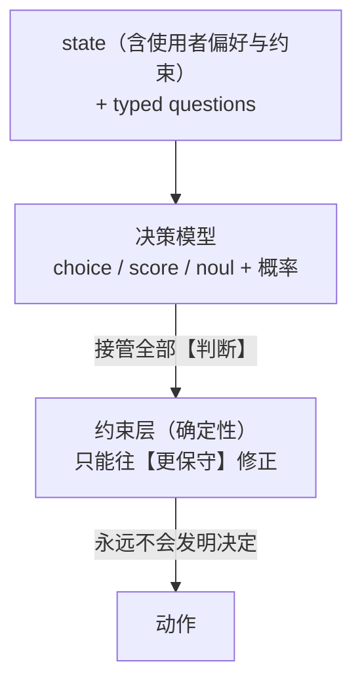
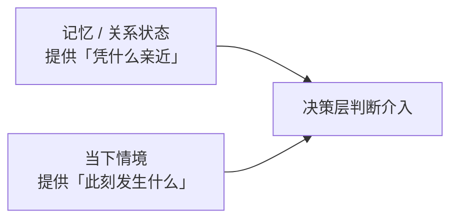
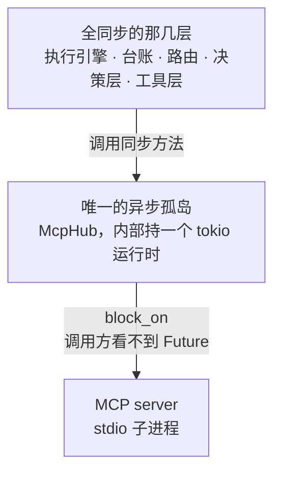
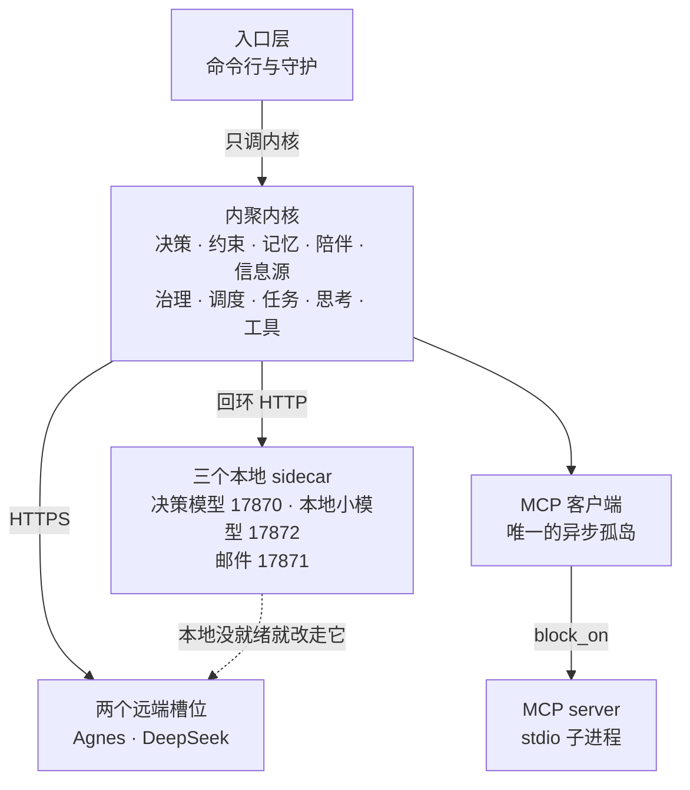
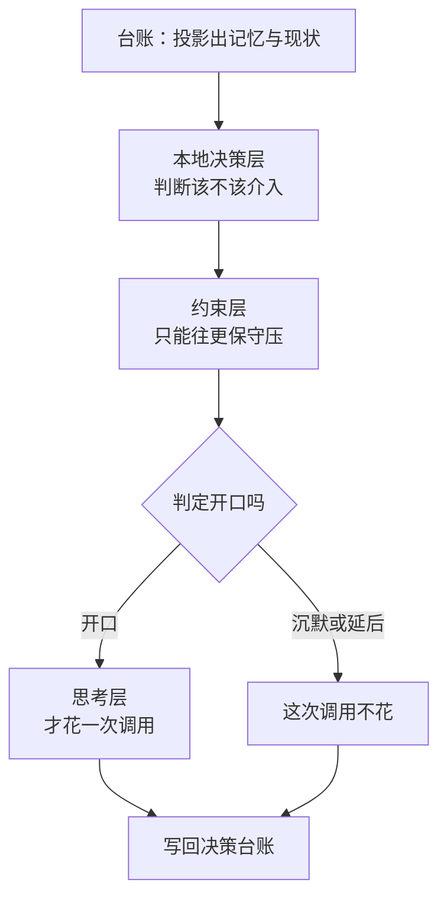
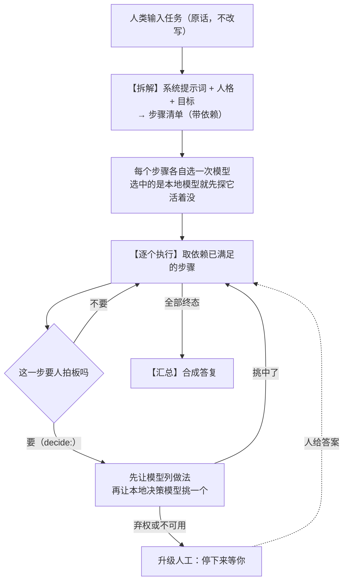
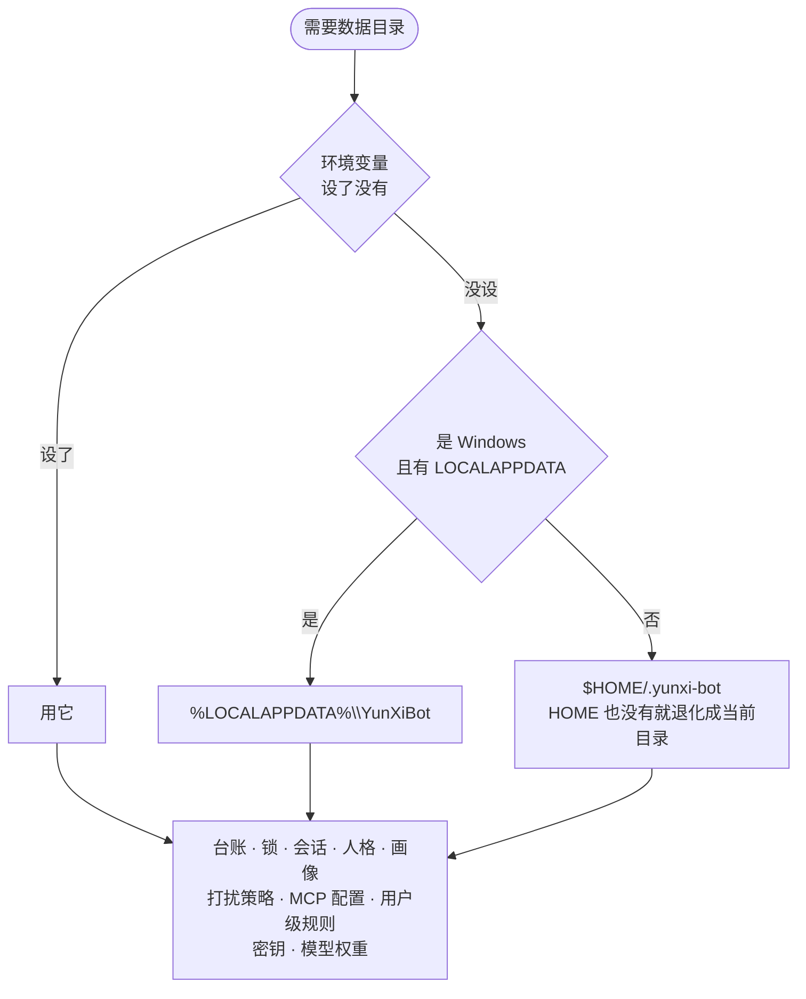
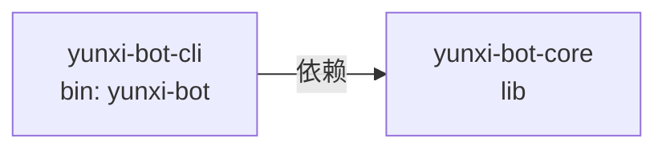

# 01 · 架构与技术栈

> README 的「架构篇」。README 把很多东西压成了表格和一句话，这里把那些压缩展开，
> 并补上模块地图与数据落地。
>
> **本文的引用格式是 `路径:行号`。** 每一条事实都来自实际读过的代码或文档；
> 推断出来的东西一律不写。确实没能核实的，集中放在文末
> [「我没能核实的」](#九我没能核实的) 一节。
>
> 架构有分歧时以 [ADR-0001 架构与边界](../adr/0001-架构与边界.md) 为事实来源
> （`AGENTS.md:11`）。
>
> **行号锚定在 2026-10-07 16:26 之后的那份工作区状态。** 那一次改动给引擎加了
> `Engine::with_ledger`（`task/engine.rs` 净增约 71 行），`main.rs` 与 `chat_handler.rs`
> 也跟着动了——这三个文件的行号是按改动之后重新核过的。它们再变，行号就会失效。
>
> **这一版修掉的是三件已经对不上的事**：文档里没有本地小模型这个槽位、
> 没有本地→Agnes 的回落链、并且把"模型选择"说成两层（实际是四个槽位）。
> 新增的 §5.5 专门讲回落链；§三的模块地图补上了 `think/local_health.rs`。

---

## 一、设计哲学

### 1.1 四个词，缺一个就退化成别的东西

README 用一张表定义了这个项目（`README.md:11-16`），ADR 把它展开成
"缺了会变成什么"（`docs/adr/0001-架构与边界.md:16-23`）：

| 词 | 承诺 | 缺了会变成 |
|---|---|---|
| **陪伴** | 对使用者状态有连续记忆，介入方式随关系状态变化 | 冷冰冰的调度器 |
| **通用** | 不预设领域；能力可扩展，内核不知道具体领域 | 又一个垂直工具 |
| **常驻** | 7×24 运行，任务与状态跨重启存活 | 需要主动打开的 App |
| **助理** | 既做判断也干活 | 只会聊天的壳，或只会排班的 cron |

这四条不是宣传语，是**架构约束**：后面每一个设计决定（内聚内核、进程边界、
台账为唯一事实来源）都能追溯到"少了哪一条就不成立"。

### 1.2 核心判断：陪伴不是功能，是「介入策略」

"什么时候该开口、什么时候该沉默、此刻该用关心还是汇报的语气"——
**这些本质上全是分类判断**（`README.md:20`、`docs/adr/0001-架构与边界.md:48`）。

而常驻 + 陪伴 + 通用这三者**无法同时用规则满足**（`README.md:22`）：

| 约束 | 后果 |
|---|---|
| 常驻 | 7×24 跑任务，产生大量事件 |
| 陪伴 | 需要介入，但介入多了就是骚扰 |
| 通用 | 事件种类无限，写不出穷举规则 |

规则要么漏（通用场景写不全），要么吵（保守阈值频繁打扰）。所以**唯一能同时满足
三者的是一个高准确率的「介入决策器」**（`docs/adr/0001-架构与边界.md:64`）。

### 1.3 决策流：模型接管判断，约束层兜底



出处：`README.md:26-34`、`docs/adr/0001-架构与边界.md:107-115`。

这条链条的形状借自本项目自身的既有设计原则：**能力可以下放，安全边界只能收紧**
（`README.md:36`）。落到代码上就是 `companion.rs` 模块文档里那句
"约束层永远不会「发明」一个决定，只会否决或降级到更保守的选项"
（`crates/yunxi-bot-core/src/companion.rs:17`）。

**修正方向是单向的**，`Speak → Hold → Quiet`，绝不反向
（`crates/yunxi-bot-core/src/companion.rs:22-23`）。实现上有一个必须写对的地方：

```rust
// crates/yunxi-bot-core/src/companion.rs:58-60
pub fn more_conservative(self, other: Intervention) -> Intervention {
    self.max(other)
}
```

用 `max` 而不是 `min`——`Ord` 按声明顺序派生，`Speak < Hold < Quiet`，越"大"越保守。
写成 `min` 会拿到最激进的动作，**约束收紧会完全失效**（`crates/yunxi-bot-core/src/companion.rs:52-53`）。

安静时段、每日上限、最小间隔是使用者设定的**硬事实**，不归模型判断
（`README.md:82-83`、`crates/yunxi-bot-core/src/companion.rs:63`）。
模型概率不可靠这件事，被挡在安全边界之外。

### 1.4 记忆的作用：提供「凭什么亲近」



出处：`README.md:87-91`、`docs/adr/0001-架构与边界.md:70-74`。

ADR 把这条写成一句必须守住的前提：**陪伴的温度来自「连续性」，不是来自「判断」**
（`docs/adr/0001-架构与边界.md:68`）。决策模型越强，越需要一个像样的 state，
而 state 的质量取决于记忆系统——**两者不能互相替代，记忆不能推迟到最后做**
（`docs/adr/0001-架构与边界.md:76-77`）。

state 必须**主动裁剪**。上游原话是"A good state contains the evidence needed for
the decision, not merely a long dump of everything your service knows"
（`docs/adr/0001-架构与边界.md:192`）。落到代码：

- `Memory::build_decision_state` 负责裁剪，**密钥与无关字段一律不进 state**
  （`crates/yunxi-bot-core/src/memory.rs:16-18`）；
- `Situation` 结构体"刻意保持小"：安静时段、距上次互动分钟数、待处理事件数、
  近期失败数、今日打扰次数、关系阶段标签——六个字段（`crates/yunxi-bot-core/src/memory.rs:750-765`）。

### 1.5 从哲学到不可动摇的边界

哲学最终落成九条硬边界，写在 `AGENTS.md:19-29`；其中四条也被抄进了内核 crate 的
文档注释（`crates/yunxi-bot-core/src/lib.rs:9-14`）。README 列出的八条
（`README.md:244-251`）是 AGENTS.md 那张表的对外版本。

这份文档里出现的所有取舍——失败方向朝不执行、模型给概率约束层做决定、
不静默降级、不把进程内策略包装成沙箱——都是这九条的推论，而不是独立的设计偏好。

---

## 二、技术栈

### 2.1 Rust：edition 2024，rust-version 1.88

```toml
# Cargo.toml:5-10
[workspace.package]
version = "0.1.0"
edition = "2024"
license = "Apache-2.0"
rust-version = "1.88"
repository = "https://github.com/sjxbbdb/YunXi-Bot"
```

`resolver = "3"`（`Cargo.toml:2`）——edition 2024 配套的解析器版本。

选 Rust 的三条理由写在 ADR §四（`docs/adr/0001-架构与边界.md:144-148`）：

1. YunXi 家族已有 **12 万行 Rust** 的内核与治理实现可供参考，语言一致才能实质性复用其设计；
2. 常驻进程的长期诉求是**低资源占用 + 长期稳定 + 单二进制分发**；
3. Rust 的显式类型与编译期依赖，契合本项目"边界必须写死在代码里"的要求。

ADR D1 同时记下了被否决的两个选项和**当时为什么倾向过 Node**——那份判断建立在
"只看过 5 个开源项目 README"的基础上（`docs/adr/0001-架构与边界.md:207`）。

> **版本号的一处不一致（如实记录）：** `README.md:206` 写的是"Rust stable 1.85+"，
> `AGENTS.md:84` 也写 `rust-version = 1.85`，而 `Cargo.toml:9` 实际是 `1.88`。
> 抬门槛的原因与代价记在 ADR D32：rmcp 3.5.1 要求 rustc 1.88，
> 抬到 1.88 之后 let-chains 稳定、clippy 在整个代码库启用 `collapsible_if`，
> 19 个文件冒出建议，用 `cargo clippy --fix` 全部修掉
> （`docs/adr/0001-架构与边界.md:1106-1116`）。**README 与 AGENTS.md 这两处是旧的。**

### 2.2 关于「没有第三方异步运行时」——这个前提已经过期

项目**曾经**是纯同步的：ADR D9 只引入一个 TLS 依赖（`docs/adr/0001-架构与边界.md:438-451`），
`decide/http.rs` 的 HTTP 客户端是纯 TCP 手写的（`crates/yunxi-bot-core/src/decide/http.rs:1-8`）。

但接 MCP 之后，**唯一引入异步运行时的依赖出现了**（`Cargo.toml:27-28`）：

> MCP 客户端。**这是唯一引入异步运行时的依赖**，代价是量出来的：
> 67 个包 -> 104 个包，构建约 16 秒

处理方式是**把异步关在一个模块里**（ADR D20，`docs/adr/0001-架构与边界.md:765-797`）：



落地证据：`McpHub` 的定义是 `{ rt: Runtime, servers: Vec<RunningServer> }`
（`crates/yunxi-bot-core/src/mcp.rs:279-283`），对外方法如 `connect` / `list_tools` / `call`
全是同步签名（`crates/yunxi-bot-core/src/mcp.rs:293-316`）。只开当前线程运行时
`rt` 而不是 `rt-multi-thread`——MCP 客户端是"发一条等一条"的形状，多线程运行时是白付的
（`Cargo.toml:37-38`、`crates/yunxi-bot-core/src/mcp.rs:16-18`）。

### 2.3 Python 侧是什么

跨语言能力**通过进程边界解决，而不是通过统一语言**（`docs/adr/0001-架构与边界.md:150-154`）。
Python 侧共五类进程，全部只绑回环：

| 进程 | 端口 | 干什么 | 出处 |
|---|---|---|---|
| `sidecar/verdict_server.py` | 17870 | 决策模型（Verdict）包装成固定 `/decide` 契约 | `sidecar/verdict_server.py:3`、`:36` |
| `sidecar/laya_server.py` | 17870 | 同一契约的 Laya 实现（历史后端） | `sidecar/laya_server.py:3`、`:41` |
| `sidecar/mock_laya.py` | 17870 | **测试替身**，按脚本作答，绝不用于生产 | `sidecar/mock_laya.py:3`、`:21` |
| `sidecar/mail_server.py` | 17871 | **只读** IMAP 信息源 | `sidecar/mail_server.py:3`、`:30-40` |
| `sidecar/local_llm_server.py` | 17872 | **本地小模型**：OpenAI 兼容的 `/v1/chat/completions`，另有 `/health`、`/warmup`、`/unload` | `sidecar/local_llm_server.py:3`、`:31`、`:699` |

端口刻意错开，免得两个 sidecar 抢同一个端口时错误信息指向错的那个
（`crates/yunxi-bot-core/src/info/mail.rs:34-36`）。

**前四个说的是"判断"，第五个说的是"说话"。** `local_llm_server.py` 走的是
`OpenAiThinker` 已经在说的那套 OpenAI 协议，所以 Rust 侧几乎一行不用改——
加一个 `ThinkerConfig` 就够了；另起一套协议等于凭空造一个 `Thinker` 实现
（`sidecar/local_llm_server.py:5-11`）。它跟另外四个还有两点不同：

- **它有"状态"，而且状态在响应正文里。** `/health` 会答 `ok` / `loading` / `idle` / `degraded`
  四种，**全都是 HTTP 200**（`sidecar/local_llm_server.py:605-634`）。
  Rust 侧因此**只看正文、不看状态码**（`crates/yunxi-bot-core/src/think/local_health.rs:80-84`）。
- **它会被主动释放，也会被主动催热。** 权重约 8 GB，空闲 `--idle-unload` 秒（默认 600）之后
  由看门狗放掉（`sidecar/local_llm_server.py:273-300`、`:704`），需要时由 `/warmup` 在后台线程里
  重新加载（`sidecar/local_llm_server.py:569-603`）。Rust 侧那一半见 §5.5。

Rust 侧只认一个固定 JSON 契约（`crates/yunxi-bot-core/src/decide/laya.rs:3-18`）：

```text
POST /decide
{ "state": {...},
  "questions": [ {"id":"q1","kind":{"type":"noul"},"instructions":"..."} ] }

→ 200
{ "answers": { "q1": {"noul": 0.83} },
  "model": "laya-multilingual" }
```

把上游库差异关在 Python 侧这件事**被兑现过一次**：决策层后端从 Laya 换成 Verdict，
而 **Rust 侧一行未改**（`README.md:372`、`docs/adr/0001-架构与边界.md:503-504`）。

Python 版本：`scripts/setup.ps1` 默认 `py -3.12`（`scripts/setup.ps1:13`）。

### 2.4 发布构建

```toml
# Cargo.toml:42-45
[profile.release]
lto = true
codegen-units = 1
strip = true
```

常驻进程 + 单二进制分发的诉求，对应 ADR §四第 2 条（`docs/adr/0001-架构与边界.md:147`）。

---

## 三、依赖清单

### 3.1 workspace 依赖（`Cargo.toml:12-40`）

| crate | 版本 / features | 解决什么问题 | 出处与理由 |
|---|---|---|---|
| `serde` | `1`，`features = ["derive"]` | 事件、会话、配置的序列化 | `Cargo.toml:13` |
| `serde_json` | `1` | 台账是 JSONL，sidecar 契约是 JSON | `Cargo.toml:14` |
| `chrono` | `0.4`，`default-features = false`，`["clock","std"]` | **唯一的时区依赖**。cron 必须按本地时间解析，而 std 不提供本地时区；个人助理的"每天早上 9 点"不能按 UTC 算 | `Cargo.toml:15-17` |
| `ureq` | `2`，`default-features = false`，`["tls","json","gzip"]` | **唯一的 TLS/网络依赖**。Agnes 走 HTTPS，而 std 没有 TLS；自己实现 TLS 是不负责任的 | `Cargo.toml:18-26` |
| `rmcp` | `3.5.1`，`default-features = false`，`["client","transport-child-process","transport-io"]` | MCP 客户端。通用助理的能力长尾只有 MCP 覆盖得住 | `Cargo.toml:27-36`、`crates/yunxi-bot-core/src/mcp.rs:5-9` |
| `tokio` | `1`，`default-features = false`，`["sync","macros","rt","time","process","io-util"]` | rmcp 自带 tokio 但需调用方提供运行时；只用当前线程运行时 | `Cargo.toml:37-39` |
| `yunxi-bot-core` | `path = "crates/yunxi-bot-core"` | 内核 | `Cargo.toml:40` |

**三条被显式记下来的取舍，值得单独抄一遍：**

1. **为什么不用 `reqwest`：** 它会把 tokio 整套异步运行时也带进来，而本项目的守护
   循环是同步的（`Cargo.toml:24-25`）。选 `ureq` 而不是它，是阻塞式、体积小的选择，
   底层是 rustls（同上）。
2. **为什么 rmcp 只开三个 feature、刻意不引 `reqwest`：** HTTP 传输会带来**第二套
   TLS 栈**（我们已用 ureq + rustls）。绝大多数 MCP server 就是 `npx`/`uvx`/独立二进制，
   stdio 覆盖得住（`Cargo.toml:33-35`，ADR D20 第 3 条在
   `docs/adr/0001-架构与边界.md:806-809`）。
3. **为什么是 `rmcp` 3.5.1 而不是 2.2.0：** 后者是 cargo 因 `rust-version` 门限自动
   退回的旧大版本；两者代价几乎一样（105 vs 104 包），但 MCP 规范变化很快，
   为一个新集成钉在旧大版本上没有道理（`Cargo.toml:29-31`）。

### 3.2 两个 crate 各自的依赖

```toml
# crates/yunxi-bot-core/Cargo.toml:10-16
[dependencies]
serde = { workspace = true }
serde_json = { workspace = true }
chrono = { workspace = true }
ureq = { workspace = true }
rmcp = { workspace = true }
tokio = { workspace = true }
```

```toml
# crates/yunxi-bot-cli/Cargo.toml:14-18
[dependencies]
yunxi-bot-core = { workspace = true }
serde_json = { workspace = true }
# 展示决策时间用。核心已依赖它，这里只是复用同一个 workspace 依赖。
chrono = { workspace = true }
```

**CLI 侧没有引入任何核心没有的依赖。** 这条不是巧合，是分层的证据：
入口层只做参数解析、交互、组装，能力全部来自内核（见 §六）。

工作区里**没有** `[dev-dependencies]` 与 `[build-dependencies]`
（实测：两个 crate 的 `Cargo.toml` 全文只有 `[package]`、`[[bin]]`、`[dependencies]` 三段，
`crates/yunxi-bot-cli/Cargo.toml:1-18`、`crates/yunxi-bot-core/Cargo.toml:1-16`）。

### 3.3 依赖代价的记账

`Cargo.lock` 当前有 **136** 个 `[[package]]` 条目（实测计数，含工作区自身的两个 crate
以及同一 crate 的多个版本）。ADR 记下了几次扩张的代价，都是**量出来的**：

| 事件 | 代价 | 出处 |
|---|---|---|
| 引入 `ureq`（D9） | 传递依赖从 **3 个涨到 57 个包** | `docs/adr/0001-架构与边界.md:450-451` |
| 引入 `rmcp`（D20） | **67 个包 -> 104 个包**，构建约 16 秒 | `Cargo.toml:28-29` |
| 同上（D32 复核） | rmcp 2.2.0 路线 67→105 / 19s；**3.5.1 路线 67→104 / 16s** | `docs/adr/0001-架构与边界.md:1104-1107` |

"先量出代价再引"是本项目的依赖纪律，`diff.rs` 里自己写 LCS 而不引 `similar`
就是这个纪律的又一次应用（`crates/yunxi-bot-core/src/diff.rs:18-26`）。

### 3.4 Python 侧依赖（`sidecar/requirements.txt`）

只有一行真实依赖（`sidecar/requirements.txt:11`）：

```text
verdictml @ git+https://github.com/Manavarya09/verdict
```

文件里的注释解释了两件事：

1. **为什么钉仓库而不是 PyPI：** PyPI 上已有 0.1.0，但官方 README 推荐从仓库装
   （修得更勤），这里固定到仓库来源，实测可用（`sidecar/requirements.txt:8-10`）。
2. **verdictml / torch 的关系：** 它会把 `sentence-transformers` / `transformers` /
   `torch(CPU)` 一并带进来，venv 大约 1 GB——这是跑编码器模型的必要成本
   （`sidecar/requirements.txt:9-10`）。而且**即使只要 ONNX 引擎，安装期仍会拉 torch**，
   因为那是 `sentence-transformers` 的基础依赖；只有**运行时**
   `Verdict(engine="onnx")` 才不需要 torch。想彻底免 torch 要用 `verdictml[onnx]`
   并自行裁剪依赖，但**那样没被实测过**（`sidecar/requirements.txt:13-15`）。

除 `verdictml` 外，邮件 sidecar **零新依赖**：`imaplib` + `ssl` + `email` 都在
Python 标准库里（`sidecar/mail_server.py:13-14`）。

---

## 四、模块地图

`crates/yunxi-bot-core/src/` 下有 **26 个 `.rs` 文件**（实测计数）：
**25 个模块 + crate 根 `lib.rs`**。另有 5 个子目录
（`decide/` `info/` `task/` `think/` `tool/`，共 **24** 个 `.rs` 文件，
其中 `think/` 8 个——`local_health.rs` 是这一轮新加的）。

下表每一行的职责都摘自该文件顶部的 `//!` 文档注释，**不是从文件名推的**。
（§4.1 至 §4.4 四张表的"出处"列里，路径都省去了
`crates/yunxi-bot-core/src/` 前缀，只有文件名与行号。）

### 4.1 根目录的 25 个模块 + crate 根

| 文件 | 职责（摘自模块文档） | 出处 |
|---|---|---|
| `lib.rs` | crate 根。**内聚的具体内核，不是元内核**：明确知道自己管什么——任务、台账、触发、约束、决策、执行。没有服务查找、没有事件总线、没有插件生命周期 | `lib.rs:1-14` |
| `agent.rs` | Agent 循环：把记忆、决策、思考三层串成一个回合；只依赖台账作为事实来源 | `agent.rs:1-27` |
| `assistant.rs` | 助理巡览：取信息 → 判断 → 通知 → 落台账，一轮走完。放在内核里因为有两个调用方 | `assistant.rs:1-22` |
| `companion.rs` | 陪伴层：把「何时介入」交给决策层判断，再用确定性约束兜底 | `companion.rs:1-23` |
| `costlog.rs` | 模型调用的成本台账。**先记账、后算钱** | `costlog.rs:1-18` |
| `diff.rs` | 最小的行级 diff：为了让人在批准前看清"文件会变成什么样" | `diff.rs:1-32` |
| `embedding.rs` | 本地字符 n-gram 向量，**零依赖**；派生数据不落盘 | `embedding.rs:1-27` |
| `exec.rs` | 执行层：以子进程运行任务。不用 shell、凭证剥离、硬超时 + 进程树清理、绝不无隔离派生 | `exec.rs:1-9` |
| `feedback.rs` | 反馈回写：使用者的处置，以及下一次判断要不要记得它 | `feedback.rs:1-39` |
| `instance.rs` | 单实例锁。锁文件记 pid，启动时判断该 pid 是否真的还活着 | `instance.rs:1-6` |
| `job.rs` | 任务域模型与状态机。状态迁移是**显式白名单** | `job.rs:1-4` |
| `ledger.rs` | 任务台账：append-only 事件日志 + 可丢弃投影 | `ledger.rs:1-8` |
| `mcp.rs` | MCP 客户端：**把异步关在这一个模块里** | `mcp.rs:1-32` |
| `memory.rs` | 记忆层：为决策层提供可用的 state；事件溯源，不另起存储 | `memory.rs:1-18` |
| `notify.rs` | 通知出口：助理把事告诉使用者的那条路。**不许虚报送达** | `notify.rs:1-43` |
| `notify_windows.rs` | Windows toast 后端。走 PowerShell 而不是引 `windows` crate；核心价值是能**验证**送达 | `notify_windows.rs:1-33` |
| `persona.rs` | 人格：`<数据目录>/persona.md`。**可改，不再写死在代码里** | `persona.rs:1-38` |
| `policy.rs` | 约束层：权限旋钮、预设，与审批结果的封闭词汇表 | `policy.rs:1-7` |
| `profile.rs` | 用户画像：`<数据目录>/profile.md`。它和记忆不是一回事 | `profile.rs:1-34` |
| `recall_gate.rs` | 召回触发门控：**先判"有没有记忆需求"，再决定要不要召回** | `recall_gate.rs:1-31` |
| `rules.rs` | 项目规则加载：让它在某个项目里工作时**自动知道那个项目的约定** | `rules.rs:1-45` |
| `runner.rs` | 调度循环：把 job / ledger / trigger / policy / exec 串成一个可运行的回合 | `runner.rs:1-10` |
| `triage.rs` | 打扰判定：这条信息值不值得**现在**告诉你。**复用陪伴层的三层，不另造一套** | `triage.rs:1-43` |
| `trigger.rs` | 触发器与调度：`manual` / `every` / `cron` / `watch` 四种；单飞 + 崩溃残留检测 | `trigger.rs:1-10` |
| `win_job.rs` | Windows Job Object 隔离。开头就写明**它不保证什么**：不做文件系统写入隔离 | `win_job.rs:1-16` |
| `win_token.rs` | Windows 写入隔离：受限令牌 + 低完整性级别。含被证伪的能力 SID 路线 | `win_token.rs:1-45` |

其中三个模块在 `lib.rs` 里带**额外的**行内文档，说明为什么这样区分：

- `assistant`：因为有两个调用方，抄两份的话漂移的表现是"手动跑没问题，常驻跑出问题"
  （`crates/yunxi-bot-core/src/lib.rs:17-22`）；
- `notify_windows`：**不在非 Windows 平台上编译**，在没有 WinRT 的平台上放一个永远
  返回失败的实现只会制造噪音（`crates/yunxi-bot-core/src/lib.rs:39-42`）；
- `win_token`：`#[cfg(windows)]`（`crates/yunxi-bot-core/src/lib.rs:56-57`）。

### 4.2 `task/` —— 人类给目标，系统拆解、逐步执行

| 文件 | 职责 | 出处 |
|---|---|---|
| `task/mod.rs` | 数据结构与状态机在 `model`，拆解在 `plan`，决策点在 `decide`，执行循环在 `engine` | `task/mod.rs:1-4` |
| `task/model.rs` | 把"人类给一个目标"变成"一组有序执行的步骤"。三条设计约束：台账是唯一事实来源、每个任务路由一次、预算是硬上限 | `task/model.rs:1-37` |
| `task/plan.rs` | 任务拆解。解析**要容错，但不能猜**：只认位置，不认语法 | `task/plan.rs:1-21` |
| `task/decide.rs` | 决策点：模型给选项，本地决策模型选，弃权就升级人工。**整个框架里最重要的一处分工** | `task/decide.rs:1-19` |
| `task/engine.rs` | 执行循环：取可跑的步骤 → 执行 → 回填 → 再取，直到全部终态。并行是"设计好但先不接线" | `task/engine.rs:1-23` |
| `task/schedule.rs` | 任务调度：守护进程该推进哪些任务。两条边界：不碰 `AwaitingHuman`、不碰刚还在动的任务 | `task/schedule.rs:1-32` |

`task/schedule.rs` 的模块文档开头就点明它补的是哪条断链——"任务卡住后
**没有任何东西自动推进它**"（`task/schedule.rs:5`）。

### 4.3 `think/` —— 思考层（System 2）

| 文件 | 职责 | 出处 |
|---|---|---|
| `think/mod.rs` | 思考层：Agent 的通用能力来自这里。**模块文档里"默认接远端 Agnes"与"本地跑（Laya）"两句都已过期**——默认现在是本地小模型，决策后端现在是 Verdict | `think/mod.rs:1-18` |
| `think/agnes.rs` | Agnes AI 接入（OpenAI 兼容）。Base URL、端点、默认模型、密钥从类型上就打印不出来 | `think/agnes.rs:1-8`、`:23-27` |
| `think/router.rs` | 模型选择器：每个任务决定一次「用哪个模型 + 要不要思考」。**两个轴，不要混在一起**；三个槽位（本地 / Agnes / DeepSeek）都在这里 | `think/router.rs:1-60`、`:330-377` |
| `think/local_health.rs` | **本地槽位的健康判定与兜底**：六种状态 → 「留本地 / 改走 Agnes」，纯函数判定 + 薄探测 + 一脚下 `/warmup` | `think/local_health.rs:1-56`、`:220-260` |
| `think/prompt.rs` | 缓存友好的提示词组装。三段式，顺序不可变 | `think/prompt.rs:1-30` |
| `think/context.rs` | 上下文预算与压缩。**通用 agent 里唯一一条"做错了比不做更糟"的东西** | `think/context.rs:1-47` |
| `think/cost.rs` | 成本记账：把 token 用量换算成钱，并暴露缓存命中率。**本地槽位那档价位表全零** | `think/cost.rs:1-10`、`:71-80` |
| `think/session.rs` | 会话落盘：让一次对话能跨进程活下去 | `think/session.rs:1-36` |

`think/mod.rs` 里还有一个 `thresholds` 重导出模块，注释写着"路由阈值。**集中在一处**，
便于按实际账单调整"（`crates/yunxi-bot-core/src/think/mod.rs:27-30`），
实际常量定义在 `crates/yunxi-bot-core/src/think/router.rs:434-450`。

`think/local_health.rs` 是这一轮新加的，它值得在模块地图里单列，因为**它是"本地挂了会不会静默降级"的唯一守门人**：
判定写成**纯函数**（六种健康状态 → `Keep | Fallback`，不碰任何 I/O），所以六种情况都能在单元测试里直接构造出来；
真去连端口的只有 `probe` 一个函数（`crates/yunxi-bot-core/src/think/local_health.rs:43-48`、`:211-219`）。
对话链路和任务引擎**共用它这一份判定**，两份实现必然漂移——而漂移的方向是"有一条链路悄悄不回落了"
（`crates/yunxi-bot-core/src/think/local_health.rs:371-379`）。

### 4.4 `tool/`、`decide/`、`info/`

| 文件 | 职责 | 出处 |
|---|---|---|
| `tool/mod.rs` | 工具层：模型能对世界做的事，以及"哪些必须先问人"。审批按**能力类别**判定，不逐个工具写规则 | `tool/mod.rs:1-40` |
| `tool/runner.rs` | 工具循环：模型决定调工具 → 审批 → 执行 → 结果回灌 → 再问，直到模型不再调工具 | `tool/runner.rs:1-36` |
| `tool/files.rs` | 文件类工具：读、列目录、搜内容、写、改。**先读后写** | `tool/files.rs:1-33` |
| `tool/system.rs` | 系统类工具：时间、执行命令、问人 | `tool/system.rs:1-30` |
| `tool/web.rs` | 网络类工具：抓网页、搜索。Jina Reader 主路 + 直连回退 | `tool/web.rs:1-45` |
| `decide/mod.rs` | 决策层：System-1 决策模型的接入、结果归一与降级。三条不可动摇的规则。**降级类别七类**（含为本地槽位回落单开的 `Route`） | `decide/mod.rs:1-9`、`:161-182` |
| `decide/laya.rs` | `Decider` 抽象、Laya 的本地 sidecar 适配器，以及测试用 Stub | `decide/laya.rs:1-23` |
| `decide/http.rs` | 最小 HTTP/1.1 客户端，只服务本机回环上的 JSON 接口。**模块位置是历史原因** | `decide/http.rs:1-18` |
| `info/mod.rs` | 信息源：助理"看外面"的入口。两条纪律：取不到不能伪装成没有、摘要不是正文 | `info/mod.rs:1-31` |
| `info/mail.rs` | 邮件信息源：连本机的只读邮件 sidecar。三种失败必须分开 | `info/mail.rs:1-24` |

`decide/http.rs` 的模块注释里有一句值得单独记住的话：**回环限制才是它最值钱的地方**——
决策 state 和邮件内容都是私人信息，这个限制保证它们不可能被发到外部主机；
加一个新 sidecar 就白拿这条保证（`crates/yunxi-bot-core/src/decide/http.rs:16-18`）。

### 4.5 CLI crate 的 6 个文件

| 文件 | 职责 | 出处 |
|---|---|---|
| `main.rs` | 命令行入口 + 全部 `cmd_*` 子命令 + 守护循环 | `crates/yunxi-bot-cli/src/main.rs:1-15` |
| `approval.rs` | 命令行侧的审批交互与工具装配。**默认答案是否** | `crates/yunxi-bot-cli/src/approval.rs:1-17` |
| `chat.rs` | 交互式会话 REPL：**通用 agent 的核心体验** | `crates/yunxi-bot-cli/src/chat.rs:1-29` |
| `chat_handler.rs` | 接入真实模型的 `TaskHandler` 实现。三套独立的会话、按 provider 分开记历史 | `crates/yunxi-bot-cli/src/chat_handler.rs:1-18` |
| `tooling.rs` | 工具装配：把工具注册成一套，把命令行参数变成审批策略 | `crates/yunxi-bot-cli/src/tooling.rs:1-7` |
| `tool_sink.rs` | 把每次工具调用写进台账。**包括被拒绝和没人应答的** | `crates/yunxi-bot-cli/src/tool_sink.rs:1-30` |

---

## 五、分层架构

### 5.1 总体分层

ADR §三给出的分层（`docs/adr/0001-架构与边界.md:83-103`），映射到本仓库的实际代码。
**内核内部那十几个模块的分组放在图下面的表里**——它们是并列的，画进图只会让图变宽。



内核内部分成这十组（下表每一行的职责都摘自模块文档，不是从文件名推的）：

| 组 | 模块 |
|---|---|
| 决策层 | `decide`（含 `decide/laya.rs` 适配器、`decide/http.rs` 回环客户端） |
| 约束层 | `policy`、`companion::constraint_ceiling`——只能往更保守修正 |
| 记忆 / 人格 / 画像 | `memory`、`persona`、`profile`、`recall_gate` |
| 陪伴与助理 | `companion`、`triage`、`assistant`、`feedback` |
| 信息源 | `info::mail` |
| 治理层 | `ledger`、`job`、`costlog` |
| 调度与执行 | `runner`、`trigger`、`instance`、`exec` |
| 任务链路 | `task::plan` / `engine` / `decide` / `schedule` |
| 思考层 | `think::router` / `agnes` / `prompt` / `session` / `cost` / `context`，**加 `think::local_health`** |
| 工具层 | `tool::files` / `system` / `web` / `runner` |
| 异步孤岛 | `mcp::McpHub` |

图中每条边的依据：

| 边 | 出处 |
|---|---|
| 入口层只调内核 | `crates/yunxi-bot-cli/src/main.rs:21-26`（import 全部来自 `yunxi_bot_core`） |
| CLI 直接驱动陪伴层与助理回合 | `crates/yunxi-bot-cli/src/main.rs:632-636`、`:3871-3872` |
| CLI 直接连信息源 | `crates/yunxi-bot-cli/src/main.rs:3077`、`:3220` |
| CLI 子模块装配工具 | `crates/yunxi-bot-cli/src/tooling.rs:12-19` |
| 决策层走回环 HTTP | `crates/yunxi-bot-core/src/decide/laya.rs:3-18` |
| 助理调信息源 | `crates/yunxi-bot-core/src/assistant.rs:29` |
| 信息源走回环 HTTP | `crates/yunxi-bot-core/src/info/mail.rs:10-12`、`:34-36` |
| 任务链路既用决策层也用思考层 | `crates/yunxi-bot-core/src/task/engine.rs:27-31` |
| 思考层走 HTTPS | `crates/yunxi-bot-core/src/think/agnes.rs:3-8`、`Cargo.toml:18-26` |
| **思考层选中的可能是本地槽位，所以要先过健康判定** | `crates/yunxi-bot-core/src/think/local_health.rs:389-419` |
| **健康判定与催热都走回环 HTTP** | `crates/yunxi-bot-core/src/think/local_health.rs:364-369`、`:352-356` |
| 本地槽位那次对话走回环 HTTP `/v1` | `crates/yunxi-bot-core/src/think/router.rs:334`、`Cargo.toml:18-26` |
| **没就绪就改走 Agnes** | `crates/yunxi-bot-core/src/think/local_health.rs:252-259` |
| 工具层接 MCP | `crates/yunxi-bot-core/src/mcp.rs:29-32` |
| 约束层收紧陪伴层动作 | `crates/yunxi-bot-core/src/companion.rs:10-12`、`:17` |
| 内核保持同步 | `docs/adr/0001-架构与边界.md:796`（"执行引擎、台账、路由、决策层全部保持同步"） |
| 一切写回台账 | `crates/yunxi-bot-core/src/ledger.rs:5`（事件日志是唯一真相来源） |

### 5.2 一个 Agent 回合

`agent::run_cycle` 把三层串起来（`crates/yunxi-bot-core/src/agent.rs:167`），
顺序在模块文档里写死了（`crates/yunxi-bot-core/src/agent.rs:14-27`）：



**顺序不能反**：Agnes 免费档只有 **10 RPM**（`crates/yunxi-bot-core/src/think/agnes.rs:20-21`），
常驻进程每轮都打远端几秒就把配额烧光。本地那一层先筛，是这套配额下的结构必然，
不是优化（`crates/yunxi-bot-core/src/agent.rs:26-27`、`README.md:287-288`）。

> 图里的 `T` 原来标的是"远端思考层（Agnes）"。**它现在不一定在远端**：
> 思考层选出来的可能是**本地小模型**（`127.0.0.1:17872`），而本地不可用时才改走 Agnes
> （见 §5.5）。这一段顺序上仍然是"本地判断先筛、远端表达后发"，
> 但"本地"和"远端"的所指要按槽位读，不能按进程读。

### 5.3 任务链路（与调度并列的另一条）



出处：`crates/yunxi-bot-core/src/task/model.rs:3-21`（链路图）、
`crates/yunxi-bot-core/src/task/decide.rs:1-19`（决策点）、
`crates/yunxi-bot-core/src/task/model.rs:108-126`（`TaskState`，含 `Stalled`）、
`crates/yunxi-bot-core/src/think/local_health.rs:389-419`（本地槽位那一道）。

**`Stalled` 是一个必须存在的状态**：没有它，"依赖成环"和"还在跑"会长得一模一样，
于是死锁表现为无限等待（`crates/yunxi-bot-core/src/task/model.rs:116-120`）。

### 5.4 数据落在哪：一条解析规则，一份定义

数据目录的解析**在内核里只有一份定义**（`crates/yunxi-bot-core/src/lib.rs:111`），
CLI 直接委托，不重算（`crates/yunxi-bot-cli/src/main.rs:28-35`、`:49-51`）：



上面那十一个文件各自的格式与出处，见 §7.1 的目录总表——**那是表该干的活，不画进图里。**
解析顺序的代码依据：`crates/yunxi-bot-core/src/lib.rs:127-141`。
各落盘位置的依据见 §七。

**为什么这件事值得有"唯一一份"**：之前 CLI 自己算一份、sidecar 在 Python 里再算一份。
两边算法看起来一样，但只要有一处漏了对齐，表现就是最难查的那类错——
sidecar 说"没配置"，而使用者的配置文件明明就在那儿。端到端测试抓到过一次真实的路径
不一致（`crates/yunxi-bot-core/src/lib.rs:113-126`，ADR D27 在
`docs/adr/0001-架构与边界.md:1010-1015`）。

修法不是"让两边神奇地一致"（不可靠），而是**让不一致可被看见**——
sidecar 报出自己算的 `config_path`，Rust 侧发现不同就直接把两个路径摆出来
（`crates/yunxi-bot-core/src/info/mail.rs:126`、`:251`）。

### 5.5 本地槽位与它的回落链（D129）

这一节讲的是**上面那张分层图里 `THK → HL → S3 / AG` 那三条边**。它在架构上值得单列，
因为它是这个项目里**唯一一处"选中的端点可能整个不存在"**的地方：

- Agnes 和 DeepSeek 是远端服务，它们不会"恰好没起来"；
- **本地小模型是这台机器上的一个 Python 进程**（`sidecar/local_llm_server.py`），
  它可能没起、可能正在加载 8 GB 权重、可能刚被空闲回收、也可能上次加载失败过
  （`crates/yunxi-bot-core/src/think/local_health.rs:8-18`）。

D126 把本地槽位接进路由之后，请求**真的**打到 `127.0.0.1:17872` 了——于是上面这四种情况
第一次成了真问题。而且它们**全都长得像"正常"**：功能还在，只是退化成了另一个模型。
这正是这个项目反复栽的那个形状（D128 的教训，`crates/yunxi-bot-core/src/think/local_health.rs:20-22`）。

**架构上它是怎么摆的：**

| 决定 | 摆法 | 出处 |
|---|---|---|
| 判据写在哪 | `think::local_health` 一个模块，**纯函数 `decide()` 不碰任何 I/O**，真连端口的只有 `probe` | `crates/yunxi-bot-core/src/think/local_health.rs:43-48`、`:211-219` |
| 谁在用 | 对话链路（`ChatHandler::route_for`）与任务引擎（`Engine::apply_local_fallback`）**共用同一份** | `crates/yunxi-bot-cli/src/chat_handler.rs:951-987`、`crates/yunxi-bot-core/src/task/engine.rs:450-495` |
| 怎么注入 | 对话那边默认 `Probe::real()`（真探）；引擎那边 `Option<Probe>`，**默认 `None` = 零 I/O、零逻辑** | `crates/yunxi-bot-cli/src/chat_handler.rs:211-218`、`crates/yunxi-bot-core/src/task/engine.rs:348-366` |
| 回落到哪 | `ModelSpec::AGNES_FLASH`——**免费档，不是 DeepSeek**：回落的理由是"本地这台机器上跑不了"，不是"这活变难了" | `crates/yunxi-bot-core/src/think/local_health.rs:252-256` |
| 留痕 | 理由接进 `Routing::reason`（随 `TaskPlanned` / `StepRouted` 落库）+ stderr 一行 + 一条 `DecisionClass::Route` 决策事件 | `crates/yunxi-bot-core/src/think/local_health.rs:412`、`crates/yunxi-bot-core/src/task/engine.rs:459-495` |

**两条默认值故意相反，这是这段设计里最容易被读错的地方。**
对话链路只有一个跑法，使用者敲下的那一句**一定**在能起 sidecar 的那台机器上，所以默认真探。
而引擎是 core 里的东西，被近千条测试、干跑、端到端脚本反复构造——默认去连 `127.0.0.1:17872` 的话，
**测试的结论会取决于开发机上有没有起 sidecar**，同一份代码在两台机器上答案不同，
那是最不该进断言的东西（`crates/yunxi-bot-core/src/task/engine.rs:350-359`）。
代价写得很明白：**没挂 = 没有兜底**，所以 CLI 那几条真会发请求的路每一处都必须挂
（`crates/yunxi-bot-cli/src/main.rs:566`、`:2740`、`:2786`、`:3871`）。

**还有一件事必须一起做，否则本地槽位会静默死掉。** 空闲回收之后 `/health` 报 `idle`；
只回落、不催热的话，下一轮探还是 `idle`、于是再回落……**那个模型再也不会被用到**，
而每一处显示都正常：走的还是免费端点、账也没多花、没有一处报错
（`crates/yunxi-bot-core/src/think/local_health.rs:27-41`）。
所以 `idle` / `loading` 这两种状态**除了这一轮改走 Agnes，还会 fire-and-forget 地踢一脚 `/warmup`**，
好让下一轮回到本地。`degraded` / `unreachable` / `unexpected` 不踢——
一个不重试，一个没人监听，一个**我们不知道那是什么**（`crates/yunxi-bot-core/src/think/local_health.rs:126-137`、`:144-146`）。

真机实测这一整环的结论记在 ADR D129 与 `README.md`：
`ok` → 空闲 15 秒 → `idle` → 第一次说话走 Agnes 并在 4 秒内热回 `ok` → 第二次说话回到本地。
**其中那一串显存数字我无法复核**（ADR 明确注明它们来自提交信息），见 §九。

---

## 六、两个 crate 的分工

### 6.1 依赖方向



- `yunxi-bot-cli` 依赖 `yunxi-bot-core`（`crates/yunxi-bot-cli/Cargo.toml:15`）；
- **反向没有**：`crates/yunxi-bot-core/Cargo.toml:10-16` 的依赖里没有 `yunxi-bot-cli`。
  所以上图只有一条边——这正是"边界写死在编译期"的意思。

### 6.2 边界怎么划

| | `yunxi-bot-core` | `yunxi-bot-cli` |
|---|---|---|
| 类型 | 库（`lib.rs`） | 可执行（`[[bin]] name = "yunxi-bot"`，`crates/yunxi-bot-cli/Cargo.toml:10-12`） |
| 自我描述 | "内聚内核：任务、台账、触发、约束、决策"（`crates/yunxi-bot-core/Cargo.toml:3`） | "命令行与常驻守护入口"（`crates/yunxi-bot-cli/Cargo.toml:3`） |
| 依赖 | serde / serde_json / chrono / ureq / rmcp / tokio | core + serde_json + chrono |
| 管什么 | 内核原语、决策、执行、工具、思考、任务链路 | 参数解析、终端交互、进程编排（daemon / supervise / 自启） |

**判据是"有没有两个调用方"，不是"像不像 UI"。** 两处明确记下的边界判断：

1. **`assistant` 为什么在内核里而不是 CLI 里**——因为它有**两个调用方**：
   `yunxi-bot check`（你主动问）与 daemon 的每一轮（它自己看）。抄两份的话两边迟早
   漂移，而漂移的表现最恶心：手动跑没问题，常驻跑就出问题
   （`crates/yunxi-bot-core/src/assistant.rs:3-12`，ADR D27 在
   `docs/adr/0001-架构与边界.md:1002-1008`）。
2. **CLI 侧的东西为什么留在 CLI**——审批交互要读 stdin（`approval.rs`）、
   工具调用写台账需要一个自己的 `Ledger` 句柄因为可变借用会打架
   （`crates/yunxi-bot-cli/src/tool_sink.rs:41-47`）。这些是"入口形态"的问题，
   不是内核语义的问题。

**内核文档里明确写了它不是什么**：没有服务查找、没有事件总线、没有插件生命周期，
依赖全部是编译期显式的（`crates/yunxi-bot-core/src/lib.rs:5-7`）。
ADR D2 记下了否决元内核范式的理由——**该范式已经实现过**，重做一遍既没有学习，
也构不成差异化（`docs/adr/0001-架构与边界.md:210-214`）。

### 6.3 内核的公开面

`lib.rs` 只重导出少量稳定类型（`crates/yunxi-bot-core/src/lib.rs:59-65`）：

```rust
pub use exec::{ExecError, ExecOptions, ExecOutcome, IsolationLevel, IsolationRequirement};
pub use job::{Job, JobId, JobSpec, JobState, Trigger};
pub use ledger::{Event, EventKind, Ledger, LedgerError, SpanGuard};
pub use policy::{ApprovalOutcome, ApprovalPolicy, PermissionState, SandboxMode, normalize_outcome};
pub use runner::{TickOptions, TickReport, tick};
```

其余通过 `pub mod` 路径访问——`lib.rs` 里一共声明了 **30 个模块**
（25 个根目录模块 + 5 个子目录模块），集中在
`crates/yunxi-bot-core/src/lib.rs:16-57`。CLI 用的正是模块路径形式，例如
`yunxi_bot_core::task::engine::{LedgerTaskStore, TaskStore}`
（`crates/yunxi-bot-cli/src/main.rs:24`）。

---

## 七、数据落地

### 7.1 目录总表

| 文件 / 目录 | 内容 | 格式 | 出处 |
|---|---|---|---|
| `<home>/ledger.jsonl` | 台账（唯一事实来源） | JSONL，首行是版本头 | `crates/yunxi-bot-cli/src/main.rs:53-55` |
| `<home>/daemon.lock` | 单实例锁 | 文本（记 pid），与台账同目录便于一起备份/清理 | `crates/yunxi-bot-cli/src/main.rs:57-59` |
| `<home>/sessions/<id>.json` | 会话（稳定前缀 + 历史 + 指纹） | JSON（pretty），先写 `.json.tmp` 再改名 | `crates/yunxi-bot-core/src/think/session.rs:50`、`:99-103`、`:138-141` |
| `<home>/persona.md` | 助理人格 | Markdown，第一个一级标题是名字 | `crates/yunxi-bot-core/src/persona.rs:1-2`、`:42-43` |
| `<home>/profile.md` | 使用者画像 | Markdown，**原样进提示词** | `crates/yunxi-bot-core/src/profile.rs:1`、`:38-39` |
| `<home>/triage.json` | 打扰判定策略（黑白名单等） | JSON | `crates/yunxi-bot-core/src/triage.rs:138` |
| `<home>/mcp.json` | MCP server 配置 | JSON | `crates/yunxi-bot-core/src/mcp.rs:109` |
| `<home>/AGENTS.md` | 用户级项目规则 | Markdown | `crates/yunxi-bot-core/src/rules.rs:120-124` |
| `<home>/secrets/agnes.key` | Agnes 密钥 | 纯文本 | `crates/yunxi-bot-core/src/think/agnes.rs:131-141` |
| `<home>/secrets/deepseek.key` | DeepSeek 密钥 | 纯文本 | `crates/yunxi-bot-core/src/think/agnes.rs:120` |
| `<home>/secrets/mail.json` | IMAP 凭证 | JSON（`imap_host` / `imap_port` / `username` / `password`） | `crates/yunxi-bot-core/src/info/mail.rs:297-299`、`sidecar/mail_server.py:30-37` |
| `<home>/secrets/bocha.key` | 博查搜索密钥 | 纯文本 | `crates/yunxi-bot-cli/src/tooling.rs:78-81` |
| `<home>/models/verdict-small/` | 决策模型权重 | safetensors | `scripts/fetch_model.py:149`、`sidecar/verdict_server.py:124` |
| `<home>/models/Qwen3-4B-Instruct-2507/` | **本地小模型权重**（约 8 GB，**不在 git 里、`setup.ps1` 也不下**） | HuggingFace 目录（`config.json` 等） | `sidecar/local_llm_server.py:70-85`、`scripts/fetch_local_model.py` |

`secrets/` 与 `*.key` 都在 `.gitignore` 里（`.gitignore:29-31`），
`data/` 与 `*.jsonl` 也是——**台账绝不入库**（`.gitignore:4-6`）。

**`models/` 下现在住着两个模型，它们的来路不同**：决策模型权重由 `setup.ps1` 拉、有 SHA256 校验
（约 348 MB）；本地小模型**要自己下**，而且下载脚本的默认值是 `Qwen/Qwen3-1.7B`
（`scripts/fetch_local_model.py:41`），**和路由里写死的 `Qwen3-4B-Instruct-2507` 不一致**
（`crates/yunxi-bot-core/src/think/router.rs:335`）——要跟代码对齐就得显式给参数。
本地 sidecar 自己的 `--model` 默认值同样是小一号的 `Qwen3-1.7B`（`sidecar/local_llm_server.py:698`）。
**三处默认值互不相同，这是实测出来的不一致，不是设计。**
`local_llm_server.py` 找模型的顺序是：先当路径用 → 再 `<数据目录>/models/<名字>`
（认 `config.json`）→ 都没有就交给 transformers 按仓库名联网拉
（`sidecar/local_llm_server.py:70-85`）。

密钥的读取顺序是 `YUNXI_BOT_AGNES_KEY` 环境变量 → `key_file`；**文件方式优先于
命令行参数，避免密钥出现在进程列表里**（`crates/yunxi-bot-core/src/think/agnes.rs:36-39`）。
而 `ApiKey` 刻意不实现 `Display`、`Debug` 只打印前 6 位——**从类型上堵住"密钥被打进日志"
这条路**，而不是靠"记得别打印"（`crates/yunxi-bot-core/src/think/agnes.rs:23-27`）。

### 7.2 台账：append-only + 边界 + 版本

**文件结构**（`crates/yunxi-bot-core/src/ledger.rs:21-30`、`:346-356`）：

```text
第 1 行   {"yunxi_bot_ledger":1}                     ← 头部，固定，写一次
第 2 行   {"seq":1,"at":1759...,"kind":"...",...}    ← 事件，一行一条，只追加
第 3 行   {...}
...
```

**四条不可让步的性质：**

1. **事件日志是唯一真相来源**，状态全部是投影，可随时丢弃重建
   （`crates/yunxi-bot-core/src/ledger.rs:5`，`Ledger::rebuild` 在 `:572-575`）。
2. **事件流中任何无法解析的行都视为损坏，而不是跳过**——静默跳行会让投影悄悄偏离真相
   （`crates/yunxi-bot-core/src/ledger.rs:301-302`、`:334-343`）。
3. **审计事件必须被「边界」包住**：落在边界之外的事件与崩溃残尾无法区分，
   reload 时会被静默丢弃。所以宁可直接返回错误，也不写入边界外的事件
   （`crates/yunxi-bot-core/src/ledger.rs:6-7`）。执行点是 `append` 的第一句：

   ```rust
   // crates/yunxi-bot-core/src/ledger.rs:537-539
   if kind.requires_span() && self.open_span.is_none() {
       return Err(LedgerError::AuditOutsideSpan(kind));
   }
   ```

   需要边界的只有四个类型：`DecisionAsked` / `DecisionDecided` / `ApprovalAsked` /
   `ApprovalDecided`（`crates/yunxi-bot-core/src/ledger.rs:138-156`）。
4. **拒绝非无损 JSON**（`crates/yunxi-bot-core/src/ledger.rs:540`），
   包括 `-0` 这类 JSON 往返不稳定的值（`docs/adr/0001-架构与边界.md:273`）。

**事件词汇表是封闭的**：不在 `EventKind` 里的类型无法反序列化，直接报错
（`crates/yunxi-bot-core/src/ledger.rs:32`）。当前共 **42 个变体**
（实测计数），定义在 `crates/yunxi-bot-core/src/ledger.rs:35-143`。
下表按用途归组：

| 组 | 事件 |
|---|---|
| 权限 | `PermissionPreset` / `SandboxModeSet` / `ApprovalPolicySet` / `SessionSeeded` |
| 任务生命周期 | `JobCreated` / `JobApprovalRequired` / `JobApproved` / `JobStarted` / `JobSucceeded` / `JobFailed` / `JobSkipped` / `JobWatchObserved` |
| 任务执行框架 | `TaskCreated` / `TaskPlanning` / `TaskPlanned` / `TaskStateChanged` / `StepPending` / `StepRunning` / `StepSucceeded` / `StepFailed` / `StepSkipped` / `StepRouted` / `TaskFinished` |
| 成本 | `ModelCalled` |
| 助理链路 | `InfoFetched` / `InfoTriaged` / `NoticeSent` / `ToolCalled` |
| 人工与压缩 | `HumanAnswered` / `ContextCompacted` / `TaskAttentionNotified` / `FeedbackRecorded` |
| 记忆与画像 | `MemoryRecorded` / `MemoryReinforced` / `MemoryForgotten` / `ProfileProposed` / `ProfileAccepted` / `ProfileRejected` |
| 审计对 | `DecisionAsked` / `DecisionDecided` / `ApprovalAsked` / `ApprovalDecided` |

**多写入者怎么处理。** 同一个文件可以被多本 `Ledger` 打开（任务 store 一本、
工具调用记录一本、调用方自己一本）。两件事因此必须显式做：

- **读**：`Ledger::events()` 是**快照**，不是实时视图。别人写的不出现在你的 `events` 里，
  要拿最新状态就调 `reload()`（`crates/yunxi-bot-core/src/ledger.rs:386-399`、`:408`）。
- **写**：每次 `append` 前先 `sync_seq_from_disk()` 对齐磁盘序号，
  否则会产生**重复 seq**（`crates/yunxi-bot-core/src/ledger.rs:493-526`、`:542-544`）。
  这里有一个必须用自己记的 `seen_len` 而不是现查 `File::metadata()` 的细节——
  后者返回的是"当前"长度，会让"长度变了没有"这个判断永远为假（`:502-507`）。

这两条都是端到端测试抓出来的，记在 ADR D30（`docs/adr/0001-架构与边界.md:1063-1079`）。

### 7.3 会话：跨进程存活

存什么、不存什么，模块文档列了一张表（`crates/yunxi-bot-core/src/think/session.rs:16-26`）：

| 存 | 不存 |
|---|---|
| 稳定前缀（含人格、规则、工具定义） | 模型客户端（每次重建） |
| 历史消息（含工具调用与结果） | 工具注册表 |
| 轮次、时间戳、fingerprint | 密钥、审批状态 |

**稳定前缀要一起存**：它是缓存命中的依据。重建时如果重新拼一遍，只要拼法有任何差别
（顺序、空白），缓存就全废——而那种失效是静默的，只会表现为账单变贵
（`crates/yunxi-bot-core/src/think/session.rs:24-26`）。

**写盘用"先写临时文件再改名"**（`crates/yunxi-bot-core/src/think/session.rs:151-159`）：

```rust
let tmp = path.with_extension("json.tmp");
std::fs::write(&tmp, &text)?;
std::fs::rename(&tmp, &path)?;
```

直接覆写的话，写到一半被杀（或磁盘满）会留下半个 JSON，下一次载入报"不可解析"，
**整个会话就废了**；改名在同一文件系统上是原子的（`:151-156`）。

**会话 id 是安全边界。** id 会被拼进文件路径，所以只允许字母数字和 `-` `_`——
`../` 能让"保存会话"写到数据目录外面去；拒绝发生在拼路径**之前**
（`crates/yunxi-bot-core/src/think/session.rs:114-119`、`:138-141`）。

### 7.4 persona.md 与 profile.md：两个文件，两件事

| | 写的是谁 | 谁写的 | 例子 | 出处 |
|---|---|---|---|---|
| **`persona.md`** | **助理是谁** | 使用者 | "你叫云熙，说话简洁" | `crates/yunxi-bot-core/src/persona.rs:30-38` |
| `profile.md` | **使用者是谁** | 使用者自己 | "叫我老王，别用感叹号" | `crates/yunxi-bot-core/src/profile.rs:5-16` |

**混在一起的话，"我想换个助理的性格"和"我想让它更懂我"就变成了同一件事**——
而它们该分开改（`crates/yunxi-bot-core/src/persona.rs:38`）。

**画像为什么和记忆不是一回事**：画像的权威性来自"使用者自己写的"，
记忆是"助理攒的、可能有错"。来源不同、权威性不同，所以不合并成一张表
（`crates/yunxi-bot-core/src/profile.rs:5-16`）。作者在这里记了一次判断失误：
"我一开始判断画像就是事实/偏好的聚合视图，不该造新概念——**错了**"（`:14`）。

**格式都是 Markdown，理由是人要能改它**（`crates/yunxi-bot-core/src/profile.rs:18-25`）：
JSON 的引号、逗号、转义全是给机器的负担，而画像本来就是一段话；
而且它**原样进提示词**，写成 JSON 再渲染一道，等于把人的话翻译成机器的再翻译回来。

**上限**（都进稳定前缀，而且每轮都发）：

| 文件 | 上限 | 出处 |
|---|---|---|
| `persona.md` | 16 KiB | `crates/yunxi-bot-core/src/persona.rs:50` |
| persona 名字 | 32 字符 | `crates/yunxi-bot-core/src/persona.rs:56` |
| `profile.md` | 8 KiB | `crates/yunxi-bot-core/src/profile.rs:48` |

超限是**截断并说明**，不是静默丢弃——一份 200KB 的"自我介绍"会把前缀和预算一起毁掉，
但"它被截断了"这件事必须说出来（`crates/yunxi-bot-core/src/profile.rs:41-45`，
同样的话也在 `crates/yunxi-bot-core/src/persona.rs:47-49`）。

### 7.5 版本号机制

三个独立版本号 + 两个内容哈希。**它们不共用一个**——`SESSION_FORMAT_VERSION`
的注释写明了理由："独立于台账版本：两者的演进节奏不同，绑在一起会让改一个就得动另一个"
（`crates/yunxi-bot-core/src/think/session.rs:44-47`）。

| 名字 | 值 | 落在哪 | 出处 |
|---|---|---|---|
| `LEDGER_FORMAT_VERSION` | `1` | 台账首行 `{"yunxi_bot_ledger":1}` | `crates/yunxi-bot-core/src/ledger.rs:21-24`、`:353` |
| `SESSION_FORMAT_VERSION` | `1` | 会话文件字段 `yunxi_bot_session` | `crates/yunxi-bot-core/src/think/session.rs:47`、`:55`、`:287` |
| `EMBEDDING_VERSION` | `1` | **不落盘**，只给日志一个可查的锚点 | `crates/yunxi-bot-core/src/embedding.rs:29-33` |

**版本不匹配一律拒绝，不"将就"。**

- 台账：`不支持的台账版本 {n}，本程序只支持 {m}`，直接报错
  （`crates/yunxi-bot-core/src/ledger.rs:328-333`）；
- 会话：`不支持的会话版本 {n}，本程序只支持 {m}`
  （`crates/yunxi-bot-core/src/think/session.rs:172-177`）；
- 迁移规则：**必须新增相邻迁移（vN → vN+1），不可跳版、不可重命名**
  （`crates/yunxi-bot-core/src/ledger.rs:23`）。

**内容哈希之一：稳定前缀指纹。** `PromptLayout::fingerprint()` 对稳定前缀字符串
求 `DefaultHasher` 值（`crates/yunxi-bot-core/src/think/prompt.rs:156-165`），
会话文件里存的就是它（`crates/yunxi-bot-core/src/think/session.rs:62-63`）。
作用是把"前缀是否稳定"变成**可断言的东西**，而不是一句写在文档里的叮嘱
（`crates/yunxi-bot-core/src/think/prompt.rs:29-30`）。

载入时对不上怎么办？`PrefixMismatch` 只有两种取值（`crates/yunxi-bot-core/src/think/session.rs:228-235`）：
`Same`，或 `Changed { was, now }`——处理方式是**保留历史、换用新前缀、如实报告**。
丢弃历史是过度的（使用者会莫名其妙"失忆"），静默换前缀则会让使用者以为缓存还在命中
（`crates/yunxi-bot-core/src/think/session.rs:28-36`）。

还有一个必须提前算的细节：**稳定前缀要在载入会话之前算好**（`chat_prefix`），
因为"先建会话再比"会覆盖掉存档里的指纹，于是每次都报"前缀变了"——**假警报**
（`docs/adr/0001-架构与边界.md:1187-1188`）。

**内容哈希之二：常驻记忆版本号。** `Memory::resident_version` 把常驻条目的
id + 正文 + 取整后的权重一起哈希，输出 **6 位十六进制**
（`crates/yunxi-bot-core/src/memory.rs:653-665`）。它出现在提示词里：

```text
# 关于使用者（记忆 v3f2a1c）
- [事实] 使用者最喜欢的颜色是青绿色
- [偏好] 使用者不喜欢被叫「亲」
```

出处：`crates/yunxi-bot-core/src/think/prompt.rs:436-461`。

它的价值是**可诊断**：版本没变 → 前缀没变 → 缓存该命中；版本变了 → 就是这次换了记忆，
一次未命中是预期内的。缓存失效是**静默**的（不报错、不变慢，只表现为账单变贵），
所以需要一个能对账的东西（`crates/yunxi-bot-core/src/memory.rs:645-652`、
`crates/yunxi-bot-core/src/think/prompt.rs:444-448`）。

### 7.6 常量速查

用到哪一个就去确认哪一个。全部实测自源码：

| 常量 | 值 | 出处 |
|---|---|---|
| `DIMS`（n-gram 向量维度） | `256` | `crates/yunxi-bot-core/src/embedding.rs:39` |
| `RRF_K`（倒数排名融合的 K） | `60.0` | `crates/yunxi-bot-core/src/embedding.rs:297` |
| `CHANNEL_DEPTH`（每路取前几名进融合） | `12` | `crates/yunxi-bot-core/src/embedding.rs:304` |
| `MAX_NGRAM` | `3` | `crates/yunxi-bot-core/src/embedding.rs:46` |
| `RESIDENT_MEMORY_CHARS`（常驻记忆段上限） | `1200` | `crates/yunxi-bot-core/src/think/prompt.rs:426` |
| `RESIDENT_PER_KIND`（每类最多几条） | `20` | `crates/yunxi-bot-core/src/think/prompt.rs:432` |
| `RECALL_BUDGET_CHARS`（召回段上限） | `320` | `crates/yunxi-bot-core/src/think/prompt.rs:372` |
| `MAX_RULE_BYTES` | `32 * 1024` | `crates/yunxi-bot-core/src/rules.rs:54` |
| `MAX_RULE_FILES` | `8` | `crates/yunxi-bot-core/src/rules.rs:57` |
| `MAX_DEPTH`（向上找规则的深度上限） | `12` | `crates/yunxi-bot-core/src/rules.rs:60` |
| `FREE_TIER_RPM`（Agnes 免费档） | `10` | `crates/yunxi-bot-core/src/think/agnes.rs:21` |
| `DEFAULT_TIMEOUT_MS`（决策模型调用） | `2_000` | `crates/yunxi-bot-core/src/decide/laya.rs:86` |
| `LOOPBACK_CONNECT_MS`（回环连接超时） | `300` | `crates/yunxi-bot-core/src/decide/http.rs:45` |
| `MAX_RESPONSE_BYTES` | `4 * 1024 * 1024` | `crates/yunxi-bot-core/src/decide/http.rs:25` |
| `DEFAULT_PORT`（邮件 sidecar） | `17871` | `crates/yunxi-bot-core/src/info/mail.rs:36` |
| `DEFAULT_TIMEOUT_MS`（邮件读取） | `30_000` | `crates/yunxi-bot-core/src/info/mail.rs:43` |
| `MAX_CAPTURE_BYTES`（单条输出流） | `200_000` | `crates/yunxi-bot-core/src/exec.rs:18` |
| 任务默认内存上限 | `2 * 1024 * 1024 * 1024`（2 GiB） | `crates/yunxi-bot-core/src/runner.rs:44` |
| 任务默认进程数上限 | `16` | `crates/yunxi-bot-core/src/runner.rs:45` |
| `DEFAULT_MAX_ROUNDS`（工具循环） | `8` | `crates/yunxi-bot-core/src/tool/runner.rs:338` |
| `HEALTH_TIMEOUT_MS`（探本地 `/health`） | `300` | `crates/yunxi-bot-core/src/think/local_health.rs:70` |
| `WARMUP_TIMEOUT_MS`（催本地 `/warmup`） | `300` | `crates/yunxi-bot-core/src/think/local_health.rs:78` |
| `LOCAL_QWEN.rpm` | `600` | `crates/yunxi-bot-core/src/think/router.rs:341` |
| `LOCAL_MODEL_PORT`（CLI 拉起 sidecar 用） | `17872` | `crates/yunxi-bot-cli/src/main.rs:2413` |
| 本地 sidecar `--idle-unload` | `600` 秒（`<=0` 不释放） | `sidecar/local_llm_server.py:704` |
| `STEP_MAX_TOKENS` | `1024` | `crates/yunxi-bot-core/src/task/engine.rs:41` |
| `PLAN_MAX_TOKENS` | `2048` | `crates/yunxi-bot-core/src/task/engine.rs:44` |
| `THINKING_OUTPUT_HEADROOM` | `2048` | `crates/yunxi-bot-core/src/task/engine.rs:57` |
| `OPTIONS_MAX_TOKENS` | `512` | `crates/yunxi-bot-core/src/task/engine.rs:60` |
| `MIN_OPTIONS` / `MAX_OPTIONS` | `2` / `6` | `crates/yunxi-bot-core/src/task/decide.rs:32`、`:36` |
| `MAX_OPTION_CHARS` / `MAX_QUESTION_CHARS` | `120` / `300` | `crates/yunxi-bot-core/src/task/decide.rs:42`、`:46` |
| `MAX_LINES`（diff 参与行数） | `400` | `crates/yunxi-bot-core/src/diff.rs:38` |
| `READ_DEFAULT_LIMIT` | `400` | `crates/yunxi-bot-core/src/tool/files.rs:44` |
| `READ_MAX_FILE_BYTES` | `64 * 1024 * 1024` | `crates/yunxi-bot-core/src/tool/files.rs:56` |
| `SEARCH_MAX_FILE_BYTES` | `1024 * 1024` | `crates/yunxi-bot-core/src/tool/files.rs:82` |
| `DEFAULT_MAX_CHARS`（web_fetch） | `20_000` | `crates/yunxi-bot-core/src/tool/web.rs:111` |
| `DEFAULT_TIMEOUT_MS`（run_command） | `60_000` | `crates/yunxi-bot-core/src/tool/system.rs:73` |
| `MAX_TURNS`（REPL 会话） | `200` | `crates/yunxi-bot-cli/src/chat.rs:45` |
| `MAX_BODY_BYTES`（sidecar 请求体） | `1 << 20` | `sidecar/laya_server.py:43` |
| 路由器阈值组 | `MULTI_CALL=4` / `SHORT_PROMPT_CHARS=200` / `CHARS_PER_TOKEN=2` / `OVERHEAD_CHARS=1200` / `ANSWER_CHARS=400` / `THINKING_OUTPUT_MULTIPLIER=2.5` | `crates/yunxi-bot-core/src/think/router.rs:434-450` |

**权限的两个正交旋钮 + 四个命名预设**（`crates/yunxi-bot-core/src/policy.rs:13-70`）：

| 旋钮 | 取值 | 出处 |
|---|---|---|
| `sandbox` | `read-only` / `workspace-write` / `danger-full-access` | `crates/yunxi-bot-core/src/policy.rs:16-23` |
| `approval` | `ask` / `never` | `crates/yunxi-bot-core/src/policy.rs:28-33` |

| 预设 | sandbox | approval |
|---|---|---|
| `readonly` | `ReadOnly` | `Ask` |
| `standard` | `WorkspaceWrite` | `Ask` |
| `unattended` | `WorkspaceWrite` | `Never` |
| `full` | `DangerFullAccess` | `Ask` |

`custom` 只作展示，**永不作为切换目标或事件载荷**——未知状态不许写进日志
（`crates/yunxi-bot-core/src/policy.rs:35-38`、`:81-87`）。
`approval = never` 的含义是「需要批准的动作自动拒绝」，**不是**「自动放行」
（`crates/yunxi-bot-core/src/policy.rs:31`）。

---

## 八、这张地图上最容易记错的三件事

1. **不是"没有异步运行时"，而是"只有一个异步孤岛"。** tokio 与 rmcp 是真的在依赖里
   （`Cargo.toml:27-39`），代价也是真的（67 → 104 个包）。区别在于它被关在 `mcp`
   模块内部，对外只暴露同步方法（`crates/yunxi-bot-core/src/mcp.rs:11-18`）。

2. **不是"一个模型"，也不只是"两层模型"。** 现在是**四个槽位**：
   三个在思考层（本地 Qwen3-4B / Agnes / DeepSeek，见 `think/router.rs`），
   一个在决策层（本地 Verdict，`127.0.0.1:17870`）。
   **本地那个小模型既不是"决策层"也不是"兜底"——它是闲聊和确定的简单任务的第一选择**，
   `Tier::Cheap` 就挂在它身上（`crates/yunxi-bot-core/src/think/router.rs:330-345`）。
   决策层那个只管"该不该介入"，**不生成任何文本**；
   而两层之上还有约束层，它**永远不会发明一个决定**，只会把动作往更保守压
   （`crates/yunxi-bot-core/src/companion.rs:17`）。

   > `crates/yunxi-bot-core/src/think/mod.rs:6-10` 那句"默认接远端 Agnes"和
   > "本地跑（Laya）"**都过期了**：默认现在是本地小模型，决策后端现在是 Verdict。
   > 模块文档没跟着改，这里如实记下。

3. **不是"内存里有一份状态"，是"台账是唯一事实来源"。** 现状全部从台账投影得出，
   不引入第二份状态（ADR D11，`docs/adr/0001-架构与边界.md:472-477`）。
   推论是硬的：`events()` 是快照，多写入者时必须显式 `reload()` 或
   `sync_seq_from_disk()`，而且跨重启续跑靠的是重放事件，不是靠把内存写进磁盘
   （`crates/yunxi-bot-core/src/ledger.rs:386-399`、`:572-575`）。

---

## 九、我没能核实的

以下是**在写这篇文档时没能确认**的东西。列在这里而不是写进正文——
这个项目历史上为"凭猜写文档"付过代价，宁缺勿错。

1. **`Cargo.lock` 的 136 个 `[[package]]` 与 ADR 里"104 个包"的口径差异。**
   136 是我实际数出来的条目数（含工作区自身的两个 crate，以及同一 crate 的多个版本），
   而 ADR D32 记的是"67 → 104"。我**没能核实**这两个数字的口径是否一致
   （是否统计了不同版本的重复项、是否含 dev 依赖），所以正文里两个数字都给了原始出处，
   没有做换算。

2. **`README.md` 与 `AGENTS.md` 里的 `rust-version = 1.85` 是何时、是否有意留下的。**
   我只核实了 `Cargo.toml:9` 是 `1.88`，以及 ADR D32 记了抬门槛的原因
   （`docs/adr/0001-架构与边界.md:1106-1116`）。**这两处文档没同步的原因我没有核实**，
   也没有去改它们（不在本次任务范围内）。

3. **`AGENTS.md:92` 说"运行时依赖只有一个 `chrono`"与现状不符。**
   现状是 core 依赖六个（`crates/yunxi-bot-core/Cargo.toml:10-16`）。
   ADR D20 末尾其实写了这是**收窄**而不是推翻：D9 的"只加一个 TLS 依赖"是自定纪律，
   不是硬约束（`docs/adr/0001-架构与边界.md:770-774`、`:811-813`）。
   但 `AGENTS.md` 那一行没有跟着更新，**它是有意保留还是漏改，我没核实**。

4. **`win_job.rs:13-14` 的注释已经过期。**
   它写的是"写入隔离需要受限令牌 + 能力 SID，**尚未实现**"，
   而 `win_token.rs` 的模块文档与 `exec::IsolationLevel::WindowsRestrictedToken`
   都表明**低完整性路线的写入隔离已实现并自检通过**
   （`crates/yunxi-bot-core/src/win_token.rs:1-17`、
   `crates/yunxi-bot-core/src/exec.rs:98-107`）。
   这两处注释互相矛盾，**哪一处是权威、`win_job` 那句该不该删，我没有核实**。

5. **决策模型权重文件的精确大小与当前 `models/manifest.json` 的内容。**
   README 写的是"编码器权重 347.7 MB"（`README.md:350`）、
   ADR 写"单个 `model.safetensors` 有 448.8 MB"（`docs/adr/0001-架构与边界.md:506`）。
   我**没有打开 `models/manifest.json` 核对当前的 SHA256 与字节数**，
   所以正文里没有复述任何权重体积数字。

6. **`sidecar/` 下 20 余个 `e2e_*.py` / `stress_*.py` 脚本各自的覆盖范围。**
   我只核对了 `laya_server.py` / `verdict_server.py` / `mail_server.py` /
   `mock_laya.py` 四个的模块文档，**没有逐个读端到端脚本**，
   所以正文里没有对测试覆盖做任何断言。

7. **`data/` 与 `dist/` 两个目录当前是空的**（实测）。
   `.gitignore` 把它们排除在外（`.gitignore:5`、`:19`），
   但**它们是被谁创建、在什么流程里被写入，我没有核实**。

8. **本仓库根目录下的 `diag_realtask.py`、`tight.txt` 是什么、还算不算有效资产。**
   `vs_out.txt` / `vs_err.txt` 被 `.gitignore` 显式排除（`.gitignore:39-40`），
   而 `diag_realtask.py` 与 `tight.txt` **既没被排除、也没有任何文档提及它们的用途**。
   我没有核实它们是什么，也没有动它们。

9. **本地小模型的权重在这台机器上到底有没有下、`/health` 当前报什么。**
   这次修改我只读到代码与 sidecar 的模块文档，**没有去 `<数据目录>/models/` 看盘**，
   也没有起 sidecar 去问一次 `/health`。
   ADR D129 里那一串数字（显存 7911.6 / 173.5 / 924 / 8654 MB、`/warmup` 0.035 s、
   加载 6–17 s、热回来 4 秒）**ADR 自己注明"全部来自提交信息，不是重跑出来的"**，
   我同样无法复核。§5.5 只复述了机制。

10. **`triage`（通知分流）那条链路在实际邮件上会不会真的问到决策模型。**
    代码是：`assistant::run_pass` → `triage::triage_item` → 只有确定性规则全不命中才
    `engine.decide`（`crates/yunxi-bot-core/src/triage.rs:457-473`）。
    **我没有跑 `yunxi-bot check`**，所以"一封具体的邮件落在第一层还是第二层"没有实测。
    这条顺带牵出一处**已经修掉的文档计数问题**：主 `README.md` 曾写"决策模型只在五个地方
    被问到"，而代码里**活的调用点是六个**（多出来的那个就是这里）。
    `README.md` 与 `02-任务链路与决策模型.md` §2.6 现在都写六个。
    **但上面那句"没跑过 check"仍然成立**——计数对得上，不代表那条链路被实测过。

11. **工作区在我写作期间被并发修改过。**
    核对行号时，`crates/yunxi-bot-core/src/task/engine.rs`、`crates/yunxi-bot-cli/src/main.rs`、
    `crates/yunxi-bot-cli/src/chat_handler.rs` 在 16:26 前后被另一个进程改动过
    （新增 `Engine::with_ledger`，engine.rs 净增约 71 行）。
    **本文的 `engine.rs` / `main.rs` / `chat_handler.rs` 行号对应那一次改动之后的工作区状态**；
    那三个文件再变，这些行号就会失效。
