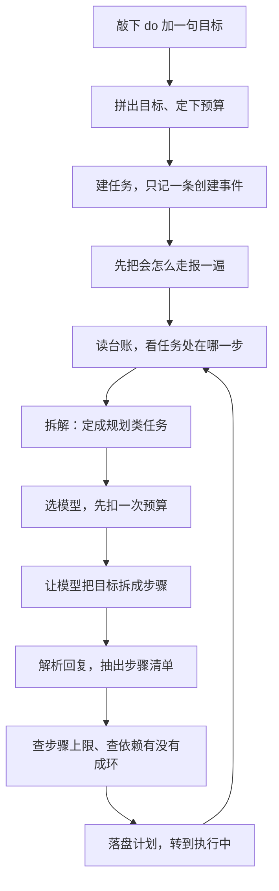
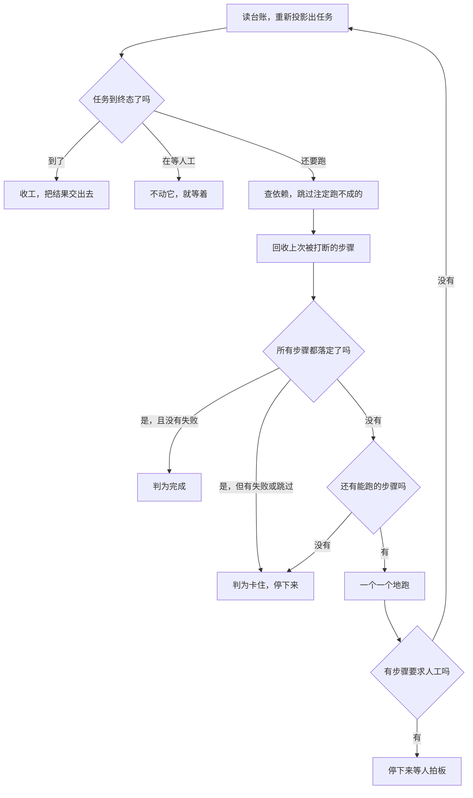
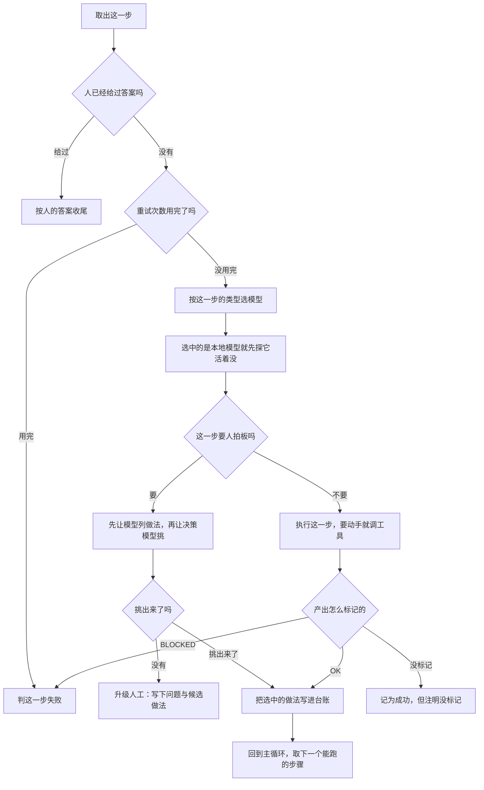
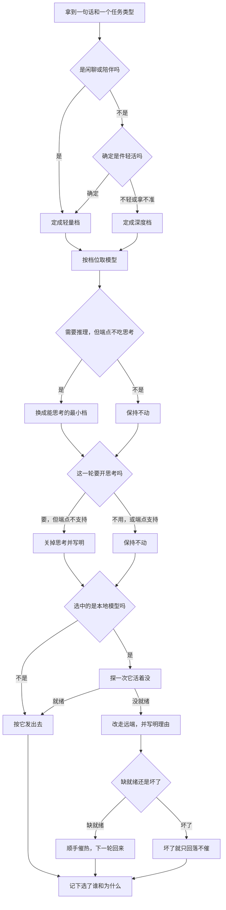
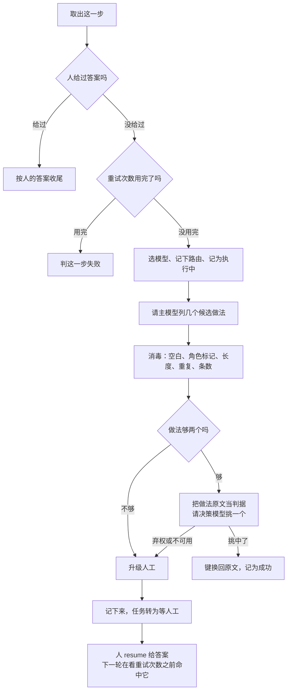
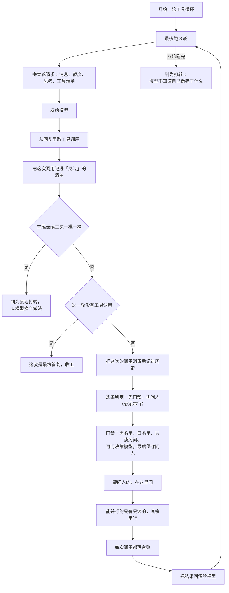

# 02 · 任务链路与决策模型

本文回答两个问题：

1. 敲下 `yunxi-bot do "把这件事办了"` 之后，**这条命到底经过了哪些代码**。
2. **决策模型（本地 Verdict）到底在哪些时刻被问到**，问的是什么，答案怎么用。

## 怎么读这份文档

- 每一条事实后面都跟 `文件:行号`。**没有出处的说法不写进来。**
- 行号对应本文写作时的代码。文件路径相对仓库根。
- 本文只描述**代码里现在是什么样**，不描述"应该是什么样"。发现代码与注释不一致的地方，会明确标出来。
- 文末有「我没能核实的」一节，列的是没有读到、或读到但无法确认运行时行为的事。

> **行号锚定在 2026-10-07 16:26 之后的那份工作区状态。**
> 那一次改动给引擎加了 `Engine::with_ledger`，`crates/yunxi-bot-core/src/task/engine.rs`
> 净增约 71 行，`crates/yunxi-bot-cli/src/main.rs` 与 `chat_handler.rs` 也跟着动了——
> **本文件里这三个文件的每一个行号都是按改动之后重新核过的。**
> 如果它们再变，行号会失效；没有别的办法，只能重新核一遍（见文末第 9 条）。

> **这一版修掉的是"文档在描述一个已经不存在的机制"。**
> 最典型的一处是：§2.1 原本整节在讲"路由时问决策模型要调用次数"，而那个调用点
> **在代码里已经没有了**——`ModelRouter::ask_call_count` 全仓库零调用点。
> 同类问题还有：§3.1 少写了本地模型槽位、§3.3 的"少调用走 Agnes 多调用走 DeepSeek"
> 已经不是路由的判据、§4.4 把一个**已经修好**的接线缺口写成未解之谜。
> 这些都在原处改掉了，并且在改动的地方留了"原来写的是什么、为什么不对"的说明。

---

## 一、一条任务的完整链路

### 1.1 全景流程图

一条 `do` 链路太长，一张图塞不下（也读不了），所以拆成三张。
**每张图的分支点都说人话，函数名与行号统一放在图下面的表里。**

#### 图 1-1：从敲下命令到拿到步骤清单



#### 图 1-2：主循环每轮重新投影



#### 图 1-3：一个步骤怎么跑



三张图里每一个框对应的代码：

| 图 | 这一步在做什么 | 出处 |
|---|---|---|
| 1-1 | 入口：拼目标（过滤 `--` 开头的参数） | `crates/yunxi-bot-cli/src/main.rs:2616-2626` |
| 1-1 | 入口：预算默认 `--budget 20` / `--max-steps 12` | `crates/yunxi-bot-cli/src/main.rs:2628-2638` |
| 1-1 | 入口：`ModelRouter::default()` + 台账 + 决策器探活 | `crates/yunxi-bot-cli/src/main.rs:2660`、`:2685`、`:2395` |
| 1-1 | 入口：干跑预览（按 Planning 画像路由一次，传 `decider = None`） | `crates/yunxi-bot-cli/src/main.rs:2693-2703` |
| 1-1 | 入口：`create_task` 只写 `TaskCreated` | `crates/yunxi-bot-core/src/task/engine.rs:1467`、`main.rs:2731` |
| 1-1 | 拆解：`Engine::plan_task` | `crates/yunxi-bot-core/src/task/engine.rs:708` |
| 1-1 | 拆解：`TaskKind::Planning`、`step_count` 固定 3 | `crates/yunxi-bot-core/src/task/engine.rs:719-725` |
| 1-1 | 拆解：路由 + 本地槽位兜底 + `try_charge` | `crates/yunxi-bot-core/src/task/engine.rs:726-733` |
| 1-1 | 拆解：`handler.plan` → `ChatHandler::plan` | `crates/yunxi-bot-core/src/task/engine.rs:739` |
| 1-1 | 拆解：`parse_plan` | `crates/yunxi-bot-core/src/task/plan.rs:111` |
| 1-1 | 拆解：`steps_allowed` 卡上限、`validate_dependencies` 查环 | `crates/yunxi-bot-core/src/task/engine.rs:742`、`:755` |
| 1-1 | 拆解：写 `TaskPlanned`，`set_state(Running)` | `crates/yunxi-bot-core/src/task/engine.rs:757-767` |
| 1-2 | 主循环：`Engine::run_inner`，每轮 `self.load` 重新投影 | `crates/yunxi-bot-core/src/task/engine.rs:512`、`:525` |
| 1-2 | 主循环：终态 / 等人工 两个提前出口 | `crates/yunxi-bot-core/src/task/engine.rs:533-554` |
| 1-2 | 主循环：`skip_doomed` → `recover_interrupted` | `crates/yunxi-bot-core/src/task/engine.rs:1201`、`:780` |
| 1-2 | 主循环：`all_settled()` 之后再筛一遍失败与跳过 | `crates/yunxi-bot-core/src/task/engine.rs:571-621` |
| 1-2 | 主循环：`ready_steps` 为空 → `Stalled` | `crates/yunxi-bot-core/src/task/engine.rs:624-639` |
| 1-2 | 主循环：逐个 `run_step`，三种停法 | `crates/yunxi-bot-core/src/task/engine.rs:643-670` |
| 1-3 | 单步：`Engine::run_step` | `crates/yunxi-bot-core/src/task/engine.rs:809` |
| 1-3 | 单步：人的答案优先于重试计数 | `crates/yunxi-bot-core/src/task/engine.rs:838-842` |
| 1-3 | 单步：重试用尽 → `StepFailed` | `crates/yunxi-bot-core/src/task/engine.rs:844-856` |
| 1-3 | 单步：`router.route` + `apply_local_fallback` | `crates/yunxi-bot-core/src/task/engine.rs:865-876` |
| 1-3 | 单步：写 `StepRouted`、`StepRunning`，再 `try_charge` | `crates/yunxi-bot-core/src/task/engine.rs:877-902` |
| 1-3 | 单步：`decide:` 分支 → `run_decision` | `crates/yunxi-bot-core/src/task/engine.rs:905-910` |
| 1-3 | 单步：`execute_step` → `classify_step_output` 三分类 | `crates/yunxi-bot-core/src/task/engine.rs:921-959` |
| 1-3 | 决策步：`Engine::run_decision` | `crates/yunxi-bot-core/src/task/engine.rs:1025` |
| 1-3 | 升级人工：`Engine::escalate` | `crates/yunxi-bot-core/src/task/engine.rs:1131` |
| 全部 | 路由：`ModelRouter::route` | `crates/yunxi-bot-core/src/think/router.rs:804` |
| 全部 | 本地槽位健康与回落：`local_health::apply_fallback` | `crates/yunxi-bot-core/src/think/local_health.rs:389` |
| 全部 | 工具循环：`ToolRunner::run` | `crates/yunxi-bot-core/src/tool/runner.rs:407` |

### 1.2 为什么主循环是"每轮重新投影"

`Engine::run` 先把预算账本和用量收集器建好（`engine.rs:431-435`），然后调 `run_inner`，最后统一 `flush_records`（`engine.rs:436-438`）。

`run_inner` 的循环体第一件事是 `let mut task = self.load(task_id)?`（`engine.rs:454`），而 `load` 走的是 `self.store.project()`（`engine.rs:1175-1180`），`LedgerTaskStore::project` 又是 `task_from_events(self.ledger.events())`（`engine.rs:1330-1332`）。

**这样做的理由是：内存里的 `Task` 只是台账的视图，不是真相。** 每轮重新投影，就不存在"内存与台账不一致"这个失效形态（`task/model.rs:23-26` 把这条列为三条设计约束的第一条）。

一个直接后果：循环体里每个分支要么 `return`、要么 `continue`。`engine.rs:447-449` 用 `let mut outcome = None` 当哨兵，让"循环不可达终点"这件事在类型层面成立。

### 1.3 拆解：目标怎么变成步骤清单

`plan_task`（`engine.rs:637`）做的事，按顺序：

1. **给自己的画像**：`TaskKind::Planning`，`step_count: 3`（`engine.rs:648-654`）。
   `step_count` 故意报"至少三步"，代码注释给的理由是：拆解产出是多步计划，按一步报会被判成轻量档（本地那个），而不支持思考的端点拿不到思考，拆出来的步骤质量会掉（`engine.rs:644-647`）。
   **这条注释的结论已经对不上了**，理由见本节末尾。
2. **路由**：`self.router.route(&task.goal, kind, &profile, self.effort, Some(self.decider))`（`engine.rs:655-657`）。注意 `decider` 参数现在**不起作用**——`route` 不查它（见 §3.3）。
3. **本地槽位兜底**：`self.apply_local_fallback(&mut routing)`（`engine.rs:661`）。拆解反正落在 DeepSeek 上，这一行今天不改行为（`engine.rs:658-660`）。
4. **先扣预算再调用**：`ledger.try_charge()?`（`engine.rs:662`）。扣不动就直接出错，不排队不等待（`model.rs:318-327`）。
5. **调用模型**：`self.handler.plan(&routing, &req, records)`（`engine.rs:668`）。真实实现是 `ChatHandler::plan`（`chat_handler.rs:1349`），它把 `目标：... / 最多拆成 N 步。` 作为易变尾，走 `converse`（`chat_handler.rs:1357-1358`）。
6. **解析**：`parse_plan(&raw)`（`engine.rs:670`）。

> **拆解实际落在哪张牌上，是算出来的，不是注释说的那样。**
> `step_count = 3` 让 `estimated_calls()` 得 `1 + 3 + 3/2 = 5`，`5 > MULTI_CALL(4)`，
> 于是 `heuristic_tier()` 直接返回 `Some(Tier::Deep)`，拆解落到 DeepSeek
> （`router.rs:468-497`、`router.rs:852-883`）。
> 而**就算**按一步报（`step_count = 1`，短目标），档位会判成 `Tier::Cheap` → 本地模型，
> 可本地模型**不吃 `thinking` 字段**，于是"需要推理但没有能推理的端点"那条规则
> 会把它换成支持思考的最小档端点，那还是 DeepSeek（`router.rs:897-911`）。
> **两条路都到 DeepSeek**，只是理由不同——`engine.rs:645-647` 那段注释停在旧规格上，没跟着改。

`parse_plan` 自己分四步（`plan.rs:111-142`）：

| 步 | 函数 | 失败时说什么 |
|---|---|---|
| 取 JSON | `extract_json`（`plan.rs:277`） | 报"试了几个候选片段"+首个错误（`plan.rs:318-325`） |
| 拆步骤数组 | `steps_from_value`（`plan.rs:428`） | 逐个反序列化，报"第 N 个步骤的字段不合法"（`plan.rs:450-451`） |
| 查可用性 | `check_usable`（`plan.rs:473`） | 空清单 / id 空白 / id 重复 / instruction 空白（`plan.rs:474-513`） |
| 查依赖图 | `validate_dependencies`（`plan.rs:140`） | 引用不存在的步骤、成环 |

**"截断"有专门的一条检测**：`looks_truncated`（`plan.rs:260-265`）判断"文里出现了 `{` 或 `[`，但从第一个开始找不到配对的闭合"。命中时错误信息里会明说"**回复被截断了**……多半是输出预算不够"（`plan.rs:291-295`、`plan.rs:116-120`）。

为什么这条值得单独做：真机上回复是 `{"steps":[{"id":"s1",...` 被 `max_tokens` 从中间切断，而括号配对扫描会返回内部**每个完整的步骤对象**——那些能正常解析、但没有 `steps` 字段，于是报出来是「顶层对象里没有 steps 字段」，**指向完全错误的方向**（`plan.rs:246-259`）。

**一个必须知道的 schema 让步**：`normalize_kind`（`plan.rs:84-104`）会在 `kind == "decide"` **且** instruction 以 `decide:` 开头时，把 `kind` 字段删掉。因为 `decide` 不在 `TaskKind` 枚举里，模型顺手写上去会让**整份计划被拒**、白费一次拆解调用（`plan.rs:62-83`）。只在两件事同时成立时才丢；普通步骤写 `kind=decide` 仍然报错（`plan.rs:566-573` 的测试锁着这条）。

拆解落地时，`kind` 缺省按 `TaskKind::classify(&p.instruction).unwrap_or(TaskKind::Generation)` 兜底（`engine.rs:677-679`，同一转换在 `plan.rs:525-534` 也有一份，注释说明刻意共用 `planned_to_steps` 以免漂移，见 `plan.rs:517-520`）。

### 1.4 终态判定：`all_settled()` 回答的不是"目标达成没有"

这是整条链路里最容易读错的一处，单独说。

```rust
// task/model.rs:82-85
pub fn all_settled(&self) -> bool {
    !self.steps.is_empty() && self.steps.iter().all(|s| s.state.is_settled())
}
```

而 `is_settled` 的定义是：

```rust
// task/model.rs:234-240
pub fn is_settled(self) -> bool {
    matches!(self, StepState::Succeeded | StepState::Failed | StepState::Skipped)
}
```

**"完成 / 失败 / 跳过"三种都算终态。** 所以 `all_settled()` 回答的是"还有没有在跑的步骤"，**不是**"目标达成没有"。

引擎在 `engine.rs:500` 用它，但**没有直接把它当成成功**。命中之后还要再筛一遍 `Failed | Skipped`（`engine.rs:512-522`）：

- `broken` 为空 → `finish(TaskState::Done)`（`engine.rs:523-527`）
- `broken` 非空 → `set_state(TaskState::Stalled)`，然后 `break` 把 `Waiting` 交出去（`engine.rs:540-550`）

**那一段必须 `break` 不能 `continue`。** 因为 `Stalled` 不是终态——`is_terminal()` 只认 `Done | Failed | Cancelled`（`model.rs:141-147`）。回到循环顶之后 `all_settled()` 仍然为真、`broken` 仍非空，会**无限设 Stalled**。`engine.rs:529-539` 的注释记着这次事故（上一版写的 `continue`，测试套件挂死）。

**为什么这层补丁非有不可**（`engine.rs:501-511`）：真机上抓到过 `s5` 因为"需要使用者拍板"而 BLOCKED（那是对的行为），依赖它的全跳过，而任务状态报的是"**完成**"、文件一个字没改。12 次里出现 2 次。`TaskError` 层的 `needs_human()` 契约管的是单步输出，管不到整条链——这里补的就是整条链那一层。

CLI 那边同样把这两件事分开报：只有 `failed == 0 && skipped == 0` 才打印"完成"，否则打印"完成，但有 N 步失败、M 步被跳过"并返回退出码 1（`main.rs:2786-2796`，`resume` 那条在 `main.rs:3858-3868`）。

`TaskState` 七个取值与允许的迁移写在 `model.rs:108-163`。其中 `Stalled` 的存在理由是：没有它，"依赖成环"和"还在跑"会长得一模一样，于是死锁表现为无限等待（`model.rs:116-120`）。

### 1.5 三个"停下等人"的出口

| 出口 | 触发 | 代码 |
|---|---|---|
| 任务状态转 `AwaitingHuman` | 步骤返回 `StepRun::NeedsHuman` 或错误 `needs_human()` | `engine.rs:575-593` |
| 任务状态转 `Stalled` | `all_settled()` 但有 Failed/Skipped；或 `ready_steps` 为空 | `engine.rs:540`、`engine.rs:561` |
| 直接把错误抛出去 | `Err(e)` 且 `e.needs_human() == false` | `engine.rs:594` |

`TaskError::needs_human()` 的判据是**失败方向朝"不执行"**：只有 `StepFailed` 和 `Core` 返回 false（可以自己重试/是基础设施故障），其余（预算用尽、步骤太多、计划无法解析、依赖成环、需要人工、卡住）一律 true（`model.rs:424-436`）。

---

## 二、决策模型什么时候决策

### 2.0 决策层的形状

先把接口钉死，后面每个调用点都用到。

```rust
// decide/laya.rs:71-73
pub trait Decider: Send + Sync {
    fn decide(&self, req: &DecisionRequest) -> Result<DecisionResult, DecisionError>;
}
```

- **问题**：`Question`，三种 `QuestionKind`——`Choice { criteria }` / `Score { levels }` / `Noul`（`decide/mod.rs:21-37`）。`Question::choice(id, instructions, criteria)` 把 `&[(&str, &str)]` 收成 `选项名 → 判据` 的 `BTreeMap`（`decide/mod.rs:49-64`）。
- **请求**：`DecisionRequest { state, questions }`（`decide/mod.rs:89-99`）。`state` 是"判断所需的证据"，不是"服务知道的一切"（`decide/mod.rs:85-88`）。
- **答案**：`DecisionResult { answers: BTreeMap<String, Answer>, model }`（`decide/mod.rs:135-140`）。`Answer` 四个字段：`choice` / `distribution` / `expected_score` / `noul`（`decide/mod.rs:102-116`）。`DecisionResult::choice(id)` 返回 `Option<&str>`（`decide/mod.rs:153-155`）。
- **传输**：`POST /decide`，请求体 `{state, questions}`，响应 `{answers, model}`（`decide/laya.rs:5-15`）。`LayaDecider` 默认超时 `DEFAULT_TIMEOUT_MS = 2_000` 毫秒（`decide/laya.rs:86`）。

**校验不在适配器里，在 `DecisionEngine` 里，而且是无条件必经之路**（`decide/mod.rs:383-393`）。理由是：塞进 `LayaDecider` 的话，换一个适配器（或测试桩）就会漏掉，而未校验的模型返回值恰恰最危险（比如编出一个没声明的选项）。`laya::validate` 检查：每个问题都有答案、`choice` 落在判据里、概率在 `[0,1]`、分布非空时各项和接近 1（`decide/laya.rs:145-204`、`206-236`）。

**熔断**：连续失败阈值 `DEFAULT_FAILURE_THRESHOLD = 3`（`decide/mod.rs:277`），达到后 `circuit_open()` 为真、直接降级不再调模型（`decide/mod.rs:368-381`），要人工 `reset_circuit`（`decide/mod.rs:425-427`）。

**决策类别决定降级方向**（`decide/mod.rs:196-221`，共七类）：

| 类别 | 降级方向 | 降级动作 |
|---|---|---|
| `Interrupt` | FailClosed | 延后聚合，本轮不打扰 |
| `Escalate` | **FailOpen** | 升级给人 |
| `Irreversible` | NotApplicable | 保持强制人工批准（行为不变） |
| `Classify` | FailClosed | 归入待分类队列，不猜 |
| `Urgency` | FailClosed | 按普通处理 |
| `Anomaly` | **FailOpen** | 按可疑处理并记日志 |
| `Route` | **FailOpen** | 改走远端（Agnes），这一轮照常办 |

第一项与第二项**方向相反**——这正是必须先分类的原因（`decide/mod.rs:199`）。

最后一类 `Route` 是**为本地槽位的回落链单独加的**（D129，`decide/mod.rs:174-181`）：它记的是"原来选的那个端点用不了"，而不是"这句话属于哪一类"。混进 `Classify` 的话，事后按类别翻台账的人会把**端点替换**读成**分类结果**。

### 2.1 调用点一：输入分类（"要办事，还是闲聊"）

> **这一节原来是"路由时的调用次数档位判定"。那个机制已经不存在了**：
> `ModelRouter::route` 现在**不查决策模型**，也不再把 `call_count` 折算成档位。
> 它留下的 `ask_call_count`（`router.rs:961-977`）**全仓库没有任何调用点**，
> 连测试都没有——它是"向本地决策模型问一个数值判断"的范例，不是活的链路。
> 路由的真实判据在 §3.3。

**在哪**：`ModelRouter::classify_input`（`router.rs:1001-1017`）。唯一的生产调用点是 `ChatHandler::route_for`（`chat_handler.rs:867-927`）。

**触发条件**：**每一次 `chat` 输入的开头问一次**，结果在整轮里复用（`chat_handler.rs:872-877`）。
`do` / `resume` / 守护那一轮**不走这里**：那条链路的 `kind` 由引擎自己定（拆解固定 `Planning`，单步用 `step.kind`，决策点固定 `Analysis`），不需要问。

**问的是什么**：`Question::choice("input_kind", "这句话是要我办事，还是随口聊聊？", &TaskKind::input_kind_criteria())`（`router.rs:1004-1008`）。两个选项的判据原文（`router.rs:186-199`）：

| 选项 | 判据原文（节选） |
|---|---|
| `task` | 有事要办：要查什么、要改什么、要跑什么、要写什么、要分析什么……哪怕只有一句话、听起来很随口，只要落点是"办成一件事"，就是这一类 |
| `chat` | 只是闲聊：打招呼、聊感受、随口说一句、问我在不在。不需要我动手做任何事，回一句话就够了 |

判据刻意写得具体，因为**使用者不会说"请执行一个任务"**——他会说"帮我把这个改一下"（`router.rs:179-185`）。

`state` 只放 `{ "input": text }`（`router.rs:1009`）。

**这套判据和 `TaskKind::criteria()` 是两套东西**，不能混（`router.rs:979-986`）：那一套问"需要多少推理"（`shallow`/`drafting`/`deep`），选项里**根本没有"闲聊"**——硬套的话闲聊会被归成"不用推理"，于是走到查找档，**那还是当成了任务**。两套判据的差异有测试钉着（`router.rs:1240-1256`）。

**答案怎么用**：

| 答案 | `classify_input` 返回 | 调用方怎么用（`chat_handler.rs:878`、`:914-918`） |
|---|---|---|
| `task` | `Some(true)` | `kind = TaskKind::classify(input).unwrap_or(TaskKind::Generation)`——再细分成具体类型 |
| `chat` | `Some(false)` | `kind = TaskKind::Conversation` → 路由必落 `Tier::Cheap` → 本地模型 |
| 未知选项 / 缺答案 / 调用失败 | `None` | `verdict.unwrap_or(false)` → **按闲聊处理** |

**弃权往"闲聊"倒**，注释写明了两边代价不对称（`router.rs:988-994`）：把闲聊判成任务，是**天天在花钱**；把任务判成闲聊，是**那件事办不成**。所以 `None` 走免费的那一边——代价是"少办事"，不是"乱花钱"。
注意这条推断的落点变了：判成 `chat` 现在走的是**本地模型**（不是 Agnes），比免费端点还省（不花钱、不占配额、不走网络）；判成 `task` 只是"接下来按 §3.3 的判据选模型"，**不一定**收费。

**分类必须留痕**（`chat_handler.rs:880-911`）：

```rust
// chat_handler.rs:898-911
if let Ok(mut ledger) = Ledger::open(self.home.join("ledger.jsonl")) {
    let _ = record_decision(
        &mut ledger,
        DecisionClass::Classify,
        // **拿不到答案就是降级**——不是"它说是闲聊"。
        verdict.is_none(),
        if is_task { "task" } else { "chat" },
        "问决策模型：这句话是要我办事，还是随口聊聊",
        Some("verdict-small"),
        &["input_kind".to_string()],
    );
}
```

两处细节值得单独说：

- **`degraded = verdict.is_none()`**。行为上"决策模型挂了"和"它说是闲聊"完全一样（都走免费那边），但台账上必须分得开（`chat_handler.rs:903-905`）。这正是 D104/D106 那两次静默降级的形状：功能还在，只是退化了，而退化之后看起来和正常一模一样。
- **开不出来台账就算了**（`if let Ok(...)`）。`ChatHandler` 不常驻一个台账句柄，开不出来只跳过留痕——**留痕失败不该挡住对话**（`chat_handler.rs:895-897`）。

### 2.2 调用点二：任务中途的 `decide:` 步骤

**在哪**：`decision_point`（`crates/yunxi-bot-core/src/task/decide.rs:197`），由 `Engine::run_decision` 在 `engine.rs:1023` 调用，key 固定为 `"task_decision"`。

**触发条件**：引擎发现某一步的指令以 `DECIDE_PREFIX = "decide:"` 开头（`engine.rs:66`、`engine.rs:767`）。而且**顺序很要紧**：
- 先查**人有没有答过**（`engine.rs:767-771`）——在"重试次数用尽"检查**之前**；
- 再看重试次数（`engine.rs:774`）；
- 再路由、落 `StepRunning`、扣预算；
- 最后才进 `run_decision`（`engine.rs:834-839`）。

**问的是什么**：`decision_point` 只认逐字命中的选项（`task/decide.rs:17-19`）。它构造：

```rust
// task/decide.rs:240-245
let state = serde_json::json!({
    "question": question,
    "options": options,
    "criteria": criteria_map,
});
let req = DecisionRequest::new(state, vec![Question::choice(key, question, criteria)]);
```

`criteria` 是 `选项名 → 判据`。**选项名是 `opt0`/`opt1`/…，判据是选项原文**——因为本地 Verdict 是双编码器，按**判据文本**打分，所以判据必须是能读懂的原话，而它回的是键（`engine.rs:1008-1017`）。

**答案怎么用**：`decision_point` 返回 `TaskDecision::Chosen { choice, rationale, alternatives }` 或 `NeedsHuman { question, options }`（`task/decide.rs:84-97`）。引擎在 `Chosen` 分支里把键**换回原文**再落盘（`engine.rs:1031-1044`），因为台账里存 `"opt1"` 这种占位符的话，事后回看"当时选了哪个做法"完全读不出来。

**五条升级人工的路径**（全部汇到 `escalate`，`task/decide.rs:325-348`）：

| 情形 | 说明文字 | 出处 |
|---|---|---|
| 判据本身少于 `MIN_OPTIONS(=2)` | 直接 `Err(TaskError::NeedsHuman)`，**压根不问模型** | `task/decide.rs:204-211` |
| 判据里有空选项名 / 重名 | 同上 | `task/decide.rs:212-227` |
| 决策模型调用失败 | "决策模型不可用（服务未启动、超时，或响应非法）——这是故障，不是它在弃权" | `task/decide.rs:247-258` |
| 响应非法（未声明的选项 / 越界概率） | "决策模型的响应不合法" | `task/decide.rs:263-269` |
| 没有答案 / `choice` 为空 / 选项名对不上 | "没有回应这个问题" / "弃权——它没有选任何一项" / "选了一个不存在的选项" | `task/decide.rs:273-287` |

**"弃权"和"不可用"必须分得开**，这是真机上抓到的（D104）：Verdict sidecar 因为线程耗尽被杀，之后每一次决策都变成"问人"，而没有任何人知道它已经不在了——那份日志里最后一句是 `OMP: Error #137: Cannot create thread.`，而界面上显示的是"任务卡住，需要你拍板"（`task/decide.rs:327-344`）。

**选项名逐字匹配，不做 trim、不忽略大小写**：宽容匹配等于替模型猜它想说什么，而这里猜错的代价是执行了另一种做法（`task/decide.rs:283-287`）。

### 2.3 调用点三：工具审批门禁的"该不该问人"

**在哪**：`ask_local`（`crates/yunxi-bot-core/src/tool/mod.rs:738`），由 `gate` 在第二层调用（`tool/mod.rs:717`）。

**触发条件**：`gate` 是三层，从便宜到贵（`tool/mod.rs:624-732`）：

1. **确定性规则**：`deny` 黑名单命中即终点（`tool/mod.rs:642-653`）；`needs_explicit_approval()` 的能力（`Outbound` / `Unknown`）**命中白名单才放行，否则一律问人，且不问模型**（`tool/mod.rs:660-676`）；`allow` 白名单命中放行（`tool/mod.rs:678-689`）；只读且在工作区内免问（`tool/mod.rs:698-714`）。
2. **本地决策模型**：`ask_local`。
3. **保守兜底**：`GateDecision::Ask`，理由"信号不足，按最保守处理"（`tool/mod.rs:721-731`）。

`Capability` 六类：`ReadOnly` / `Write` / `Execute` / `Network` / `Outbound` / `Unknown`（`tool/mod.rs:63-98`）。`is_inert()` 只认 `ReadOnly`（`tool/mod.rs:113-115`）；`needs_explicit_approval()` 认 `Outbound | Unknown`（`tool/mod.rs:128-130`）。

**问的是什么**：`Question::choice("needs_human", "这个动作该不该先问过使用者？", ...)`，两个选项（`tool/mod.rs:748-755`）：
- `auto`：无需询问：它没有副作用，或者副作用完全在预期范围内
- `ask`：需要询问：它会改变系统状态、或把信息发到外部

`state` 带工具名、能力、粒度、参数（**截断到 600 字符**）、cwd、是否在工作区内（`tool/mod.rs:757-766`）。

**答案怎么用**（`tool/mod.rs:770-779`）：`auto → GateDecision::Allow`、`ask → GateDecision::Ask`、其余（未知选项、缺答案）**返回 `None` 交给第三层兜底**。

**失败方向**：兜底是"问人"，不是"放行"——这一层失败只会让事情更保守（`tool/mod.rs:736-737`）。`decider` 为 `None`（本地决策模型不可用）时只会走第一层和兜底，**不会因此变宽松**（`tool/mod.rs:626-627`）。

### 2.4 调用点四：陪伴/通知的"该不该打扰"

这一层是**两个调用点**，共用同一套三层结构（ADR D24 明确说"打扰判定复用陪伴层的三层，不另造一套"）。

#### 陪伴介入：`decide_intervention`

`companion.rs:206-255`。

- **触发**：陪伴层的一次完整介入决策。
- **问的**：`intervention_questions()`（`companion.rs:117-137`），一个 `Choice` 加两个 `Noul`：
  - `intervention`（Choice，问题"此刻应当如何介入？"）：`speak` = 有值得主动说明的信息，且现在说不会打扰；`hold` = 有信息但现在不适合说，应留到合适时机；`quiet` = 没有需要主动说明的信息，保持静默即可
  - `needs_support`（Noul）："使用者此刻是否处于明确需要情绪支持的状态（而非只是没说话）？"
  - `is_anomaly`（Noul）："近期的运行结果中是否出现了显著偏离常态、需要人知道的情况？"
- **答案怎么用**：`parse_action`（`companion.rs:192-200`）把 choice 解析成 `Intervention`，**未知选项按最保守处理 `Quiet`**；然后与约束层上限取更保守者：`model_action.more_conservative(verdict.ceiling)`（`companion.rs:222-223`）。
- **约束层**（`constraint_ceiling`，`companion.rs:150-189`）四条硬闸，任一命中上限就压到 `Hold`：
  - 处在安静时段（`CompanionPolicy::default()`：23 点到 8 点，`companion.rs:79-80`）
  - 情境标记为安静时段（`companion.rs:161-166`）
  - 今天已打扰次数 ≥ `max_interventions_per_day`（默认 3，`companion.rs:81`）
  - 距上次互动分钟数 < `min_minutes_between_interventions`（默认 120，`companion.rs:82`）
  - 都没命中 → 上限 `Speak`（`companion.rs:185-188`）
- **降级**：引擎类别固定 `Interrupt`（`companion.rs:267-269`），方向 fail-closed。降级时 `Intervention::Hold.more_conservative(verdict.ceiling)`——**约束仍然生效，降级不等于绕过使用者的设定**（`companion.rs:243-253`）。

`Intervention` 的 `Ord` 是 `Speak < Hold < Quiet`，所以 `more_conservative` 用 `max` 而不是 `min`；写成 `min` 会拿到最激进的动作，约束收紧会完全失效（`companion.rs:50-60`）。

#### 邮件/通知分流：`triage_item`

`triage.rs:444-510`。

- **触发**：对一条 `InfoItem` 做打扰判定。
- **顺序**：先算约束层（`triage.rs:455`，**任何路径都要过它，包括确定性规则**），再走第二层模型。
- **第一层确定性规则** `deterministic_triage`（`triage.rs:307-369`），按优先级：

  | # | 规则 | 动作 | 行号 |
  |---|---|---|---|
  | 1 | 黑名单命中 | `Quiet` | `triage.rs:316-326` |
  | 2 | 白名单命中 | `Speak` | `triage.rs:329-339` |
  | 3 | 验证码 | `Speak` | `triage.rs:343-349` |
  | 4 | 群发（`looks_bulk`） | `Hold` | `triage.rs:353-359` |
  | 5 | 机器发件人 | `Hold` | `triage.rs:362-368` |

  `TriagePolicy::default().bulk_threshold = 3`（`triage.rs:122-132`）。
- **第二层**：`triage_questions()`（`triage.rs:378-394`），一个 `Choice` 加一个 `Noul`：
  - `triage`（"这一封邮件此刻应当如何处置？"）：`speak` = 值得现在就告诉使用者，晚了他会不方便；`hold` = 有内容但不必现在说，攒着等他自己看；`quiet` = 与使用者无关或纯噪音，不值得提
  - `needs_action`（Noul）："这封邮件是否明确需要使用者本人做一件事（而不只是知会他）？"
- **`state` 主动裁剪**（`build_state`，`triage.rs:401-438`）：摘要截到 400 字符，**不喂整封正文**；时间戳取不到时 `age_minutes` 是 `null` 而不是编一个数，并另给显式标志 `received_at_known`（`triage.rs:405-412`）。
- **答案怎么用**：`parse_triage` + `apply_ceiling`（`triage.rs:475-490`、`triage.rs:514-539`）；置信度也拼进理由（`triage.rs:487-489`）。
- **降级兜底是 `Hold` 而不是 `Speak`，也不是 `Quiet`**（`triage.rs:492-508`）：`Speak` 会乱说话；`Quiet` 等于**把信息丢了**。`Hold` 保住了它，使用者主动看的时候还在。这是"不打扰"和"不丢失"之间唯一同时成立的那个选择。

### 2.5 调用点五：召回门控拿不准时的兜底

这一处和前四处形状不同：**关键词先跑，只有它判成 `Mixed`（拿不准）时才问模型。**

- **第一层**：`recall_gate::gate(query)`（`crates/yunxi-bot-core/src/recall_gate.rs:179-235`），纯关键词，返回 `MemoryNeed`（`None` / `Profile` / `Episode` / `LongTerm` / `Mixed`，`recall_gate.rs:38-49`）。优先级是刻意排的（`recall_gate.rs:166-178`）：

  | 顺序 | 判据 | 结果 | 行号 |
  |---|---|---|---|
  | 0 | 空串 | `None` | `recall_gate.rs:180-183` |
  | 1 | 明确回指（`BACK_REFERENCE`） | 有时间词 → `Mixed`，否则 `LongTerm` | `recall_gate.rs:192-199` |
  | 2 | 第一人称 + 时间词 | `Episode` | `recall_gate.rs:206-208` |
  | 3 | 第一人称 + 个人名词 / 只有个人名词 | `Profile` | `recall_gate.rs:211-216` |
  | 4 | 只有时间词 | `Mixed`（"去年 Rust 发布了什么版本"问的是世界） | `recall_gate.rs:218-221` |
  | 5 | 通用问法且**无任何第一人称** | `None` | `recall_gate.rs:223-229` |
  | 6 | **什么都没匹配到** | **`Mixed`（保守召回）** | `recall_gate.rs:231-234` |

  第 6 条是这张表里最要紧的一行：**"没看懂"不能等于"不需要"**（`recall_gate.rs:178`）。判错的两个方向不对称——判成"不用召回"而其实要，表现是"它明明记过却想不起来"，**最难查**（`recall_gate.rs:23-31`）。

- **第二层**：`ChatHandler::gate_with_model`（`crates/yunxi-bot-cli/src/chat_handler.rs:518-530`）。
  - **触发条件**：`need == MemoryNeed::Mixed`（`chat_handler.rs:596-600`）。
  - **问的**：`gate_questions()`（`recall_gate.rs:268-294`），question id 是常量 `GATE_QUESTION = "memory_need"`（`recall_gate.rs:238`），问题"为了回答使用者这一句话，需要去查关于他本人的记忆吗？"，六个选项：`none` / `profile` / `episode` / `long_term` / `knowledge` / `mixed`。
  - **state**：只放 `{ "使用者这一句": input }`（`chat_handler.rs:523-526`）——把整段上下文倒进去既浪费调用，也让"它凭什么这么判"变得不可复核。
  - **答案怎么用**：`need_from_choice`（`recall_gate.rs:304-313`）把选项翻成 `MemoryNeed`。**`knowledge` 映射成 `None`**，因为这一层的职责只是决定要不要翻私人记忆。
  - **失败方向**：`gate_with_model` 返回 `None`（没有决策器 / 调用失败 / 选项听不懂），调用方 `unwrap_or(need)` **退回关键词的判断**（`chat_handler.rs:596-597`）。门控是优化，不是对话能不能进行的前提（`chat_handler.rs:593-594`）。
  - **认不出就说认不出，不硬猜**：硬猜一个比不猜更坏，因为它看起来像有依据，事后没法归因（`chat_handler.rs:516-517`）。

### 2.6 调用点汇总

| # | 位置 | 函数 | 触发条件 | question id | 答案形状 |
|---|---|---|---|---|---|
| 1 | 输入分类 | `ModelRouter::classify_input`（`router.rs:1001`） | **每一次 `chat` 输入**（`do` 那条链路不问） | `input_kind` | Choice：`task`/`chat` |
| 2 | 任务决策步 | `task::decide::decision_point`（`task/decide.rs:197`） | 步骤指令以 `decide:` 开头 | `task_decision` | Choice：`opt0`/`opt1`/… |
| 3 | 工具审批 | `tool::ask_local`（`tool/mod.rs:738`） | 前两层确定性规则都定不了 | `needs_human` | Choice：`auto`/`ask` |
| 4 | 陪伴介入 | `companion::decide_intervention`（`companion.rs:206`） | 陪伴层一次介入决策 | `intervention` | Choice：`speak`/`hold`/`quiet`（另两个 Noul） |
| 5 | 通知分流 | `triage::triage_item`（`triage.rs:444`） | 确定性规则全不命中 | `triage` | Choice：`speak`/`hold`/`quiet`（另一个 Noul） |
| 6 | 召回门控 | `ChatHandler::gate_with_model`（`chat_handler.rs:518`） | 关键词判成 `Mixed` | `memory_need` | Choice：`none`/`profile`/`episode`/`long_term`/`knowledge`/`mixed` |

**上面是六个。** 主 `README.md` 那张表列的是同样六个（含"通知分流"这一行）。
两个文档这次已经对齐——**曾经不一致过**：`README` 早先写的是"只在五个地方被问到"，
把"通知分流"算进了"陪伴介入"。代码里 `triage_item` 是一条**独立的**决策调用
（`triage.rs:473`），由 `assistant.rs:171` 的巡览链路驱动、`yunxi-bot check` 走得到
（`main.rs:3314` 的 `cmd_check` → `run_pass`），所以按代码是六个。
**两份文档各说一个数正是这次要修的那类问题**，这里记下它是怎么来的。

**另外有两条路没有被接线**，两条都是 `pub` 却没人调：

| 函数 | 问什么 | 现状 |
|---|---|---|
| `ModelRouter::ask_call_count`（`router.rs:961-977`） | "完成这个任务预计需要多少次模型调用？"（`few`/`several`/`many`） | **全仓库零调用点**，连测试都没有 |
| `ModelRouter::ask_kind`（`router.rs:1023-1031`） | "这个任务需要多少推理？"（`shallow`/`drafting`/`deep`，`router.rs:171-177`） | 只有 `router.rs:1589-1595` 的测试 |

`route` 两个都不调——`kind` 是 `route` 的入参，由调用方给（`router.rs:799-803` 的文档说明了这个设计：把 `kind` 作为参数而不是内部再判一次，是为了让"任务类型是在任务执行层定的"这件事在类型上就成立）。
`ask_call_count` 的保留理由是它自己注释里写的：它是"向本地决策模型问一个数值判断"的完整范例，删掉的话连它那套"弃权怎么处理"的测试也一起没了（`router.rs:952-960`）。

> **那段注释有两处与代码不符，如实记下：**
> 1. 它说删掉会"连测试也一起没了"——**但那个函数的测试已经不存在了**（全仓库搜 `ask_call_count` 只有它自己的定义，`router.rs:961`）。取代它的三条测试在 `router.rs:1124-1151` 的注释里点名写着"那三条测的是'决策模型决定档位'这个机制，而**路由现在根本不问它了**"。
> 2. 它说"真实任务→DeepSeek，寒暄→Agnes"——**两句都不对了**：寒暄现在走本地，而"真实任务"只在那条 `else` 分支上才落 DeepSeek。

**代码里没有说 `ask_kind` 是留给未来的**，只能说它今天没有接线。

---

## 三、模型选择器（router）

### 3.1 四个槽位：三个负责思考，一个负责判断

| 槽位 | `Tier` | 端点 / 模型 | 谁在用 | 限流 | 密钥 |
|---|---|---|---|---|---|
| **本地 Qwen** | `Cheap` | `http://127.0.0.1:17872/v1` · `Qwen3-4B-Instruct-2507` | 闲聊/陪伴、**确定的**简单任务 | 本地进程，字段里填 `600` | **不需要** |
| Agnes 3.0 Flash | `Standard` | `https://api.agnes-ai.cn/v1` · `agnes-3.0-flash` | 本地不可用时的回落目标 | `rpm: 10` | `secrets/agnes.key` 或 `YUNXI_BOT_AGNES_KEY` |
| DeepSeek Flash | `Deep` | `https://api.deepseek.com/v1` · `deepseek-flash` | 复杂任务、拿不准的一切 | `rpm: 60` | `secrets/deepseek.key` 或 `YUNXI_BOT_DEEPSEEK_KEY` |
| **Verdict**（决策层） | 无 | `http://127.0.0.1:17870/decide` | 只回答分类/选择类问题，**不生成文本** | 本地，走回环 | 不需要（权重约 348 MB） |

前三个是 `ModelSpec` 常量，在 `router.rs` 里；第四个**不是 `ModelSpec`**，见本节末尾。

#### 本地 Qwen3-4B —— 闲聊与确定的简单任务

```rust
// router.rs:330-345
pub const LOCAL_QWEN: Self = Self {
    tier: Tier::Cheap,
    provider: "local",
    // **`/v1` 结尾**：`OpenAiThinker` 会自己拼 `/chat/completions`。
    base_url: "http://127.0.0.1:17872/v1",
    model: "Qwen3-4B-Instruct-2507",
    price: PriceTable::LOCAL,
    rpm: 600,
    thinking: Thinking::ServerDefault,
    key_hint: "本地模型不需要密钥（先起 sidecar/local_llm_server.py）",
};
```

- **它是本机的一个 Python 进程**（`sidecar/local_llm_server.py`），不是一个远端服务；所以 `key_hint` 留着只是为了出错时能告诉人"这里本来该有什么"，**不是每个槽位都得有密钥**（`router.rs:320-324`）。
- **档位是 `Cheap`，而不是新加一档**：`Tier` 表达的是"这件事有多重"，闲聊和简单任务本来就是最轻的那一档；以前 `Cheap` 没有对应的 spec、于是回落到默认档（免费的 Agnes），现在给它一个真正本地的实现，语义反而更顺（`router.rs:313-318`）。
- **`rpm` 填 600 而不是 0**：0 在限流器里通常意味着"不允许任何调用"，而不是"不限"——**那是两种相反的语义，猜错的方向是本地模型一次也用不上**（`router.rs:337-340`）。
- **不吃 `thinking` 字段**（`thinking: Thinking::ServerDefault`，`router.rs:343`），和 Agnes 同理。
- 价格表 `PriceTable::LOCAL` **全零 + `free: true`**（`think/cost.rs:71-80`）。全零而不是"照 Agnes 记 0.35"：Agnes 那档虽然免费但刊例价是真的，而本地模型**压根没有刊例价**，硬填一个数会让成本报表凭空多出一列假数字。**电费和显卡折旧不进这个表**——那是"要不要跑本地模型"的决策成本，不是"这一句话花了多少"的边际成本（`think/cost.rs:63-70`）。
- **能力上限明显低于 DeepSeek**，所以它只接闲聊和简单任务；复杂任务走 `Tier::Deep`，不由这里决定（`router.rs:326-329`）。
- 端口 `17872` 在仓库里有**两处**：`ModelSpec::LOCAL_QWEN.base_url`（唯一出处）和 CLI 用来"把 sidecar 拉起来"的 `LOCAL_MODEL_PORT`（`main.rs:2413`），两边注释互相指认。健康探测与催热的地址**只从 `base_url` 推**，不再写第二个数字（`local_health.rs:179-209`）。

#### Agnes 3.0 Flash —— 本地不可用时的回落目标

```rust
// router.rs:350-360
pub const AGNES_FLASH: Self = Self {
    tier: Tier::Standard,
    provider: "agnes",
    base_url: "https://api.agnes-ai.cn/v1",
    model: "agnes-3.0-flash",
    price: PriceTable::AGNES_30_FLASH,
    rpm: 10,
    thinking: Thinking::ServerDefault,
    key_hint: "secrets/agnes.key 或 YUNXI_BOT_AGNES_KEY",
};
```

- 端点：`https://api.agnes-ai.cn/v1`，`POST /v1/chat/completions`，`Authorization: Bearer <key>`（`think/agnes.rs:3-8`）。
- 限流：`rpm: 10`（`router.rs:356`），另有常量 `FREE_TIER_RPM = 10`（`think/agnes.rs:21`，注释记着"2026-09 起从 20 下调到 10"）。`RateLimiter::with_rpm(10)` 会算出 `60_000 / 10 = 6000` 毫秒的最小间隔（`think/mod.rs:340-347`）。
- **不吃 `thinking` 字段**：`accepts_thinking()` 因此返回 false（`router.rs:380-382`）。
- 价格：`PriceTable::AGNES_30_FLASH`，`free: true`，缓存命中 0.035 / 输入 0.35 / 输出 1.0（元每百万 token，高峰空闲同价）（`think/cost.rs:82-91`）。
- 缓存折扣 **10 倍**（`think/cost.rs:62`）。
- **它今天的角色变了**：以前它是默认档（"少调用就走它"），现在它是**本地槽位不可用时的兜底目标**（`local_health.rs:252-256`）。理由是回落的原因是"本地这台机器上跑不了"，不是"这活变难了"——所以**不挑 DeepSeek**。

#### DeepSeek Flash —— 复杂任务与拿不准的一切

```rust
// router.rs:368-377
pub const DEEPSEEK_FLASH: Self = Self {
    tier: Tier::Deep,
    provider: "deepseek",
    base_url: "https://api.deepseek.com/v1",
    model: "deepseek-flash",
    price: PriceTable::DEEPSEEK_FLASH,
    rpm: 60,
    thinking: Thinking::Enabled,
    key_hint: "secrets/deepseek.key 或 YUNXI_BOT_DEEPSEEK_KEY",
};
```

- 模型名 `deepseek-flash`（DeepSeek-V4.1-Flash，`router.rs:364`），端点 `https://api.deepseek.com/v1`。
- 限流：`rpm: 60`（`router.rs:374`），即最小间隔 1000 毫秒。
- `thinking: Thinking::Enabled` 表示**这个端点支持思考**，而不是"每个任务都开"（`router.rs:366-367`）。**三个思考槽位里只有它接受 `thinking` 字段。**
- 价格：缓存命中 0.04（高峰）/ 0.02（空闲），输入 2.0 / 1.0，输出 8.0 / 4.0（`think/cost.rs:48-57`）。**缓存命中与未命中差 50 倍**（`think/cost.rs:44-47`）。
- 高峰时段：北京时间周一至周五 9:00–12:00 与 14:00–18:00，**不含法定节假日**（`think/cost.rs:121-136`）。缺失的后果是节假日按高峰价估算，即**高估成本**——刻意选的方向：宁可高估花费，也不要虚报节省（`think/cost.rs:126-128`）。

> 注意一处文档与常量的措辞差异：`router.rs:32-39` 的模块文档表格里把 DeepSeek 的限流写成"并发 2500，基本无等待"，而 `ModelSpec::DEEPSEEK_FLASH.rpm` 这个字段写的是 `60`（`router.rs:374`）。本文按字段值 60 说。

#### `thinker_config()`：端点参数的唯一出处

`ModelSpec::thinker_config()`（`router.rs:404-430`）**只决定"密钥从哪来、超时给多少"**，`base_url` / `model` / `rpm` / `thinking` 一律从 `self` 取。这一层是补出来的，理由值得记下来：在这之前调用方各自 `match spec.provider` 再手写一份 `ThinkerConfig`，于是"路由选了哪个端点"和"客户端实际连哪个端点"是两份数据，**而只有后一份会被真正使用**。后果实测过：`provider` 是 `"local"`，调用方的 `match` 里没有这一支，掉进 `_ =>` 兜底拿到了 Agnes 的地址——终端打印的是 `Qwen3-4B-Instruct-2507`、台账记的也是 `provider: "local"`，**唯独发出去的请求是给 Agnes 的**（`router.rs:386-396`，即 D128）。

默认那一支**不给密钥**（`router.rs:410-423`）：漏写一个新 provider 时不会悄悄借用别人的凭证，只会在构造时失败。**没接上的槽位报错，好过没接上的槽位借别人的钥匙。**

#### Verdict —— 本地决策模型

**它不是 `ModelSpec`，不在 `router.rs` 里，也不参与"选哪个模型思考"这件事。**

- 它是决策层的本地 sidecar，用 `POST /decide` 契约（`decide/laya.rs:5-18`）。
- 默认端口 `DEFAULT_PORT = 17870`（`sidecar/verdict_server.py:36`），Rust 侧默认端点 `http://127.0.0.1:17870/decide`（`main.rs:2396`、`main.rs:2409`）。
- 超时 `DEFAULT_TIMEOUT_MS = 2_000`（`decide/laya.rs:86`）。
- 选 Verdict 不选 Laya 的四条理由写在 `sidecar/verdict_server.py:5-17`：选项顺序不变性（Laya 翻转率 0.23）、校准诚实（ECE 0.014–0.030）、保形弃权（`calibrate()` 给分布无关的覆盖率保证）、适配成本（`fit()` 在笔记本 CPU 上 0.9 秒）。
- **`think/mod.rs:6-10` 的措辞是过期的**：它写"决策层（`crate::decide`）……本地跑（Laya）"，而现在的实现是 Verdict（`decide/laya.rs:1` 也已经写着"Laya 的本地 sidecar 适配器"这个名字保留）。`LayaDecider` 是**类型名**，指"实现 `Decider` 的 HTTP 适配器"，不必然指向 Laya 模型。同一段模块文档的"默认接远端 Agnes"也旧了——现在默认是本地。

### 3.2 `TaskKind` 七类与它对选择的影响

```rust
// router.rs:94-111
pub enum TaskKind {
    Conversation,  // 寒暄、确认、报个状态。不需要推理。
    Lookup,        // 查一个事实、取一个值、转述一条记录。
    Generation,    // 起草一段文字、写一封邮件、生成一段代码。
    Edit,          // 改一个已有的东西（文件、配置、数据）。
    Analysis,      // 分析、比较、诊断、算一笔账。需要推理。
    Planning,      // 拆解目标、排步骤、定方案。需要推理。
    Execution,     // 跑一条命令、调一个工具、执行一个动作。
}
```

`kind` 对选择的**唯一直接影响**是"要不要思考"：

```rust
// router.rs:127-129
pub fn needs_reasoning(self) -> bool {
    matches!(self, TaskKind::Analysis | TaskKind::Planning)
}
```

**七类里只有分析与规划需要推理**。

分类链 `TaskKind::classify`（`router.rs:135-168`）**顺序即优先级**，推理信号最强所以排最前：

| 顺序 | 判据函数 | 命中给 | 行号 |
|---|---|---|---|
| 1 | `is_complex_reasoning`（15 个词：分析/对比/比较/评估/权衡/诊断/排查/推理/为什么/为何/判断/可行性/利弊/方案/预算多少） | `Analysis` | `router.rs:136-138`、`router.rs:599-618` |
| 2 | `detect_planning`（8 个词：拆解/拆成/排期/规划/路线图/分期/分几个阶段/先后顺序） | `Planning` | `router.rs:139-141`、`router.rs:621-633` |
| 3 | `detect_execution`（10 个词：运行/执行/跑一下/跑个/启动/部署/安装/重启/调用工具/发出去） | `Execution` | `router.rs:142-144`、`router.rs:636-650` |
| 4 | `detect_edit`（8 个词：修改/改成/改一下/删掉/删除/替换/更新一下/重命名） | `Edit` | `router.rs:145-147`、`router.rs:653-665` |
| 5 | `detect_code`（8 个记号：三个反引号组成的代码块围栏、代码、脚本、函数、编译、报错、bug、.rs）；有"写一个/写个/实现一个/新写/从零"算 `Generation`，否则 `Edit` | `Generation`/`Edit` | `router.rs:148-155`、`router.rs:734-737` |
| 6 | `detect_generation`（12 个词：写一封/写个/写一个/写一段/写一份/起草/拟定/拟一份/生成/润色/扩写/缩写） | `Generation` | `router.rs:156-158`、`router.rs:672-688` |
| 7 | `detect_lookup`（8 个祈使式 + 6 个疑问式："哪/几/多少/有没有/吗/谁"） | `Lookup` | `router.rs:159-161`、`router.rs:695-717` |
| 8 | 短、无信号（`0 < 长度 < SHORT_PROMPT_CHARS(200)`） | `Conversation` | `router.rs:162-166` |
| — | 都不命中 | `None`（"该问下一步了"的信号） | `router.rs:167` |

两条刻意的设计：
- **"对比一下"的短句是分析任务**，不该因为字少被当成寒暄（`router.rs:132-134`）。
- `detect_lookup` 有祈使式和疑问式**两条并行判据**：只留前一条会把"查一下快递到哪了"漏成对话（`router.rs:692-716`）。

**另外两套和 `TaskKind` 有关、但用途完全不同的判据**，别和分类链混：

| 函数 | 问题 | 选项 | 用在哪 |
|---|---|---|---|
| `TaskKind::input_kind_criteria()`（`router.rs:186-199`） | 这句话是要我办事，还是随口聊聊 | `task` / `chat` | `classify_input`（§2.1） |
| `TaskKind::criteria()`（`router.rs:171-177`） | 这个任务需要多少推理 | `shallow` / `drafting` / `deep` | `ask_kind`——**今天没有调用点**（§2.6） |
| `TaskKind::from_choice()`（`router.rs:202-209`） | — | 把上面那套的选项翻回 `TaskKind` | 同上 |

`kind` 由调用方给出，不在这里判：拆解固定 `TaskKind::Planning`（`engine.rs:648`），单步用 `step.kind`（`engine.rs:796`），决策点固定 `TaskKind::Analysis`（`engine.rs:980`）。步的 `kind` 来自模型给的 `PlannedStep.kind`，缺省时按指令文本判（`engine.rs:677-679`）。

### 3.3 路由真正的判据：三行代码，不问任何人

> **这一节原来是"不需要多次调用 → Agnes，需要多次 → DeepSeek"。那条规则已经不存在了。**
> 现在 `route` **不查决策模型**（`Routing::used_decider` 恒为 `false`），
> 也不再拿 `call_count` 的答案折算档位。

`ModelRouter::route`（`router.rs:804-950`）里定档的就是一个三分支（`router.rs:852-883`）：

```rust
// router.rs:852-883（节选：三段各自的判据与理由文案）
let (tier, reason) = if kind == TaskKind::Conversation {
    (Tier::Cheap, "档位=轻量：寒暄/陪伴走本地模型（Qwen3-4B-Instruct-2507）".to_string())
} else if profile.heuristic_tier() == Some(Tier::Cheap) {
    (Tier::Cheap, format!("档位=轻量：简单任务走本地模型，预计 {calls} 次调用（{} 字 / {} 步）", ...))
} else {
    (Tier::Deep, format!("档位=深度：复杂任务走 DeepSeek（deepseek-flash），预计 {calls} 次调用（{} 字 / {} 步）", ...))
};
```

三句话说完：

| # | 条件 | 档位 | 落到哪张牌 |
|---|---|---|---|
| 1 | `kind == TaskKind::Conversation` | `Tier::Cheap` | 本地 Qwen |
| 2 | 否则 `profile.heuristic_tier() == Some(Tier::Cheap)` | `Tier::Cheap` | 本地 Qwen |
| 3 | **其余一切，包括 `heuristic_tier()` 返回 `None`** | `Tier::Deep` | DeepSeek |

**门槛卡在"确定是轻量"，不是"大概不重"。** 两个方向的代价不对称（`router.rs:857-866`）：

- 错判成本地：一个任务办砸，可能还要重试，**使用者直接受损**
- 错判成 DeepSeek：多花几分钱，**任务还是办成了**

**省钱的收益是线性的，砸任务的损失不是。**

`heuristic_tier()`（`router.rs:482-497`）本身没变，仍然是两条确定性判据：

```rust
// router.rs:482-497
pub fn heuristic_tier(&self) -> Option<Tier> {
    let calls = self.estimated_calls();
    if calls > thresholds::MULTI_CALL {
        return Some(Tier::Deep);
    }
    // 明确的小任务
    if self.prompt_chars > 0
        && self.prompt_chars < thresholds::SHORT_PROMPT_CHARS
        && self.step_count <= 1
        && !self.explicit_multi
        && !self.has_code
    {
        return Some(Tier::Cheap);
    }
    None
}
```

**注意它的两个返回值在 `route` 里的地位完全不同**：`Some(Tier::Cheap)` 被用来**定档**，而 `Some(Tier::Deep)` 和 `None` **走同一个分支**（都是 `else`）。
换句话说，**`heuristic_tier()` 今天只回答一个问题："这件事确定是轻的吗？"** 它返回 `Deep` 只是在说"不轻"，并没有直接把档位定成 Deep——那个 `else` 本来就给 Deep。

`estimated_calls()`（`router.rs:468-477`）仍然是 `1 + steps + steps / 2`：

```rust
// router.rs:468-477
pub fn estimated_calls(&self) -> usize {
    let steps = if self.step_count > 0 {
        self.step_count
    } else {
        // 没拆解前粗估：每 300 字算一步，至少 1 步
        (self.prompt_chars / 300).max(1)
    };
    // 拆解 1 次 + 每步 1 次 + 决策点按步数的一半估
    1 + steps + steps / 2
}
```

`MULTI_CALL = 4`，注释给的依据仍是 Agnes 免费档 10 RPM ≈ 每次间隔 6 秒，4 次调用要等约 18 秒还在"能接受"的范围（`router.rs:435-439`）。**但这条依据今天已经不对应真实决策了**：那个 `calls > MULTI_CALL` 的分支只用来判"不轻"，而"不轻"之后去的是**收费的 DeepSeek**，不是"不排队的那个"。

档位到模型的映射在 `ModelRouter::spec`（`router.rs:791-797`）：

```rust
self.specs.iter().find(|s| s.tier == tier)
    .or_else(|| self.specs.iter().find(|s| s.tier == self.default_tier))
    .or_else(|| self.specs.first())
```

**注册表里有三个槽位了**：`ModelRouter::default()` 放的是 `[LOCAL_QWEN(Cheap), AGNES_FLASH(Standard), DEEPSEEK_FLASH(Deep)]`，`default_tier = Tier::Standard`（`router.rs:757-769`）。所以：

- `Tier::Cheap` → **本地 Qwen**（这是这一轮新接上的；在这之前 `Cheap` 没有 spec，会回落到 Standard → Agnes）
- `Tier::Standard` → Agnes（今天**只有** `default_tier` 这一条路能走到它；回落链直接用 `ModelSpec::AGNES_FLASH`，不走档位）
- `Tier::Deep` → DeepSeek

> **档位的名字容易读错。** `Standard` 挂的是免费的 Agnes，而 `Cheap` 挂的是**更省的本地模型**——
> `router.rs:826-831` 那句注释就是为这件事写的："**看到 `Standard` 别当成'贵的那个'。**"

`route` 的签名里 `decider` 参数还在，但**它是死的**（`router.rs:810` 写成 `_decider`）：

```rust
// router.rs:804-811
pub fn route(
    &self,
    _task_text: &str,
    kind: TaskKind,
    profile: &TaskProfile,
    effort: ReasoningEffort,
    _decider: Option<&dyn Decider>,
) -> Routing
```

`Routing::used_decider` 因此**恒为 `false`**（`router.rs:944-947`），字段留着是因为它对调用方仍有意义："这次档位是不是决策模型定的"——答案是"不是，是分类定的"。

**为什么把决策模型从路由里拿掉**（`router.rs:833-839` 的注释）：原来一次会话输入会问它 2~3 次（拆解路由 + 步骤路由 + 决策点），路由不再问之后，那两次直接消失了。**分类那一步才是它该管的**（§2.1）。这条路有测试直接钉着：`a_real_task_goes_to_deepseek_without_asking_the_decider` 断言 `stub.calls() == 0`（`router.rs:1124-1151`）。

**拆解落在哪**（把上面几条合起来算）：`plan_task` 报 `step_count: 3`，于是 `estimated_calls() = 1 + 3 + 3/2 = 5 > 4`，`heuristic_tier()` 返回 `Some(Tier::Deep)`，`route` 走 `else` → `Tier::Deep` → DeepSeek（`engine.rs:648-657`、`router.rs:852-883`）。

### 3.4 思考模式怎么决定

唯一依据是 `ReasoningEffort::applies`：

```rust
// router.rs:231-237
pub fn applies(self, kind: TaskKind, tier: Tier) -> bool {
    match self {
        ReasoningEffort::Always => true,
        ReasoningEffort::Never => false,
        ReasoningEffort::Auto => tier == Tier::Deep && kind.needs_reasoning(),
    }
}
```

**默认值是 `Auto`**（`router.rs:212-223`）。`Auto` 下要**同时**满足两条才开思考：
1. 档位是 `Tier::Deep`（即走 DeepSeek）
2. 任务类型需要推理（`Analysis` 或 `Planning`）

`Always` / `Never` 是使用者的显式覆盖。CLI 的 `do` 用 `parse_effort(args)` 解析（`main.rs:2382-2392`），`chat` 同样吃 `--thinking auto/on/off`。

为什么"只有 Deep 才开"：免费档不值得为思考花等待时间和 token 预算，而且轻量档的任务类型本来就不需要推理（`router.rs:226-230`）。
**今天这条理由更硬了**：三个思考槽位里只有 DeepSeek 接受 `thinking` 字段，本地 Qwen 和 Agnes 都是 `ServerDefault`。所以"档位不是 Deep"和"拿不到思考"在实践里基本等价。

三个 `Thinking` 取值到线上字段的映射（`router.rs:273-279`）：

| `Thinking` | 请求体字段 |
|---|---|
| `ServerDefault` | **不传** |
| `Enabled` | `{"type": "enabled"}` |
| `Disabled` | `{"type": "disabled"}` |

`Routing::thinking_field()` 在这里加了一道保险：端点不支持思考时**返回 `ServerDefault`，绝不硬塞**（`router.rs:524-529`）。

`route` 里思考轴的计算与降级（`router.rs:913-922`）：

```rust
let mut think = effort.applies(kind, spec.tier);
if think && !spec.accepts_thinking() {
    // 选了不支持思考的端点却要思考 → 说清楚并降级，不静默
    reason.push_str(&format!("；{} 不支持思考模式，已降级为不开思考", spec.provider));
    think = false;
}
```

`reason` 字符串也在这一段拼：`Auto` 时写"思考模式按任务类型定：{类型} {需要/不需要推理}"，否则写"思考模式由使用者指定：{档}"（`router.rs:923-934`）。

**思考模式的输出预算要额外加余量。** `max_tokens` 是"思考过程 + 正文"的总和，不是正文的额度。`THINKING_OUTPUT_HEADROOM = 2048`（`engine.rs:57`），在 `converse` 里一处统一加（`chat_handler.rs:1139-1149`）。常量文档记着实测：拆解请求在 `max_tokens=2048` 时被截断（`finish_reason=length`），思考吃掉 280~540 token；`max_tokens=4096` 正常结束（`engine.rs:45-56`）。

**思考模式与工具调用不冲突**——实测 `finish_reason=tool_calls` 且正常带回 `reasoning_content`（`router.rs:27-28`）。工具循环每一轮都要带思考模式，只在第一轮带会让后续轮次静默退回默认（`runner.rs:426-430`）。

### 3.5 两个轴的交汇：需要推理，但选中的端点不支持思考

这是 `route` 里唯一一处"模型轴的结论被思考轴否决"的地方（`router.rs:897-911`）：

```rust
if kind.needs_reasoning()
    && !spec.accepts_thinking()
    && effort != ReasoningEffort::Never
    && let Some(better) = self
        .specs
        .iter()
        .filter(|s| s.accepts_thinking())
        .min_by_key(|s| s.tier)
{
    reason.push_str(&format!(
        "；这一步需要推理，但 {} 不支持思考模式，改用 {}",
        spec.provider, better.provider
    ));
    spec = better.clone();
}
```

**这条今天比过去更容易被触发**：以前只有 Agnes 不支持思考，现在**本地 Qwen 也不支持**，而它恰好就是 `Tier::Cheap` 的落点。所以每一个"判成轻量、但类型是分析/规划"的步骤都会走这里。

放在今天注册表上，`filter(accepts_thinking).min_by_key(tier)` **只有 DeepSeek 一个候选**，所以效果就是"**需要推理 → 一定升到 DeepSeek**"。举例：一个只有一句话的 `Analysis` 步骤，`heuristic_tier()` 判它 `Some(Tier::Cheap)` → 本地 Qwen；本地不吃 `thinking`，于是被换成 DeepSeek，`reason` 里留下"这一步需要推理，但 local 不支持思考模式，改用 deepseek"。

**判据顺序仍然关键：调用次数决定"要不要省这次钱"（成本），需要推理决定"这一步能不能拿到思考"（硬约束）。**（`router.rs:888-896`）

注意 `effort != ReasoningEffort::Never` 这一条：使用者显式说"不要思考"时，这个升级不发生——那时本地模型就是对的。
**但 `Routing::tier` 记的是换完之后那个 spec 的档位**（`router.rs:938`，`tier: spec.tier`），所以一次升级之后台账上看到的是 `Deep`，不是最初判出来的 `Cheap`。这是刻意的：`Routing` 不能自己和自己对不上。

### 3.6 降级与失败方向

**"fail-closed" 在本仓库的定义是：不确定时朝"不做"倒——不打扰、不升级、不动**（`decide/mod.rs:180-182`）。它的反面 `FailOpen` 是"朝告警倒：不确定就叫人"。

它在**四层**落地，方向并不统一——**这正是必须先分类的原因**：

| 层 | 位置 | 失败方向 | 具体行为 |
|---|---|---|---|
| 决策类别 | `DecisionClass::direction`（`decide/mod.rs:200-221`） | 逐类不同 | `Interrupt`/`Classify`/`Urgency` → FailClosed；`Escalate`/`Anomaly`/`Route` → FailOpen；`Irreversible` → NotApplicable |
| 任务执行 | `TaskError::needs_human`（`model.rs:429-435`） | 朝"不执行" | 只有 `StepFailed` / `Core` 可自愈，其余一律停下等人 |
| 工具审批 | `gate` 第三层（`tool/mod.rs:721-731`） | 朝"问人" | 模型弃权/不可用 → `GateDecision::Ask`，**不是 Allow** |
| 本地槽位回落 | `local_health::decide`（`local_health.rs:220-260`） | **朝"远端"** | 不是"就绪"就换 Agnes。这是**可用性方向**的保守，不是安全方向 |

最后一行值得单独说：**路由这一层的失败方向与其它三层不同。** 其它三层都朝"不执行/问人"倒，本地槽位那层朝"**换个端点把这一轮办完**"倒。这是刻意的（`decide/mod.rs:214-218`）：两边的代价不对称——错判成远端多花几分钱，错判成本地则这一轮**必然失败**。而且选中的模型无论如何都要过审批门禁，所以这一层不需要承担安全方向的保守。

**"路由弃权就回落免费档"那条分支已经不存在了**（它随"路由去问决策模型"一起被删掉）。今天路由不产生失败，因为它不再调用任何东西。

`route` 里"说清楚，不静默"的两处：
- 端点不支持思考却要思考 → 降级为不开，并把原因拼进 `reason`（`router.rs:915-921`）
- 需要推理但端点不支持思考 → 换端点，并把原因拼进 `reason`（`router.rs:906-909`）

第三处是回落链自己加的：`apply_fallback` 把"本地为什么用不了"拼进 `routing.reason`（`local_health.rs:412`）。

`reason` 会随 `RoutingRecord` 进台账（`model.rs:243-265`、`engine.rs:806-814`），"只存能解释账单的字段，不存整个 `Routing`"（`model.rs:243`）。

**熔断与置信度**（`decide/mod.rs:394-441`）：
- `DecisionEngine::decide` **永不返回 `Err`**——失败一律转成降级，因为调用方必须拿到一个明确的、可留痕的走向（`decide/mod.rs:394`）。
- 连续失败达到 `DEFAULT_FAILURE_THRESHOLD = 3` 后 `circuit_open()`，暂停调用模型（`decide/mod.rs:293`、`decide/mod.rs:384`）。
- `with_min_confidence` 可设置信度下限，低于它按"模型自己不确定"降级；但注释强调**只应在用自己的数据校准过之后设置**（`decide/mod.rs:374-378`、`decide/mod.rs:413-423`）。
- 降级必须可见：`DecisionOutcome::ledger_data` 给出 `degraded: true` + `class`/`direction`/`action`/`reason`（`decide/mod.rs:269-290`）。

### 3.6b 本地槽位的回落链（D129）

这一条不在 `route` 里，而是**紧接着 `route` 之后**的一道独立闸门。放在这里是因为它改写的正是 `route` 的输出。

**它的存在理由是 D128 那个 bug 的形状**：功能还在，只是退化成了一个看不出来的样子。D126 把本地槽位接进路由之后，请求**真的**打到 `127.0.0.1:17872` 了——于是"它可能根本没在跑"第一次成了一个真问题（`local_health.rs:3-6`）。

**判定只有一份，两个调用方共用**：

| 调用方 | 注入点 | 默认值 |
|---|---|---|
| 对话（`chat`） | `ChatHandler::apply_local_fallback`（`chat_handler.rs:951-987`） | `Probe::real()`——**默认真去连**（`chat_handler.rs:211-218`） |
| 任务引擎（`do` / `resume` / 守护 / 干跑） | `Engine::with_local_probe`（`engine.rs:434-437`），在 `plan_task` / `run_step` / `run_decision` 三处调用（`engine.rs:732`、`:876`、`:1056`） | `None`——**不挂就是不探**（`engine.rs:348-366`） |

两边的默认值**故意相反**：
- 对话那条链路只有一个跑法，使用者敲下的那一句**一定**在能起 sidecar 的那台机器上，所以默认真探。
- 引擎是 core 里的东西，被近千条测试、干跑、端到端脚本反复构造。默认去连 `127.0.0.1:17872` 的话，**测试的结论会取决于开发机上有没有起 sidecar**——同一份代码在两台机器上答案不同。代价要写明白：**没挂 = 没有兜底**，所以 CLI 那几条真会发请求的路**每一处都必须挂**（`main.rs:2740`、`:2786`、`:3871`，守护那一轮在 `:566`）。

判定本身是**纯函数**（`local_health::decide`，`local_health.rs:220-260`），六种健康状态 → `Keep | Fallback`：

| `/health` 说什么 | 这一轮走谁 | 要不要催热 |
|---|---|---|
| `ok`：权重在显存里 | **留在本地** | 不催 |
| `loading`：还在加载（几十秒） | 走 Agnes | **催**（`/warmup`） |
| `idle`：权重被空闲释放了 | 走 Agnes | **催**（`/warmup`） |
| `degraded`：上次加载失败过，**不会重试** | 走 Agnes | 不催 |
| `unreachable`：连不上 / 超时 / 非 2xx | 走 Agnes | 不催 |
| `unexpected`：答了 200，但状态不认识 | 走 Agnes | 不催 |

四条值得单独说：

1. **状态在响应正文里，不只在状态码里。** 这几种状态**全都是 HTTP 200**（`local_llm_server.py:605-634`），所以"能连上"远远不等于"能用"。只看状态码会把 `degraded` 当成健康，而那恰恰是最该回落的一种（`local_health.rs:80-84`）。

2. **`idle` / `loading` 必须顺手踢一脚 `/warmup`，否则本地槽位会静默死掉。** 空闲回收之后 `/health` 报 `idle`；只回落、不催热的话，下一轮探还是 `idle`、于是再回落……**那个本地模型再也不会被用到**，而每一处显示都正常：走的还是免费端点、账也没多花、没有一处报错（`local_health.rs:27-32`、`:139-143`）。
   反方向（`idle` 就留在本地）同样不行：sidecar 在 `_model` 为空时**同步加载**，8 GB 要十几秒——使用者盯着一个不动的光标（`local_health.rs:34-36`）。所以走第三条：**这一轮走 Agnes（快），同时 fire-and-forget 地 `POST /warmup`，下一轮回到本地**（`local_health.rs:38-41`）。
   `degraded` / `unreachable` / `unexpected` **不催**：一个不重试（`_load_once` 见到 `_model_error` 就立刻返回），一个没人监听，一个**我们不知道那是什么**——对一个不认识的进程动手，比不动手更坏（`local_health.rs:126-137`）。

3. **非本地槽位连探都不探。** `apply_fallback` 第一行就 `if !is_local(&routing.spec) { return None; }`（`local_health.rs:390-392`）。远端端点的健康和 17872 上那个进程没有关系；白探一次不只是多花最多 300 ms——探失败时还会把"本地没起来"记到一次本来和它无关的路由上。
   判据用 `provider == "local"` 而不是 `base_url`：`provider` 才是路由和台账用的身份，`base_url` 是可以变的（`local_health.rs:171-177`）。

4. **换端点必须连档位一起换。** `apply_fallback` 同时改 `routing.spec` 和 `routing.tier`（`local_health.rs:416-417`）。只换 `spec` 的话 `Routing` 自己和自己对不上，而台账、终端标签、成本统计读的正是这两个字段（`local_health.rs:413-415`）。

`/health` 与 `/warmup` 的地址**从 `LOCAL_QWEN.base_url` 推**，代码里不写第二个端口号（`local_health.rs:188-209`）：探的是哪台机器、催的就是哪台机器上的同一个进程，而端口只有一份出处。探测超时 `HEALTH_TIMEOUT_MS = 300`，催热超时 `WARMUP_TIMEOUT_MS = 300`——**两个常量值相同但理由不同，所以是两个常量**（`local_health.rs:59-78`）。

**留痕要挂两处，形状必须一样**：

| 留痕方式 | 对话链路 | 任务引擎 |
|---|---|---|
| 理由进 `routing.reason` | `chat_handler.rs:925` 之后 | `engine.rs:732` / `:876` / `:1056`，随后进 `TaskPlanned`（`engine.rs:760`）或 `StepRouted`（`engine.rs:879`） |
| stderr 上一行 | `chat_handler.rs:968` | `engine.rs:466` |
| 一条 `DecisionClass::Route` 决策事件 | `chat_handler.rs:974-985`（默认就有） | `Engine::with_ledger`（`engine.rs:445-448`），**不挂就没有**（`engine.rs:367-395`） |

决策事件那一栏值得单独说，因为它是**同一个动作在两条链路上形状必须一致**的例子：两边都记 `DecisionClass::Route` + `degraded = true` + 同一句 action，**`model` 字段是 `None`**——没有模型回答过这个问题，答话的是 sidecar 的 `/health`；填一个模型名会把归因引到一条根本没发生过的调用上（`engine.rs:470-477`、`chat_handler.rs:974-978`）。
引擎那边**没挂 `with_ledger` 的表现最阴**：回落照旧发生、终端照旧打一行，而台账里就是没有那条 `route`——"本地到底有没有被用上"又查不出来了（`engine.rs:390-394`）。CLI 因此把 `do`、干跑、`resume`、守护**四处全挂上**（`main.rs:2744`、`:2790`、`:3874`、`:570`）。

### 3.7 路由与回落流程图

这张图覆盖 `route` 和紧接着的本地槽位回落两段。**一条判据一个框，框里说人话。**



图里每个判断的代码位置：

| 框 | 判据 | 出处 |
|---|---|---|
| 是闲聊或陪伴吗 | `kind == TaskKind::Conversation` | `router.rs:852-856` |
| 确定是件轻活吗 | `profile.heuristic_tier() == Some(Tier::Cheap)` | `router.rs:867-874` |
| 不轻或拿不准 | 上面两条都不成立（**含 `None`**） | `router.rs:875-883` |
| 按档位取模型 | `ModelRouter::spec` | `router.rs:791-797` |
| 需要推理，但端点不吃思考 | 换端点（今天只有 DeepSeek 可选） | `router.rs:897-911` |
| 这一轮要开思考吗 | `ReasoningEffort::applies` | `router.rs:231-237` |
| 关掉思考并写明 | `think && !spec.accepts_thinking()` | `router.rs:915-921` |
| 探一次它活着没 | `local_health::apply_fallback` → `Probe::health` | `local_health.rs:389-393` |
| 缺就绪还是坏了 | `LocalHealth::needs_warmup` | `local_health.rs:144-146` |
| 顺手催热 | `Probe::warm` → `POST /warmup`，300 ms，不等结果 | `local_health.rs:397-411` |
| 记下选了谁和为什么 | 拼 `reason`、估算用量，返回 `Routing` | `router.rs:923-949` |
| （落库时）端点不吃就不传字段 | `Routing::thinking_field()` | `router.rs:524-529` |

---

## 四、`decide:` 步骤的完整生命周期

### 4.1 时序



图里每一步的代码位置：

| 图里的动作 | 出处 |
|---|---|
| 指令以 `decide:` 开头吗 | `engine.rs:767`、`engine.rs:834` |
| 先查人有没有给过答案 | `engine.rs:767-771`；`settle_human_answer` 在 `engine.rs:933` |
| 再看重试次数 | `engine.rs:774-785` |
| 选模型（`TaskKind::Analysis`、1 步、`decider = None`） | `engine.rs:978-980` |
| 记下选了谁 / 记为执行中 / 扣预算 | `engine.rs:806-831` |
| 请它列做法 | `engine.rs:988-1001` → `ChatHandler::observe`（`chat_handler.rs:1377`） |
| 系统提示只输出问题与候选 | `task/decide.rs:68-82` |
| 消毒 | `parse_options`（`task/decide.rs:131-187`） |
| 做法少于两个 → 升级人工 | `engine.rs:1004-1006` |
| 造判据、键编成 `opt0`/`opt1` | `engine.rs:1013-1021` |
| 请它挑一个 | `decision_point`（`task/decide.rs:197`），调用点 `engine.rs:1023` |
| 把键换回原文、记为成功 | `engine.rs:1031-1049` |
| 记下"问了什么、为什么没定" | `engine.rs:1083-1095` |
| 放回待执行、清零尝试、转等人工 | `engine.rs:1098-1099` |
| 打印"停下等人" | `main.rs:2814` |
| `resume --answer` 落答案 | `main.rs:3764-3788` |
| 这一步放回待执行 | `main.rs:3796-3808` |
| 下一轮命中人的答案 | `engine.rs:767-771` |

### 4.2 各阶段的关键判断

**选项生成侧**（`task/decide.rs` 的模块文档把它叫"第一道闸"，`task/decide.rs:12-16`）：

- `OPTIONS_SYSTEM_PROMPT` 是**常量**（`task/decide.rs:68-77`）。任何随调用变化的字节混进来，缓存前缀就作废，所以目标与步骤只能进用户消息（`task/decide.rs:64-67`）。
- `options_request`（`task/decide.rs:103-112`）用 `PromptLayout` 把稳定前缀进 system、`# 任务目标 / # 当前步骤` 进用户消息，温度 `OPTIONS_TEMPERATURE = 0.2`（`task/decide.rs:48-53`）——列做法不需要创造性，需要的是**稳定**。
- `parse_options`（`task/decide.rs:131-187`）的消毒清单：

  | 检查 | 常量/取值 | 失败 |
  |---|---|---|
  | `question` 非空 | — | 拒绝整份 |
  | `question` 长度 | `MAX_QUESTION_CHARS = 300` | 拒绝 |
  | 选项非空 | — | 拒绝 |
  | 单条选项长度 | `MAX_OPTION_CHARS = 120` | 拒绝 |
  | 角色冒充标记 | `ROLE_MARKERS = ["system", "assistant", "developer"]` | 拒绝 |
  | 选项去重（按小写归一） | — | 拒绝 |
  | 选项条数 | `MIN_OPTIONS = 2` .. `MAX_OPTIONS = 6` | 拒绝 |

  **超限拒绝而不是截断**：截断会悄悄改掉做法本身，而本地决策模型是照字面选的，它选中的将是一句我们没写完整的话（`task/decide.rs:38-46`）。
  **任何一条不合格都拒绝整份响应**，而不是丢掉坏的那条：丢一条会悄悄改变模型的提案（`task/decide.rs:128-130`）。
  消毒放在解析里而不是留给调用方：解析是唯一入口，只要有一条路径忘了消毒，"选项"就能变成塞进决策模型提示里的新指令（`task/decide.rs:124-127`）。选项会进决策模型的 `state`，而 `state` 是给模型看的指令区（`task/decide.rs:55-62`）。

  注意这里有**两个同名常量**：`task/decide.rs:32` 的 `MIN_OPTIONS = 2`（用于 `parse_options` 与 `decision_point`）和 `engine.rs:69` 的 `pub const MIN_OPTIONS: usize = 2`（用于 `run_decision` 里"选项少于两个"的检查，`engine.rs:1075`）。值相同，是两处独立声明。

**判据构造**（`engine.rs:1084-1092`）：键是 `format!("opt{i}")`，值是选项原文。注释说明：本地决策模型是双编码器，它按**判据文本**打分，所以判据必须是能读懂的原话；而它回的是键（`engine.rs:1079-1083`）。

**`DecisionAsked` 里记了什么**（`engine.rs:1154-1166`）：

```rust
self.store.write(
    task_id,
    EventKind::DecisionAsked,
    serde_json::json!({
        "task": task_id,
        "step": step.id,
        "question": question,
        "options": options,
        // 说清是"谁"没定下来
        "why": why,
    }),
)?;
```

五个字段：`task` / `step` / `question` / `options` / `why`。`why` 的取值来自 `escalate` 的第三个参数，两处调用点给的分别是：
- `"选项少于两个"`（`engine.rs:1076`）
- `"决策模型弃权"`（`engine.rs:1126`）

而 `decision_point` 内部的 `escalate`（`task/decide.rs:325-348`）把原因写进**问题文本**末尾：`question: format!("{question}\n（{why}）")`——因为 `NeedsHuman` 只有问题和选项两个字段，不新造变体（那会牵动引擎、台账、界面三处，而这里要的只是"让原因可见"，`task/decide.rs:342-344`）。

**为什么弃权也要进台账**（`engine.rs:1143-1153`）：决策模型**拍板**那条路已经留了痕（`StepSucceeded` 的 result 里有 choice / rationale / alternatives），但**弃权这条路没有**——`why` 只进了返回值，谁没接住就没了。而**决策模型接管之后，人从回路里退出了**：以前每个 `decide:` 都问人，人看到问题本身就是一道检查；现在它自己拍板，"它拍了什么、凭什么"只能靠台账。**弃权是最需要解释的那一种**——"它为什么不敢定"直接说明那一类问题它判不了。

**`fresh: true` 的作用**（`engine.rs:1169` 与 `engine.rs:1174-1183`）：弃权不该消耗重试次数。真机上决策模型弃权两次就把步骤硬判失败，任务从"等人工"变成"卡住"，人再想答也没机会了（`engine.rs:1181-1183`）。

**成功那条路的产物形状**（`engine.rs:1109-1115`）：

```json
{
  "choice": "<选项原文>",
  "choice_key": "opt1",
  "rationale": "<本地决策模型 模型名 选择「...」（判据）；置信度 0.87>",
  "alternatives": ["<其余选项原文>"]
}
```

`rationale` 由 `decision_point` 拼（`task/decide.rs:311-318`），带上模型名与置信度——"事后要能回答这个选择是谁在什么把握下做的"（`task/decide.rs:296-299`）。

### 4.3 人给答案时产物形状一致，只多一个 `source`

`settle_human_answer`（`engine.rs:1004-1023`）产出：

```json
{"choice": "<人的答案>", "rationale": "人工给出", "alternatives": [], "source": "human"}
```

**形状和决策模型选了某个选项时一致，只多了一个 `source: "human"`**——事后回看要能分清"这是模型选的"还是"人定的"，那两种的可信度完全不同（`engine.rs:999-1003`）。

取答案时**取最新的一条**：人可能改主意，而最后说的那句才算数（`engine.rs:990-993`、`engine.rs:1313-1343`）。**空白答案当"没答过"**（`engine.rs:996`、`engine.rs:1337-1341`）。

`resume` 那边也有两处刻意的顺序（`main.rs:3755-3774`）：
- **不能只认 `AwaitingHuman`**——真机上决策模型弃权两次把重试次数耗光，步骤硬判失败，依赖它的全跳过，任务变成 `Stalled`，而人在这个状态下给答案会被守卫**静默丢掉**。
- **先把人的答案落进台账，再把状态放回执行中**——顺序不能反：状态一变成 running，引擎下一轮就会去看"这一步有没有人答过"（`main.rs:3780-3808`）。

### 4.4 曾经的接线缺口：已经补上了（D90）

> **这一节原来写的是一个"读代码一定能看出来、但没实测"的推论**：`Engine::escalate` 直接写 `DecisionAsked`，
> 而 `LedgerTaskStore::write` 会拦截没有审计边界的事件，于是真实 CLI 路径上任何一次弃权都会
> 得到一个 `TaskError::Core` 而不是"等人工"。
> **那个缺口现在是修好的状态**，所以这一节改成记录"它是什么、怎么修的"。

**问题**：`DecisionAsked` 在 `EventKind` 里被归入"审计对（必须位于边界内）"，`requires_span()` 对它返回 true（`ledger.rs:139`、`ledger.rs:147-156`）。`Ledger::append` 在 `open_span.is_none()` 时对这类事件返回 `AuditOutsideSpan`（`ledger.rs:538`）。

**为什么它曾经很隐蔽**（`engine.rs:1361-1368` 的注释记着）：**真实 CLI 用的是 `LedgerTaskStore`（会拦），而引擎测试用的是 `MemoryTaskStore`（不拦）**。于是测试全绿，真机上每一次弃权都变成 `TaskError::Core` 被抛出去——不是"等人工"；而 `Core::needs_human()` 是 false（`model.rs:431`），所以它连升级人工都走不到。这和 D93 那次是同一族：**测试用了一套和生产不同的器件**。

**修法**：`LedgerTaskStore::write` 自己开边界（`engine.rs:1370-1394`）：

```rust
// engine.rs:1373-1394（节选）
if kind.requires_span() && !self.ledger.has_open_span() {
    let mut span = self.ledger.begin_span()...;
    span.ledger().append(kind, None, data)...;
    return span.close().map(|_| ())...;
}
```

语义上也对：审计事件必须落在边界内，而"开边界"是这个 store 的职责，不该推给上层每个调用点（`engine.rs:1370-1372`）。**显式关边界**同样要紧——留一个永远开着的边界，后面所有审计事件都会落进它里面，那是更隐蔽的错（`engine.rs:1387-1389`）。

这条现在有测试直接钉住，而且**要害是它用的是真台账**：`an_abstention_survives_the_real_ledger_store`（`engine.rs:2465-2510`）——注释写明了"引擎测试用的是 `MemoryTaskStore`，它不检查边界；而真实 CLI 用的是 `LedgerTaskStore`"，所以那条测试的价值不在断言本身，在它换掉了器件（`engine.rs:2474-2478`）。
`MemoryTaskStore::write` 仍然不检查 span（`engine.rs:1437`），所以引擎的单元测试照旧用内存 store——**但"真台账上会怎样"这件事不再靠推断。**

---

## 五、工具循环

工具循环在 `ToolRunner::run`（`crates/yunxi-bot-core/src/tool/runner.rs:407`）。它是**每一步、每一轮对话**底下真正发请求的地方

> 本节里所有写成 `runner.rs:行号` 的出处，都指 `crates/yunxi-bot-core/src/tool/runner.rs`。仓库里另有一个同名的 `crates/yunxi-bot-core/src/runner.rs`，那是另一条链路，本节不涉及。：`ChatHandler::converse` 组好 `PromptLayout` 之后交给它（`chat_handler.rs:1116`、`:1151`），三种意图（Plan / Step / Options / Chat）都走这一条（`chat_handler.rs:1038` 的注释："没挂工具时它等价于一次普通调用"）。

### 5.1 轮数上限

```rust
// runner.rs:338
pub const DEFAULT_MAX_ROUNDS: u32 = 8;
```

在 `ToolRunner::new` 里设为默认（`runner.rs:356`），可用 `with_max_rounds` 覆盖（`runner.rs:390-393`）。选 8 的理由：8 轮足够"查一下再算一下再写一下"这类复合任务；再多通常意味着打转，而打转的代价是实打实的 token 和配额（`runner.rs:294-297`）。

轮数用 `for round in 1..=self.max_rounds` 的 `round` 本身当计数，不另开变量（否则两者一旦漂移就是账目不对，`runner.rs:416-418`）。轮数就是模型调用次数——一轮一次，没有别的调用点（`runner.rs:416`）。

**跑到上限还没收敛不是"模型还没说完"，而是一个真实的失败形态**：`ToolLoopError::RoundsExhausted { rounds }`（`runner.rs:166-170`、`runner.rs:520-522`）。

### 5.2 重复检测：同一工具 + 同样参数，连着 3 次

```rust
// runner.rs:308
pub const REPEAT_LIMIT: usize = 3;
```

`detect_repeat`（`runner.rs:317-336`）只看**末尾连续的 N 条**：

```rust
fn detect_repeat(seen: &[(String, String)], limit: usize) -> Option<(String, u32)> {
    if seen.len() < limit { return None; }
    let tail = &seen[seen.len() - limit..];
    let first = &tail[0];
    if tail.iter().all(|c| c == first) {
        // 把真正连续的次数报出来（可能不止 limit 次）
        let mut n = 0usize;
        for c in seen.iter().rev() {
            if c == first { n += 1; } else { break; }
        }
        return Some((first.0.clone(), n as u32));
    }
    None
}
```

**比的是"工具名 + 参数"的完整文本**，不是模糊相似——模糊相似会把"读 a.rs、读 b.rs、读 c.rs"这种正常的批量读判成重复；要拦的是**字面上一模一样**那种（`runner.rs:310-314`）。

检查位置在**执行之前**（`runner.rs:449-458`）：

```rust
for tr in &reqs {
    seen.push((tr.name.clone(), tr.arguments.to_string()));
}
if let Some((tool, times)) = detect_repeat(&seen, REPEAT_LIMIT) {
    return Err(ToolLoopError::Repeating { tool, times });
}
```

**放在执行之前**：重复的那些调用没必要再跑一遍——跑了也只是再拿一次同样的结果，然后下一轮再来（`runner.rs:449-452`）。

`REPEAT_LIMIT = 3` 是权衡出来的（`runner.rs:298-307`）：
- **2 次太紧**——正常流程里"读一遍、改一下、再读一遍确认"是合理的
- **4 次太松**——真机上那次是 11 次连写同一个文件，等到第 4 次才拦也已经白花了三轮
- 3 次的意思是：**同一个工具、同样的参数、连着来三遍**

### 5.3 两种"打转"的区别

它们是两个不同的错误变体，因为**给模型的信息完全不同**（`runner.rs:176-184`）：

| | `RoundsExhausted` | `Repeating` |
|---|---|---|
| 触发 | 8 轮跑完还没收敛（`runner.rs:520-522`） | 末尾连续 3 次同一工具同一参数（`runner.rs:456-458`） |
| 给模型的文字 | "工具循环跑了 {rounds} 轮仍未结束——模型可能在原地打转"（`runner.rs:192-194`） | "连续 {times} 次调用都是同一个动作（{tool}），参数也一样——这是在原地打转，不是在做新的事。**换个做法，或者说明为什么做不下去。**"（`runner.rs:195-199`） |
| 模型能做什么 | **它对这个毫无办法，因为它不知道自己做错了什么** | **它至少能换个做法**（`runner.rs:181`） |

真机上抓到的（D100）：一次运行调了 40 次工具、最后 12 次里 11 次是 `write_file`，把 19 行的文件撑到 **49 行**，直到撞上 8 轮上限才停（`runner.rs:173-174`）。**这种事本来就不该磨到轮数上限**——磨到上限意味着白花了 5 轮的钱和时间（`runner.rs:183-184`）。

两处返回的都是 `Err(ToolLoopError)`，被 `converse` 转成 `TaskError::Core`（`chat_handler.rs:1151-1156`）。而在 `run_step` 里，`TaskError::Core` 的 `needs_human()` 是 false（`model.rs:431`），所以会走"还能重试吗"那一支（`engine.rs:966-995`）。

### 5.4 失败时给模型看什么

`render_tool_result`（`runner.rs:890-910`）把一次调用的结局渲染成回灌文本，**三种结局都要说清楚**，因为模型下一步的动作完全取决于它：成功 → 用结果；失败 → 换条路；被拒绝 → 别重试，另想办法（`runner.rs:886-889`）。

| 结局 | 回灌文本 |
|---|---|
| 成功 | 工具输出原文，原样透传（`runner.rs:892`） |
| 执行失败 | `工具 {tool} 执行失败：{e}`（`runner.rs:893`） |
| 被拒绝 | `工具 {tool} 被拒绝，不会执行：{reason}。不要重复请求同一个调用，请换一种做法，或者用 BLOCKED: 说明你缺什么。`（`runner.rs:895-899`） |
| 需要人工但无人应答 | `工具 {tool} 需要人工确认，当前无人可应答（{reason}）。不要重复请求，请用 BLOCKED: 说明你需要什么才能继续。`（`runner.rs:900-904`） |
| 放行但无输出 | `工具 {tool} 未产生输出`（`runner.rs:905-907`） |

**无论成败都要回灌**——被拒绝、失败、成功，模型都得知道，否则它会以为工具没被调用过而重复请求同一个（`runner.rs:512-513`）。

另外一条同样重要的"给模型看什么"：**助手请求调工具的 `arguments` 如果不是合法 JSON，不能原样进历史。** 真机上抓到的 400 报文是 `Assistant tool call <id>.arguments must be valid JSON.`，根因是模型产出的参数被输出预算截断在中间（`{"path": "src/bill`），而**我们把它原样塞进历史，下一轮服务端校验历史时整条请求被拒**——一条坏的工具调用，废掉后面所有的回合（`runner.rs:471-486`）。所以进历史前先过 `sanitize_tool_calls`（`runner.rs:487-489`）。

每一轮循环的完整动作顺序（`runner.rs:423-518`）：
1. `layout.build()` 取消息（`runner.rs:424`）
2. 带 `max_tokens` 和思考模式（`runner.rs:425-430`）
3. 非空注册表则带 `tools`（`runner.rs:431-433`）
4. `think_stream` 发请求（`runner.rs:437-445`）
5. `parse_tool_calls`（`runner.rs:447`）
6. 记 `seen`，查重复（`runner.rs:453-458`）
7. **没有工具调用 → 这一轮就是最终答复**，连正文一起进历史后返回（`runner.rs:459-469`）
8. 助手消息经消毒后进历史（`runner.rs:487-489`）
9. **先全部判定（串行），再批量执行**（`runner.rs:491-496`）
10. 每条记录交给 sink，回灌结果，进 `calls`（`runner.rs:498-517`）

第 9 步为什么这样分（`runner.rs:525-535`、`runner.rs:247-257`）：**判定阶段（门禁 + 问人）必须串行**——审批者是一个 `&mut`，而且更重要的是那是人的现实：**同时弹三个审批框，使用者根本不知道自己在批哪一条**。执行阶段才可以并行，而且只有只读的可以。

`Decided::parallelizable`（`runner.rs:283-291`）只对 `Capability::ReadOnly` 返回 true。理由三条（`runner.rs:273-282`）：并行写同一个文件是灾难，结果取决于调度且事后无法复现；有副作用的调用之间有隐式依赖；`Network` 也不并行——搜索和抓取有各自的限流，并发打过去只会更快撞上配额。

### 5.5 工具循环流程图



图里每一步的代码位置（都在 `crates/yunxi-bot-core/src/tool/runner.rs`）：

| 图里的动作 | 出处 |
|---|---|
| 最多跑 8 轮 | `runner.rs:338`、`runner.rs:423` |
| 拼本轮请求 | `runner.rs:424-433`，发请求在 `runner.rs:437-445` |
| 从回复里取工具调用 | `runner.rs:447` |
| 记进"见过"的清单 | `runner.rs:453-455` |
| 末尾连续三次一模一样 | `detect_repeat`（`runner.rs:317-336`）、`REPEAT_LIMIT`（`runner.rs:308`），检查在 `runner.rs:456-458` |
| 这一轮没有工具调用 | `runner.rs:459-469` |
| 消毒后记进历史 | `sanitize_tool_calls`（`runner.rs:487-489`） |
| 逐条判定（串行） | `decide_one`（`runner.rs:536`）、调用点 `runner.rs:495` |
| 门禁 | `tool::gate`（`tool/mod.rs:628`） |
| 要问人的在这里问 | `runner.rs:525-535` |
| 只读的并行、其余串行 | `execute_batch`（`runner.rs:659`）、`Decided::parallelizable`（`runner.rs:283-291`） |
| 落台账 / 回灌 | `runner.rs:509-511`、`render_tool_result`（`runner.rs:890`） |
| 八轮跑完 | `RoundsExhausted`（`runner.rs:520-522`） |

---

## 六、常量速查

用到哪个确认哪个，全部带出处。

| 常量 | 值 | 位置 | 用途 |
|---|---|---|---|
| `MULTI_CALL` | 4 | `router.rs:439` | 预计调用次数超过它就不算"确定轻量"（**不再直接等于"换 DeepSeek"**，见 §3.3） |
| `SHORT_PROMPT_CHARS` | 200 | `router.rs:441` | 短任务判定 |
| `CHARS_PER_TOKEN` | 2 | `router.rs:443` | 估算用 |
| `OVERHEAD_CHARS` | 1200 | `router.rs:445` | 估算系统提示词开销 |
| `ANSWER_CHARS` | 400 | `router.rs:447` | 估算回答长度 |
| `THINKING_OUTPUT_MULTIPLIER` | 2.5 | `router.rs:449` | 开思考的输出放大 |
| `LOCAL_QWEN.rpm` | 600 | `router.rs:341` | 本地槽位（不是端点限流，只用来算最小间隔） |
| `AGNES_FLASH.rpm` | 10 | `router.rs:356` | Agnes 限流 |
| `DEEPSEEK_FLASH.rpm` | 60 | `router.rs:374` | DeepSeek 限流 |
| `FREE_TIER_RPM` | 10 | `think/agnes.rs:21` | Agnes 免费档 RPM |
| `HEALTH_TIMEOUT_MS` | 300 | `think/local_health.rs:70` | 探 `/health` 的超时 |
| `WARMUP_TIMEOUT_MS` | 300 | `think/local_health.rs:78` | 催 `/warmup` 的超时（**值同、理由不同，所以是两个常量**） |
| `local_llm_server --port` | 17872 | `sidecar/local_llm_server.py:699` | 本地小模型端口（Rust 侧唯一出处是 `LOCAL_QWEN.base_url`） |
| `local_llm_server --idle-unload` | 600 秒 | `sidecar/local_llm_server.py:704` | 空闲多久释放权重；`<=0` 表示不释放 |
| `DEFAULT_MAX_ROUNDS` | 8 | `runner.rs:338` | 工具循环轮数上限 |
| `REPEAT_LIMIT` | 3 | `runner.rs:308` | 连续同一调用判重复 |
| `MIN_OPTIONS`（引擎） | 2 | `engine.rs:69` | 决策点选项下界 |
| `MIN_OPTIONS`（决策模块） | 2 | `task/decide.rs:32` | 同上，独立声明 |
| `MAX_OPTIONS` | 6 | `task/decide.rs:36` | 选项上界 |
| `MAX_OPTION_CHARS` | 120 | `task/decide.rs:42` | 单条选项长度 |
| `MAX_QUESTION_CHARS` | 300 | `task/decide.rs:46` | 问题长度 |
| `OPTIONS_TEMPERATURE` | 0.2 | `task/decide.rs:53` | 生成选项的温度 |
| `ROLE_MARKERS` | `system`/`assistant`/`developer` | `task/decide.rs:62` | 注入拦截 |
| `DECIDE_PREFIX` | `"decide:"` | `engine.rs:66` | 决策步骤前缀 |
| `OK_MARK` | `"OK:"` | `engine.rs:72` | 步骤成功标记 |
| `BLOCKED_MARK` | `"BLOCKED:"` | `engine.rs:74` | 步骤阻塞标记 |
| `STEP_MAX_TOKENS` | 1024 | `engine.rs:41` | 单步输出上限 |
| `PLAN_MAX_TOKENS` | 2048 | `engine.rs:44` | 拆解输出上限 |
| `THINKING_OUTPUT_HEADROOM` | 2048 | `engine.rs:57` | 开思考时的额外余量 |
| `OPTIONS_MAX_TOKENS` | 512 | `engine.rs:60` | 生成选项的输出上限 |
| `RAW_HEAD_CHARS` | 300 | `plan.rs:36` | 报错时随原文带走的字符数 |
| `PLANNER_NAME` | `"云熙"` | `plan.rs:46` | 拆解提示词里的人格名 |
| `Budget::default().max_model_calls` | 20 | `model.rs:282` | 模型调用上限 |
| `Budget::default().max_steps` | 12 | `model.rs:283` | 步骤数上限 |
| `Budget::default().max_attempts_per_step` | 2 | `model.rs:284` | 单步重试上限 |
| `DEFAULT_TIMEOUT_MS` | 2000 | `decide/laya.rs:86` | 决策调用超时 |
| `DEFAULT_FAILURE_THRESHOLD` | 3 | `decide/mod.rs:293` | 熔断阈值 |
| `CompanionPolicy` 安静时段 | 23 点–8 点 | `companion.rs:79-80` | 打扰闸门 |
| `CompanionPolicy.max_interventions_per_day` | 3 | `companion.rs:81` | 打扰闸门 |
| `CompanionPolicy.min_minutes_between_interventions` | 120 | `companion.rs:82` | 打扰闸门 |
| `TriagePolicy.bulk_threshold` | 3 | `triage.rs:129` | 群发判定 |
| `verdict_server.DEFAULT_PORT` | 17870 | `sidecar/verdict_server.py:36` | 本地决策模型端口 |
| `DECIDER_PORT`（CLI） | 17870 | `main.rs:2409` | 拉决策模型 sidecar 用 |
| `LOCAL_MODEL_PORT`（CLI） | 17872 | `main.rs:2413` | 拉本地小模型 sidecar 用，**必须和 `LOCAL_QWEN.base_url` 对齐** |
| `LOCAL_MODEL_NAME`（CLI） | `Qwen3-4B-Instruct-2507` | `main.rs:2416` | 同上 |
| CLI `do` 默认 `--budget` | 20 | `main.rs:2625` | 与 `Budget::default` 一致 |
| CLI `do` 默认 `--max-steps` | 12 | `main.rs:2629` | 与 `Budget::default` 一致 |

---

## 七、我没能核实的

以下是我**没有写进正文**、或者写进去时明确标注了"未实测"的事项。按"宁缺勿错"处理，列在这里而不是当成事实。

1. **`DecisionClass::Route` 那条决策事件在真实台账里的完整形状。**
   我能核实的是两边都会调 `record_decision(..., DecisionClass::Route, true, "改走 Agnes（远端）", &reason, None, &[])`
   （`chat_handler.rs:974-985`、`engine.rs:481-490`），且 `record_decision` 会开一个审计边界、写 `DecisionAsked`/`DecisionDecided` 一对
   （`decide/mod.rs:305-340`）。**我没有真跑一条会回落的链路去 dump 出那两条事件**，所以字段名与顺序只能照代码读。

2. **`triage_item` 那条链路在 CLI 上是否真的会被触发到调模型。**
   我能核实的是 `cmd_check`（`main.rs:3317`）→ `run_pass` → `assistant.rs:171` → `triage::triage_item` → `engine.decide`（`triage.rs:473`），
   确定性规则在前、不命中才问模型（`triage.rs:457-473`）。**我没有跑 `yunxi-bot check` 去确认某封具体的邮件会走到第二层。**

3. **`run_decision` 里 `self.decider` 与传入的 `decider` 参数是否总是同一个对象。**
   `run_step` 的签名同时有 `decider: &dyn Decider` 形参（`engine.rs:811`）和 `self.decider` 字段（`engine.rs:343`）。`run_step` 内部对 `run_decision` 传的是 `self.decider`（`engine.rs:909`），而路由用的是形参 `decider`（`engine.rs:870`）。在 `run_inner` 的调用点两处实参相同（`engine.rs:644` 传 `self.decider`），所以现在没有差别；**但如果将来有人从别处调 `run_step` 传入不同的 decider，这两条路会分叉。** 我没有找到反例，只是无法排除这个设计意图。

4. ~~干跑预览与实际拆解路由不一致~~
   **这一条已经不再是问题。** 原先的推论建立在"路由会去问决策模型"上（预览传 `None`、实际传 `Some`，所以两条路可能分叉）。
   现在 `route` **根本不查 `decider`**（`router.rs:810` 是 `_decider`、`used_decider` 恒为 false），
   而预览（`main.rs:2689-2697`）与实际拆解（`engine.rs:708-732`）用的是**同一个 `TaskKind::Planning` + 同一个 `step_count: 3`**，
   所以两边算出的档位必然相同。**我没有跑 `--dry-run` 去对一遍输出，但这个分叉在代码上已经不可能发生了。**

5. **Agnes 端点对 `thinking` 字段的实际行为。**
   我核实的是代码把 `AGNES_FLASH.thinking` 设为 `Thinking::ServerDefault`（`router.rs:358`），`thinking_field()` 因此不传该字段（`router.rs:524-529`）。**我没有验证"传了会怎样"。** 本地 Qwen 那档同理（`router.rs:343`）。

6. **`docs/readme/` 下是否应该与其它篇目共享术语表。**
   本次修改时目录下已有三篇（`01` / `02` / `03`），但**它们之间没有共享的术语表文件**，交叉引用靠相对路径。要不要建一张，我没有依据下判断。

7. **`TaskKind::classify` 在 `Step` 上的实际命中率。**
   我核实的是分类链的代码与顺序（`router.rs:135-168`），以及 `engine.rs:677-679` / `plan.rs:525-534` 用它兜底。**没有任何统计或日志能说明它在真实拆解结果上表现如何。**

8. **`main.rs` 里 `ensure_local_model_running()` 那段注释是否已经改过。**
   ADR D129 记着它当时还写着"必须先有回落链……那件事还没做"，而回落链已经做好了。
   本次读到的是：它的正文注释（`main.rs:2493-2510`）仍然只解释"为什么只在 `chat` 里调它，不在 `do` 里"，
   **我没有逐句核对它是否还留着那句过期保证**，也没有改它（不在本次可改文件范围内）。

9. **本仓库工作区在我写作期间被并发修改过。**
   我核对行号时，`crates/yunxi-bot-core/src/task/engine.rs`、`crates/yunxi-bot-cli/src/main.rs`、
   `crates/yunxi-bot-cli/src/chat_handler.rs` 三个文件**在 16:26 前后被另一个进程改动过**
   （新增 `Engine::with_ledger` 及其在 CLI 四处调用点，engine.rs 净增约 71 行）。
   **本文所有 `engine.rs` / `main.rs` / `chat_handler.rs` 行号对应的是那一次改动之后、且尚未提交的工作区状态。**
   如果那三个文件再被改动，这些行号会失效——**没有别的办法，只能重新核一遍。**

9. **本仓库工作区在我写作期间被并发修改过。**
   我核对行号时，`crates/yunxi-bot-core/src/task/engine.rs`、`crates/yunxi-bot-cli/src/main.rs`、
   `crates/yunxi-bot-cli/src/chat_handler.rs` 三个文件**在 16:26 前后被另一个进程改动过**
   （新增 `Engine::with_ledger` 及其在 CLI 四处调用点，engine.rs 净增约 71 行）。
   **本文所有 `engine.rs` / `main.rs` / `chat_handler.rs` 行号对应的是那一次改动之后、且尚未提交的工作区状态。**
   如果那三个文件再被改动，这些行号会失效——**没有别的办法，只能重新核一遍。**

10. **`sidecar/verdict_server.py` 的实际校准数据文件是否存在。**
    我看到用法注释里提到 `--calibration data/decisions.verdict`（`sidecar/verdict_server.py:24`），但**没有去确认 `data/` 目录下有没有这个文件**，也没有读 `verdict_server.py` 的 `main` 来确认未提供校准文件时的默认行为。

11. **本地小模型的权重在当前这台机器上到底有没有下。**
    我能核实的是：`setup.ps1` **不下载它**，脚本 `scripts/fetch_local_model.py` 默认下 `Qwen/Qwen3-1.7B`，
    而路由里写死的槽位是 `Qwen3-4B-Instruct-2507`（`router.rs:335`），**两者不一致，要显式给参数才对齐**。
    **我没有去 `<数据目录>/models/` 看盘上有没有这个模型**，也没有跑起 sidecar 去确认 `/health` 报 `ok`。
    ADR D129 里那一串显存数字（7911.6 / 173.5 / 924 / 8654 MB）明确注明"来自提交信息，不是重跑出来的"（ADR D129），我也无法复核。
