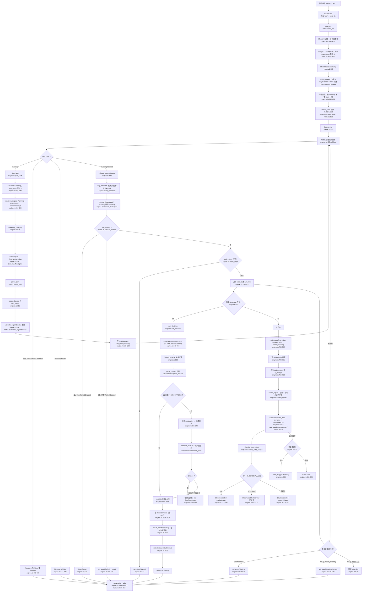
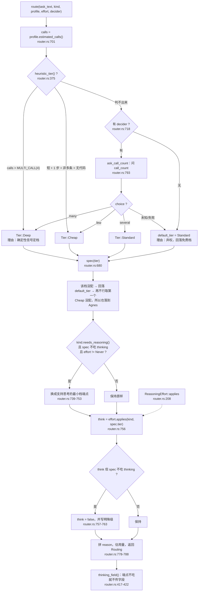
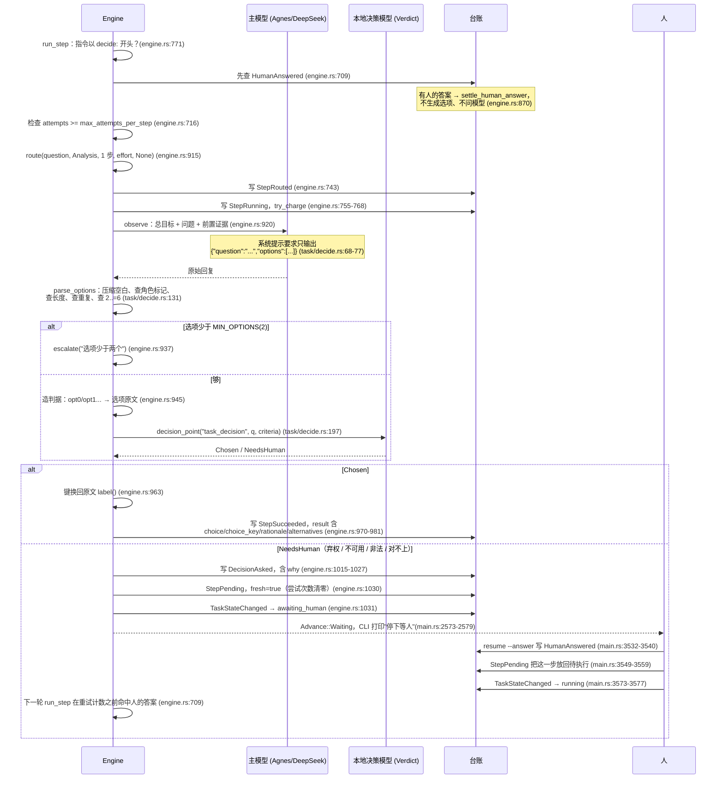
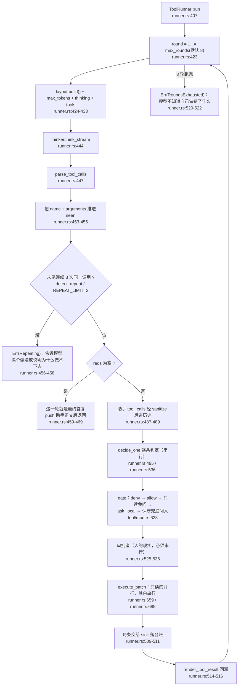

# 02 · 任务链路与决策模型

本文回答两个问题：

1. 敲下 `yunxi-bot do "把这件事办了"` 之后，**这条命到底经过了哪些代码**。
2. **决策模型（本地 Verdict）到底在哪些时刻被问到**，问的是什么，答案怎么用。

## 怎么读这份文档

- 每一条事实后面都跟 `文件:行号`。**没有出处的说法不写进来。**
- 行号对应本文写作时的代码。文件路径相对仓库根。
- 本文只描述**代码里现在是什么样**，不描述"应该是什么样"。发现代码与注释不一致的地方，会明确标出来。
- 文末有「我没能核实的」一节，列的是没有读到、或读到但无法确认运行时行为的事。

---

## 一、一条任务的完整链路

### 1.1 全景流程图



同一张图的分段读法：

| 段 | 入口函数 | 文件的哪一段 |
|---|---|---|
| CLI 入口 | `cmd_do` | `crates/yunxi-bot-cli/src/main.rs:2394` |
| 拆解 | `Engine::plan_task` | `crates/yunxi-bot-core/src/task/engine.rs:583` |
| 计划解析 | `parse_plan` | `crates/yunxi-bot-core/src/task/plan.rs:111` |
| 状态机主循环 | `Engine::run_inner` | `crates/yunxi-bot-core/src/task/engine.rs:387` |
| 单步执行 | `Engine::run_step` | `crates/yunxi-bot-core/src/task/engine.rs:680` |
| 决策步 | `Engine::run_decision` | `crates/yunxi-bot-core/src/task/engine.rs:891` |
| 升级人工 | `Engine::escalate` | `crates/yunxi-bot-core/src/task/engine.rs:992` |
| 路由 | `ModelRouter::route` | `crates/yunxi-bot-core/src/think/router.rs:693` |
| 工具循环 | `ToolRunner::run` | `crates/yunxi-bot-core/src/tool/runner.rs:407` |

### 1.2 为什么主循环是"每轮重新投影"

`Engine::run` 先把预算账本和用量收集器建好（`engine.rs:377-381`），然后调 `run_inner`，最后统一 `flush_records`（`engine.rs:382-384`）。

`run_inner` 的循环体第一件事是 `let mut task = self.load(task_id)?`（`engine.rs:400`），而 `load` 走的是 `self.store.project()`（`engine.rs:1107-1109`），`LedgerTaskStore::project` 又是 `task_from_events(self.ledger.events())`（`engine.rs:1229-1231`）。

**这样做的理由是：内存里的 `Task` 只是台账的视图，不是真相。** 每轮重新投影，就不存在"内存与台账不一致"这个失效形态（`task/model.rs:25-26` 把这条列为三条设计约束的第一条）。

一个直接后果：循环体里每个分支要么 `return`、要么 `continue`。`engine.rs:393-395` 用 `let mut outcome = None` 当哨兵，让"循环不可达终点"这件事在类型层面成立。

### 1.3 拆解：目标怎么变成步骤清单

`plan_task`（`engine.rs:583`）做的事，按顺序：

1. **给自己的画像**：`TaskKind::Planning`，`step_count: 3`（`engine.rs:594-600`）。
   `step_count` 故意报"至少三步"——注释说明：拆解产出是多步计划，按一步报会被判成轻量档，而轻量档走 Agnes，Agnes 的思考模式是"服务端默认"（它不吃 `thinking` 字段），于是**拆解这一步永远拿不到思考**（`engine.rs:591-593`）。
2. **路由**：`self.router.route(&task.goal, kind, &profile, self.effort, Some(self.decider))`（`engine.rs:601-603`）。
3. **先扣预算再调用**：`ledger.try_charge()?`（`engine.rs:604`）。扣不动就直接出错，不排队不等待（`model.rs:318-327`）。
4. **调用模型**：`self.handler.plan(&routing, &req, records)`（`engine.rs:610`）。真实实现是 `ChatHandler::plan`（`chat_handler.rs:1160`），它把 `目标：... / 最多拆成 N 步。` 作为易变尾，走 `converse`（`chat_handler.rs:1168-1169`）。
5. **解析**：`parse_plan(&raw)`（`engine.rs:612`）。

`parse_plan` 自己分四步（`plan.rs:111-142`）：

| 步 | 函数 | 失败时说什么 |
|---|---|---|
| 取 JSON | `extract_json`（`plan.rs:277`） | 报"试了几个候选片段"+首个错误（`plan.rs:318-325`） |
| 拆步骤数组 | `steps_from_value`（`plan.rs:428`） | 逐个反序列化，报"第 N 个步骤的字段不合法"（`plan.rs:450-451`） |
| 查可用性 | `check_usable`（`plan.rs:473`） | 空清单 / id 空白 / id 重复 / instruction 空白（`plan.rs:474-513`） |
| 查依赖图 | `validate_dependencies`（`plan.rs:140`） | 引用不存在的步骤、成环 |

**"截断"有专门的一条检测**：`looks_truncated`（`plan.rs:260-265`）判断"文里出现了 `{` 或 `[`，但从第一个开始找不到配对的闭合"。命中时错误信息里会明说"**回复被截断了**……多半是输出预算不够"（`plan.rs:291-295`、`plan.rs:116-120`）。

为什么这条值得单独做：真机上回复是 `{"steps":[{"id":"s1",...` 被 `max_tokens` 从中间切断，而括号配对扫描会返回内部**每个完整的步骤对象**——那些能正常解析、但没有 `steps` 字段，于是报出来是「顶层对象里没有 steps 字段」，**指向完全错误的方向**（`plan.rs:246-259`）。

**一个必须知道的 schema 让步**：`normalize_kind`（`plan.rs:84-104`）会在 `kind == "decide"` **且** instruction 以 `decide:` 开头时，把 `kind` 字段删掉。因为 `decide` 不在 `TaskKind` 枚举里，模型顺手写上去会让**整份计划被拒**、白费一次拆解调用（`plan.rs:62-83`）。只在两件事同时成立时才丢；普通步骤写 `kind=decide` 仍然报错（`plan.rs:566-573` 的测试锁着这条）。

拆解落地时，`kind` 缺省按 `TaskKind::classify(&p.instruction).unwrap_or(TaskKind::Generation)` 兜底（`engine.rs:619-621`，同一转换在 `plan.rs:529-531` 也有一份，注释说明刻意共用 `planned_to_steps` 以免漂移，见 `plan.rs:517-520`）。

### 1.4 终态判定：`all_settled()` 回答的不是"目标达成没有"

这是整条链路里最容易读错的一处，单独说。

```rust
// task/model.rs:82-85
pub fn all_settled(&self) -> bool {
    !self.steps.is_empty() && self.steps.iter().all(|s| s.state.is_settled())
}
```

而 `is_settled` 的定义是：

```rust
// task/model.rs:235-240
pub fn is_settled(self) -> bool {
    matches!(self, StepState::Succeeded | StepState::Failed | StepState::Skipped)
}
```

**"完成 / 失败 / 跳过"三种都算终态。** 所以 `all_settled()` 回答的是"还有没有在跑的步骤"，**不是**"目标达成没有"。

引擎在 `engine.rs:446` 用它，但**没有直接把它当成成功**。命中之后还要再筛一遍 `Failed | Skipped`（`engine.rs:458-468`）：

- `broken` 为空 → `finish(TaskState::Done)`（`engine.rs:470`）
- `broken` 非空 → `set_state(TaskState::Stalled)`，然后 `break` 把 `Waiting` 交出去（`engine.rs:486-496`）

**那一段必须 `break` 不能 `continue`。** 因为 `Stalled` 不是终态——`is_terminal()` 只认 `Done | Failed | Cancelled`（`model.rs:142-147`）。回到循环顶之后 `all_settled()` 仍然为真、`broken` 仍非空，会**无限设 Stalled**。`engine.rs:475-485` 的注释记着这次事故（上一版写的 `continue`，测试套件挂死）。

**为什么这层补丁非有不可**（`engine.rs:447-457`）：真机上抓到过 `s5` 因为"需要使用者拍板"而 BLOCKED（那是对的行为），依赖它的全跳过，而任务状态报的是"**完成**"、文件一个字没改。12 次里出现 2 次。`TaskError` 层的 `needs_human()` 契约管的是单步输出，管不到整条链——这里补的就是整条链那一层。

CLI 那边同样把这两件事分开报：只有 `failed == 0 && skipped == 0` 才打印"完成"，否则打印"完成，但有 N 步失败、M 步被跳过"并返回退出码 1（`main.rs:2560-2572`）。

`TaskState` 七个取值与允许的迁移写在 `model.rs:111-162`。其中 `Stalled` 的存在理由是：没有它，"依赖成环"和"还在跑"会长得一模一样，于是死锁表现为无限等待（`model.rs:116-120`）。

### 1.5 三个"停下等人"的出口

| 出口 | 触发 | 代码 |
|---|---|---|
| 任务状态转 `AwaitingHuman` | 步骤返回 `StepRun::NeedsHuman` 或错误 `needs_human()` | `engine.rs:521-539` |
| 任务状态转 `Stalled` | `all_settled()` 但有 Failed/Skipped；或 `ready_steps` 为空 | `engine.rs:486`、`engine.rs:507` |
| 直接把错误抛出去 | `Err(e)` 且 `e.needs_human() == false` | `engine.rs:540` |

`TaskError::needs_human()` 的判据是**失败方向朝"不执行"**：只有 `StepFailed` 和 `Core` 返回 false（可以自己重试/是基础设施故障），其余（预算用尽、步骤太多、计划无法解析、依赖成环、需要人工、卡住）一律 true（`model.rs:424-435`）。

---

## 二、决策模型什么时候决策

### 2.0 决策层的形状

先把接口钉死，后面每个调用点都用到。

```rust
// decide/laya.rs:71-73
pub trait Decider: Send + Sync {
    fn decide(&self, req: &DecisionRequest) -> Result<DecisionResult, DecisionError>;
}
```

- **问题**：`Question`，三种 `QuestionKind`——`Choice { criteria }` / `Score { levels }` / `Noul`（`decide/mod.rs:21-37`）。`Question::choice(id, instructions, criteria)` 把 `&[(&str, &str)]` 收成 `选项名 → 判据` 的 `BTreeMap`（`decide/mod.rs:49-64`）。
- **请求**：`DecisionRequest { state, questions }`（`decide/mod.rs:89-99`）。`state` 是"判断所需的证据"，不是"服务知道的一切"（`decide/mod.rs:85-88`）。
- **答案**：`DecisionResult { answers: BTreeMap<String, Answer>, model }`（`decide/mod.rs:135-140`）。`Answer` 四个字段：`choice` / `distribution` / `expected_score` / `noul`（`decide/mod.rs:102-116`）。`DecisionResult::choice(id)` 返回 `Option<&str>`（`decide/mod.rs:153-155`）。
- **传输**：`POST /decide`，请求体 `{state, questions}`，响应 `{answers, model}`（`decide/laya.rs:5-15`）。`LayaDecider` 默认超时 `DEFAULT_TIMEOUT_MS = 2_000` 毫秒（`decide/laya.rs:86`）。

**校验不在适配器里，在 `DecisionEngine` 里，而且是无条件必经之路**（`decide/mod.rs:383-393`）。理由是：塞进 `LayaDecider` 的话，换一个适配器（或测试桩）就会漏掉，而未校验的模型返回值恰恰最危险（比如编出一个没声明的选项）。`laya::validate` 检查：每个问题都有答案、`choice` 落在判据里、概率在 `[0,1]`、分布非空时各项和接近 1（`decide/laya.rs:145-204`、`206-236`）。

**熔断**：连续失败阈值 `DEFAULT_FAILURE_THRESHOLD = 3`（`decide/mod.rs:277`），达到后 `circuit_open()` 为真、直接降级不再调模型（`decide/mod.rs:368-381`），要人工 `reset_circuit`（`decide/mod.rs:425-427`）。

**决策类别决定降级方向**（`decide/mod.rs:188-207`）：

| 类别 | 降级方向 | 降级动作 |
|---|---|---|
| `Interrupt` | FailClosed | 延后聚合，本轮不打扰 |
| `Escalate` | **FailOpen** | 升级给人 |
| `Irreversible` | NotApplicable | 保持强制人工批准（行为不变） |
| `Classify` | FailClosed | 归入待分类队列，不猜 |
| `Urgency` | FailClosed | 按普通处理 |
| `Anomaly` | **FailOpen** | 按可疑处理并记日志 |

第一项与第二项**方向相反**——这正是必须先分类的原因（`decide/mod.rs:191-192`）。

### 2.1 调用点一：路由时的"调用次数档位"判定

**在哪**：`ModelRouter::route`（`router.rs:693`）→ `ModelRouter::ask_call_count`（`router.rs:793`）。

**触发条件**：只有当**确定性信号判不出档位**时才会问。`route` 先试 `profile.heuristic_tier()`（`router.rs:706`），返回 `Some` 就直接定档且 `used_decider = false`；只有 `None` 才走 `decider.and_then(|d| self.ask_call_count(d, task_text))`（`router.rs:718`）。

`heuristic_tier`（`router.rs:375-390`）返回 `None` 的条件是**两个确定性判据都不成立**：
- 调用次数不 `> thresholds::MULTI_CALL`（`= 4`，`router.rs:332`）
- 不满足"小任务"：`prompt_chars > 0 && prompt_chars < SHORT_PROMPT_CHARS(200) && step_count <= 1 && !explicit_multi && !has_code`

**问的是什么**：`Question::choice("call_count", "完成这个任务预计需要多少次模型调用？", &call_count_criteria())`（`router.rs:796-800`）。判据三条（`router.rs:633-639`）：

| 选项 | 判据原文 |
|---|---|
| `few` | 一两次调用就能完成，不需要来回多轮 |
| `several` | 需要四五次调用，中间有几轮来回 |
| `many` | 需要很多轮调用，要拆成多个步骤逐步完成 |

`state` 只放 `{ "task": task_text }`（`router.rs:801`）。

**答案怎么用**（`router.rs:803-808`）：`few → Tier::Cheap`、`several → Tier::Standard`、`many → Tier::Deep`，**其余一律 `None`**（未知选项算弃权）。

**弃权/失败怎么办**：`decider.decide(&req).ok()?`（`router.rs:802`）——任何 `Err` 都变成 `None`，于是 `route` 走 `self.default_tier` 并记理由"档位信号不足且本地判断弃权，回落默认档（免费）"（`router.rs:720-724`）。**路由失败不能把任务卡住**（`router.rs:791-792`）。

**谁传了 decider**：

| 调用点 | decider 参数 | 出处 |
|---|---|---|
| 拆解 | `Some(self.decider)` | `engine.rs:603` |
| 单步执行 | `Some(decider)` | `engine.rs:741` |
| 决策点生成选项之后的路由 | **`None`** | `engine.rs:917` |
| CLI 的干跑预览 | **`None`** | `main.rs:2476` |

`run_decision` 传 `None` 是**故意的**，注释写得很清楚：调用次数我们已经知道是 1，"需要推理"也已经在 `TaskKind::Analysis` 里写明；问一次纯属浪费一个本地调用，而且被问的模型并不比我们多任何信息（`engine.rs:900-908`）。

### 2.2 调用点二：任务中途的 `decide:` 步骤

**在哪**：`decision_point`（`crates/yunxi-bot-core/src/task/decide.rs:197`），由 `Engine::run_decision` 在 `engine.rs:955` 调用，key 固定为 `"task_decision"`。

**触发条件**：引擎发现某一步的指令以 `DECIDE_PREFIX = "decide:"` 开头（`engine.rs:65`、`engine.rs:771`）。而且**顺序很要紧**：
- 先查**人有没有答过**（`engine.rs:709-713`）——在"重试次数用尽"检查**之前**；
- 再看重试次数（`engine.rs:716`）；
- 再路由、落 `StepRunning`、扣预算；
- 最后才进 `run_decision`（`engine.rs:771-776`）。

**问的是什么**：`decision_point` 只认逐字命中的选项（`task/decide.rs:17-19`）。它构造：

```rust
// task/decide.rs:240-245
let state = serde_json::json!({
    "question": question,
    "options": options,
    "criteria": criteria_map,
});
let req = DecisionRequest::new(state, vec![Question::choice(key, question, criteria)]);
```

`criteria` 是 `选项名 → 判据`。**选项名是 `opt0`/`opt1`/…，判据是选项原文**——因为本地 Verdict 是双编码器，按**判据文本**打分，所以判据必须是能读懂的原话，而它回的是键（`engine.rs:940-949`）。

**答案怎么用**：`decision_point` 返回 `TaskDecision::Chosen { choice, rationale, alternatives }` 或 `NeedsHuman { question, options }`（`task/decide.rs:83-97`）。引擎在 `Chosen` 分支里把键**换回原文**再落盘（`engine.rs:963-981`），因为台账里存 `"opt1"` 这种占位符的话，事后回看"当时选了哪个做法"完全读不出来。

**五条升级人工的路径**（全部汇到 `escalate`，`task/decide.rs:321-348`）：

| 情形 | 说明文字 | 出处 |
|---|---|---|
| 判据本身少于 `MIN_OPTIONS(=2)` | 直接 `Err(TaskError::NeedsHuman)`，**压根不问模型** | `task/decide.rs:204-211` |
| 判据里有空选项名 / 重名 | 同上 | `task/decide.rs:212-227` |
| 决策模型调用失败 | "决策模型不可用（服务未启动、超时，或响应非法）——这是故障，不是它在弃权" | `task/decide.rs:247-258` |
| 响应非法（未声明的选项 / 越界概率） | "决策模型的响应不合法" | `task/decide.rs:263-269` |
| 没有答案 / `choice` 为空 / 选项名对不上 | "没有回应这个问题" / "弃权——它没有选任何一项" / "选了一个不存在的选项" | `task/decide.rs:273-287` |

**"弃权"和"不可用"必须分得开**，这是真机上抓到的（D104）：Verdict sidecar 因为线程耗尽被杀，之后每一次决策都变成"问人"，而没有任何人知道它已经不在了——那份日志里最后一句是 `OMP: Error #137: Cannot create thread.`，而界面上显示的是"任务卡住，需要你拍板"（`task/decide.rs:327-344`）。

**选项名逐字匹配，不做 trim、不忽略大小写**：宽容匹配等于替模型猜它想说什么，而这里猜错的代价是执行了另一种做法（`task/decide.rs:283-287`）。

### 2.3 调用点三：工具审批门禁的"该不该问人"

**在哪**：`ask_local`（`crates/yunxi-bot-core/src/tool/mod.rs:738`），由 `gate` 在第二层调用（`tool/mod.rs:717`）。

**触发条件**：`gate` 是三层，从便宜到贵（`tool/mod.rs:624-732`）：

1. **确定性规则**：`deny` 黑名单命中即终点（`tool/mod.rs:642-653`）；`needs_explicit_approval()` 的能力（`Outbound` / `Unknown`）**命中白名单才放行，否则一律问人，且不问模型**（`tool/mod.rs:660-676`）；`allow` 白名单命中放行（`tool/mod.rs:678-689`）；只读且在工作区内免问（`tool/mod.rs:698-714`）。
2. **本地决策模型**：`ask_local`。
3. **保守兜底**：`GateDecision::Ask`，理由"信号不足，按最保守处理"（`tool/mod.rs:721-731`）。

`Capability` 六类：`ReadOnly` / `Write` / `Execute` / `Network` / `Outbound` / `Unknown`（`tool/mod.rs:63-98`）。`is_inert()` 只认 `ReadOnly`（`tool/mod.rs:113-115`）；`needs_explicit_approval()` 认 `Outbound | Unknown`（`tool/mod.rs:128-130`）。

**问的是什么**：`Question::choice("needs_human", "这个动作该不该先问过使用者？", ...)`，两个选项（`tool/mod.rs:748-755`）：
- `auto`：无需询问：它没有副作用，或者副作用完全在预期范围内
- `ask`：需要询问：它会改变系统状态、或把信息发到外部

`state` 带工具名、能力、粒度、参数（**截断到 600 字符**）、cwd、是否在工作区内（`tool/mod.rs:757-766`）。

**答案怎么用**（`tool/mod.rs:770-779`）：`auto → GateDecision::Allow`、`ask → GateDecision::Ask`、其余（未知选项、缺答案）**返回 `None` 交给第三层兜底**。

**失败方向**：兜底是"问人"，不是"放行"——这一层失败只会让事情更保守（`tool/mod.rs:736-737`）。`decider` 为 `None`（本地决策模型不可用）时只会走第一层和兜底，**不会因此变宽松**（`tool/mod.rs:626-627`）。

### 2.4 调用点四：陪伴/通知的"该不该打扰"

这一层是**两个调用点**，共用同一套三层结构（ADR D24 明确说"打扰判定复用陪伴层的三层，不另造一套"）。

#### 陪伴介入：`decide_intervention`

`companion.rs:206-255`。

- **触发**：陪伴层的一次完整介入决策。
- **问的**：`intervention_questions()`（`companion.rs:117-137`），一个 `Choice` 加两个 `Noul`：
  - `intervention`（Choice，问题"此刻应当如何介入？"）：`speak` = 有值得主动说明的信息，且现在说不会打扰；`hold` = 有信息但现在不适合说，应留到合适时机；`quiet` = 没有需要主动说明的信息，保持静默即可
  - `needs_support`（Noul）："使用者此刻是否处于明确需要情绪支持的状态（而非只是没说话）？"
  - `is_anomaly`（Noul）："近期的运行结果中是否出现了显著偏离常态、需要人知道的情况？"
- **答案怎么用**：`parse_action`（`companion.rs:192-200`）把 choice 解析成 `Intervention`，**未知选项按最保守处理 `Quiet`**；然后与约束层上限取更保守者：`model_action.more_conservative(verdict.ceiling)`（`companion.rs:222-223`）。
- **约束层**（`constraint_ceiling`，`companion.rs:150-189`）四条硬闸，任一命中上限就压到 `Hold`：
  - 处在安静时段（`CompanionPolicy::default()`：23 点到 8 点，`companion.rs:79-80`）
  - 情境标记为安静时段（`companion.rs:161-166`）
  - 今天已打扰次数 ≥ `max_interventions_per_day`（默认 3，`companion.rs:81`）
  - 距上次互动分钟数 < `min_minutes_between_interventions`（默认 120，`companion.rs:82`）
  - 都没命中 → 上限 `Speak`（`companion.rs:185-188`）
- **降级**：引擎类别固定 `Interrupt`（`companion.rs:267-269`），方向 fail-closed。降级时 `Intervention::Hold.more_conservative(verdict.ceiling)`——**约束仍然生效，降级不等于绕过使用者的设定**（`companion.rs:243-253`）。

`Intervention` 的 `Ord` 是 `Speak < Hold < Quiet`，所以 `more_conservative` 用 `max` 而不是 `min`；写成 `min` 会拿到最激进的动作，约束收紧会完全失效（`companion.rs:50-60`）。

#### 邮件/通知分流：`triage_item`

`triage.rs:444-510`。

- **触发**：对一条 `InfoItem` 做打扰判定。
- **顺序**：先算约束层（`triage.rs:455`，**任何路径都要过它，包括确定性规则**），再走第二层模型。
- **第一层确定性规则** `deterministic_triage`（`triage.rs:307-369`），按优先级：

  | # | 规则 | 动作 | 行号 |
  |---|---|---|---|
  | 1 | 黑名单命中 | `Quiet` | `triage.rs:316-326` |
  | 2 | 白名单命中 | `Speak` | `triage.rs:329-339` |
  | 3 | 验证码 | `Speak` | `triage.rs:343-349` |
  | 4 | 群发（`looks_bulk`） | `Hold` | `triage.rs:353-359` |
  | 5 | 机器发件人 | `Hold` | `triage.rs:362-368` |

  `TriagePolicy::default().bulk_threshold = 3`（`triage.rs:122-132`）。
- **第二层**：`triage_questions()`（`triage.rs:378-394`），一个 `Choice` 加一个 `Noul`：
  - `triage`（"这一封邮件此刻应当如何处置？"）：`speak` = 值得现在就告诉使用者，晚了他会不方便；`hold` = 有内容但不必现在说，攒着等他自己看；`quiet` = 与使用者无关或纯噪音，不值得提
  - `needs_action`（Noul）："这封邮件是否明确需要使用者本人做一件事（而不只是知会他）？"
- **`state` 主动裁剪**（`build_state`，`triage.rs:401-438`）：摘要截到 400 字符，**不喂整封正文**；时间戳取不到时 `age_minutes` 是 `null` 而不是编一个数，并另给显式标志 `received_at_known`（`triage.rs:405-412`）。
- **答案怎么用**：`parse_triage` + `apply_ceiling`（`triage.rs:475-490`、`triage.rs:514-539`）；置信度也拼进理由（`triage.rs:487-489`）。
- **降级兜底是 `Hold` 而不是 `Speak`，也不是 `Quiet`**（`triage.rs:492-508`）：`Speak` 会乱说话；`Quiet` 等于**把信息丢了**。`Hold` 保住了它，使用者主动看的时候还在。这是"不打扰"和"不丢失"之间唯一同时成立的那个选择。

### 2.5 调用点五：召回门控拿不准时的兜底

这一处和前四处形状不同：**关键词先跑，只有它判成 `Mixed`（拿不准）时才问模型。**

- **第一层**：`recall_gate::gate(query)`（`crates/yunxi-bot-core/src/recall_gate.rs:179-235`），纯关键词，返回 `MemoryNeed`（`None` / `Profile` / `Episode` / `LongTerm` / `Mixed`，`recall_gate.rs:38-49`）。优先级是刻意排的（`recall_gate.rs:166-178`）：

  | 顺序 | 判据 | 结果 | 行号 |
  |---|---|---|---|
  | 0 | 空串 | `None` | `recall_gate.rs:180-183` |
  | 1 | 明确回指（`BACK_REFERENCE`） | 有时间词 → `Mixed`，否则 `LongTerm` | `recall_gate.rs:192-199` |
  | 2 | 第一人称 + 时间词 | `Episode` | `recall_gate.rs:206-208` |
  | 3 | 第一人称 + 个人名词 / 只有个人名词 | `Profile` | `recall_gate.rs:211-216` |
  | 4 | 只有时间词 | `Mixed`（"去年 Rust 发布了什么版本"问的是世界） | `recall_gate.rs:218-221` |
  | 5 | 通用问法且**无任何第一人称** | `None` | `recall_gate.rs:223-229` |
  | 6 | **什么都没匹配到** | **`Mixed`（保守召回）** | `recall_gate.rs:231-234` |

  第 6 条是这张表里最要紧的一行：**"没看懂"不能等于"不需要"**（`recall_gate.rs:178`）。判错的两个方向不对称——判成"不用召回"而其实要，表现是"它明明记过却想不起来"，**最难查**（`recall_gate.rs:23-31`）。

- **第二层**：`ChatHandler::gate_with_model`（`crates/yunxi-bot-cli/src/chat_handler.rs:479-491`）。
  - **触发条件**：`need == MemoryNeed::Mixed`（`chat_handler.rs:557-561`）。
  - **问的**：`gate_questions()`（`recall_gate.rs:268-294`），question id 是常量 `GATE_QUESTION = "memory_need"`（`recall_gate.rs:238`），问题"为了回答使用者这一句话，需要去查关于他本人的记忆吗？"，六个选项：`none` / `profile` / `episode` / `long_term` / `knowledge` / `mixed`。
  - **state**：只放 `{ "使用者这一句": input }`（`chat_handler.rs:484-487`）——把整段上下文倒进去既浪费调用，也让"它凭什么这么判"变得不可复核。
  - **答案怎么用**：`need_from_choice`（`recall_gate.rs:304-313`）把选项翻成 `MemoryNeed`。**`knowledge` 映射成 `None`**，因为这一层的职责只是决定要不要翻私人记忆。
  - **失败方向**：`gate_with_model` 返回 `None`（没有决策器 / 调用失败 / 选项听不懂），调用方 `unwrap_or(need)` **退回关键词的判断**（`chat_handler.rs:557-558`）。门控是优化，不是对话能不能进行的前提（`chat_handler.rs:554-555`）。
  - **认不出就说认不出，不硬猜**：硬猜一个比不猜更坏，因为它看起来像有依据，事后没法归因（`chat_handler.rs:477-478`）。

### 2.6 五个调用点汇总

| # | 位置 | 函数 | 触发条件 | question id | 答案形状 |
|---|---|---|---|---|---|
| 1 | 路由 | `ModelRouter::ask_call_count`（`router.rs:793`） | `profile.heuristic_tier()` 返回 `None` 且有 decider | `call_count` | Choice：`few`/`several`/`many` |
| 2 | 任务决策步 | `task::decide::decision_point`（`task/decide.rs:197`） | 步骤指令以 `decide:` 开头 | `task_decision` | Choice：`opt0`/`opt1`/… |
| 3 | 工具审批 | `tool::ask_local`（`tool/mod.rs:738`） | 前两层确定性规则都定不了 | `needs_human` | Choice：`auto`/`ask` |
| 4a | 陪伴介入 | `companion::decide_intervention`（`companion.rs:206`） | 陪伴层一次介入决策 | `intervention` | Choice：`speak`/`hold`/`quiet`（另两个 Noul） |
| 4b | 通知分流 | `triage::triage_item`（`triage.rs:444`） | 确定性规则全不命中 | `triage` | Choice：`speak`/`hold`/`quiet`（另一个 Noul） |
| 5 | 召回门控 | `ChatHandler::gate_with_model`（`chat_handler.rs:479`） | 关键词判成 `Mixed` | `memory_need` | Choice：`none`/`profile`/`episode`/`long_term`/`knowledge`/`mixed` |

**有一条路没有被接线。** `ModelRouter::ask_kind`（`router.rs:815-823`）是 `pub` 的，问的是 `task_kind`（`shallow`/`drafting`/`deep`，`router.rs:170-176`），但它**除了 `router.rs:1211-1213` 的测试之外没有任何调用点**。`route` 里没有调用它——`kind` 是 `route` 的入参，由调用方给（`router.rs:688-692` 的文档说明了这个设计：把 `kind` 作为参数而不是内部再判一次，是为了让"任务类型是在任务执行层定的"这件事在类型上就成立）。

---

## 三、模型选择器（router）

### 3.1 三个模型

#### Agnes 3.0 Flash —— 思考用的主力

```rust
// router.rs:291-301
pub const AGNES_FLASH: Self = Self {
    tier: Tier::Standard,
    provider: "agnes",
    base_url: "https://api.agnes-ai.cn/v1",
    model: "agnes-3.0-flash",
    price: PriceTable::AGNES_30_FLASH,
    rpm: 10,
    thinking: Thinking::ServerDefault,
    key_hint: "secrets/agnes.key 或 YUNXI_BOT_AGNES_KEY",
};
```

- 端点：`https://api.agnes-ai.cn/v1`，`POST /v1/chat/completions`，`Authorization: Bearer <key>`（`think/agnes.rs:3-8`）。
- 限流：`rpm: 10`（`router.rs:297`），另有常量 `FREE_TIER_RPM = 10`（`think/agnes.rs:21`，注释记着"2026-09 起从 20 下调到 10"）。`RateLimiter::with_rpm(10)` 会算出 `60_000 / 10 = 6000` 毫秒的最小间隔（`think/mod.rs:340-347`）。
- **不吃 `thinking` 字段**：`thinking: Thinking::ServerDefault`（`router.rs:299`），注释写"Agnes 不吃 thinking 字段，传了是错的行为"。`accepts_thinking()` 因此返回 false（`router.rs:321-323`）。
- 价格：`PriceTable::AGNES_30_FLASH`，`free: true`，缓存命中 0.035 / 输入 0.35 / 输出 1.0（元每百万 token，高峰空闲同价）（`think/cost.rs:63-72`）。
- 缓存折扣 10 倍（`think/cost.rs:62`）。

#### DeepSeek Flash —— 需要多次调用或需要推理

```rust
// router.rs:309-318
pub const DEEPSEEK_FLASH: Self = Self {
    tier: Tier::Deep,
    provider: "deepseek",
    base_url: "https://api.deepseek.com/v1",
    model: "deepseek-flash",
    price: PriceTable::DEEPSEEK_FLASH,
    rpm: 60,
    thinking: Thinking::Enabled,
    key_hint: "secrets/deepseek.key 或 YUNXI_BOT_DEEPSEEK_KEY",
};
```

- 模型名 `deepseek-flash`（DeepSeek-V4.1-Flash，`router.rs:305`），端点 `https://api.deepseek.com/v1`。
- 限流：`rpm: 60`（`router.rs:315`），即最小间隔 1000 毫秒。
- `thinking: Thinking::Enabled` 表示**这个端点支持思考**，而不是"每个任务都开"（`router.rs:307-308`）。
- 价格：缓存命中 0.04（高峰）/ 0.02（空闲），输入 2.0 / 1.0，输出 8.0 / 4.0（`think/cost.rs:48-57`）。**缓存命中与未命中差 50 倍**（`think/cost.rs:46-47`）。
- 高峰时段：北京时间周一至周五 9:00–12:00 与 14:00–18:00，**不含法定节假日**（`think/cost.rs:102-109`）。

> 注意一处文档与常量的措辞差异：`router.rs:32-39` 的模块文档表格里把 DeepSeek 的限流写成"并发 2500，基本无等待"，而 `ModelSpec::DEEPSEEK_FLASH.rpm` 这个字段写的是 `60`（`router.rs:315`）。本文按字段值 60 说。

#### Verdict —— 本地决策模型

**它不是 `ModelSpec`，不在 `router.rs` 里，也不参与"选哪个模型思考"这件事。**

- 它是决策层的本地 sidecar，用 `POST /decide` 契约（`decide/laya.rs:5-18`）。
- 默认端口 `DEFAULT_PORT = 17870`（`sidecar/verdict_server.py:36`），Rust 侧默认端点 `http://127.0.0.1:17870/decide`（`main.rs:2382`、`main.rs:2545`）。
- 超时 `DEFAULT_TIMEOUT_MS = 2_000`（`decide/laya.rs:86`）。
- 选 Verdict 不选 Laya 的四条理由写在 `sidecar/verdict_server.py:5-17`：选项顺序不变性（Laya 翻转率 0.23）、校准诚实（ECE 0.014–0.030）、保形弃权（`calibrate()` 给分布无关的覆盖率保证）、适配成本（`fit()` 在笔记本 CPU 上 0.9 秒）。
- **`think/mod.rs:6-10` 的措辞是过期的**：它写"决策层（`crate::decide`）……本地跑（Laya）"，而现在的实现是 Verdict（`decide/laya.rs:1` 也已经写着"Laya 的本地 sidecar 适配器"这个名字保留）。`LayaDecider` 是**类型名**，指"实现 `Decider` 的 HTTP 适配器"，不必然指向 Laya 模型。

### 3.2 `TaskKind` 七类与它对选择的影响

```rust
// router.rs:93-110
pub enum TaskKind {
    Conversation,  // 寒暄、确认、报个状态。不需要推理。
    Lookup,        // 查一个事实、取一个值、转述一条记录。
    Generation,    // 起草一段文字、写一封邮件、生成一段代码。
    Edit,          // 改一个已有的东西（文件、配置、数据）。
    Analysis,      // 分析、比较、诊断、算一笔账。需要推理。
    Planning,      // 拆解目标、排步骤、定方案。需要推理。
    Execution,     // 跑一条命令、调一个工具、执行一个动作。
}
```

`kind` 对选择的**唯一直接影响**是"要不要思考"：

```rust
// router.rs:126-128
pub fn needs_reasoning(self) -> bool {
    matches!(self, TaskKind::Analysis | TaskKind::Planning)
}
```

**七类里只有分析与规划需要推理**。

分类链 `TaskKind::classify`（`router.rs:134-167`）**顺序即优先级**，推理信号最强所以排最前：

| 顺序 | 判据函数 | 命中给 | 行号 |
|---|---|---|---|
| 1 | `is_complex_reasoning`（15 个词：分析/对比/比较/评估/权衡/诊断/排查/推理/为什么/为何/判断/可行性/利弊/方案/预算多少） | `Analysis` | `router.rs:135-137`、`router.rs:492-511` |
| 2 | `detect_planning`（8 个词：拆解/拆成/排期/规划/路线图/分期/分几个阶段/先后顺序） | `Planning` | `router.rs:138-140`、`router.rs:514-526` |
| 3 | `detect_execution`（10 个词：运行/执行/跑一下/跑个/启动/部署/安装/重启/调用工具/发出去） | `Execution` | `router.rs:141-143`、`router.rs:529-543` |
| 4 | `detect_edit`（8 个词：修改/改成/改一下/删掉/删除/替换/更新一下/重命名） | `Edit` | `router.rs:144-146`、`router.rs:546-558` |
| 5 | `detect_code`（8 个记号：三个反引号组成的代码块围栏、代码、脚本、函数、编译、报错、bug、.rs）；有"写一个/写个/实现一个/新写/从零"算 `Generation`，否则 `Edit` | `Generation`/`Edit` | `router.rs:147-154`、`router.rs:627-630` |
| 6 | `detect_generation`（12 个词：写一封/写个/写一个/写一段/写一份/起草/拟定/拟一份/生成/润色/扩写/缩写） | `Generation` | `router.rs:155-157`、`router.rs:565-581` |
| 7 | `detect_lookup`（8 个祈使式 + 6 个疑问式："哪/几/多少/有没有/吗/谁"） | `Lookup` | `router.rs:158-160`、`router.rs:588-610` |
| 8 | 短、无信号（`0 < 长度 < SHORT_PROMPT_CHARS(200)`） | `Conversation` | `router.rs:161-165` |
| — | 都不命中 | `None`（"该问下一步了"的信号） | `router.rs:166` |

两条刻意的设计：
- **"对比一下"的短句是分析任务**，不该因为字少被当成寒暄（`router.rs:131-133`）。
- `detect_lookup` 有祈使式和疑问式**两条并行判据**：只留前一条会把"查一下快递到哪了"漏成对话（`router.rs:583-609`）。

`kind` 由调用方给出，不在这里判：拆解固定 `TaskKind::Planning`（`engine.rs:594`），单步用 `step.kind`（`engine.rs:738`），决策点固定 `TaskKind::Analysis`（`engine.rs:917`）。步的 `kind` 来自模型给的 `PlannedStep.kind`，缺省时按指令文本判（`engine.rs:619-621`）。

### 3.3 "不需要多次调用 → Agnes，需要多次 → DeepSeek"写在哪

**写在 `TaskProfile::heuristic_tier`（`router.rs:375-390`），依据是 `TaskProfile::estimated_calls`（`router.rs:361-370`），门槛是 `thresholds::MULTI_CALL`（`router.rs:332`）。**

```rust
// router.rs:361-370
pub fn estimated_calls(&self) -> usize {
    let steps = if self.step_count > 0 {
        self.step_count
    } else {
        // 没拆解前粗估：每 300 字算一步，至少 1 步
        (self.prompt_chars / 300).max(1)
    };
    // 拆解 1 次 + 每步 1 次 + 决策点按步数的一半估
    1 + steps + steps / 2
}
```

```rust
// router.rs:375-390
pub fn heuristic_tier(&self) -> Option<Tier> {
    let calls = self.estimated_calls();
    if calls > thresholds::MULTI_CALL {
        return Some(Tier::Deep);
    }
    // 明确的小任务
    if self.prompt_chars > 0
        && self.prompt_chars < thresholds::SHORT_PROMPT_CHARS
        && self.step_count <= 1
        && !self.explicit_multi
        && !self.has_code
    {
        return Some(Tier::Cheap);
    }
    None
}
```

`MULTI_CALL = 4`，注释给的依据是：Agnes 免费档 10 RPM ≈ 每次间隔 6 秒，4 次调用要等约 18 秒，还在"能接受"的范围；再多就该换到不排队的那个了（`router.rs:328-332`）。

`suggested Tier` 到具体模型的映射在 `ModelRouter::spec`（`router.rs:680-686`）：

```rust
self.specs.iter().find(|s| s.tier == tier)
    .or_else(|| self.specs.iter().find(|s| s.tier == self.default_tier))
    .or_else(|| self.specs.first())
```

**这里有一个必须知道的细节：默认注册表里没有 `Tier::Cheap` 的模型。** `ModelRouter::default()` 只放 `[AGNES_FLASH(Standard), DEEPSEEK_FLASH(Deep)]`，`default_tier = Tier::Standard`（`router.rs:650-658`）。所以 `Tier::Cheap` 会**回落到 Standard → Agnes**。

两句话合起来才是完整规则：

- **判成 Deep（调用次数 > 4）→ DeepSeek**
- **其余一切（Cheap / Standard / 判不出来回落默认档）→ Agnes**

一条不容易注意的推论：**拆解永远判不出确定性档位。** 因为 `plan_task` 把 `step_count` 固定成 3（`engine.rs:597`），`estimated_calls()` 得 `1 + 3 + 1 = 4`，而 `4 > 4` 为假；同时"小任务"那条要求 `step_count <= 1`，也不成立。于是 `heuristic_tier()` 必返回 `None`，**拆解的路由总是去问本地决策模型**（`router.rs:718`），除非没接 decider（那就回落 Standard/Agnes，`router.rs:720-724`）。

### 3.4 思考模式怎么决定

唯一依据是 `ReasoningEffort::applies`：

```rust
// router.rs:208-214
pub fn applies(self, kind: TaskKind, tier: Tier) -> bool {
    match self {
        ReasoningEffort::Always => true,
        ReasoningEffort::Never => false,
        ReasoningEffort::Auto => tier == Tier::Deep && kind.needs_reasoning(),
    }
}
```

**默认值是 `Auto`**（`router.rs:189-195`）。`Auto` 下要**同时**满足两条才开思考：
1. 档位是 `Tier::Deep`（即走 DeepSeek）
2. 任务类型需要推理（`Analysis` 或 `Planning`）

`Always` / `Never` 是使用者的显式覆盖。CLI 的 `do` 用 `parse_effort(args)` 解析（`main.rs:2422`），`chat` 用 `--thinking off/on/auto`（`main.rs:2635-2638`）。

为什么"只有 Deep 才开"：免费档不值得为思考花等待时间和 token 预算，而且轻量档的任务类型本来就不需要推理（`router.rs:203-207`）。

三个 `Thinking` 取值到线上字段的映射（`router.rs:250-256`）：

| `Thinking` | 请求体字段 |
|---|---|
| `ServerDefault` | **不传** |
| `Enabled` | `{"type": "enabled"}` |
| `Disabled` | `{"type": "disabled"}` |

`Routing::thinking_field()` 在这里加了一道保险：端点不支持思考（Agnes）时**返回 `ServerDefault`，绝不硬塞**（`router.rs:417-422`）。

`route` 里思考轴的计算与降级（`router.rs:756-764`）：

```rust
let mut think = effort.applies(kind, spec.tier);
if think && !spec.accepts_thinking() {
    // 选了不支持思考的端点却要思考 → 说清楚并降级，不静默
    reason.push_str(&format!("；{} 不支持思考模式，已降级为不开思考", spec.provider));
    think = false;
}
```

`reason` 字符串也在这一段拼：`Auto` 时写"思考模式按任务类型定：{类型} {需要/不需要推理}"，否则写"思考模式由使用者指定：{档}"（`router.rs:765-776`）。

**思考模式的输出预算要额外加余量。** `max_tokens` 是"思考过程 + 正文"的总和，不是正文的额度。`THINKING_OUTPUT_HEADROOM = 2048`（`engine.rs:56`），在 `converse` 里一处统一加（`chat_handler.rs:962-966`）。常量文档记着实测：拆解请求在 `max_tokens=2048` 时被截断（`finish_reason=length`），思考吃掉 280~540 token；`max_tokens=4096` 正常结束（`engine.rs:45-56`）。

**思考模式与工具调用不冲突**——实测 `finish_reason=tool_calls` 且正常带回 `reasoning_content`（`router.rs:27-28`）。工具循环每一轮都要带思考模式，只在第一轮带会让后续轮次静默退回默认（`runner.rs:426-430`）。

### 3.5 两个轴的交汇：需要推理但端点不支持思考

这是 `route` 里唯一一处"模型轴的结论被思考轴否决"的地方（`router.rs:739-753`）：

```rust
if kind.needs_reasoning()
    && !spec.accepts_thinking()
    && effort != ReasoningEffort::Never
    && let Some(better) = self
        .specs
        .iter()
        .filter(|s| s.accepts_thinking())
        .min_by_key(|s| s.tier)
{
    reason.push_str(&format!(
        "；这一步需要推理，但 {} 不支持思考模式，改用 {}",
        spec.provider, better.provider
    ));
    spec = better.clone();
}
```

**判据顺序很关键：调用次数决定"要不要换不排队的模型"（优化），需要推理决定"能不能省这次钱"（硬约束）。**（`router.rs:737-738`）

触发的场景：一个只有一句话的分析步骤，按调用次数算是轻量档 → Agnes；但 Agnes 的思考模式是"服务端默认"，于是**这一步永远拿不到思考**——而它恰恰是唯一真正需要思考的一步（`router.rs:730-736`）。这段注释写明"这是测试逼出来的一条"。

注意 `effort != ReasoningEffort::Never` 这一条：使用者显式说"不要思考"时，这个升级不发生。

### 3.6 降级与失败方向

**"fail-closed" 在本仓库的定义是：不确定时朝"不做"倒——不打扰、不升级、不动**（`decide/mod.rs:180-182`）。它的反面 `FailOpen` 是"朝告警倒：不确定就叫人"。

它在三处落地，方向并不统一——**这正是必须先分类的原因**：

| 层 | 位置 | 失败方向 | 具体行为 |
|---|---|---|---|
| 决策类别 | `DecisionClass::direction`（`decide/mod.rs:192-207`） | 逐类不同 | `Interrupt`/`Classify`/`Urgency` → FailClosed；`Escalate`/`Anomaly` → FailOpen；`Irreversible` → NotApplicable |
| 任务执行 | `TaskError::needs_human`（`model.rs:424-435`） | 朝"不执行" | 只有 `StepFailed` / `Core` 可自愈，其余一律停下等人 |
| 工具审批 | `gate` 第三层（`tool/mod.rs:721-731`） | 朝"问人" | 模型弃权/不可用 → `GateDecision::Ask`，**不是 Allow** |
| 路由 | `route` 弃权分支（`router.rs:720-724`） | **朝"免费档"** | 回落 `default_tier`（Standard → Agnes）。这是**成本方向**的保守，不是安全方向 |

最后一行值得单独说：**路由这一层的失败方向与其它三层不同。** 其它三层都朝"不执行/问人"倒，路由朝"用免费的那个"倒。这是刻意的——路由失败不能把任务卡住（`router.rs:791-792`），而且选中的模型无论如何都要过审批门禁，所以路由层不需要承担安全方向的保守。

`route` 里"说清楚，不静默"的两处：
- 端点不支持思考却要思考 → 降级为不开，并把原因拼进 `reason`（`router.rs:757-763`）
- 需要推理但端点不支持思考 → 换端点，并把原因拼进 `reason`（`router.rs:748-751`）

`reason` 会随 `RoutingRecord` 进台账（`model.rs:243-265`、`engine.rs:743-751`），"只存能解释账单的字段，不存整个 `Routing`"（`model.rs:243`）。

**熔断与置信度**（`decide/mod.rs:376-422`）：
- `DecisionEngine::decide` **永不返回 `Err`**——失败一律转成降级，因为调用方必须拿到一个明确的、可留痕的走向（`decide/mod.rs:376-377`）。
- 连续失败达到 `DEFAULT_FAILURE_THRESHOLD = 3` 后 `circuit_open()`，暂停调用模型（`decide/mod.rs:277`、`decide/mod.rs:379-381`）。
- `with_min_confidence` 可设置信度下限，低于它按"模型自己不确定"降级；但注释强调**只应在用自己的数据校准过之后设置**（`decide/mod.rs:355-361`、`decide/mod.rs:396-406`）。
- 降级必须可见：`DecisionOutcome::ledger_data` 给出 `degraded: true` + `class`/`direction`/`action`/`reason`（`decide/mod.rs:253-273`）。

### 3.7 路由决策流程图



---

## 四、`decide:` 步骤的完整生命周期

### 4.1 时序



### 4.2 各阶段的关键判断

**选项生成侧**（`task/decide.rs` 的模块文档把它叫"第一道闸"，`task/decide.rs:12-16`）：

- `OPTIONS_SYSTEM_PROMPT` 是**常量**（`task/decide.rs:68-77`）。任何随调用变化的字节混进来，缓存前缀就作废，所以目标与步骤只能进用户消息（`task/decide.rs:64-67`）。
- `options_request`（`task/decide.rs:103-112`）用 `PromptLayout` 把稳定前缀进 system、`# 任务目标 / # 当前步骤` 进用户消息，温度 `OPTIONS_TEMPERATURE = 0.2`（`task/decide.rs:48-53`）——列做法不需要创造性，需要的是**稳定**。
- `parse_options`（`task/decide.rs:131-187`）的消毒清单：

  | 检查 | 常量/取值 | 失败 |
  |---|---|---|
  | `question` 非空 | — | 拒绝整份 |
  | `question` 长度 | `MAX_QUESTION_CHARS = 300` | 拒绝 |
  | 选项非空 | — | 拒绝 |
  | 单条选项长度 | `MAX_OPTION_CHARS = 120` | 拒绝 |
  | 角色冒充标记 | `ROLE_MARKERS = ["system", "assistant", "developer"]` | 拒绝 |
  | 选项去重（按小写归一） | — | 拒绝 |
  | 选项条数 | `MIN_OPTIONS = 2` .. `MAX_OPTIONS = 6` | 拒绝 |

  **超限拒绝而不是截断**：截断会悄悄改掉做法本身，而本地决策模型是照字面选的，它选中的将是一句我们没写完整的话（`task/decide.rs:38-46`）。
  **任何一条不合格都拒绝整份响应**，而不是丢掉坏的那条：丢一条会悄悄改变模型的提案（`task/decide.rs:128-130`）。
  消毒放在解析里而不是留给调用方：解析是唯一入口，只要有一条路径忘了消毒，"选项"就能变成塞进决策模型提示里的新指令（`task/decide.rs:124-127`）。选项会进决策模型的 `state`，而 `state` 是给模型看的指令区（`task/decide.rs:55-62`）。

  注意这里有**两个同名常量**：`task/decide.rs:32` 的 `MIN_OPTIONS = 2`（用于 `parse_options` 与 `decision_point`）和 `engine.rs:68` 的 `pub const MIN_OPTIONS: usize = 2`（用于 `run_decision` 里"选项少于两个"的检查）。值相同，是两处独立声明。

**判据构造**（`engine.rs:945-949`）：键是 `format!("opt{i}")`，值是选项原文。注释说明：本地决策模型是双编码器，它按**判据文本**打分，所以判据必须是能读懂的原话；而它回的是键（`engine.rs:940-944`）。

**`DecisionAsked` 里记了什么**（`engine.rs:1015-1027`）：

```rust
self.store.write(
    task_id,
    EventKind::DecisionAsked,
    serde_json::json!({
        "task": task_id,
        "step": step.id,
        "question": question,
        "options": options,
        // 说清是"谁"没定下来
        "why": why,
    }),
)?;
```

五个字段：`task` / `step` / `question` / `options` / `why`。`why` 的取值来自 `escalate` 的第三个参数，两处调用点给的分别是：
- `"选项少于两个"`（`engine.rs:937`）
- `"决策模型弃权"`（`engine.rs:987`）

而 `decision_point` 内部的 `escalate`（`task/decide.rs:325-348`）把原因写进**问题文本**末尾：`question: format!("{question}\n（{why}）")`——因为 `NeedsHuman` 只有问题和选项两个字段，不新造变体（那会牵动引擎、台账、界面三处，而这里要的只是"让原因可见"，`task/decide.rs:342-344`）。

**为什么弃权也要进台账**（`engine.rs:1004-1014`）：决策模型**拍板**那条路已经留了痕（`StepSucceeded` 的 result 里有 choice / rationale / alternatives），但**弃权这条路没有**——`why` 只进了返回值，谁没接住就没了。而**决策模型接管之后，人从回路里退出了**：以前每个 `decide:` 都问人，人看到问题本身就是一道检查；现在它自己拍板，"它拍了什么、凭什么"只能靠台账。**弃权是最需要解释的那一种**——"它为什么不敢定"直接说明那一类问题它判不了。

**`fresh: true` 的作用**（`engine.rs:1030` 与 `engine.rs:1035-1044`）：弃权不该消耗重试次数。真机上决策模型弃权两次就把步骤硬判失败，任务从"等人工"变成"卡住"，人再想答也没机会了（`engine.rs:1042-1044`）。

**成功那条路的产物形状**（`engine.rs:970-976`）：

```json
{
  "choice": "<选项原文>",
  "choice_key": "opt1",
  "rationale": "<本地决策模型 模型名 选择「...」（判据）；置信度 0.87>",
  "alternatives": ["<其余选项原文>"]
}
```

`rationale` 由 `decision_point` 拼（`task/decide.rs:311-318`），带上模型名与置信度——"事后要能回答这个选择是谁在什么把握下做的"（`task/decide.rs:296-299`）。

### 4.3 人给答案时产物形状一致，只多一个 `source`

`settle_human_answer`（`engine.rs:870-889`）产出：

```json
{"choice": "<人的答案>", "rationale": "人工给出", "alternatives": [], "source": "human"}
```

**形状和决策模型选了某个选项时一致，只多了一个 `source: "human"`**——事后回看要能分清"这是模型选的"还是"人定的"，那两种的可信度完全不同（`engine.rs:866-869`）。

取答案时**取最新的一条**：人可能改主意，而最后说的那句才算数（`engine.rs:1174-1178`、`engine.rs:1184-1197`）。**空白答案当"没答过"**（`engine.rs:1198-1201`）。

`resume` 那边也有两处刻意的顺序（`main.rs:3497-3516`）：
- **不能只认 `AwaitingHuman`**——真机上决策模型弃权两次把重试次数耗光，步骤硬判失败，依赖它的全跳过，任务变成 `Stalled`，而人在这个状态下给答案会被守卫**静默丢掉**。
- **先把人的答案落进台账，再把状态放回执行中**——顺序不能反：状态一变成 running，引擎下一轮就会去看"这一步有没有人答过"。

### 4.4 一处接线缺口（读代码得到的推论，未在真机确认）

`DecisionAsked` 在 `EventKind` 里被归入"审计对（必须位于边界内）"，`requires_span()` 对它返回 true（`ledger.rs:138-155`）。`Ledger::append` 在 `open_span.is_none()` 时对这类事件返回 `AuditOutsideSpan`（`ledger.rs:537-538`）。

而 `LedgerTaskStore::write` 也会拦一道：

```rust
// engine.rs:1215-1222
// 审计事件必须落在边界内——台账会拒绝边界外的审计事件。
// 任务执行框架目前没有审计事件（DecisionAsked 由 decide 模块写），
// 所以这里直接追加；等决策点接入台账审计时在这里开边界。
if kind.requires_span() && !self.ledger.has_open_span() {
    return Err(TaskError::Core(crate::CoreError::Ledger(format!(
        "{kind:?} 需要边界，但当前没有开启"
    ))));
}
```

但 `Engine::escalate` 恰恰是直接写 `DecisionAsked` 的（`engine.rs:1015-1027`），而且带 `?` 向上传播。任务执行路径上**没有任何地方开边界**（全仓库 `begin_span` 只出现在 `decide/mod.rs:300` 的 `record_decision` 和 `agent.rs:692` 的测试里）。

`MemoryTaskStore::write` 不检查 span（`engine.rs:1265-1282`），所以引擎的测试（`engine.rs:2283` 那条"弃权要进台账"）用的是内存 store，不会碰到这个检查。

推论：在真实 CLI 路径（`cmd_do` 用 `LedgerTaskStore`，`main.rs:2502`）上，**任何一次走到 `escalate` 的决策步骤都会得到一个 `TaskError::Core`**，而 `Core` 的 `needs_human()` 是 false（`model.rs:431`），于是它会从 `engine.rs:540` 直接抛出去，而不是转成"等人工"。

`engine.rs:1216` 那句注释（"任务执行框架目前没有审计事件（DecisionAsked 由 decide 模块写）"）与 `engine.rs:1015-1027` 的实际代码相互矛盾，看起来是过期的。

**我没有运行端到端程序来确认这个推论的运行时表现**，所以把它放在这里并同时在文末列出。这是一个"读代码一定能看出来、但没实测"的点，请以后续实测为准。

---

## 五、工具循环

工具循环在 `ToolRunner::run`（`crates/yunxi-bot-core/src/tool/runner.rs:407`）。它是**每一步、每一轮对话**底下真正发请求的地方

> 本节里所有写成 `runner.rs:行号` 的出处，都指 `crates/yunxi-bot-core/src/tool/runner.rs`。仓库里另有一个同名的 `crates/yunxi-bot-core/src/runner.rs`，那是另一条链路，本节不涉及。：`ChatHandler::converse` 组好 `PromptLayout` 之后交给它（`chat_handler.rs:968`），三种意图（Plan / Step / Options / Chat）都走这一条（`chat_handler.rs:855-856` 的注释："没挂工具时它等价于一次普通调用"）。

### 5.1 轮数上限

```rust
// runner.rs:338
pub const DEFAULT_MAX_ROUNDS: u32 = 8;
```

在 `ToolRunner::new` 里设为默认（`runner.rs:356`），可用 `with_max_rounds` 覆盖（`runner.rs:390-393`）。选 8 的理由：8 轮足够"查一下再算一下再写一下"这类复合任务；再多通常意味着打转，而打转的代价是实打实的 token 和配额（`runner.rs:294-297`）。

轮数用 `for round in 1..=self.max_rounds` 的 `round` 本身当计数，不另开变量（否则两者一旦漂移就是账目不对，`runner.rs:416-418`）。轮数就是模型调用次数——一轮一次，没有别的调用点（`runner.rs:416`）。

**跑到上限还没收敛不是"模型还没说完"，而是一个真实的失败形态**：`ToolLoopError::RoundsExhausted { rounds }`（`runner.rs:166-170`、`runner.rs:520-522`）。

### 5.2 重复检测：同一工具 + 同样参数，连着 3 次

```rust
// runner.rs:308
pub const REPEAT_LIMIT: usize = 3;
```

`detect_repeat`（`runner.rs:317-336`）只看**末尾连续的 N 条**：

```rust
fn detect_repeat(seen: &[(String, String)], limit: usize) -> Option<(String, u32)> {
    if seen.len() < limit { return None; }
    let tail = &seen[seen.len() - limit..];
    let first = &tail[0];
    if tail.iter().all(|c| c == first) {
        // 把真正连续的次数报出来（可能不止 limit 次）
        let mut n = 0usize;
        for c in seen.iter().rev() {
            if c == first { n += 1; } else { break; }
        }
        return Some((first.0.clone(), n as u32));
    }
    None
}
```

**比的是"工具名 + 参数"的完整文本**，不是模糊相似——模糊相似会把"读 a.rs、读 b.rs、读 c.rs"这种正常的批量读判成重复；要拦的是**字面上一模一样**那种（`runner.rs:310-314`）。

检查位置在**执行之前**（`runner.rs:449-458`）：

```rust
for tr in &reqs {
    seen.push((tr.name.clone(), tr.arguments.to_string()));
}
if let Some((tool, times)) = detect_repeat(&seen, REPEAT_LIMIT) {
    return Err(ToolLoopError::Repeating { tool, times });
}
```

**放在执行之前**：重复的那些调用没必要再跑一遍——跑了也只是再拿一次同样的结果，然后下一轮再来（`runner.rs:449-452`）。

`REPEAT_LIMIT = 3` 是权衡出来的（`runner.rs:298-307`）：
- **2 次太紧**——正常流程里"读一遍、改一下、再读一遍确认"是合理的
- **4 次太松**——真机上那次是 11 次连写同一个文件，等到第 4 次才拦也已经白花了三轮
- 3 次的意思是：**同一个工具、同样的参数、连着来三遍**

### 5.3 两种"打转"的区别

它们是两个不同的错误变体，因为**给模型的信息完全不同**（`runner.rs:176-184`）：

| | `RoundsExhausted` | `Repeating` |
|---|---|---|
| 触发 | 8 轮跑完还没收敛（`runner.rs:520-522`） | 末尾连续 3 次同一工具同一参数（`runner.rs:456-458`） |
| 给模型的文字 | "工具循环跑了 {rounds} 轮仍未结束——模型可能在原地打转"（`runner.rs:192-194`） | "连续 {times} 次调用都是同一个动作（{tool}），参数也一样——这是在原地打转，不是在做新的事。**换个做法，或者说明为什么做不下去。**"（`runner.rs:195-199`） |
| 模型能做什么 | **它对这个毫无办法，因为它不知道自己做错了什么** | **它至少能换个做法**（`runner.rs:181`） |

真机上抓到的（D100）：一次运行调了 40 次工具、最后 12 次里 11 次是 `write_file`，把 19 行的文件撑到 **49 行**，直到撞上 8 轮上限才停（`runner.rs:173-174`）。**这种事本来就不该磨到轮数上限**——磨到上限意味着白花了 5 轮的钱和时间（`runner.rs:183-184`）。

两处返回的都是 `Err(ToolLoopError)`，被 `converse` 转成 `TaskError::Core`（`chat_handler.rs:968-972`）。而在 `run_step` 里，`TaskError::Core` 的 `needs_human()` 是 false（`model.rs:431`），所以会走"还能重试吗"那一支（`engine.rs:832-846`）。

### 5.4 失败时给模型看什么

`render_tool_result`（`runner.rs:890-910`）把一次调用的结局渲染成回灌文本，**三种结局都要说清楚**，因为模型下一步的动作完全取决于它：成功 → 用结果；失败 → 换条路；被拒绝 → 别重试，另想办法（`runner.rs:886-889`）。

| 结局 | 回灌文本 |
|---|---|
| 成功 | 工具输出原文，原样透传（`runner.rs:892`） |
| 执行失败 | `工具 {tool} 执行失败：{e}`（`runner.rs:893`） |
| 被拒绝 | `工具 {tool} 被拒绝，不会执行：{reason}。不要重复请求同一个调用，请换一种做法，或者用 BLOCKED: 说明你缺什么。`（`runner.rs:895-899`） |
| 需要人工但无人应答 | `工具 {tool} 需要人工确认，当前无人可应答（{reason}）。不要重复请求，请用 BLOCKED: 说明你需要什么才能继续。`（`runner.rs:900-904`） |
| 放行但无输出 | `工具 {tool} 未产生输出`（`runner.rs:905-907`） |

**无论成败都要回灌**——被拒绝、失败、成功，模型都得知道，否则它会以为工具没被调用过而重复请求同一个（`runner.rs:512-513`）。

另外一条同样重要的"给模型看什么"：**助手请求调工具的 `arguments` 如果不是合法 JSON，不能原样进历史。** 真机上抓到的 400 报文是 `Assistant tool call <id>.arguments must be valid JSON.`，根因是模型产出的参数被输出预算截断在中间（`{"path": "src/bill`），而**我们把它原样塞进历史，下一轮服务端校验历史时整条请求被拒**——一条坏的工具调用，废掉后面所有的回合（`runner.rs:471-486`）。所以进历史前先过 `sanitize_tool_calls`（`runner.rs:487-489`）。

每一轮循环的完整动作顺序（`runner.rs:423-518`）：
1. `layout.build()` 取消息（`runner.rs:424`）
2. 带 `max_tokens` 和思考模式（`runner.rs:425-430`）
3. 非空注册表则带 `tools`（`runner.rs:431-433`）
4. `think_stream` 发请求（`runner.rs:437-445`）
5. `parse_tool_calls`（`runner.rs:447`）
6. 记 `seen`，查重复（`runner.rs:453-458`）
7. **没有工具调用 → 这一轮就是最终答复**，连正文一起进历史后返回（`runner.rs:459-469`）
8. 助手消息经消毒后进历史（`runner.rs:487-489`）
9. **先全部判定（串行），再批量执行**（`runner.rs:491-496`）
10. 每条记录交给 sink，回灌结果，进 `calls`（`runner.rs:498-517`）

第 9 步为什么这样分（`runner.rs:525-535`、`runner.rs:247-257`）：**判定阶段（门禁 + 问人）必须串行**——审批者是一个 `&mut`，而且更重要的是那是人的现实：**同时弹三个审批框，使用者根本不知道自己在批哪一条**。执行阶段才可以并行，而且只有只读的可以。

`Decided::parallelizable`（`runner.rs:283-291`）只对 `Capability::ReadOnly` 返回 true。理由三条（`runner.rs:273-282`）：并行写同一个文件是灾难，结果取决于调度且事后无法复现；有副作用的调用之间有隐式依赖；`Network` 也不并行——搜索和抓取有各自的限流，并发打过去只会更快撞上配额。

### 5.5 工具循环流程图



---

## 六、常量速查

用到哪个确认哪个，全部带出处。

| 常量 | 值 | 位置 | 用途 |
|---|---|---|---|
| `MULTI_CALL` | 4 | `router.rs:332` | 超过它就换 DeepSeek |
| `SHORT_PROMPT_CHARS` | 200 | `router.rs:334` | 短任务判定 |
| `CHARS_PER_TOKEN` | 2 | `router.rs:336` | 估算用 |
| `OVERHEAD_CHARS` | 1200 | `router.rs:338` | 估算系统提示词开销 |
| `ANSWER_CHARS` | 400 | `router.rs:340` | 估算回答长度 |
| `THINKING_OUTPUT_MULTIPLIER` | 2.5 | `router.rs:342` | 开思考的输出放大 |
| `AGNES_FLASH.rpm` | 10 | `router.rs:297` | Agnes 限流 |
| `DEEPSEEK_FLASH.rpm` | 60 | `router.rs:315` | DeepSeek 限流 |
| `FREE_TIER_RPM` | 10 | `think/agnes.rs:21` | Agnes 免费档 RPM |
| `DEFAULT_MAX_ROUNDS` | 8 | `runner.rs:338` | 工具循环轮数上限 |
| `REPEAT_LIMIT` | 3 | `runner.rs:308` | 连续同一调用判重复 |
| `MIN_OPTIONS`（引擎） | 2 | `engine.rs:68` | 决策点选项下界 |
| `MIN_OPTIONS`（决策模块） | 2 | `task/decide.rs:32` | 同上，独立声明 |
| `MAX_OPTIONS` | 6 | `task/decide.rs:36` | 选项上界 |
| `MAX_OPTION_CHARS` | 120 | `task/decide.rs:42` | 单条选项长度 |
| `MAX_QUESTION_CHARS` | 300 | `task/decide.rs:46` | 问题长度 |
| `OPTIONS_TEMPERATURE` | 0.2 | `task/decide.rs:53` | 生成选项的温度 |
| `ROLE_MARKERS` | `system`/`assistant`/`developer` | `task/decide.rs:62` | 注入拦截 |
| `DECIDE_PREFIX` | `"decide:"` | `engine.rs:65` | 决策步骤前缀 |
| `OK_MARK` | `"OK:"` | `engine.rs:71` | 步骤成功标记 |
| `BLOCKED_MARK` | `"BLOCKED:"` | `engine.rs:73` | 步骤阻塞标记 |
| `STEP_MAX_TOKENS` | 1024 | `engine.rs:40` | 单步输出上限 |
| `PLAN_MAX_TOKENS` | 2048 | `engine.rs:43` | 拆解输出上限 |
| `THINKING_OUTPUT_HEADROOM` | 2048 | `engine.rs:56` | 开思考时的额外余量 |
| `OPTIONS_MAX_TOKENS` | 512 | `engine.rs:59` | 生成选项的输出上限 |
| `RAW_HEAD_CHARS` | 300 | `plan.rs:36` | 报错时随原文带走的字符数 |
| `PLANNER_NAME` | `"云熙"` | `plan.rs:46` | 拆解提示词里的人格名 |
| `Budget::default().max_model_calls` | 20 | `model.rs:282` | 模型调用上限 |
| `Budget::default().max_steps` | 12 | `model.rs:283` | 步骤数上限 |
| `Budget::default().max_attempts_per_step` | 2 | `model.rs:284` | 单步重试上限 |
| `DEFAULT_TIMEOUT_MS` | 2000 | `decide/laya.rs:86` | 决策调用超时 |
| `DEFAULT_FAILURE_THRESHOLD` | 3 | `decide/mod.rs:277` | 熔断阈值 |
| `CompanionPolicy` 安静时段 | 23 点–8 点 | `companion.rs:79-80` | 打扰闸门 |
| `CompanionPolicy.max_interventions_per_day` | 3 | `companion.rs:81` | 打扰闸门 |
| `CompanionPolicy.min_minutes_between_interventions` | 120 | `companion.rs:82` | 打扰闸门 |
| `TriagePolicy.bulk_threshold` | 3 | `triage.rs:129` | 群发判定 |
| `verdict_server.DEFAULT_PORT` | 17870 | `sidecar/verdict_server.py:36` | 本地决策模型端口 |
| CLI `do` 默认 `--budget` | 20 | `main.rs:2415` | 与 `Budget::default` 一致 |
| CLI `do` 默认 `--max-steps` | 12 | `main.rs:2419` | 与 `Budget::default` 一致 |

---

## 七、我没能核实的

以下是我**没有写进正文**、或者写进去时明确标注了"未实测"的事项。按"宁缺勿错"处理，列在这里而不是当成事实。

1. **`escalate` 写 `DecisionAsked` 在真实台账上是否真的失败。**
   我读到的是：`DecisionAsked.requires_span() == true`（`ledger.rs:147-155`）、`Ledger::append` 在没有开边界时返回 `AuditOutsideSpan`（`ledger.rs:537-538`）、`LedgerTaskStore::write` 会先拦一道（`engine.rs:1218-1222`）、而任务路径上没有任何 `begin_span` 调用点（全仓库搜索只有 `decide/mod.rs:300` 和 `agent.rs:692` 的测试）。推论写在 §4.4。
   **我没有运行 `yunxi-bot do` 去跑一个会弃权的 `decide:` 步骤**，所以无法确认运行时到底是"抛错退出"还是"我漏看了某处开边界的地方"。也没有跑 `cargo test`。

2. **`run_decision` 里 `self.decider` 与传入的 `decider` 参数是否总是同一个对象。**
   `run_step` 的签名同时有 `decider: &dyn Decider` 形参（`engine.rs:682`）和 `self.decider` 字段（`engine.rs:342`）。`run_step` 内部对 `run_decision` 传的是 `self.decider`（`engine.rs:775`），而路由用的是形参 `decider`（`engine.rs:741`）。在 `run_inner` 的调用点两处实参相同（`engine.rs:519` 传 `self.decider`），所以现在没有差别；**但如果将来有人从别处调 `run_step` 传入不同的 decider，这两条路会分叉。** 我没有找到反例，只是无法排除这个设计意图。

3. **`ModelRouter::ask_kind`（`router.rs:815`）是否是刻意留给未来的接线。**
   我能核实的是"除测试外没有调用点"（全仓库搜索 `ask_kind` 只有 `router.rs:815` 的定义和 `router.rs:1211-1213` 的测试）。**它是不是有意为之，代码里没有写。**

4. **干跑预览与实际拆解路由不一致时的实际表现。**
   可核实的是：预览传 `decider = None`（`main.rs:2476`），实际拆解传 `Some(self.decider)`（`engine.rs:603`）；而拆解画像的 `step_count` 固定为 3（`main.rs:2472` / `engine.rs:597`），使 `heuristic_tier()` 必返回 `None`（`router.rs:375-390`），于是实际路径会去问本地决策模型。
   **推论是**：当本地决策模型把调用次数判成 `many` 时，预览显示 Agnes 而实际会用 DeepSeek。**我没有跑过这种情形**，也没有读 `e2e_preview.py` 来确认端到端测试有没有覆盖它。

5. **Agnes 端点对 `thinking` 字段的实际行为。**
   我核实的是代码把 `AGNES_FLASH.thinking` 设为 `Thinking::ServerDefault`，注释写"Agnes 不吃 thinking 字段，传了是错的行为"（`router.rs:298-299`），`thinking_field()` 因此不传该字段（`router.rs:417-422`）。**我没有验证"传了会怎样"。**

6. **`docs/readme/` 下是否应该与其它篇目共享术语表。**
   我只看到 `docs/adr/0001-架构与边界.md` 和 `docs/工具层调研与设计.md` 两个既有文档，`docs/readme/` 目录在本次写作前不存在。**没有别的 README 篇目可以对齐编号与交叉引用风格。**

7. **`TaskKind::classify` 在 `Step` 上的实际命中率。**
   我核实的是分类链的代码与顺序（`router.rs:134-167`），以及 `engine.rs:619-621` / `plan.rs:529-531` 用它兜底。**没有任何统计或日志能说明它在真实拆解结果上表现如何。**

8. **`sidecar/verdict_server.py` 的实际校准数据文件是否存在。**
   我看到用法注释里提到 `--calibration data/decisions.verdict`（`sidecar/verdict_server.py:24`），但**没有去确认 `data/` 目录下有没有这个文件**，也没有读 `verdict_server.py` 的 `main` 来确认未提供校准文件时的默认行为。
