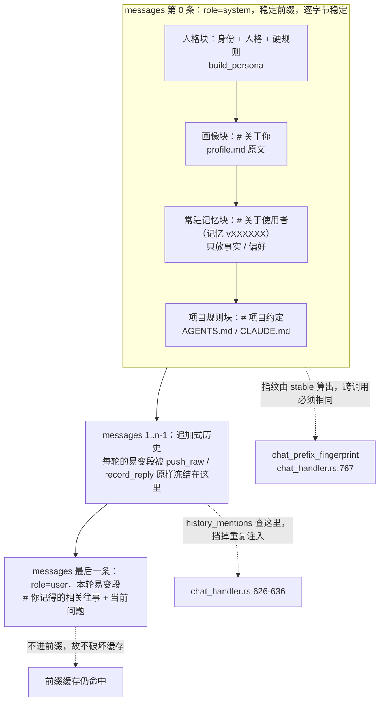
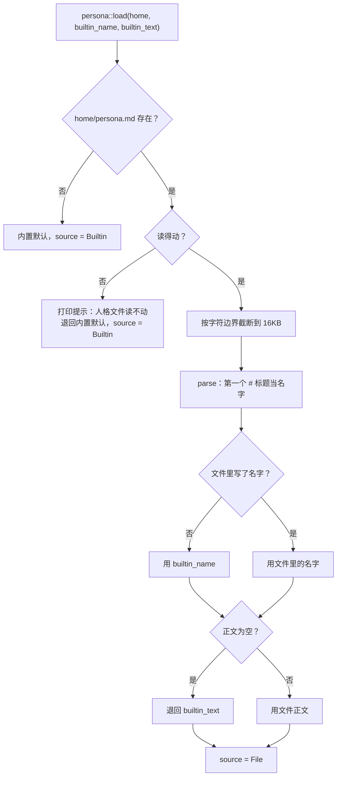
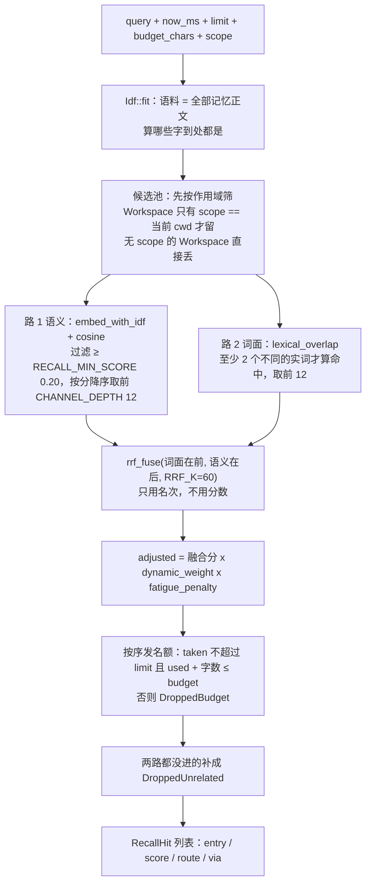
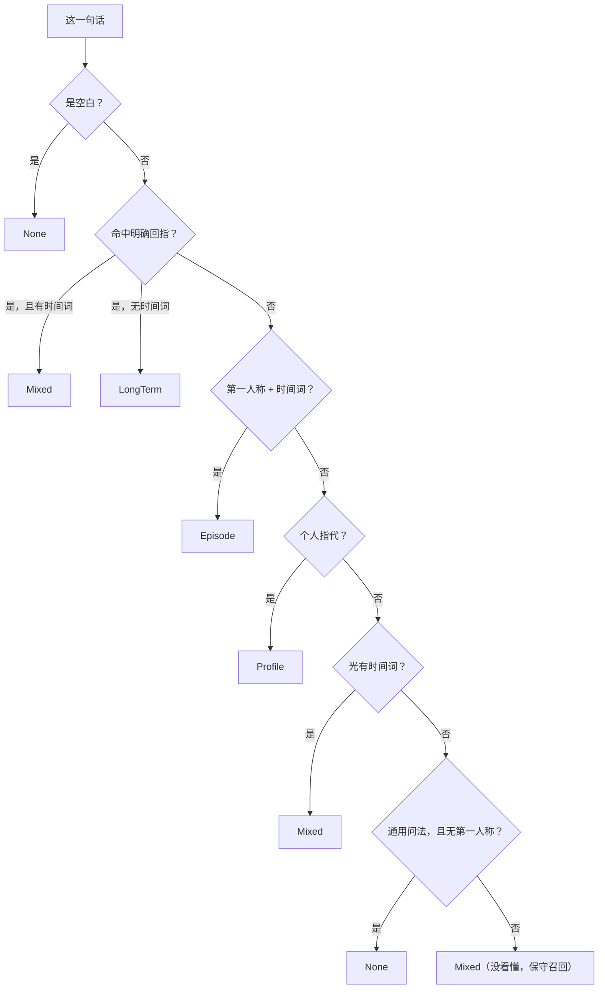
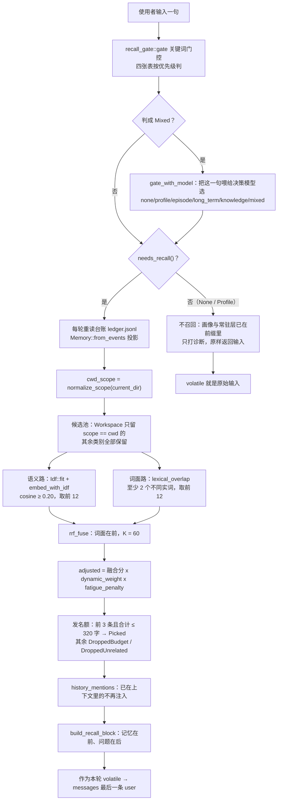

# 03 提示词、人格与记忆

> 这一篇讲三件事：**发给模型的那串字节是怎么拼出来的**、**人格与画像从哪来**、
> **记忆怎么被选中并注入**。
>
> 读法：每条事实后面都跟着 `文件:行号`。**没有出处的话不要信**——包括本文。
> 架构上有分歧时以 [`docs/adr/0001-架构与边界.md`](../adr/0001-架构与边界.md) 为准
> （AGENTS.md:11 定的规矩）。

这一篇覆盖的代码：

| 关注点 | 文件 |
|---|---|
| 提示词布局与拼装 | `crates/yunxi-bot-core/src/think/prompt.rs` |
| 会话与稳定前缀 | `crates/yunxi-bot-cli/src/chat_handler.rs` |
| 会话落盘与指纹核对 | `crates/yunxi-bot-core/src/think/session.rs` |
| 人格 | `crates/yunxi-bot-core/src/persona.rs` |
| 画像 | `crates/yunxi-bot-core/src/profile.rs` |
| 记忆 | `crates/yunxi-bot-core/src/memory.rs` |
| 向量与融合 | `crates/yunxi-bot-core/src/embedding.rs` |
| 召回门控 | `crates/yunxi-bot-core/src/recall_gate.rs` |
| 项目规则 | `crates/yunxi-bot-core/src/rules.rs` |

---

## 1. 系统提示词是怎么拼出来的

### 1.1 三段式：稳定段 / 追加段 / 易变段

`PromptLayout` 把一条请求拆成三段，**顺序不可变**（`prompt.rs:17-27`）：

```text
┌─────────────────────────────────────┐
│ 稳定段：系统提示词 + 人格 + 工具定义  │  ← 字节级稳定，跨调用完全相同
├─────────────────────────────────────┤
│ 追加段：已完成步骤的历史              │  ← 只追加，绝不重写前面的
├─────────────────────────────────────┤
│ 易变段：当前要问的问题                │  ← 每次不同，放最后
└─────────────────────────────────────┘
```

数据结构就长这样：`stable: String` / `history: Vec<Message>` / `volatile: String`
（`prompt.rs:40-54`）；拼成消息列表的是 `build()`，它把 `stable` 放进 `messages[0]`
的 system 消息，`history` 原样接在后面，`volatile` 非空时作为最后一条 user 消息
（`prompt.rs:187-195`）。

**为什么必须这样切。** DeepSeek 的缓存前缀要**完整匹配**：
在提示词中间插入任何变化内容，整段前缀就作废（`prompt.rs:5-15`）。
这不是"效率降低一点"，是把已经花掉的缓存构建成本全部浪费掉。
实测命中一次比未命中便宜 50 倍，而命中率实测是 87.1%
（`docs/adr/0001-架构与边界.md:1954-1966`）。

唯一的例外是**压缩**：它会有意地把最老的一段换成一条摘要消息，
代价是那一次缓存未命中，换来的是不撞上下文上限（`prompt.rs:44-47`，
设计细节见 `docs/adr/0001-架构与边界.md:1201-1262`）。

### 1.2 稳定前缀：四块，顺序固定

稳定前缀只有一个来源：`ChatHandler::stable_prefix(intent)`
（`chat_handler.rs:737-761`）。它先拼人格和该意图的固定指令，再按顺序追加三块：

```rust
let mut out = format!("{}\n\n{}", self.persona, intent.system());   // chat_handler.rs:738
if intent == Intent::Chat {
    if !self.profile_block.is_empty() { ... }   // 画像        chat_handler.rs:746-749
    if !self.memory_block.is_empty() { ... }    // 常驻记忆     chat_handler.rs:750-753
    let rules_text = self.project_rules.render();
    if !rules_text.is_empty() { ... }           // 项目规则     chat_handler.rs:754-758
}
```

顺序是 **人格 → 画像 → 常驻记忆 → 项目规则**，代码注释给了理由：
"先我是谁，再你是谁，再我记得什么，最后这个项目的约定。从最稳定到最具体，
读起来顺，也符合注意力从远到近的分布"（`chat_handler.rs:743-745`，同一句也写在
`docs/adr/0001-架构与边界.md:2587-2588`）。

四块各自的来源与形态：

| 块 | 由谁生成 | 内容形态 | 出处 |
|---|---|---|---|
| 人格 + 硬规则 | `build_persona(name, persona, rules)` | `# 身份` + `# 人格` + `# 硬规则`（编号列表） | `prompt.rs:350-363` |
| 画像 | `profile::load_and_render(home)` | `# 关于你` + 使用者原文 | `profile.rs:66-77`、`profile.rs:121-134` |
| 常驻记忆 | `build_memory_block(entries, version)` | `# 关于使用者（记忆 vXXXXXX）` + `- [类别] 正文` | `prompt.rs:455-481` |
| 项目规则 | `RuleSet::render()` | `# 项目约定` + 每份规则的来源路径与正文 | `rules.rs:187-213` |

`intent.system()` 有四套互不相同的固定指令：`CHAT_SYSTEM`（面对使用者，
`chat_handler.rs:96-120`）、`PLANNER_SYSTEM`（拆解，`chat_handler.rs:38-52`）、
`STEP_SYSTEM`（执行一步，`chat_handler.rs:55-84`）、`OPTIONS_SYSTEM`（列选项，
`chat_handler.rs:131-138`）。**只有 `Chat` 才会带上后面三块**——项目规则只给对话，
因为"任务那三条有自己的指令，项目约定对它们是另一回事"（`chat_handler.rs:735-736`）。

**空块不拼。** 三个 `if !...is_empty()` 是有意的：空段会平白占掉前缀的 token，
而且每轮都一样地占（`chat_handler.rs:740-742`；同一条理由在
`prompt.rs:456-459`、`rules.rs:185-186`、`profile.rs:120` 各写了一遍）。

**三块各自只读一次，读完就定下来。** 人格、画像、常驻记忆、项目规则都在
`ChatHandler::new` 里读（`chat_handler.rs:267-315`：人格 `268`、项目规则 `279-280`、
常驻记忆 `290`、画像 `296`）。理由是同一条："它进稳定前缀，而前缀每轮变的话
缓存全废"（`chat_handler.rs:271-276`、`281-289`、`291-295`）。
代价也写清楚了：**同一个进程里新记的记忆，这一轮会话看不见**——
记记忆本来就该"下一次对话生效"（`chat_handler.rs:287-289`）。

**为什么在这里读而不是在调用方读。** 有 5 处构造点，每处自己读一遍的话，
"迟早有一处忘了读——而那一处的表现是改了人格但那条链路没变，最难查"
（`chat_handler.rs:262-266`，同一决定记在 `docs/adr/0001-架构与边界.md:3233-3239`）。

**稳定前缀只能有一份来源。** 历史上有两份（构造时给指纹用的 `chat_prefix`
和 `converse` 里现场拼的那份），后果是"项目规则根本没进对话请求"，
而两条本该拦住它的检查都在骗人（一条测试拿一个串和它自己比，恒真；
`/rules` 检查的正是"有规则"的那一份）。修法就是抽出 `stable_prefix(intent)`，
指纹、`expected_chat_prefix`、建会话全走它（`chat_handler.rs:706-736`，
完整复盘见 `docs/adr/0001-架构与边界.md:2199-2242`）。

注意 `stable_prefixes()`（复数）只返回**任务引擎的三套**前缀，不含对话那套
（`chat_handler.rs:364-373`），它是给 `yunxi-bot do --show-prompt` 用的
（`main.rs:2426-2441`）。

### 1.3 易变段：本轮召回的 sidecar + 当前问题

易变段由 `with_recalled_memory(input)` 拼出来（`chat_handler.rs:509-663`），
最后一行是：

```rust
format!("{block}\n{input}")   // chat_handler.rs:660-662
```

其中 `block` 是 `build_recall_block(&picked)` 的产出，形如
`# 你记得的相关往事` + 若干条 `- [类别] 正文`（`prompt.rs:397-415`）。
把问题放最后一行是标准做法，而且这样问题的位置每轮都一样（`chat_handler.rs:660-661`）。

它怎么进请求：`chat_turn` 调 `with_recalled_memory` 拿到 `volatile`
（`chat_handler.rs:415`），`converse` 里 `layout.ask(volatile)`（`chat_handler.rs:907`），
`build()` 把它作为最后一条 user 消息发出去（`prompt.rs:191-193`）。

**为什么召回结果放尾部而不是前缀。** 动态召回的产出**每轮都不一样**，
放进前缀的话前缀每轮都变、缓存永远命中不了；放尾部则不享受缓存，
但也**不破坏**任何已有的缓存（`chat_handler.rs:495-499`）。

**标题为什么叫"你记得的相关往事"而不是"背景知识"。** 记忆是**关于使用者的事实**，
说成"背景知识"会让模型把它当资料引用，而它其实该用来调整称呼和态度；
标题写"记忆"是为了让它明白这是**它自己记得的事**——用户问"你还记得吗"时
它该答得出（`prompt.rs:390-396`）。

**动态段每轮重新读台账**（`chat_handler.rs:580-584`），而不是用构造时那份：
常驻段必须在构造时定下来（它进前缀），而动态段**应该**看到最新的记忆——
同一轮对话里刚 `remember` 的东西，下一句就该能想起来（`chat_handler.rs:505-508`）。

### 1.4 内容哈希版本号：fingerprint / fingerprint_for / PrefixMismatch

四个不同的东西，很容易混：

| 名字 | 算什么 | 用在哪 | 出处 |
|---|---|---|---|
| `PromptLayout::fingerprint()` | 对 `self.stable` 做 `DefaultHasher`，返回 `u64` | 断言"前缀没变" | `prompt.rs:160-165` |
| `PromptLayout::fingerprint_for(candidate)` | 同一套算法，但算的是**传进来的候选串**，不改状态 | 载入会话时比对新前缀 | `prompt.rs:179-184` |
| `Memory::resident_version(per_kind)` | 常驻记忆**内容**决定的 6 位十六进制短哈希 | 拼进常驻段的标题 | `memory.rs:653-665` |
| `SessionFile.fingerprint` | 落盘的指纹 | `--resume` 时核对 | `session.rs:62-63` |

`fingerprint_for` 存在的理由是时序：载入会话时要拿"当前前缀"和"存档里的指纹"比，
而当前前缀还没进布局——所以需要一个不改状态的算法（`prompt.rs:175-178`）。

`PrefixMismatch` 是核对的结果：`resume_onto(file, current_stable)` 比对
存档指纹与当前前缀的指纹，相同返回 `Same`，不同返回 `Changed { was, now }`
（`session.rs:230`、`session.rs:242-251`）。处理方式是**保留历史、换用新前缀、
并如实报告**——丢弃历史是过度的（使用者会莫名其妙地"失忆"），
静默换前缀则会让使用者以为缓存还在命中（`session.rs:28-36`）。
CLI 里那段提示就照这个写的（`chat.rs:183-199`）。

**为什么必须逐字节稳定。** 缓存命中完全取决于它，而**这种失效是静默的**：
不报错、不变慢，只表现为账单变贵（`prompt.rs:156-159`、`prompt.rs:445-448`）。
所以"前缀是否稳定"必须是**可断言的东西**，而不是一句写在文档里的叮嘱
（`prompt.rs:29-30`）。常驻段的版本号是给人对账用的："出问题时能一眼看出
前缀到底变没变"（`memory.rs:645-652`）。

`resident_version` 还有两条自我约束：权重先取整再参与哈希，免得浮点尾数
让版本号无谓地跳（`memory.rs:661-662`）；只加一条与常驻层无关的事件时，
版本号**不该**变（测试 `the_version_changes_when_the_content_changes`，
`prompt.rs:654-672`）。

### 1.5 `build_persona` 必须是纯函数

函数本体只有 14 行，没有任何 IO、没有时钟、没有 `HashMap` 遍历：

```rust
pub fn build_persona(name: &str, persona: &str, rules: &[String]) -> String   // prompt.rs:350
```

文档注释把要求写在第一句："**它必须是纯函数**：同样的输入永远产出同样的字节。
任何掺进去的当前时间、本次运行 id 都会让缓存前缀失效——那些东西属于易变段"
（`prompt.rs:346-349`）。

**为什么这条是整段设计里最要紧的。** 如果 `build_persona` 不纯
（比如读了时钟、读了会被并发写的文件、或者用了 `HashMap` 的遍历顺序），
指纹就会**每一轮都不一样**。后果不是报错，是**缓存永远不命中**——
而实测命中率是 87.1%，那 87.1% 全靠"同样的输入给同样的字节"。
**它坏掉的时候没有声音**（`prompt.rs:1237-1244`，同一句在
`docs/adr/0001-架构与边界.md:5076-5079`）。

同一族约束落在别处也都能看到：

- 常驻记忆**不能用** `Memory::recall` 来选——那个按 `score(now_ms)` 排，
  score 里含 30 天半衰期的时间因子，**同样的记忆随时间推移排序会变**，
  前缀就跟着静默变化。所以 `resident()` 只按 `(权重, 创建时间, id)` 排，
  全是事件里定死的值（`memory.rs:589-602`、`memory.rs:612-643`）。
  盯着这条的测试是 `the_resident_block_is_byte_identical_at_any_wall_clock_time`
  （`prompt.rs:613-638`）。
- `dynamic_weight` **收 `now_ms` 而不是自己读时钟**：这个函数的输出不该依赖
  "什么时候调用"，由调用方把时间递进来，测试才能钉死一个时刻去断言
  （`memory.rs:570-571`、`memory.rs:572-587`）。
- 反过来，动态召回**允许**用时钟——因为它的产出不进稳定前缀，
  本来就不缓存（`memory.rs:385-392`）。这个区分要守住：哪天有人想把动态召回的
  产出挪进前缀，就会踩到"前缀随时间静默变化"那个坑。

守这条纪律的测试有两组：`persona_is_a_pure_function`（`prompt.rs:1136-1146`）
和 `the_fingerprint_changes_exactly_once_and_then_stays_put`（`prompt.rs:1232-1274`），
后者盯的是"改人格之后指纹**只变一次**，变完必须稳定"。
`docs/adr/0001-架构与边界.md:5060-5103` 记了这条验收的真机证据（见本文 2.5）。

### 1.6 易变段被"冻进历史"之后，注入的记忆会不会被重复注入

这是本期最容易误解的一处，先说结论：**会，但被 `history_mentions` 挡住了。**

机制分三步：

**第一步：易变段被消费进历史。** `record_reply` 把 `volatile` **取走**
（`std::mem::take`）塞进历史，因此不可能出现"同一个问题既留在 volatile
又进了历史"（`prompt.rs:99-117`）。API 早先是 `push_exchange(question, answer)`，
问题要由调用方再传一遍——实测那会让同一个问题出现两次，而且下一轮的前缀
与上一轮对不上、缓存直接失效。结论写在注释里：**API 应该让正确的用法成为
唯一顺手的用法**（`prompt.rs:101-106`）。

同一件事在 `push_raw` 里也有：它先消费掉待问的问题（如果有），再压入原样消息
（`prompt.rs:206-215`）。**生产路径上走的是 `push_raw`**——工具循环里助手消息带
`tool_calls`、随后每条结果带 `tool_call_id`，顺序和字段都不能被改写
（`prompt.rs:197-205`），所以 `ToolRunner::run` 用的是
`layout.push_raw(Message::assistant(...))`（`runner.rs:459-469`）、
`push_raw(Message::assistant_tool_calls(...))`（`runner.rs:487-489`）、
`push_raw(Message::tool_result(...))`（`runner.rs:516`）。
`record_reply` 现在是"一问一答"的便捷写法，见测试
（`prompt.rs:1196-1221`）；全仓 grep 里它的调用点只有测试
（`prompt.rs:107` 定义；调用见 `prompt.rs:1127`、`session.rs:360` 等）。

**第二步：历史是可查询的。** `history_mentions(needle)` 扫历史（含已冻结的
易变内容）里有没有这段文字（`prompt.rs:139-145`）。空串**当成"见过"**并返回
`true`——反过来的话，调用方一不小心传个空串进来，就会把一条空记忆注入到
上下文里（`prompt.rs:141-143`，设计意图见
`docs/adr/0001-架构与边界.md:2537-2541`）。

**第三步：注入前先过这个筛子。** `with_recalled_memory` 在挑 `picked` 时，
对每条命中再查一次历史，已经在上下文里的不再注入
（`chat_handler.rs:626-636`）；同时统计被挡下多少条用于诊断
（`chat_handler.rs:616-624`，打印成"因已在上下文里而不重复注入 N 条"，
`chat_handler.rs:462`）。

**为什么不用"召回次数"降权。** 最初写的是疲劳计数（同一条召回超过 5 次就按
对数降权）——**那是在给自己造出来的问题打补丁**：真正要判的是"它现在在不在
上下文里"，计数只是粗糙代理，而且会误伤（同一条记忆在**新会话**里该正常召回，
计数却把它按下去）。**查实际存在与否，比统计次数准**
（`prompt.rs:131-138`、`chat_handler.rs:515-528`；
复盘见 `docs/adr/0001-架构与边界.md:2494-2553`）。

要注意的边界：`history_mentions` 比的是**记忆正文**（`h.entry.text`，
`chat_handler.rs:622`、`chat_handler.rs:633`），不含 `- [类别] ` 前缀；
而 `pushed` 里那些 `DroppedBudget` / `DroppedUnrelated` 的条目不会进 `picked`，
所以"没被选中"和"被挡下"在诊断里是两个不同的数字。

顺带说明"化石化"这个词：上几轮注入的记忆段现在冻在历史里并且被缓存，
**那不是每轮重发**（`docs/adr/0001-架构与边界.md:2494-2512`）。

### 1.7 一次对话请求的完整消息序列



四个意图各有自己的布局，互不共用：任务引擎的三套按 `(意图, provider)` 分键
（`chat_handler.rs:140-154`、`chat_handler.rs:872-878`），
对话固定用 `CHAT_SESSION_KEY = "chat"` 一个键——"使用者的对话是一条，
不该因为这一轮路由到了另一个模型就断开"（`chat_handler.rs:122-123`、
`chat_handler.rs:865-871`）。分工的理由：把三种意图混在一个会话里，
系统提示词就得在三者之间来回变，于是每次切换都把前缀作废
（`chat_handler.rs:3-18`）。会话不存在时由 `ensure_session` 用
`stable_prefix(intent)` 建一个（`chat_handler.rs:689-704`）——
抽出来是为了**可测**，"以前没抽，于是那条测试只能用自己跟自己比糊过去——恒真"
（`chat_handler.rs:684-688`，那条测试现在是 `chat_handler.rs:1438-1476`）。

---

## 2. 人格文件 persona

### 2.1 文件在哪、什么格式、名字怎么解析

人格文件是 `<数据目录>/persona.md`（`PERSONA_FILE`，`persona.rs:43`），
由 `persona::load(home, builtin_name, builtin_text)` 读取（`persona.rs:130`）。

格式就是普通 Markdown：**第一个一级标题是名字，其余是正文**
（`persona.rs:3-18`）：

```markdown
# 云熙

你是一个通用 agent，也是一个一直陪着的助理。
（下面写人格）
```

为什么这么定：名字和人格正文是两个东西（`build_persona` 分开写"# 身份"和
"# 人格"），但对**写它的人**来说，最自然的写法就是这样。不用 front-matter、
不用 JSON、不用额外的名字字段——"多一个字段就多一处要解释、要校验、
要处理填了名字没填正文这类组合"（`persona.rs:5-16`，同样的话在
`docs/adr/0001-架构与边界.md:3209-3222`）。

解析规则（`Persona::parse`，`persona.rs:85-103`）与四条边界：

| 规则 | 行为 | 出处 |
|---|---|---|
| 只认 `# ` 开头（一级标题） | `## 说话方式` 是正文 | `persona.rs:90`、测试 `persona.rs:200-207` |
| 只在前 3 行里找 | 正文中间偶现的 `# xxx` 不抢名字，否则"正文不同的人会得到不同的名字" | `persona.rs:90`、测试 `persona.rs:219-225` |
| 名字 ≤ `MAX_NAME_CHARS`（32 字） | 超长就**不当名字**，当正文——硬截断会截出一个奇怪的名字 | `persona.rs:92-97`、测试 `persona.rs:209-217` |
| 没有一级标题 | 整个文件都是正文，名字用默认值 | `persona.rs:18`、测试 `persona.rs:193-198` |

读进来之后还会**按字符边界**截断到上限，不是按字节——"按字节截会把一个汉字
切成两半，渲染出来是乱码"（`persona.rs:105-117`）。

### 2.2 常量

| 常量 | 值 | 含义 | 出处 |
|---|---|---|---|
| `PERSONA_FILE` | `"persona.md"` | 文件名 | `persona.rs:43` |
| `MAX_PERSONA_BYTES` | `16 * 1024` | 正文字节上限 | `persona.rs:50` |
| `MAX_NAME_CHARS` | `32` | 名字长度上限 | `persona.rs:56` |
| `BUILTIN_NAME` | `"云熙"` | 内置名字（**起点，不是唯一定值**） | `persona.rs:123` |
| `TEMPLATE` | 见下 | `--init` 写出去的模板 | `persona.rs:169-179` |
| `DEFAULT_PERSONA_NAME` | `"云熙"` | CLI 传给 `load` 的内置名字 | `chat_handler.rs:1225` |
| `DEFAULT_PERSONA` | "你是常驻在用户自己电脑上的个人助理……" | CLI 传给 `load` 的内置正文 | `chat_handler.rs:1227-1229` |
| `default_rules()` | 3 条 | 默认硬规则 | `chat_handler.rs:1232-1238` |

`MAX_PERSONA_BYTES` 比画像的 8KB 大——人格是"这个助理是谁"的完整设定，
本来就该写得下；但不能无限，因为它**进稳定前缀而且每轮都发**
（`persona.rs:45-49`）。

模板里专门写了一句代价说明（`persona.rs:169-179`）：

```markdown
<!-- 第一行的一级标题就是名字，改成你想要的。下面写人格。
     这份文件整段会进稳定前缀，所以：改它会让缓存失效一次
     （之后重新稳定）。它本来就不该频繁改。 -->
```

### 2.3 内置默认与用户文件的优先级

`load` 的分支写得很直白（`persona.rs:130-166`）：



四条都值得单独说：

- **文件优先于内置。** 构造点传进来的 `persona_name` / `persona_text` 现在是
  **内置默认**，只在该文件不存在时用；真正生效的是 `<数据目录>/persona.md`
  （`chat_handler.rs:258-261`）。
- **读不动要说一声，而不是静默用默认。** "你还没写"和"写了没读到"是两件不同的事
  （`persona.rs:142-149`）。
- **文件里只有名字时退回内置正文。** "一份空人格会让助理失去所有设定，
  那比用默认的坏得多"（`persona.rs:157-163`，测试 `persona.rs:240-250`）。
- **内置名字不在 persona 模块里硬编码。** `BUILTIN_NAME` 是个常量，但 `load`
  收的是调用方给的 `builtin_name`——"这一层该只负责读文件和解析，
  内置值是什么是 CLI 的事"（`persona.rs:125-129`）。

### 2.4 `yunxi-bot persona` 怎么用

```bash
yunxi-bot persona              # 看：名字、来源（内置默认 / 你自己的文件）、文件路径、正文与上限
yunxi-bot persona --init       # 写一份模板到 <数据目录>/persona.md
yunxi-bot persona --init --force   # 文件已存在时覆盖（会覆盖你现在写的内容）
```

实现见 `cmd_persona`（`main.rs:1828-1877`）：`--init` 前先查存在性，
不加 `--force` 就报错退出（`main.rs:1834-1839`）；
查看分支打印"名字 / 来源 / 文件 / 正文（N 字 / 上限 16 KB）"，并在结尾明确写出
缓存代价（`main.rs:1848-1876`）：

```text
**注意**：人格进稳定前缀的第一段，改它会让缓存失效一次
（之后重新稳定）。它本来就不该频繁改。
```

命令的文档注释解释了它为什么必须存在：在此之前人格是**写死在代码里的常量**
（`DEFAULT_PERSONA`），名字"云熙"也是，想改只能改代码重编译——
"那就不是你的人格，是开发者的人格"（`main.rs:1816-1820`）。

**为什么在这里读、而不是在 5 个调用点各读一遍**：见本文 1.2 末
（`chat_handler.rs:262-266`）。

### 2.5 改人格之后缓存会发生什么

一句话：**指纹变一次，然后重新稳定。**

`persona.md` 的内容进 `build_persona`，`build_persona` 的产出是稳定前缀的
**第一段**。"它一变，后面所有字节的偏移都变了，缓存整段作废"——
一次未命中，之后重新稳定（`persona.rs:20-28`、`docs/adr/0001-架构与边界.md:3244-3253`）。
不像记忆段（那个带版本号，只在内容变时才换），**人格没有版本号可用：
它本来就不该频繁改**（`persona.rs:26-28`）。

这个代价在人类的输出里明写（`main.rs:1875-1876`），
而不是让人自己去猜"为什么改完变慢了"（`main.rs:1822-1827`）。

真机验收的数字（会话文件里存了 `fingerprint`，`docs/adr/0001-架构与边界.md:5084-5093`）：

```text
人格 A「克制」     → 3724433708981988010
同一人格再聊一次   → 3724433708981988010    ← 稳定
改成「活泼」       → 15102352756711128045
改完再聊一次       → 15102352756711128045   ← 改完仍然稳定
```

同一条验收还留了一句方法论：上面那条单元测试**只有在 `build_persona` 变成
非纯函数时才会失败**，换句话说它现在必然是绿的，它守的是未来；
**"守未来"的测试不能只靠它自己证明今天是对的**，真机那四个数字才是今天的证据
（`docs/adr/0001-架构与边界.md:5095-5105`）。

你可以在自己的会话里看到这个数字：`chat` 里打 `/rules` 会打印
"稳定前缀 N 字；规则已进前缀：是/否"和"前缀指纹：{:x}"（`chat.rs:308-333`）；
`--resume` 时若指纹对不上，会打印 `注意：稳定前缀变了（old → new），
历史保留但缓存会重建一次`（`chat.rs:187-198`）。

---

## 3. 用户画像 profile

### 3.1 两个来源

| 来源 | 谁写的 | 性质 | 落点 |
|---|---|---|---|
| 使用者自己写 | 人 | 自我描述，**权威** | `<数据目录>/profile.md` |
| bot 自动总结 | 助理 | **猜的**，必须先人确认 | 台账事件 `ProfileProposed` → `--accept` 追加进 `profile.md` |

这两个来源的区分是本模块存在的全部理由（`profile.rs:5-16`）：

> 我一开始判断"画像就是事实/偏好的聚合视图，不该造新概念"——**错了**。
> 聚合视图能回答"助理认为你是谁"，回答不了"你希望它怎么理解你"。

同一段判断的复盘在 `docs/adr/0001-架构与边界.md:2555-2589`，
"画像是权威的、记忆是观察"这条边界在 `docs/adr/0001-架构与边界.md:2562-2569`。

**为什么是 Markdown 不是 JSON。** 写它的是**人**：JSON 的引号、逗号、转义
全是给机器的负担，而画像本来就是一段话；而且它**原样进提示词**——
段落、列表、语气都保留，"写成 JSON 再渲染一道，等于把人的话翻译成机器的
再翻译回来"（`profile.rs:18-25`，测试 `profile.rs:287-295`）。

渲染出来的标题是 `# 关于你`（第二人称），和记忆段的 `# 关于使用者`（第三人称）
刻意区分开——"那两段来源不同，措辞也该不同"（`profile.rs:61-68`，
测试 `profile.rs:277-284`）。

| 常量 | 值 | 出处 |
|---|---|---|
| `PROFILE_FILE` | `"profile.md"` | `profile.rs:39` |
| `MAX_PROFILE_BYTES` | `8 * 1024` | `profile.rs:48` |
| `TEMPLATE` | 5 个小节的抓手模板 | `profile.rs:246-266` |

上限必须有："它进稳定前缀，而且每轮都发。一份 200KB 的自我介绍会把前缀和预算
一起毁掉"；比项目规则的 32KB 小得多，因为"写不下的该进记忆"（`profile.rs:41-47`）。
截断按字符边界、而且**必须说出来**——静默截断的话使用者以为自己写了，
而它只看到一半（`profile.rs:100-112`、`profile.rs:68-74`、
测试 `truncation_is_announced_not_silent`，`profile.rs:313-322`）。
`load_and_render` 在全空白时返回空串（"全空白等于没写"，`profile.rs:120-134`，
测试 `profile.rs:341-348`）。

模板是**抓手不是答案**：有结构、有 `<!-- -->` 注释示范颗粒度，
但**不替你写内容**（`profile.rs:234-245`）——有一条测试专门盯这个：
把跨行注释整块剥掉之后，模板里只剩标题（`profile.rs:360-399`）。

### 3.2 三个台账事件与 pending 投影

事件定义（`ledger.rs:133-136`，注释就写着"自动总结的东西**先 pending**，
人确认了才进档案"）：

```text
ProfileProposed   一条提议（带"它为什么这么想"）
ProfileAccepted   接受 → 正文追加进 profile.md
ProfileRejected   否决 → 留痕，不再提议
```

投影是纯函数，从事件流里算"还没处理"的提议（`pending_from_events`，
`profile.rs:166-206`）：`ProfileProposed` 入待办，`ProfileAccepted` **和**
`ProfileRejected` 都把同 id 移出（`profile.rs:197-201`）。
**否决也要记**——"不然同一条会被反复提议，而使用者会以为它没听见"
（`profile.rs:195-196`、测试 `rejecting_also_removes_it`，`profile.rs:452-470`）。
缺 `text` 的坏事件跳过而不是致命：台账是追加式的，写坏的一行不能让它整本读不出来
（`profile.rs:472-490`）。被接受过的正文由 `accepted_texts` 按接受顺序取出来
（`profile.rs:208-217`）。

`ProfileProposal` 有一个 `reason` 字段（`profile.rs:150-159`）：
"**它为什么这么提议。** 没这个的话人没法判断该不该接受——只能看那句话本身，
而这句话是从哪来的恰恰是关键"（`profile.rs:154-156`）。

### 3.3 为什么必须先 pending，不能直接改档案

代码注释（`profile.rs:136-149`）和 CLI 注释（`main.rs:1972-1979`）
给的是同一套理由，源头是参考架构（`docs/adr/0001-架构与边界.md:2711-2724`
引的 §4.6 原话）：

> 自动抽取默认先 pending，不直接改变核心用户档案

三条理由，按重要性排：

1. **画像是权威的，自动总结是猜的。** 猜的东西直接写进权威档案，
   **档案就废了**——"你没法再信它，因为你不知道哪句是自己写的、哪句是它猜的"
   （`profile.rs:141-145`、`docs/adr/0001-架构与边界.md:3298-3303`）。
2. **自动总结一定会错。** 它可能把"帮我看看这个文件"当成"使用者在做文件相关的
   项目"。那种错如果无声地进了画像，**之后每一次对话都带着它**
   （`profile.rs:146-149`、`docs/adr/0001-架构与边界.md:3305-3307`）。
3. **接受之后写盘的顺序也有讲究：先进文件再记台账。** 反过来的话，
   写文件失败就留下一条"已接受"而档案里没有——"那是最难查的一种不一致
   （台账说做了、实际没做）"（`main.rs:2020-2021`、
   `docs/adr/0001-架构与边界.md:3321-3324`）。

接受的那条会被追加成 `- {text}` 一行写进 `profile.md`，并在输出里提醒
"**下一次对话生效**（它进稳定前缀，改了会失效一次缓存）"（`main.rs:2022-2046`）。

### 3.4 `--learn` 的提示词：排除项比要求还细

提示词常量是 `LEARN_SYSTEM`（`main.rs:1779-1795`），
它的文档注释第一句就是："**排除项是这份提示词的主要工作**"——
"提炼使用者信息这件事**不难**，难的是**不提炼不该提炼的**"（`main.rs:1762-1764`）。

排除规则一共四条（`main.rs:1785-1789`）：

```text
**不要提炼这些：**
- 通用知识、概念解释、教程（那些问的是世界，不是他）
- 一次性的临时问答（比如「帮我看看这个文件」——它不说明他是谁）
- 秘密、密钥、密码、证件号、银行卡号（进档案是最坏的一种错）
- 你自己说过的话（那不是他说的）
```

每条都对着一个具体的失效模式：

| 排除项 | 为什么 | 出处 |
|---|---|---|
| 通用知识 | "什么是 HashMap"问的是世界，不是他 | `main.rs:1772` |
| 一次性问答 | "帮我看看这个文件"不说明他是谁 | `main.rs:1773` |
| 秘密 | 密钥、密码、证件号进档案是**最坏的一种错** | `main.rs:1774` |
| 助理自己说过的话 | 取全部消息的话，它会把"我理解你在杭州"当成使用者说的 | `docs/adr/0001-架构与边界.md:3395-3396` |

最后一条在代码里是靠**只取 `Role::User` 的消息**落实的
（`main.rs:1909-1917`，注释："助理自己的话会污染提取"）。

提示词还**明确允许一条都不提炼**：

```text
**如果这段对话里没有任何值得记住的、关于这个人的信息，
就什么都不要输出。** 一条都没有是正常结果，不要硬凑。   （main.rs:1794-1795）
```

理由很硬：不写这句的话模型会硬凑，而硬凑出来的东西会堆进待确认列表，
让人懒得看——**那比不提议更坏，因为待确认列表一废，这个机制就废了**
（`main.rs:1776-1778`、`docs/adr/0001-架构与边界.md:3398-3402`）。

解析侧同样保守：`parse_proposals` **只认 `- ` 开头的行**，
再加一条"超过 60 字的多半是模型在解释"的长度兜底，最后 `.take(3)`
（`main.rs:1802-1812`）。"宁可漏掉一条，也不要往待确认列表里塞噪声"（`main.rs:1799-1801`）。
真机上验过排除规则：问了"你好，我叫老王，在杭州做后端，主要写 Rust"、
"我最讨厌别人用感叹号"、"顺便问一下，什么是 HashMap？"之后，
`--learn` 只提炼出前两句，第三条一个字都没提炼出来
（`docs/adr/0001-架构与边界.md:3420-3435`）。

一处已知的不足也记在 ADR 里：`reason` 现在统一是"从最近的对话里提炼"
（`main.rs:1810`），比较泛；理想的是指回原话（"他说『我叫老王』"）——
"那才叫可复核"（`docs/adr/0001-架构与边界.md:3437-3441`）。

`--learn` 是**显式命令，不是每轮跑**。两个理由：参考架构说的是"空闲、
达到批量阈值或显式维护命令"触发；而更硬的理由是 **Agnes 是账号级 10 RPM**，
每次 `--learn` 是一次模型调用，挂到每轮对话上会实打实地挤掉对话的配额——
"总结这件事不该跟对话抢额度"（`main.rs:1895-1900`、
`docs/adr/0001-架构与边界.md:3411-3418`）。

### 3.5 画像相关命令一览

```bash
yunxi-bot profile                     # 看原文 + "实际发出去的那段"（render 结果）
yunxi-bot profile --init [--force]    # 写模板
yunxi-bot profile --propose "使用者住在杭州"   # 手工提一条（带 reason："使用者直接提的"）
yunxi-bot profile --learn             # 从最近会话里自动总结 → 只进 pending
yunxi-bot profile --pending           # 看待确认队列
yunxi-bot profile --accept <编号>     # 接受 → 写进 profile.md + 记 ProfileAccepted
yunxi-bot profile --reject <编号>     # 否决 → 记 ProfileRejected
```

实现位置：查看与初始化 `main.rs:2069-2115`、`--learn` `main.rs:1901-1970`、
`--pending` `main.rs:1980-1993`、`--propose` `main.rs:1996-2008`、
`--accept` `main.rs:2011-2047`、`--reject` `main.rs:2050-2067`。

查看分支会**同时打印原文和渲染结果**（`main.rs:2109-2112`），
这样"我写的"和"它看到的"能对上（`docs/adr/0001-架构与边界.md:2576-2578`）。
`--learn` 没有会话可说时给的是"还没有对话记录——先 `yunxi-bot chat` 聊几轮再来"，
而**模型起不来时说的是"这次总结不了"**，不是"没什么可总结"——
"那两件事混在一起会让人以为它觉得自己没得记"（`main.rs:1904-1932`）。

**画像为什么不做成 `memory` 的子命令**：画像是使用者主动写的自我描述（权威），
记忆是助理攒的观察（可能有错）。放进同一个命令会让人以为它们是同一种东西，
而"这是它对我的看法"和"这是我告诉它的"混淆之后，改哪个、信哪个就说不清了
（`main.rs:1880-1887`）。

还有一个**当前不生效的边界**要如实说：参考架构要求"属主档案只在属主类入口注入，
通讯平台不生效"。YunXi Bot 现在只有属主入口（CLI），所以总是注入；
等有了别的入口这条要补上，而 `load_and_render` 的调用点就是该判断的地方
（`profile.rs:27-34`）。

---

## 4. 记忆系统

### 4.1 四类记忆 + Workspace，各自语义

`MemoryKind` 有五个取值（`memory.rs:29-53`），标签见 `memory.rs:56-64`：

| 类别 | 语义 | 进哪一层 | 出处 |
|---|---|---|---|
| `Fact` | 关于使用者的事实（职业、习惯、正在做的事） | **常驻** | `memory.rs:30-31` |
| `Preference` | 明确表达的偏好（不喜欢被打扰的时段、沟通风格） | **常驻** | `memory.rs:32-33` |
| `Relationship` | 关系状态（亲近程度、共同经历） | 动态 | `memory.rs:34-35` |
| `Event` | 值得记住的事件 | 动态 | `memory.rs:36-37` |
| `Workspace` | **关于某个工作目录的记忆**（这个项目的约定、这个仓库的坑） | 动态 + 按 cwd 筛 | `memory.rs:38-52` |

`Workspace` 单独一类是因为它**有作用域**："`Fact` 是关于这个人的，在哪儿都成立；
而'这个项目用 pytest 不用 unittest'只在那个目录下成立"（`memory.rs:40-43`）。
混在一起会出两种错（`memory.rs:45-49`）：

- 在 B 项目里召回 A 项目的约定 → **按错的前提干活**
- A 项目的路径进了常驻层 → 常驻层是稳定前缀，而 cwd 每次运行都可能变，
  **前缀一变缓存全废**

所以这一类的规则不一样：**不进常驻层**、**召回时按 cwd 筛**（`memory.rs:50-52`）。

`state_key()` 给的是决策 state 里的字段名：`facts` / `preferences` /
`relationship` / `recent_events` / `workspace_notes`（`memory.rs:67-77`）——
顺便说，`yunxi-bot memory --kind` 比对的就是这个字段名（`main.rs:2176-2181`），
所以要写 `--kind facts` 而不是 `--kind fact`。

记忆本身是**台账事件投影**出来的，不另起存储：`Memory::from_events` 只认
`MemoryRecorded` / `MemoryReinforced` / `MemoryForgotten` 三种事件
（`memory.rs:281-342`），"这样记忆天然可审计、可回溯、可重建"（`memory.rs:9-12`）。
投影里两处有意的约束：权重钳在 `0.0..=10.0`（`memory.rs:310`）；
**只有 `Workspace` 类保留 scope，别的类即使事件里写了也丢掉**——
"关于这个人的记忆不该跟着目录走"（`memory.rs:313-320`）。

### 4.2 常驻层 vs 动态层

划分依据是**变化频率**（`memory.rs:604-611`、`chat_handler.rs:500-503`）：

| | 进哪里 | 变化频率 | 缓存 | 上限 |
|---|---|---|---|---|
| 常驻层（Fact / Preference） | **稳定前缀**，带版本号 | 几个月一次 | 享受缓存 | `RESIDENT_MEMORY_CHARS` 1200 字、`RESIDENT_PER_KIND` 每类 20 条 |
| 动态层（Event / Relationship / Workspace） | **易变尾**，跟这一句走 | 每句话 | 不缓存，但也不破坏 | `RECALL_BUDGET_CHARS` 320 字、`RECALL_LIMIT` 3 条 |

**常驻层怎么进提示词。** `resident_memory_block(home)` 读台账 →
`Memory::from_events` → `mem.resident(RESIDENT_PER_KIND)` 取条目 →
`mem.resident_version(RESIDENT_PER_KIND)` 取版本 → `build_memory_block`
（`chat_handler.rs:214-236`）。台账打不开时**不拼、但也不让对话起不来**：
"记忆是增强，不是对话能不能进行的前提"；而且要说一声——
"这次没有记忆"和使用者本来就没记过是两件不同的事（`chat_handler.rs:216-231`）。

`resident()` 的三条设计（`memory.rs:612-643`）：

1. 只取 `Fact | Preference`（`memory.rs:613-617`），盯着它的测试是
   `only_facts_and_preferences_are_resident`（`prompt.rs:640-651`）。
2. 排序 `(权重降序, 创建时间降序, id)`——**最后那个兜底不能省**，
   否则同权重的两条顺序不定，前缀就跟着不定（`memory.rs:618-627`）。
3. **分类限额**而不是合起来限："偏好再多也不该把使用者是谁挤掉"
   （`memory.rs:628-641`，测试 `each_kind_has_its_own_quota`，`prompt.rs:674-704`）。

`build_memory_block` 的三条（`prompt.rs:455-481`）：一条都没有时不拼空段；
超上限时**截断到条目边界**（不切半句话）并明说"另有 N 条记忆没放进这里——
用 `yunxi-bot memory` 看全部"——"静默丢掉一部分是最坏的做法：
使用者会以为它记住了全部"（`prompt.rs:450-454`、`prompt.rs:474-479`）。
按**字符**限而不是按条数："真正稀缺的资源是 token"（`prompt.rs:423`）。

**动态层怎么进提示词。** 见 1.3；`build_recall_block` 与常驻段的三点不同
（`prompt.rs:365-371`、`prompt.rs:405-409`）：

- 预算小得多（320 vs 1200）：它进易变尾，每轮都要重发、不享受缓存，
  "所以每多一个字都是每轮多付一次"。
- 形状更窄：常驻段回答"使用者是谁"，动态段只回答"这句话跟哪些往事有关"。
- **截断不解释**：这一段每轮都发，说明文字比记忆本身还贵；
  常驻段才需要解释（它被缓存的）。

**条数为什么压到 3 条**："召回是把双刃剑，多一条相关的收益递减，
多一条不相干的就是实打实的干扰。宁可少而准"（`prompt.rs:374-378`）。

### 4.3 两路召回 + RRF 融合

`Memory::recall_for_prompt(query, now_ms, limit, budget_chars, fatigue, scope)`
（`memory.rs:399-416`）一次做完这些事：



**两路各自的职责。**

- **语义路**（`memory.rs:438-457`）：字符 n-gram + IDF 的 L2 归一化向量算余弦
  （`embedding.rs:150-173`、`embedding.rs:310-313`）。
  **带相关性下限** `RECALL_MIN_SCORE = 0.20`（`memory.rs:89`、`memory.rs:450`）；
  下限是**量出来的不是拍的**：一开始定 0.15，结果好几条相关的查询直接返回空——
  IDF 加权 + L2 归一化之后余弦的整体量级比朴素版本小得多（`memory.rs:81-88`）。
- **词面路**（`memory.rs:459-475`）：加它是为了"精确的字对上了"这种情况——
  语义通道对精确的词不敏感：问 `DISCOUNT_THRESHOLD` 长什么样时，
  一个泛化的"讲满减逻辑"可能把真正含这个标识符的那条挤掉（`memory.rs:460-463`、
  `embedding.rs:200-215`）。词面分返回的是**查询里被覆盖的比例**（0..1），
  不是绝对个数——"绝对个数会让长查询凭空占优"（`embedding.rs:222-224`）。

**为什么不能用原始分数直接比。** 词面重叠是 0..1 的比例，余弦是 -1..1；
就算都归一化到 0..1，"0.5 的词面"和"0.5 的余弦"也不是一回事。加权求和要先定权重，
而**权重只能拍**。RRF **只用名次不用分数**，所以天然免疫量纲问题
（`embedding.rs:252-266`、`docs/adr/0001-架构与边界.md:3041-3050`）：

```text
score(d) = Σ 1 / (K + rank_i(d) + 1)
```

参考实现的原话是 "scale-free"——"关键词分数量级在几十、余弦在零点几，
不用调参就能融"（`embedding.rs:266-267`）。参考实现还实测过两路单独与融合的效果：
关键词 hit@3 51%、语义 61%、**RRF 69%**（`embedding.rs:209-215`）。

| 常量 | 值 | 含义 | 出处 |
|---|---|---|---|
| `RRF_K` | `60.0` (f64) | RRF 的 K，文献常用值；对结果不敏感 | `embedding.rs:292-297` |
| `CHANNEL_DEPTH` | `12` | 每一路取前几名进融合 | `embedding.rs:299-304` |
| `RECALL_MIN_SCORE` | `0.20` (f32) | 语义路的相关性下限 | `memory.rs:89` |
| `DIMS` | `256` | 向量维度 | `embedding.rs:35-39` |
| `MAX_NGRAM` | `3` | 最长取到几元字符组（**私有常量**） | `embedding.rs:41-46` |
| `EMBEDDING_VERSION` | `1` | 算法版本（**向量不落盘**，所以只需递增给人查） | `embedding.rs:29-33` |

`CHANNEL_DEPTH` 必须存在的理由："不设的话，一个排在 500 名的尾巴也会因为
`1/(60+500)` 拿到一点点分，噪声就进来了"（`embedding.rs:301-303`）。

**平局时先传的赢。** `rrf_fuse` 用稳定排序保持"先见到"的顺序
（`embedding.rs:269-273`、`embedding.rs:287-288`），而调用方**把词面传在前面**
（`memory.rs:479-483`），于是研究文档那条要求"精确命令/路径出现时，
词面命中不能被一个泛化向量结果挤掉"自动成立（`embedding.rs:269-273`，
测试 `the_earlier_channel_wins_ties`，`embedding.rs:558-566`）。

**词面路为什么排掉功能词。** 真机上撞到的：问「量子色动力学的重整化群方程」，
词面通道靠「色」和「的」两个字把「使用者最喜欢的颜色是青绿色」收了进来——
**两个重合，但一个是实词、一个是虚词**（`embedding.rs:182-193`）。
修法两道：`STOP_CHARS` 硬性排除最高频的那一小撮（`embedding.rs:194`），
以及**至少两个不同的字才算命中**（`embedding.rs:238-249`）。
"这和 IDF 是同一个道理（IDF 是**连续**地压制高频字，这里是**硬性**排除）"
（`embedding.rs:190-193`）。同理，`normalize` **去掉所有空白**而不是折成一个空格——
"住在 杭州"和"住在杭州"因为一个空格被切断了 n-gram（`embedding.rs:315-328`）。

**向量为什么不落盘。** 台账是追加式的、是唯一事实来源，而向量是**算法的函数**：
算法一改（现在就是 v1，一定会改），存进去的那些全成了陈的，而追加式日志**改不了**
——只能再写一批迁移事件，越滚越脏。所以每次从正文现算；"几百条的规模下这是
亚毫秒的事，换来的是算法可以随便改，没有迁移负担"（`embedding.rs:14-21`）。
哈希也自己写（FNV-1a）而不用 `DefaultHasher`：后者文档明确说"不保证跨 Rust 版本
一致"，而测试会断言具体相似度关系（`embedding.rs:351-355`）。

**排序修正：** `adjusted = 融合分 × dynamic_weight × fatigue_penalty`
（`memory.rs:501-505`）。`dynamic_weight` 按类别给基础权重再乘近因
（`memory.rs:572-587`）：

| 类别 | 基础权重 | 理由 |
|---|---|---|
| `Fact` / `Preference` | 0.9 | 已经在前缀里了，"稍微让一让，但不足以翻盘" |
| `Relationship` / `Event` | 1.0 | 跟当前话题相关时才用得上，靠相似度说话 |
| `Workspace` | 0.8 | 讲的是这个目录的事，换个话题就不该占位 |

近因用 **90 天半衰期，比常驻层那个 30 天宽**——"常驻层要的是长期是谁，
动态层要的是最近相关"（`memory.rs:581-586`）。
"只能是稍微"这条有血的教训：一开始把常驻层压到 0.35、关系层给到 1.2，
结果测试里"我住在哪"召回了「妈妈住在南京」（关系类）而不是「住在杭州」（事实类）
——"同样相关的两条，凭类别分了胜负，而类别跟这条是不是答案根本没关系"
（`memory.rs:556-565`）。盯这条的测试是
`the_resident_layers_are_deprioritised_in_dynamic_recall`（`memory.rs:1155`）。

`fatigue_penalty`（`memory.rs:173-187`）现在是**留着但不再用**的：
它的设计是前 `FREE_RECALLS = 5` 次完全不罚、超过之后按对数压
（`memory.rs:154-187`），但生产路径传进去的是**空表**
（`chat_handler.rs:588-591`、`chat_handler.rs:600`），所以实际恒等于 1.0。
真正在防霸屏的是 `history_mentions`（见 1.6）。

**每一条的结局都要说清。** 返回的是**全部候选**连同各自的 `RecallRoute`，
而不只是选中的那些——"它怎么没想起那条"是排查时第一个会问的问题
（`memory.rs:394-398`、`memory.rs:522-537`）。
`RecallRoute` 三态：`Picked` / `DroppedUnrelated`（相似度太低）/
`DroppedBudget`（条数或字符预算用完）（`memory.rs:97-104`）。
`RecallVia` 四态标出这一条是从哪一路来的：`Both` / `Lexical` / `Semantic` / `None`
（`memory.rs:122-131`）——"只报选中了不够，词面命中和语义相似是两种不同的证据，
调不准的时候得知道该动哪一路"（`memory.rs:116-120`、`docs/adr/0001-架构与边界.md:3115-3128`）。

最后一个容易误用的点：`RecallHit.score` **不是相似度**，它是 RRF 融合分
（再乘了业务修正），"只反映名次，不可当阈值用"（`memory.rs:148`）。

### 4.4 召回门控：五个取值、关键词先判、拿不准才问模型

门控要回答的是"这一轮到底有没有记忆需求"，目的是**避免每轮盲目注入**
（`recall_gate.rs:3-12`）。五个取值（`recall_gate.rs:37-49`），
标签与参考架构逐字对齐（`recall_gate.rs:33-36`、测试 `recall_gate.rs:457-465`）：

| 取值 | 含义 | `needs_recall()` | 出处 |
|---|---|---|---|
| `None` | 明确不需要记忆：问概念、问命令用法、纯计算 | false | `recall_gate.rs:40` |
| `Profile` | 问使用者是谁：称呼、偏好、身份。答案在画像里 | **false** | `recall_gate.rs:41-42` |
| `Episode` | 问经历：什么时候、当时、后来。答案在情景里 | true | `recall_gate.rs:43-44` |
| `LongTerm` | 问"我记过什么"：明确回指。答案在长期记忆里 | true | `recall_gate.rs:45-46` |
| `Mixed` | 混合：既有个人指代又有具体事。**偏保守，按最宽的处理** | true | `recall_gate.rs:47-48` |

`Profile` 返回 false 的理由：**画像已经在稳定前缀里了**，再召一次是重复
（`recall_gate.rs:62-67`，测试 `the_profile_channel_does_not_ask_for_another_recall`，
`recall_gate.rs:447-455`）。诊断输出里 `profile` 那一档就是这样：
"画像和常驻层已在前缀里，不重复召回"（`docs/adr/0001-架构与边界.md:3510-3512`）。

**判错的代价不对称。** 判成"要召回"而其实不用：多花几毫秒、多几行上下文；
判成"不用召回"而其实要：**它明明记过却想不起来**——而那种失效在对话里看起来
就是"它忘了"，**最难查**。所以有疑问时偏向召回；唯一判成"不召回"的是
**明确的一般性问题**（`recall_gate.rs:23-31`）。

关键词表四张（`gate` 里按优先级用，`recall_gate.rs:179-235`）：

| 表 | 词数 | 例子 | 出处 |
|---|---|---|---|
| `BACK_REFERENCE` | 20 | 刚才 / 之前 / 你记得 / 我的偏好 | `recall_gate.rs:74-95` |
| `TEMPORAL` | 14 | 什么时候 / 那天 / 上周 / 最近一次 | `recall_gate.rs:98-113` |
| `PERSONAL_NOUNS` | 22 | 我的 / 我叫 / 我住 / 我习惯 | `recall_gate.rs:119-142` |
| `GENERAL` | 15 | 什么是 / 怎么用 / 举个例子 / 原理 | `recall_gate.rs:148-164` |

判定优先级**是刻意排的**（`recall_gate.rs:166-178`、`recall_gate.rs:191-234`）：



第一条规则（个人指代优先）的位置就是关键："我的网络为什么不稳"问的是
**使用者的网络**，不是网络的原理（`recall_gate.rs:170-172`、测试
`a_personal_reference_beats_the_general_pattern`，`recall_gate.rs:421-428`）。
而"我怎么写一个 for 循环"里的"我"不指向任何记忆，所以通用问法那条带了
`!has_first_person`（`recall_gate.rs:223-229`）。
最后一条是这张表里最要紧的一行：**"没看懂"不能等于"不需要"**——
`嗯` / `那个东西` / `帮我看看` / `继续` 全判 `Mixed`
（`recall_gate.rs:231-234`，测试 `recall_gate.rs:430-439`）。

**拿不准才问决策模型。** 门控是两段式的（`recall_gate.rs:240-261`、
`docs/adr/0001-架构与边界.md:3129-3200`）：

```text
关键词表  →  判得出来？ → 直接用（零成本、确定）
              ↓ 判不出来（Mixed）
           决策模型  →  六个选项里挑一个
              ↓ 失败/听不懂
           退回关键词的判断（保守召回）
```

- 为什么不能全靠关键词：它**判不了无标记的名词短语**。真机例子
  「量子色动力学的重整化群方程」没有疑问句式、也没有个人指代，
  关键词只能保守地判成"可能要用记忆"，于是白召回一趟——
  **"这是不是通用知识"靠字面判不出来**（`recall_gate.rs:242-250`）。
- 为什么也不是全交给模型：门控**每一轮**都跑，全交给模型的话每轮多一次调用
  （限流、延迟、花钱），常见问法本来关键词一毫秒就能判准，
  而且**它变得不可测**——同一句话两次可能判得不一样
  （`recall_gate.rs:252-260`）。

模型侧是一个选择题，id 是 `GATE_QUESTION = "memory_need"`
（`recall_gate.rs:238`），**六个**选项 `none / profile / episode / long_term /
knowledge / mixed`，每条都带互相排斥的判据（`recall_gate.rs:268-294`）。
两个刻意的决定：

1. **`knowledge` 映射成 `None`**（`need_from_choice`，`recall_gate.rs:304-313`）：
   两者的共同点是"别去翻私人记忆"，而这一层的职责就是决定要不要翻；
   区分"该查文档"和"什么都不用查"是召回**之后**的事（`recall_gate.rs:296-303`）。
2. **认不出的选项返回 `None`（拿不准）而不是硬猜一个**——"硬猜一个比不猜更坏，
   因为它看起来像有依据，事后没法归因"（`recall_gate.rs:302-303`、
   `chat_handler.rs:474-478`）。

失败方向是明确的：模型失败、超时、没有决策器——三种都退回关键词的判断
（`chat_handler.rs:553-561`）；`gate_with_model` 里的 `?` 与 `.ok()?`
把"没有决策器"和"调用失败"都变成 `None`（`chat_handler.rs:479-491`）。
门控是优化，不是对话能不能进行的前提（`recall_gate.rs:29-30` 的反面说法见
`chat_handler.rs:554-555`）。

**不召回也要留痕。** `if !need.needs_recall()` 的分支照样打诊断、并把
`lexical_n / semantic_n / both_n / echoed` 全填 0（`chat_handler.rs:563-577`）：
"它怎么没去查记忆"和"查了没找到"是两件事，只记后者的话前者永远说不清
（`chat_handler.rs:564-565`、`docs/adr/0001-架构与边界.md:3491-3495`）。

### 4.5 Workspace 按 cwd 筛，与 `normalize_scope`

**筛在召回那一刻，不是记的时候。** "记忆跨目录共存，筛选放在召回这一刻，
而不是记的时候：记的时候筛就得为每个目录重写一遍记忆"
（`memory.rs:406-410`、`docs/adr/0001-架构与边界.md:4864-4865`）。

候选池过滤规则（`memory.rs:424-436`）：

| 记忆 | 当前 cwd 已知 | 当前 cwd 未知（`None`） |
|---|---|---|
| `Workspace` 且 scope 等于当前目录 | 留 | 丢 |
| `Workspace` 且 scope 是别的目录 | 丢 | 丢 |
| `Workspace` 且**没有** scope（坏数据，记的时候一定会填） | 丢 | 丢 |
| `Fact` / `Preference` / `Relationship` / `Event` | 留（无作用域，在哪儿都成立） | 留 |

`None` 那一列的原则是："宁可少给一条，也不要用错目录的约定"
（`memory.rs:411-414`）。三条守住这个机制的反方向测试：
`a_workspace_memory_is_recalled_in_its_own_directory`（`memory.rs:1391`）、
`a_workspace_memory_is_not_recalled_in_another_directory`（`memory.rs:1409`）、
`a_workspace_memory_is_not_recalled_when_the_directory_is_unknown`（`memory.rs:1431`）、
还有一条专门守常驻层不被污染：`workspace_memories_never_enter_the_resident_layer`
（`memory.rs:1466`）。ADR 把这几条总结成一句：
"只测'该给的给了'会漏掉这两类（筛太狠 / 污染常驻层）"
（`docs/adr/0001-架构与边界.md:4871-4883`）。

**`normalize_scope` 只有一份实现**（`memory.rs:251-259`）：

```rust
pub fn normalize_scope(path: &std::path::Path) -> String {
    let s = path.to_string_lossy().replace('/', "\\");
    let trimmed = s.trim_end_matches('\\');
    if trimmed.is_empty() { "\\".to_string() } else { trimmed.to_string() }
}
```

两层理由。**第一层是正确性**：写入（`remember`）和召回（`chat`）必须用完全一样的
归一——不一致的表现是"**记了但它从来不提**"，**它不报错，只是静默地不匹配**，
而那是最难查的一种（`memory.rs:227-237`）。这个 session 里已经因为"两份来源对不上"
栽过好几次（`memory.rs:235-237` 提到的 D62：两条守卫各自检查了一份前缀，
两条都没检查真正发出去的那份）。抽成一处之后它才有自己的测试，
而"要紧的是第一条"：`different_spellings_of_the_same_directory_agree`
（`C:\proj\a` 与 `C:/proj/a/` 必须归一成同一个串，`memory.rs:1507-1517`；
复盘见 `docs/adr/0001-架构与边界.md:4986-5058`）。

**第二层是"不能用 `Path::canonicalize`"**：它会解析符号链接、而且**要求目录存在**，
而这个函数要能在"目录已经不在了"的情况下照样算出同一个值——
否则**昨天记的今天就召不回了**（`memory.rs:245-247`）。
另外还有个边界：整个路径都是分隔符时（`/`）保留一个 `\`，
否则空串会让"无作用域"和"根目录"混在一起（`memory.rs:249-250`，
测试 `a_bare_root_does_not_collapse_to_empty`，`memory.rs:1530`）。

两处调用点：写入在 `cmd_remember`（`main.rs:1721-1741`）——
**只有工作目录类带作用域**，而且**不给"手填目录"的选项**（人记的时候就在那个目录里，
让他抄一遍路径既多余又会抄错，抄错的表现还是"记了但它从来不提"，
`main.rs:1690-1696`），拿不到当前目录时**直接报错退出、不静默降级成无作用域**
（那样人以为记住了，其实永远召不回，`main.rs:1732-1737`），
成功时**把作用域打出来**（`main.rs:1751-1755`）；
召回在 `chat_handler.rs:590-605`，注释写明"这里和 `remember` 必须算出同一个串，
否则那条记忆永远召不回"（`chat_handler.rs:590-591`）。

真机验收（同一个 home、两个不同目录，`docs/adr/0001-架构与边界.md:4928-4947`）：

```text
在 A 目录记：
  已记住 [工作目录] 这个项目用 pytest 不用 unittest
    作用域 : …\projA（只在那个目录下召回）
在 A 目录问「这个项目用 pytest 还是 unittest？」
  lexical_candidates 1 / dense_candidates 1 / 两路都中 1     ← 召回了
在 B 目录问同一句话
  lexical_candidates 0 / dense_candidates 0 / 两路都中 0     ← 没给
```

`scope` 存的是**路径原文而不是哈希**：哈希更短更干净，但"台账里出现一个哈希，
事后没人看得出它指哪个目录"——而"这条记忆为什么没被召回"恰恰是最常要回答的问题
（`memory.rs:199-207`、`docs/adr/0001-架构与边界.md:4867-4869`）。

### 4.6 每回合脱敏诊断

开关是环境变量 `YUNXI_BOT_MEMORY_DEBUG`（`chat_handler.rs:434`、
`chat_handler.rs:444`）——**不是默认打开**。两个理由（`chat_handler.rs:432-441`）：

1. **每轮都打会淹没对话**——它是查问题用的，不是日常输出；
2. **它含私人内容。** 默认打的话会进终端回滚、进日志、进截图。

打出来的五类行（`chat_handler.rs:443-470`）：

```text
[记忆] 这轮问题 N 字
[记忆] memory_decision: <label>   （由关键词/决策模型判定）
[记忆] lexical_candidates N / dense_candidates N / 两路都中 N
[记忆] 因已在上下文里而不重复注入 N 条
[记忆] selected_ids: <kind:state_key>:<id>, ...   或   无（fallback: no_match）
```

**不打印正文，连问题本身都只报字数。** "这个区分不是洁癖：
**日志里出现过的私人信息就收不回来了**，而排查绝大多数时候只需要知道
是哪一条"——要看正文该去 `yunxi-bot memory --search`（`chat_handler.rs:436-442`、
`chat_handler.rs:447`；同一条纪律在 `docs/adr/0001-架构与边界.md:3483-3489`）。
选中的 id 用 `kind.state_key():id` 拼（`chat_handler.rs:638-641`），
真机输出形如 `selected_ids: recent_events:m1791281401601`
（`docs/adr/0001-架构与边界.md:3504`）。

诊断为什么打包成一个结构体而不是八个位置参数：`TurnDiag` 的具名字段
（`chat_handler.rs:238-253`）。这是 clippy 拦下来的——
"八个参数里把 `lexical_n` 和 `semantic_n` 传反了，编译器一句话都不会说，
而输出看起来一切正常——**那正是诊断本身在骗人，比没有诊断更坏**"
（`docs/adr/0001-架构与边界.md:3520-3528`）。

还有两处刻意的设计：诊断在**模型调用之前**打印，"所以即使模型那一步失败，
筛选结果照样看得见"（`docs/adr/0001-架构与边界.md:4949-4950`）；
`selected_ids` 为空时打的是 `无（fallback: no_match）` 而不是什么都不打
（`chat_handler.rs:468`）。对照参考架构那份完整清单
（`memory_decision` / `lexical_candidates` / `dense_candidates` / `fused_candidates` /
`filtered_by_scope/status/decay/echo/budget` / `selected_ids` / `latency_ms` /
`fallback`，`docs/adr/0001-架构与边界.md:2728-2735`），现在实现的是其中一部分：
**没有分阶段延迟，也没有按 scope/status/decay 分类的过滤计数**。

### 4.7 从一句话到"注入了哪几条记忆"



其中"每轮重读台账"这一点与常驻层的"构造时读一次"是刻意相反的
（`chat_handler.rs:505-508`），两条合起来的效果是：
**刚记下的新记忆，下一句就能被动态召回，但常驻层要等下一次进程启动。**

### 4.8 记忆相关常量汇总

| 常量 | 值 | 出处 |
|---|---|---|
| `RESIDENT_MEMORY_CHARS` | 1200 | `prompt.rs:426` |
| `RESIDENT_PER_KIND` | 20 | `prompt.rs:432` |
| `RECALL_BUDGET_CHARS` | 320 | `prompt.rs:372` |
| `RECALL_LIMIT` | 3 | `prompt.rs:378` |
| `RECALL_MIN_SCORE` | 0.20 | `memory.rs:89` |
| `RRF_K` | 60.0 | `embedding.rs:297` |
| `CHANNEL_DEPTH` | 12 | `embedding.rs:304` |
| `DIMS` | 256 | `embedding.rs:39` |
| `MAX_NGRAM` | 3（私有） | `embedding.rs:46` |
| `EMBEDDING_VERSION` | 1 | `embedding.rs:33` |
| `FREE_RECALLS` | 5（函数内局部常量，当前生产路径不生效） | `memory.rs:179` |

周边两块也会挤进稳定前缀，它们的上限一并列出：项目规则
`MAX_RULE_BYTES = 32 * 1024`、`MAX_RULE_FILES = 8`、`MAX_DEPTH = 12`
（`rules.rs:54`、`rules.rs:57`、`rules.rs:60`）；上下文估算
`CHARS_PER_TOKEN = 2`（`context.rs:54`，文档说明"宁可高估"，
`docs/adr/0001-架构与边界.md:1232-1233`）。

---

## 5. 功能清单与"怎么验证它活着"

每个功能一条命令。**单元测试守的是"以后别弄坏"，真机命令证明"现在是好的"**
——两者都要（`docs/adr/0001-架构与边界.md:5100-5102`）。
真机那几条需要一个可用的模型密钥，且 Agnes 是**账号级 10 RPM**，
别同时跑两个受限负载（`docs/adr/0001-架构与边界.md:1975-1998`）。

### 5.1 稳定前缀与指纹

| 功能 | 怎么验证它活着 | 该看到什么 | 出处 |
|---|---|---|---|
| 稳定前缀只有一个来源 | `cargo test -p yunxi-bot-cli the_expected_prefix_matches_what_a_session_would_use` | 期望前缀与会话里真正用的逐字相同 | `chat_handler.rs:1438-1476` |
| 前缀跨调用逐字节稳定 | `cargo test -p yunxi-bot-cli the_chat_prefix_is_stable_across_calls` | 两次算出同一个串 | `chat_handler.rs:1410-1418` |
| 上报指纹＝会话记录的指纹 | `cargo test -p yunxi-bot-cli the_reported_fingerprint_matches_what_a_session_would_record` | 两数相等 | `chat_handler.rs:1388-1408` |
| 规则真的进了前缀（不只是"加载了"） | `cargo test -p yunxi-bot-cli loaded_rules_actually_reach_the_stable_prefix` | 每份规则的首行都在前缀里 | `chat_handler.rs:1336-1359` |
| 前缀在压缩之间不变 | `cargo test -p yunxi-bot-core the_prefix_is_byte_stable_between_compactions` | 追加消息不改动前缀 | `prompt.rs:870-895` |
| 人格是纯函数 | `cargo test -p yunxi-bot-core persona_is_a_pure_function` | 同样输入同样字节 | `prompt.rs:1135-1146` |
| 改人格指纹只变一次 | `cargo test -p yunxi-bot-core the_fingerprint_changes_exactly_once_and_then_stays_put` | 变一次之后稳定 | `prompt.rs:1231-1274` |
| 真机：查看当前前缀与指纹 | `yunxi-bot chat --id t1`，然后 `/rules` | `稳定前缀 N 字；规则已进前缀：是` + `前缀指纹：xxxx` | `chat.rs:296-349` |
| 真机：核对跨启动稳定 | 同一会话 `/exit` 后 `yunxi-bot chat --resume --id t1` | 打印"接着上次聊（N 轮）"且**没有**"稳定前缀变了" | `chat.rs:173-199` |
| 真机：三套任务前缀 | `yunxi-bot do "随便一个目标" --show-prompt` | 拆解 / 执行 / 选项三套前缀，逐字符打印 | `main.rs:2426-2441`、`chat_handler.rs:364-373` |
| 缓存命中率 | `yunxi-bot cost` | `缓存命中率: xx.x%`（服务端没回缓存字段时显示"未知"） | `main.rs:3658-3662`、`costlog.rs:103-111` |
| 缓存命中率压力验收 | `python sidecar/stress_cost.py` | 有缓存字段的 provider 命中率 ≥ 60% | `sidecar/stress_cost.py:6-27`、`sidecar/stress_cost.py:95` |

### 5.2 人格

| 功能 | 怎么验证它活着 | 该看到什么 | 出处 |
|---|---|---|---|
| 名字取第一个一级标题 | `cargo test -p yunxi-bot-core the_first_heading_is_the_name_and_the_rest_is_the_body` | 名字与正文分离 | `persona.rs:185-191` |
| 二级标题不当名字 | `cargo test -p yunxi-bot-core a_second_level_heading_is_not_the_name` | `## 说话方式` 留在正文 | `persona.rs:200-207` |
| 超长标题不当名字 | `cargo test -p yunxi-bot-core an_overlong_first_heading_is_treated_as_body` | 100 字的标题被判成正文 | `persona.rs:209-217` |
| 只有名字时退回内置正文 | `cargo test -p yunxi-bot-core a_name_only_file_keeps_the_builtin_body` | name=文件里的、text=内置 | `persona.rs:239-250` |
| 真机：看当前人格来源 | `yunxi-bot persona` | `来源 : 内置默认（还没建过自己的）` 或 `你自己的文件` | `main.rs:1848-1866` |
| 真机：建一份自己的 | `yunxi-bot persona --init`，改名字与正文，再 `yunxi-bot persona` | 来源变成"你自己的文件"，改名生效 | `main.rs:1834-1846`、`docs/adr/0001-架构与边界.md:3255-3266` |
| 真机：确认人格真的影响输出 | 人格里写"每次回答不超过 10 个字"，然后 `yunxi-bot chat` 问"详细介绍一下你自己" | 回答明显变短 | `docs/adr/0001-架构与边界.md:3255-3264` |
| 真机：改人格指纹变一次 | 改 `persona.md` → `yunxi-bot chat --resume --id t1` | 出现"稳定前缀变了（old → new）"**一次**，之后不再出现 | `chat.rs:187-198`、`docs/adr/0001-架构与边界.md:5084-5091` |

### 5.3 画像

| 功能 | 怎么验证它活着 | 该看到什么 | 出处 |
|---|---|---|---|
| 没有画像是空段 | `cargo test -p yunxi-bot-core no_file_means_no_block` | `load_and_render` 返回空串 | `profile.rs:331-339` |
| 超上限截断且说出来 | `cargo test -p yunxi-bot-core truncation_is_announced_not_silent` | 渲染里出现"只读了前面一部分" | `profile.rs:313-322` |
| 接受/否决都出队 | `cargo test -p yunxi-bot-core rejecting_also_removes_it` | 待办清空，否决的不进画像 | `profile.rs:452-470` |
| 坏事件跳过而不是致命 | `cargo test -p yunxi-bot-core a_malformed_proposal_event_is_skipped_not_fatal` | 缺 text 的那条被跳过 | `profile.rs:472-490` |
| 真机：建画像并看到渲染结果 | `yunxi-bot profile --init` → 写"叫我老王" → `yunxi-bot profile` | 打印原文 + "下面这段就是每次对话都会发给它的内容" | `main.rs:2069-2115` |
| 真机：画像生效 | 写"叫我老王"后 `yunxi-bot chat --id p1`，问"你好" | 它按那个称呼回你 | `docs/adr/0001-架构与边界.md:2590` |
| 真机：提议 → 待确认 → 接受/否决 | `profile --propose "使用者住在杭州"` → `profile --pending` → `profile --accept <id>` / `--reject <id>` | 待办从 2 条到"没有待确认的提议"，`profile.md` 里只多出被接受的那条 | `main.rs:1980-2067`、`docs/adr/0001-架构与边界.md:3336-3349` |
| 真机：自动总结（排除规则生效） | `yunxi-bot chat` 聊几句（其中夹一个"什么是 HashMap"）→ `yunxi-bot profile --learn` | 只提炼出关于这个人的那几条，通用问题一条都不提炼 | `main.rs:1779-1795`、`docs/adr/0001-架构与边界.md:3420-3435` |
| 真机：没有可提炼的也不硬凑 | 只问几句通用知识后 `yunxi-bot profile --learn` | `这次没有提炼出关于你的新信息。（这是正常结果）` | `main.rs:1949-1955` |

### 5.4 记忆

| 功能 | 怎么验证它活着 | 该看到什么 | 出处 |
|---|---|---|---|
| 常驻段与时钟无关 | `cargo test -p yunxi-bot-core the_resident_block_is_byte_identical_at_any_wall_clock_time` | 不同"现在"渲染出同样字节 | `prompt.rs:613-638` |
| 常驻层只放事实/偏好 | `cargo test -p yunxi-bot-core only_facts_and_preferences_are_resident` | 3 条记忆里只有 2 条进常驻 | `prompt.rs:640-651` |
| 每类各自限额 | `cargo test -p yunxi-bot-core each_kind_has_its_own_quota` | 30 条事实 + 30 条偏好 → 各 20 条 | `prompt.rs:674-704` |
| 一条都没有时不拼空段 | `cargo test -p yunxi-bot-core no_memory_means_no_block_at_all` | 返回空串 | `prompt.rs:506-511` |
| 超预算截断到条目边界并说明 | `cargo test -p yunxi-bot-core over_budget_truncates_at_line_boundaries_and_says_so` | 每行都是完整一条，且出现"没放进这里" | `prompt.rs:533-573` |
| 版本随内容变、与无关事件无关 | `cargo test -p yunxi-bot-core the_version_changes_when_the_content_changes` | 内容变则版本变，只加事件则不变 | `prompt.rs:653-672` |
| 已在上下文里的不重复注入 | `cargo test -p yunxi-bot-core a_frozen_volatile_is_visible_in_history` | 冻结进历史的文本能被查到 | `prompt.rs:1058-1072` |
| 没注入过的不能报成见过 | `cargo test -p yunxi-bot-core something_never_injected_is_not_reported_as_seen` | 返回 false | `prompt.rs:1074-1083` |
| 召回挑得准（20 条以上） | `python sidecar/e2e_memory.py` | 22 条记忆、8 问，可判定里 ≥75% 命中 | `sidecar/e2e_memory.py:37-50`、`sidecar/e2e_memory.py:176-183` |
| 真机：记一条、下一句想起来 | `yunxi-bot remember "使用者最喜欢的颜色是青绿色" --kind preference` → `yunxi-bot chat` 问"我最喜欢什么颜色？" | 回答里出现"青绿" | `main.rs:1681-1758`、`sidecar/e2e_memory.py:38` |
| 真机：跨进程还在 | `yunxi-bot memory --search 豆豆` | 列出那条记忆 | `main.rs:2155-2167` |
| 真机：忘记生效 | `yunxi-bot memory --forget <编号>` → 再问同一个问题 | 答不出来；台账里仍留 `MemoryForgotten` | `main.rs:2138-2153` |
| 真机：按类别过滤 | `yunxi-bot memory --kind facts` | 只显示事实那一组 | `main.rs:2176-2211`、`memory.rs:67-77` |

### 5.5 召回、门控与 Workspace

| 功能 | 怎么验证它活着 | 该看到什么 | 出处 |
|---|---|---|---|
| 两路都中的赢过单路 | `cargo test -p yunxi-bot-core rrf_rewards_showing_up_in_both_channels` | 两路都出现的 id 分最高 | `embedding.rs:533-548` |
| 平局时词面赢 | `cargo test -p yunxi-bot-core the_earlier_channel_wins_ties` | 先传的那一路排前 | `embedding.rs:558-566` |
| 一路空不影响融合 | `cargo test -p yunxi-bot-core an_empty_channel_does_not_break_fusion` | 语义路空时词面单独工作 | `embedding.rs:576-585` |
| 功能词不算命中 | `cargo test -p yunxi-bot-core a_shared_function_word_does_not_count_as_a_match` | 「量子色动力学…」对「…青绿色」得 0.0 | `embedding.rs:592-604` |
| IDF 让近义胜出 | `cargo test -p yunxi-bot-core with_idf_the_paraphrase_wins` | 「别叫我亲」比「住在杭州」更像 | `embedding.rs:443-461` |
| 没看懂就保守召回 | `cargo test -p yunxi-bot-core an_unrecognised_question_recalls_rather_than_skips` | `嗯`/`继续` 判 Mixed | `recall_gate.rs:430-439` |
| 通用问题不翻私人记忆 | `cargo test -p yunxi-bot-core a_general_question_does_not_touch_private_memory` | 判 None | `recall_gate.rs:404-419` |
| 个人指代压过通用句式 | `cargo test -p yunxi-bot-core a_personal_reference_beats_the_general_pattern` | 「我的网络为什么不稳」判 Profile | `recall_gate.rs:421-428` |
| 同一目录的两种写法归一 | `cargo test -p yunxi-bot-core different_spellings_of_the_same_directory_agree` | `C:\proj\a` 与 `C:/proj/a/` 相等 | `memory.rs:1506-1517` |
| 换目录就不给 | `cargo test -p yunxi-bot-core a_workspace_memory_is_not_recalled_in_another_directory` | 别的 scope 全部落选 | `memory.rs:1408-1429` |
| 目录未知时不给带作用域的 | `cargo test -p yunxi-bot-core a_workspace_memory_is_not_recalled_when_the_directory_is_unknown` | scope=`None` 时不召回 | `memory.rs:1430-1449` |
| 工作目录记忆不进常驻层 | `cargo test -p yunxi-bot-core workspace_memories_never_enter_the_resident_layer` | `resident()` 里没有它 | `memory.rs:1465-1478` |
| 真机：召回诊断三件套 | `YUNXI_BOT_MEMORY_DEBUG=1 yunxi-bot chat --id d1 --thinking off`（PowerShell：`$env:YUNXI_BOT_MEMORY_DEBUG=1`） | 打印 `[记忆] ...` 五行 | `chat_handler.rs:443-470`、`docs/adr/0001-架构与边界.md:3497-3513` |
| 真机：Workspace 按 cwd 筛 | 在 A 目录 `yunxi-bot remember "这个项目用 pytest 不用 unittest" --kind workspace`；在 A、B 两个目录分别开 `YUNXI_BOT_MEMORY_DEBUG=1 yunxi-bot chat --id w1` 问同一句 | A 目录 `两路都中 1`，B 目录 `两路都中 0` | `main.rs:1726-1755`、`docs/adr/0001-架构与边界.md:4928-4947` |

---

## 6. 我没能核实的

按"不确定就不要写进去"的规矩，下面是**没有**写进正文的那些结论，
以及我卡在哪一步。每条都分开说"哪一半核实了、哪一半没核实"——
把两半混在一起，就是本文一直在批评的那种假证据：

1. **87.1% 这个命中率数字我无法复现。** 我只能核到它被写在两处
   （`prompt.rs:1241` 的注释、`docs/adr/0001-架构与边界.md:1954-1966` 的实测记录，
   那次是 deepseek-flash 34 次调用、命中 92672 / 未命中 13754）。
   我没有跑 `sidecar/stress_cost.py`，也没有可用的密钥，所以**这个数字本身
   是引用而非我亲自测得的**。它的测量方法可以核实：`yunxi-bot cost` 从台账重算，
   缓存命中率来自服务端返回的缓存字段（`main.rs:3644-3668`、`costlog.rs:103-111`）。
2. **参考架构原文我读不到。** 本文多处引用"研究文档 §4.x"（`none|profile|…` 的取值、
   "自动抽取默认先 pending"、"避免每轮盲目注入"等），这些都是从
   `docs/adr/0001-架构与边界.md:2636-2751` 的**转述**里读来的；
   被引的那份 `D:\YunXi-Native\docs\research\memory-recall-reference.md`
   （依据 `docs/adr/0001-架构与边界.md:2638-2640`）不在本仓库内，我没读到原文。
3. **`yunxi-bot rules` 这个命令不存在。** `rules.rs:240` 和 `chat_handler.rs:719`
   的注释都写着"用 `yunxi-bot rules` 看加载了什么"，但 `main.rs:191-229` 的派发表里
   没有它，仓库里只有 chat 内部的 `chat.rs:296` 那个 `/rules`。
   **我没能核实它是否曾经存在过**（没有查 git 历史）。
4. **`record_reply` 在生产路径上没有调用点。** 全仓 grep 只有测试与
   `session.rs:360` 的测试用到它；对话实际走 `ToolRunner::run` 里的 `push_raw`
   （`runner.rs:462`、`runner.rs:487`、`runner.rs:516`）。两者在"消费 volatile"
   这一点的语义相同（`prompt.rs:107-117` / `prompt.rs:206-215`），
   所以正文 1.6 按"易变段被冻进历史"这个**实际行为**写。
   我没能核实的是：`crates/` 之外是否还有脚本或别的 crate 直接调 `record_reply`。
5. **USAGE 横幅与派发表不一致，我没能核实是不是有意为之。**
   `main.rs:90-91` 只列了 4 个 `--kind`（缺 `workspace`），而
   `cmd_remember` 接受 5 个（`main.rs:1696`）；`main.rs:62-153` 的 USAGE 里
   也没有 `persona` / `profile` / `memory` 三条命令，虽然派发表里有
   （`main.rs:207-209`）。看起来是帮助文本没跟上，但**我没找到说明它是有意的注释**。
6. **疲劳降权在生产路径上不生效，但我不确定这是"临时"还是"已废弃"。**
   唯一的非测试调用点 `chat_handler.rs:595-605` 传的是空表
   （注释原话："疲劳参数留着但**不再用了**"，`chat_handler.rs:588-591`），
   而 `fatigue_penalty` 的实现还在（`memory.rs:173-187`），
   还有一条测试在钉它（`memory.rs:1094`）。
   我没能核实的是：将来是否计划恢复（比如把会话内计数接回来）。
7. **每回合诊断与 ADR 里列的完整形态有差距，但我不确定这是"没做"还是"不打算做"。**
   实现里没有分阶段延迟（`latency_ms`），也没有按 scope/status/decay
   分类的过滤计数（对照 `docs/adr/0001-架构与边界.md:2728-2735`）。
   代码里没有注释解释这个差距。
8. **`chat.rs:465-499` 那段"把模型调用写进台账"被原样写了两遍。**
   第二次的 `records.drain(..)` 必然拿到空迭代器，所以结果是对的
   （`chat.rs:473-481` 与 `chat.rs:491-499`）。
   我核到了这个重复（读代码即可确认），但**没能核实它的来源**
   （是有意的幂等保险，还是编辑事故）。
9. **六层记忆的第六层（ToolTrace）没接。** 台账里有 `tool_called` 事件，
   但它还没当成一层记忆用（`docs/adr/0001-架构与边界.md:4970-4984`、
   `docs/adr/0001-架构与边界.md:5130-5131`）。
   我可以核实 `MemoryKind` 里确实只有五个取值（`memory.rs:29-53`），
   但**"六层"这个验收项当前算不算达成，取决于口径，我不下结论**。
10. **`MAX_NGRAM` 是私有常量**（`embedding.rs:46`，没有 `pub`）。
    值 3 已核实，但外部代码无法引用它——所以任何"这个值是可配置的"的说法
    都不成立，我也没在别处找到它的配置入口。
11. **ADR D76 / D78 / D82 提到的几笔债（门控决定没进台账、
    `decide:` 步骤的决定留痕）我只核到 ADR 的说法**，没有逐条去查
    现在的代码是否已经补上——那超出本篇范围，留给讲决策与任务的那一篇。
